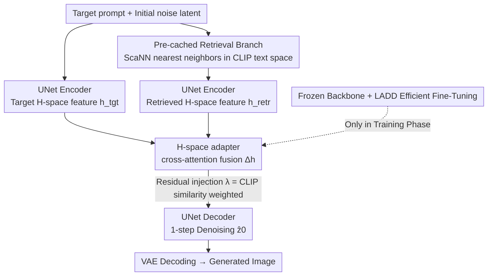

# ImageRAGTurbo: Towards One-step Text-to-Image Generation with Retrieval-Augmented Diffusion Models

**Conference**: CVPR 2026  
**Paper**: [CVF Open Access](https://openaccess.thecvf.com/content/CVPR2026/html/Qiu_ImageRAGTurbo_Towards_One-step_Text-to-Image_Generation_with_Retrieval-Augmented_Diffusion_Models_CVPR_2026_paper.html)  
**Code**: To be confirmed  
**Area**: Diffusion Models / Image Generation  
**Keywords**: Retrieval-Augmented Generation, Few-step Diffusion, One-step Text-to-Image, H-space, Adversarial Distillation

## TL;DR
ImageRAGTurbo imports "Retrieval-Augmented Generation (RAG)" into **one-step diffusion models**: given a text prompt, it first retrieves relevant "text-image pairs" from a database, and then uses a lightweight H-space cross-attention adapter to fuse the retrieved content into the deep feature space of the UNet denoiser. Consequently, this elevates the text alignment of one-step generation (TIFA from 0.779 to 0.801, CLIP +1.37%) close to the level of a 50-step teacher model, with **almost zero additional latency** (116.7ms vs 113.8ms).

## Background & Motivation

**Background**: Diffusion models are the current mainstream for text-to-image generation, but their iterative sampling of "gradually denoising images from random noise" is inherently slow—standard diffusion typically requires 25–50 denoising steps, with each step running an expensive forward pass of the denoising network, leading to too high latency for real-time/interactive scenarios. To accelerate this, the community has developed **few-step models** such as consistency models and adversarial distillation, which distill the full sampling trajectory down to 1–4 steps, or in extreme cases, mapping noise directly to images in a single step.

**Limitations of Prior Work**: Few-step distillation (particularly one-step) **sacrifices image quality and prompt alignment**. The example in the paper is illustrative: given the prompt "a boat on the water with a lighthouse in the background", a one-step distilled model often **completely fails to generate the visual concept of a 'boat'**. Furthermore, distilling few-step models from scratch from teacher models is extremely compute-intensive (often taking hundreds of GPU days), representing a high barrier to entry.

**Key Challenge**: Few-step generation compresses the mapping of "noise $\to$ target distribution" too aggressively. The model lacks sufficient "intermediate steps" to render semantic details gradually, leading to a trade-off between quality and speed. The conventional approach to improve prompt alignment is training preference models, but collecting pairwise human preference data is costly.

**Goal**: To improve generation quality and text alignment of few-step models **without sacrificing their speed**, while keeping the fine-tuning process sufficiently inexpensive.

**Key Insight**: The authors draw inspiration from RAG in LLMs—since "injecting semantically relevant external information into the model" helps LLMs answer more accurately, injecting "retrieved relevant images" into the diffusion denoiser should **simplify the mapping difficulty from noise to the target distribution**. The key observation is that the deepest **H-space** of the UNet denoiser already encodes high-level semantics like image category, object presence, and attributes. Operating directly in this space is a precise remedy for the "one-step model cannot generate a specific object" defect. Existing retrieval-augmented image generation (RAIG, such as RDM / ImageRAG / FineRAG) methods either target multi-step generation or rely on iterative refinement by repeatedly calling multimodal LLMs (making it even slower), failing to address the core demand of "speed."

**Core Idea**: Retrieve relevant "text-image pairs", fuse their H-space features into the target denoising branch via a lightweight cross-attention adapter, and use the **retrieved content to fill in the missing semantics of the one-step model**, achieving alignment gains at almost zero latency cost.

## Method

### Overall Architecture
ImageRAGTurbo appends a "retrieved branch" and a trainable H-space adapter to a **frozen one-step diffusion denoiser**, allowing the retrieved reference images to "feed" the missing semantics into the main denoising branch. The entire pipeline consists of two parallel branches (see Fig. 2 in the original paper):

- **Denoising Branch (Standard)**: The target prompt $p^{tgt}$ is encoded by the text encoder $\tau_\phi(\cdot)$ to obtain a text embedding, which is then fed into the UNet encoder $f_\theta^{enc}$ along with the initial latent $z_t$ to yield the target H-space feature $h_t^{tgt}$.
- **Retrieval Branch (Pre-cached)**: Uses the target text embedding to search for the nearest neighbors in the database to retrieve relevant "text-image pairs" $(p^{retr}, x^{retr})$. The retrieved image is encoded into $z_0^{retr}=\mathcal{E}(x^{retr})$ by the VAE, and then fed into the same UNet encoder alongside $\tau_\phi(p^{retr})$ (setting $t=0$ because the retrieved image is clean and noise-free) to obtain the retrieved H-space feature $h_t^{retr}$.

The H-space features of both branches are fused (using cross-attention) in the adapter, and the resulting $\Delta h$ is added back to the target branch as a residual. This is then denoised in a single step by the UNet decoder $f_\theta^{dec}$ to yield $\hat{z}_0$, which is eventually decoded to an image $\hat{x}$ by the VAE. The paper first validates the hypothesis that "H-space injection works" using a **training-free direct injection** version (Sec 3.2), and then elevates it to a **learnable adapter** (Sec 3.3) as the final solution. The training employs **latent adversarial distillation (LADD)**, freezing all backbones and only training the adapter and decoder LoRA.

### Key Designs

**1. Pre-cached retrieval branch: Zero extra cost to find reference images using existing CLIP text features**

The missing element in few-step models is the semantic cue of "what to draw specifically." This design performs approximate nearest neighbor search using ScaNN in the **CLIP text feature space** to retrieve several relevant "text-image pairs" for the target prompt. The clever part is that it **recycles the OpenCLIP-ViT-H-14 text features** that Stable Diffusion already has to compute as the retrieval key, introducing zero additional text encoding overhead; the search process takes only 1.9ms per image. The search repository is OpenImage containing 0.63M text-image pairs. The retrieved images are first encoded by the VAE and then passed through the UNet encoder to extract H-space features. This step can be **pre-cached** (since the image database is offline and fixed), saving repeated encoding during inference. Finding references is thus compressed to virtually zero latency, laying the groundwork for "supplementing semantics using references."

**2. Direct H-space injection: Spherical interpolation proves "injection is effective", but exposes the tuning dilemma**

This represents the feasibility validation (motivation) of the paper, explaining why they ultimately shifted to an adapter. The retrieved features $h_t^{retr}$ and target features $h_t^{tgt}$ are blended via **spherical linear interpolation (slerp)**:

$$h_t^{blend}=\frac{\sin[(1-w)\Omega_t]}{\sin\Omega_t}\,h_t^{retr}+\frac{\sin[w\Omega_t]}{\sin\Omega_t}\,h_t^{tgt}$$

where $\Omega_t=\arccos(\langle h_t^{tgt}, h_t^{retr}\rangle)$ is the angle between the two features, and $w\in(0,1)$ controls the blending strength. Slerp is chosen over linear interpolation because the geodesic path yields smoother semantic transitions, avoiding abrupt phase transitions. The validation results are compelling: fixing $w=0.8$ slightly improves TIFA from 0.779 to 0.781; if one performs grid search for the optimal $w^*$ in $\{0.1,0.2,\dots,0.9\}$ **for each prompt**, the TIFA score leaps to 0.816, **surpassing SD with 50-step sampling and no retrieval**. However, this path has a fatal flaw—the optimal blending strength for each prompt depends on implicit factors like retrieval correlation, prompt semantics, and generation difficulty, presenting an **ill-posed problem**. Searching for $w$ per prompt at inference time entirely wipes out the speed advantage of few-step models. This is precisely the motivation for replacing "manual tuning of $w$" with "automatically learned fusion."

**3. H-space adapter: Automatically learning fusion via cross-attention with adaptive weighting based on CLIP similarity**

To address the issue that grid-searching $w$ is impractical, this design introduces a trainable adapter $g_\varphi(\cdot,\cdot)$ which uses **cross-attention** to automatically learn the correlation between the retrieved features and the target features:

$$g_\varphi(h_t^{tgt}, h_t^{retr})=\mathrm{softmax}\!\left(\frac{QK^\top}{\sqrt{d_k}}\right)V,\quad Q=W_Q h_t^{tgt},\; K=W_K h_t^{retr},\; V=W_V h_t^{retr}$$

That is, the **target feature acts as the query and the retrieved feature acts as the key/value**—letting "what I want to draw" select "what to inherit" from the retrieved features. The adapter output is added back as a residual:

$$h_t^{retr}=h_t^{tgt}+\lambda\,\underbrace{g_\varphi(h_t^{tgt}, h_t^{retr})}_{\Delta h_t}$$

The weight coefficient $\lambda$ is not a fixed hyperparameter but is instead set to the **cosine similarity between the CLIP embeddings of the retrieved text and target text**. The intuition is that the more aligned the retrieved content is with the target prompt, the more it should contribute; irrelevant retrievals are automatically downweighted to prevent contamination. The adapter contains only 36M parameters (representing 4% of the total model) and adds only 1ms of denoising latency, replacing the "per-prompt grid search" with automated, single-forward fusion.

**4. Frozen backbones + latent adversarial distillation: Cheap fine-tuning of only the adapter and decoder LoRA**

To keep the fine-tuning cheap, this design **freezes all backbones of both the teacher $f_{\theta^*}$ and the few-step student $f_\theta$**. The only trainable components are the H-space adapter and a **LoRA** lightweight fine-tuning on the student decoder (helping translate the fused features into the final image). The training adopts **latent adversarial distillation (LADD)** instead of self-consistency training, as LADD empirically performs better in one-step settings and is computationally cheaper because adversarial training is done in the latent space $\mathcal{Z}$ rather than the pixel space. The discriminator $D$ is composed of a **frozen teacher UNet encoder** plus several trainable projection layers, utilizing ideas from DiffusionGAN to distinguish between pairs of noisy latents $(\hat{z}_s, z_s)$ (student output vs teacher output), with the timestep $s$ uniformly sampled from the full range of $N$ steps to allow discriminating across various noise levels. The discriminator's projection layers use **spectral normalization** to stabilize training—saving computation since it does not require second-order backpropagation compared to gradient penalty. This design allows training on only an extremely small portion of the parameters.

### Loss & Training
The adversarial objective uses a hinge loss. The discriminator objective $\mathcal{L}_{adv}^D$ classifies teacher samples as real and student samples as fake; the generator (student) objective $\mathcal{L}_{adv}^G=-\sum_k \mathbb{E}_{z_0}[D_k(\hat{z}_s, \tau_\phi(p^{tgt}))]$ backpropagates to fool the discriminator. To stabilize training and improve quality, two auxiliary losses are introduced: a **score distillation loss** (smooth L1 between $\hat{z}_0$ and $z_0$) and a **latent LPIPS loss** (perceptual loss in latent space using a VGG16 embedding network under random differentiable augmentations). The total objective is:

$$\mathcal{L}=\mathcal{L}_{adv}+\alpha\mathcal{L}_{distill}+\beta\mathcal{L}_{latentLPIPS},\quad \alpha=2.5,\;\beta=1.0$$

The training data is a mixture of synthetic and real data: synthetic images are generated using the teacher SD v2-1-base (CFG 7.5) on approximately 3M prompts from LAION-Aesthetic 6.25+, and 500K real images are selected from LAION-Aesthetic 5.5+ (filtering out resolutions < 1024x1024), uniformly resized to 512x512 and encoded to 64x64 latents using the VAE. Fine-tuning Stable Diffusion Turbo v2-1 takes 20K steps on **64x NVIDIA L40S** with a total batch size of 2048 and AdamW (lr $1\times10^{-5}$), taking about a week.

## Key Experimental Results

### Main Results

MS-COCO benchmark (5000 text-image pairs, FID for realism, CLIP for alignment, NFE = Number of Function Evaluations):

| Model | NFE | FID↓ | CLIP↑ |
|------|-----|------|-------|
| Stable Diffusion v1-5 | 50 | 24.38 | 0.319 |
| Stable Diffusion v2-1 (Teacher) | 50 | 25.33 | 0.330 |
| Latent Consistency Model | 4 | 36.52 | 0.307 |
| Stable Diffusion Turbo v2-1 (Baseline) | 1 | 26.04 | 0.319 |
| RDM (Retrieval-Augmented) | 50 | 27.60 | 0.293 |
| **ImageRAGTurbo (Ours)** | **1** | **25.59** | **0.323** |

Compared to SD Turbo (also a one-step model), ImageRAGTurbo achieves 1.37% higher CLIP and a lower FID; it substantially outperforms the 4-step LCM; it approaches the 50-step teacher model (FID difference is only 1.03%, CLIP is 2.1% lower); and its CLIP is about 10% higher than the 50-step retrieval-augmented RDM.

TIFA benchmark (4081 prompts, 12 element categories, TIFA measures faithfulness via VQA, AES measures aesthetics):

| Model | NFE | AES↑ | TIFA↑ |
|------|-----|------|-------|
| Stable Diffusion v1-5 | 50 | 5.79 | 0.768 |
| Stable Diffusion v2-1 (Teacher) | 50 | 6.04 | 0.811 |
| Latent Consistency Model | 4 | 5.80 | 0.764 |
| Stable Diffusion Turbo v2-1 (Baseline) | 1 | 5.85 | 0.779 |
| RDM (Retrieval-Augmented) | 50 | 5.40 | 0.725 |
| **ImageRAGTurbo (Ours)** | **1** | **5.88** | **0.801** |

One-step ImageRAGTurbo scores 2.2% higher in TIFA and slightly higher in aesthetics compared to one-step SD Turbo; it is 3.7% higher than the 4-step LCM; it is only about 1.2% lower overall than the 50-step teacher, **matching or even slightly exceeding** the teacher in some specific categories like object, location, activity, and material (see Fig. 5 in the original paper); and it yields a much better TIFA and aesthetics than RDM (7.6% higher in TIFA, 5.88 vs 5.40 in AES).

### Ablation Study

H-space direct injection (training-free, Sec 3.2) and efficiency breakdown, which can be seen as an analysis of the "injection strategy" and "latency cost":

| Configuration | Key Metrics | Description |
|------|---------|------|
| No-retrieval baseline (One-step SD Turbo) | TIFA 0.779 | Starting point |
| Direct injection, fixed $w=0.8$ | TIFA 0.781 | Slight improvement without training, validating that H-space injection is effective |
| Direct injection, optimal $w^*$ per prompt | TIFA 0.816 | Outperforms 50-step SD but requires grid search at inference, making it impractical |
| H-space adapter (Ours, final) | TIFA 0.801 | Automatic fusion in a single forward pass, eliminating grid search |
| Latency breakdown (Adapter version) | 116.7ms = Retrieval 1.9ms + Denoising 114.8ms | Adapter has 36M parameters (4%), adding only 1ms to denoising |

### Key Findings
- **The ceiling of H-space injection is high but hard to deploy**: Grid-searching $w^*$ per prompt pushes TIFA to 0.816 (surpassing the 50-step teacher), proving that retrieved content indeed hides effective signals for completing semantics. However, finding the optimal blending strength is an ill-posed problem, requiring the learnable adapter to tap into this potential at the cost of a single forward pass (yielding 0.801).
- **Almost zero latency cost is the core selling point**: The total inference time of 116.7ms is almost on par with the 113.8ms of SD Turbo (only a +2.5% overhead), but yields about a 3% TIFA improvement. Compared to the 50-step teacher (2960ms), this achieves an ~**25x speedup** with only a 1.2% drop in TIFA. Compared to the 4-step LCM (220.6ms), it is both faster and better (TIFA is 3.7% higher and latency is ~47% lower).
- **Using CLIP similarity instead of a fixed value for weight coefficient $\lambda$ is crucial**: Ensuring that relevant retrievals contribute more and irrelevant ones disrupt less is one of the key design choices for the adapter’s stable performance.

## Highlights & Insights
- **Truly bringing RAG into "one-step" diffusion**: Previous RAIG methods (RDM/ImageRAG/FineRAG) either failed to target few-step models or relied on slow, iterative refinement with multimodal LLMs. This work is the first retrieval-augmented solution tailored for few-step diffusion that prioritizes both training and inference efficiency. The approach of "using external retrieval to restore distilled semantics" is mathematically and conceptually intuitive.
- **A strong research roadmap starting with training-free validation before learnable deployment**: Sec 3.2 uses slerp direct injection to prove that "H-space injection is effective and has a high performance ceiling," before Sec 3.3 utilizes a cross-attention adapter to bypass the "impracticality of grid-searching $w$." The progression of motivation is clean and allows readers to clearly trace *why* the adapter is necessary.
- **Strategic selection of the injection target**: Operating on the deepest H-space of the UNet (which determines high-level semantics like object presence/attributes) directly targets the classic defect where "one-step models fail to generate specific objects," rather than attempting to modify low-level detailed features. This strategy of "selecting the injection point based on semantic hierarchy" is generalizable to other generative tasks requiring controllable semantics.
- **Engineering choices to save budget**: Recycling the default CLIP text features of SD as retrieval keys (zero extra encoding cost), pre-caching the H-space features, stabilizing the discriminator with spectral normalization without requiring second-order backpropagation, and applying LoRA strictly to the decoder—this combination of computation-saving choices makes "one week of fine-tuning" feasible.

## Limitations & Future Work
- **Coarse retrieval mechanism**: The current retrieval relies on CLIP text similarity. The authors admit that more fine-grained compositional retrieval is a promising direction; CLIP retrieval might fail to retrieve appropriate references for compositional semantics like counting and spatial relationships.
- **Only validated on UNet architecture**: The method is strictly tied to the UNet H-space. Whether it can transfer to Diffusion Transformers (DiT) remains unverified. The authors note that the deep patches/attention of DiT also possess structured semantics, which could theoretically be processed similarly, but this requires experimental confirmation.
- **Absolute quality still falls slightly short of the teacher**: The one-step model’s TIFA of 0.801 is still lower than the 50-step teacher's 0.811, and minor gaps persist in FID and CLIP. The model provides a 25x speedup, presenting a quality-speed trade-off rather than an absolute, multidimensional outperformance.
- **Training costs are not entirely "cheap"**: Although only the adapter and LoRA are trained, it still requires running on 64x L40S GPUs for about a week with ~3.5M synthetic and real images, representing a significant barrier to reproduction. ⚠️ Note: The main text once mentions aesthetics "5.88 vs 5.83", slightly differing from the baseline of 5.85 in Table 2; the tabular values should be prioritized.

## Related Work & Insights
- **vs Few-step Distillation (LCM / SD Turbo / ADD-LADD)**: These approaches compress execution to 1-4 steps through consistency or adversarial distillation, but struggle to represent all objects mentioned in the prompt. This work does not modify the distillation process itself; instead, it **adds an external retrieval branch to supply semantics**, raising the alignment of the one-step baseline with almost zero additional latency.
- **vs RDM (Retrieval-Augmented Diffusion)**: RDM uses retrieved CLIP neighbor embeddings as conditions for a 50-step LDM. Our method injects retrieval features into the H-space and automatically fuses them using an adapter, specifically optimized for **one-step** generation—achieving a ~7.6% higher TIFA and ~10% higher CLIP with only 1 step instead of 50.
- **vs ImageRAG / FineRAG (MLLM Dynamic Retrieval-Refinement)**: These rely on multimodal LLMs for iterative evaluation and fine refinement, which are accurate but slow, contradicting the initial goal of high speed. This work utilizes pre-cached retrieval and a lightweight adapter to pack retrieval augmentation into a single forward step.
- **Transferable Insight**: The paradigm of using cross-attention to fuse external knowledge in the deepest feature space (where semantics are most concentrated) and adaptively weighting the contribution using text similarity can be transferred to controllable generation, personalized generation, style transfer, and other tasks that need to "borrow from external reference as needed."

## Rating
- Novelty: ⭐⭐⭐⭐ First retrieval-augmented solution targeting one-step diffusion that prioritizes both training and inference efficiency, with a clear H-space adapter design.
- Experimental Thoroughness: ⭐⭐⭐⭐ Completeness across two main benchmarks, efficiency analysis, and training-free ablation, though a more systematic internal ablation of the adapter and validation of wider architectures is missing.
- Writing Quality: ⭐⭐⭐⭐ The progression of motivation (proving the premise via training-free injection first, then delivering the learnable implementation) is coherent, with equations and diagrams aligning well.
- Value: ⭐⭐⭐⭐ Significantly enhances the alignment of one-step generation at almost zero latency cost, with strong practical value for real-time text-to-image deployments.

<!-- RELATED:START -->

## Related Papers

- [\[CVPR 2026\] InverFill: One-Step Inversion for Enhanced Few-Step Diffusion Inpainting](inverfill_one-step_inversion_for_enhanced_few-step_diffusion_inpainting.md)
- [\[CVPR 2026\] Extending One-Step Image Generation from Class Labels to Text via Discriminative Text Representation](emf_meanflow_text_to_image.md)
- [\[CVPR 2026\] PixelRush: Ultra-Fast, Training-Free High-Resolution Image Generation via One-step Diffusion](pixelrush_ultrafast_trainingfree_highresolution_im.md)
- [\[AAAI 2026\] TruthfulRAG: Resolving Factual-level Conflicts in Retrieval-Augmented Generation with Knowledge Graphs](../../AAAI2026/image_generation/truthfulrag_resolving_factual-level_conflicts_in_retrieval-augmented_generation_.md)
- [\[CVPR 2026\] Bridging Fidelity-Reality with Controllable One-Step Diffusion for Image Super-Resolution](bridging_fidelity-reality_with_controllable_one-step_diffusion_for_image_super-r.md)

<!-- RELATED:END -->
