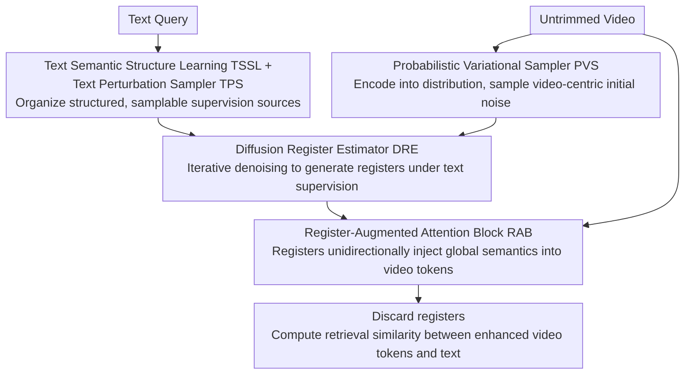

# Imagine Before Concentration: Diffusion-Guided Registers Enhance Partially Relevant Video Retrieval

**Conference**: CVPR 2026  
**arXiv**: [2604.03653](https://arxiv.org/abs/2604.03653)  
**Code**: [https://github.com/lijun2005/CVPR26-DreamPRVR](https://github.com/lijun2005/CVPR26-DreamPRVR)  
**Area**: Image Generation  
**Keywords**: Partially Relevant Video Retrieval, Diffusion Models, Register Tokens, Cross-modal Alignment, Global Context

## TL;DR

This paper proposes DreamPRVR, which adopts an "imagine before concentration" coarse-to-fine strategy: global semantic register tokens are generated via a truncated diffusion model under text supervision and then fused into fine-grained video representations. This effectively suppresses local noisy responses and achieves SOTA on three PRVR benchmarks.

## Background & Motivation

**Background**: Partially Relevant Video Retrieval (PRVR) aims to retrieve untrimmed videos based on text queries where the query only describes a segment of the video. Existing methods (e.g., MS-SL, GMMFormer, HLFormer) focus on segment-level modeling using sliding windows or Gaussian attention for local matching.

**Limitations of Prior Work**: The core problem is "query ambiguity"—a general query might match the correct segment in the right video but also unexpectedly match similar local segments in other videos, creating false local peak responses. This leads to globally irrelevant videos being incorrectly ranked high. Furthermore, the widely used Multiple Instance Learning (MIL) paradigm only rewards the best-matched segment, leaving other segments under-trained and lacking the contextual basis to resolve ambiguity.

**Key Challenge**: Existing methods lack explicit global context modeling. A few works considering global information (e.g., semantic entailment in HLFormer, global uncertainty in RAL) treat global context only as training-time regularization; video embeddings are not improved during inference.

**Goal**: (1) How to extract reliable global semantic representations from redundant and noisy untrimmed videos; (2) How to effectively supervise the generation of global representations using text semantics; (3) How to integrate global semantics into local video representations to suppress false responses.

**Key Insight**: Inspired by the "register token" concept in ViTs, global registers are introduced to store overall video semantics. Since extracting reliable registers directly from noisy videos is difficult, a diffusion model is used for iterative refinement and generation.

**Core Idea**: Use a text-supervised truncated diffusion model to iteratively generate global semantic registers starting from a video-centric distribution, then enhance local representations through attention fusion.

## Method

### Overall Architecture

DreamPRVR aims to solve the issue where untrimmed videos are filled with segments irrelevant to the query, and pure local matching can be misled by "incidentally similar" segments. Thus, a reliable global semantic anchor must be established for the video first to suppress local false peaks. The pipeline revolves around this anchor: first, a structured text latent space is learned to sample supervision signals; then, a truncated diffusion module uses the video itself as a starting point to iteratively "imagine" several registers carrying overall semantics under text guidance; these registers are concatenated back into the video token sequence for attention fusion, allowing global context to permeate each local representation; finally, registers are discarded, and only the enhanced video representations are used to calculate retrieval similarity with the text. The process is organized as a variational inference framework, modeling registers as latent variables.

### Key Designs

**1. Text Semantic Structure Learning (TSSL) + Text Perturbation Sampler (TPS): Organizing structured, samplable supervision sources**

To let the diffusion model "imagine" global semantics, clean and diverse text signals are required for supervision. Existing query diversity losses blindly push all queries apart, even those belonging to the same video that should be complementary. TSSL corrects this with two losses: Query Diversity Loss $L_{div}$ scatters query embeddings from different videos to expand semantic richness, while Query Similarity Preservation Loss $L_{qsp}$ pulls multiple queries of the same video closer, treating them as complementary views of the same global semantic. Together, they make the latent space both discriminative across videos and compact within videos. Building on this, TPS explicitly models text uncertainty by applying controllable perturbations to whitened features: $\hat{q} = \alpha \cdot \bar{q} + \beta$, where $\alpha \sim \mathcal{N}(1, (\gamma\sigma_q)^2 I)$. This sampling provides diverse supervision without extra trainable parameters.

**2. Probabilistic Variational Sampler (PVS) + Diffusion Register Estimator (DRE): "Imagining" pure global semantics from the video itself**

Directly pooling or mapping untrimmed videos would submerge reliable semantics in redundant noise. DreamPRVR treats this as a denoising problem. PVS encodes video features into a probability distribution $p(r_T \mid V_v) \sim \mathcal{N}(\mu_v, \sigma_v^2 I)$ and samples an initial "video-centric" noise $r_T$—a key feature of truncated diffusion: the starting point is not random Gaussian noise but a distribution already carrying video semantics.

$$
L_{dre} = \mathbb{E}_{t, \hat{q}_t, \epsilon}\big[\|\epsilon - \epsilon_\phi(\hat{q}_t, t, c)\|^2\big]
$$

DRE is a lightweight MLP diffusion module that performs $T$ iterative denoising steps starting from $r_T$ guided by text supervision $\hat{q}$, refining semantics into optimal registers $r_0$. The training objective is standard DDPM noise prediction. t-SNE visualizations show registers evolving from an unordered cluster into discriminative video-level clusters through the denoising steps, justifying why "video-centric starting points + iterative refinement" extracts reliable semantics better than one-step pooling.

**3. Register-Augmented Gaussian Attention (RAB): Injecting global registers into local video representations**

Registers must influence video representations to be useful. RAB concatenates video tokens and registers into a sequence $x = [V_o, r_0]$ and feeds them into an improved Gaussian attention:

$$
\text{GA}(x) = \text{softmax}\Big(\mathcal{M}_r + \big(\mathcal{M}_\sigma^g \odot \tfrac{x^q (x^k)^\top}{\sqrt{d_h}}\big)\Big) x^v
$$

The key is the asymmetric attention mask $\mathcal{M}_r$: video tokens can attend to both other video tokens and registers to absorb global context; however, registers are only allowed to attend to video tokens and not to each other. This design ensures registers unidirectionally "feed" global info to local representations while avoiding information short-circuits among registers. $N_a$ RABs are arranged in parallel, with outputs aggregated by MAIM. Once fusion is complete, registers are discarded and do not participate in final similarity calculations—their mission is only to inject global context.

### Loss & Training

Total loss: $L_{total} = L_{sim} + L_{tssl} + L_{pvs} + \lambda_{dre} L_{dre}$. $L_{sim}$ is the standard retrieval similarity loss (following MS-SL), $L_{tssl} = \lambda_d L_{div} + \lambda_q L_{qsp}$, and $L_{pvs} = \lambda_{kl} L_{kl}$ (KL divergence for PVS Gaussian prior). The model is trained on a single A100-40G GPU using the Adam optimizer with a batch size of 128. Default diffusion steps $T=10$, and the number of registers is 4-8.

## Key Experimental Results

### Main Results

| Method | ActivityNet SumR | Charades SumR | TVR SumR |
|------|-----------------|---------------|----------|
| MS-SL | 140.1 | 68.4 | 172.4 |
| GMMFormer | 146.0 | 72.9 | 176.6 |
| HLFormer | 154.9 | 78.7 | 187.7 |
| GMMFormerV2 | 154.9 | 78.2 | 189.1 |
| **DreamPRVR** | **156.1** | **80.0** | **193.1** |

**Detailed metrics for DreamPRVR on Charades-STA**:

| Metric | R@1 | R@5 | R@10 | R@100 |
|------|-----|-----|------|-------|
| HLFormer | 2.6 | 8.5 | 13.7 | 54.0 |
| **DreamPRVR** | **2.6** | **8.7** | **14.5** | **54.2** |

### Ablation Study

| Configuration | ActivityNet SumR | Charades SumR | TVR SumR | Description |
|------|-----------------|---------------|----------|------|
| Full DreamPRVR | **156.1** | **80.0** | **193.1** | Full model |
| w/o registers | 153.4 | 76.8 | 187.0 | No global registers |
| w/ adaptive pooling | 151.9 | 78.1 | 191.4 | Simple pooling instead of diffusion |
| w/o DRE | 150.6 | 78.3 | 190.8 | No iterative refinement |
| w/o PVS | 154.9 | 77.6 | 190.9 | Initialize from random noise |
| $L_{sim}$ only | 150.5 | 76.6 | 187.0 | Only retrieval loss |
| w/o $L_{tssl}$ | 151.3 | 76.9 | 191.1 | No text structure learning |

### Key Findings

- Removing registers drops Charades SumR from 80.0 to 76.8 (-3.2) and TVR SumR from 193.1 to 187.0 (-6.1), confirming the value of global context.
- Adaptive pooling (-1.9) is significantly worse than diffusion generation, indicating simple aggregation is insufficient for extracting reliable global semantics from noisy videos.
- Video-centric initialization via PVS outperforms random noise initialization (80.0 vs 77.6 on Charades), validating the necessity of truncated diffusion.
- Performance improves steadily as diffusion steps $T$ increase from 2 to 10, but drops when $T>10$, suggesting over-refinement may lead to overfitting.
- 4-8 registers are optimal; too many introduce harmful redundancy.
- t-SNE visualizations clearly show registers evolving from initial disorder to compact video-level clusters.

## Highlights & Insights

- **Cognitive Analogy of "Imagine then Concentrate"**: Analogizing diffusion generation to an "imagination" phase (forming coarse-grained global perception) and fine-grained matching to a "concentration" phase is an elegant and intuitive design.
- **Efficient Use of Truncated Diffusion**: Significant gains are achieved using a lightweight MLP and 6-8 registers with 10 diffusion steps, proving the diffusion paradigm can be highly efficient for retrieval tasks. Training and inference overhead are acceptable.
- **Complementary Design of QSP Loss**: Treating multiple queries for the same video as positive pairs rather than independent samples is a logical correction to existing query diversity losses.

## Limitations & Future Work

- Reliance on pre-extracted I3D features; end-to-end training or stronger visual encoders (e.g., CLIP ViT) were not explored.
- The number of registers and diffusion steps require dataset-specific tuning (4 for ActivityNet, 8 for TVR).
- The diffusion condition $c$ is obtained via simple cross-attention from video features, which might not be sufficiently rich.
- The framework could be extended to video corpus-level moment retrieval (VCMR) tasks.

## Related Work & Insights

- **vs GMMFormer (Gaussian Attention PRVR)**: DreamPRVR introduces register-based enhancement to its Gaussian attention, improving SumR by ~7 on Charades.
- **vs HLFormer (Hyperbolic Space + Semantic Entailment)**: HLFormer uses global context only as training regularization, while DreamPRVR's registers participate in feature enhancement during inference.
- **vs DiffusionRet / DiffDis (Diffusion for Retrieval)**: While those works use diffusion to model the joint distribution of query-candidates, DreamPRVR uses diffusion to generate global registers, representing a novel fusion of generative and discriminative paradigms.

## Rating

- Novelty: ⭐⭐⭐⭐ The idea of introducing diffusion-generated registers in retrieval is novel and elegantly designed.
- Experimental Thoroughness: ⭐⭐⭐⭐⭐ Three datasets, 12+ baselines, detailed ablation, efficiency analysis, and multiple visualizations.
- Writing Quality: ⭐⭐⭐⭐ Complete derivation of the variational inference framework and clear diagrams.
- Value: ⭐⭐⭐⭐ Provides a new generative-discriminative fusion paradigm for PRVR; the register concept is transferable.

<!-- RELATED:START -->

## Related Papers

- [\[CVPR 2026\] OpenDPR: Open-Vocabulary Change Detection via Vision-Centric Diffusion-Guided Prototype Retrieval for Remote Sensing Imagery](opendpr_open-vocabulary_change_detection_via_vision-centric_diffusion-guided_pro.md)
- [\[CVPR 2026\] Smoothing the Score Function to Enhance Generalization in Diffusion Models](smoothing_the_score_function_to_enhance_generalization_in_diffusion_models.md)
- [\[CVPR 2026\] Align Images Before You Generate](align_images_before_you_generate.md)
- [\[CVPR 2026\] Identity-Preserving Image-to-Video Generation via Reward-Guided Optimization](identity-preserving_image-to-video_generation_via_reward-guided_optimization.md)
- [\[CVPR 2026\] Learnability-Guided Diffusion for Dataset Distillation](learnability-guided_diffusion_for_dataset_distillation.md)

<!-- RELATED:END -->
