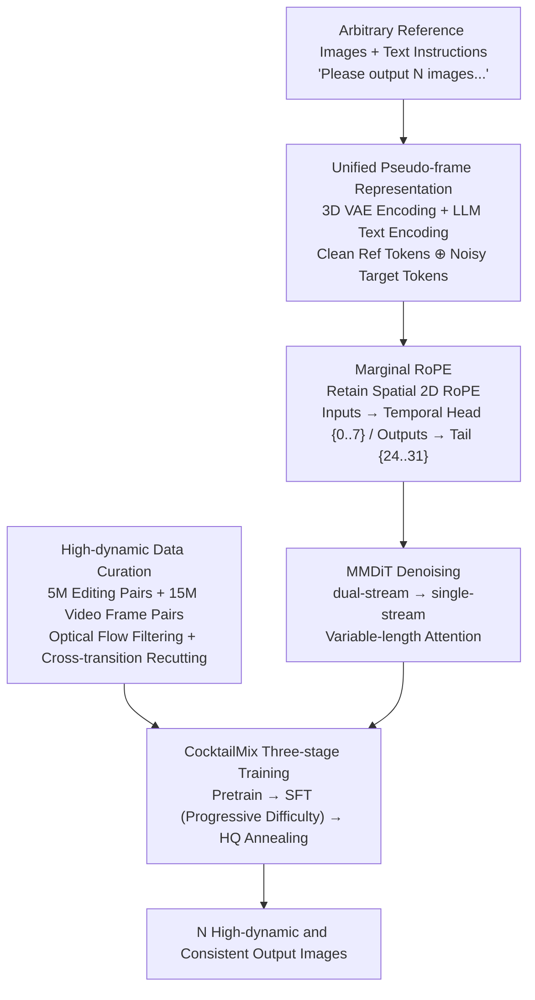

# iMontage: Unified, Versatile, Highly Dynamic Many-to-many Image Generation

**Conference**: CVPR 2026  
**Paper**: [CVF Open Access](https://openaccess.thecvf.com/content/CVPR2026/html/Fu_iMontage_Unified_Versatile_Highly_Dynamic_Many-to-many_Image_Generation_CVPR_2026_paper.html)  
**Code**: Project Page https://kr1sjfu.github.io/iMontage-web/ (Code and weights promised)  
**Area**: Image Generation  
**Keywords**: Many-to-many generation, video diffusion priors, unified image generation, RoPE, data curation

## TL;DR
iMontage transforms a pretrained video diffusion model (HunyuanVideo) into a unified generator that accepts an arbitrary number of reference images and generates multiple high-dynamic output images based on instructions. By utilizing a **Marginal RoPE** (treating input/output images as "pseudo-frames" at opposite ends of a sequence) that requires minimal modification to the original network, the model preserves motion priors while breaking the dynamic limitations of continuous frames, achieving state-of-the-art open-source performance in image editing, multi-to-one generation, and storyboard generation.

## Background & Motivation
**Background**: Unified image generation (performing editing, generation, and style transfer within a single model) is gaining momentum. However, most open-source models are limited to "single-in-single-out" workflows. True many-to-many generation (arbitrary inputs → arbitrary outputs) has only been pioneered by select closed-source commercial models, leaving a gap in systematic academic exploration. Currently, two paths exist for many-to-many generation: token-stream autoregression (representing images and text as tokens, which tends to have weaker quality and instruction following) and video diffusion (treating tasks as "discontinuous video generation," naturally handling variable-length input/output frames).

**Limitations of Prior Work**: Video-based routes (e.g., UniReal) can leverage motion priors to maintain temporal consistency, but foundational video models are almost exclusively trained on **continuous video clips**. These clips rarely contain hard cuts, abrupt transitions, or extreme camera/subject movements. Consequently, when transferred to image sets requiring "high dynamics and cross-scene jumps," these models perform poorly and suffer from limited task diversity. Conversely, pure image models can generate diverse outputs but lack an implicit understanding of real-world dynamics, leading to collapsed temporal consistency.

**Key Challenge**: The tension between **dynamic range** and **temporal/semantic consistency**. Allowing radical changes between output images (e.g., storyboards, multi-view) often sacrifices consistency; conversely, enforcing consistency under continuous video priors pulls the model back toward "quasi-static" outputs.

**Goal**: To build a unified model capable of generating multiple images that are both highly dynamic and mutually consistent under the condition of instructions and arbitrary reference images, covering the full spectrum of one-to-one editing, multi-to-one generation, and many-to-many generation.

**Key Insight**: The authors hypothesize that injecting the rich, unconstrained content diversity of image data into the coherent temporal framework of video models allows for both natural transitions and dynamic ranges far exceeding conventional benchmarks. The key is to adapt the model **without destroying the valuable original motion priors** of the video model.

**Core Idea**: All input and output images are treated as "pseudo-frames" on a timeline and fed into a video MMDiT. A minimalist head–tail **Marginal RoPE** modification distinguishes image sets from video streams. Combined with specialized high-dynamic data curation and a three-stage training strategy, the model achieves robust many-to-many generation.

## Method

### Overall Architecture
iMontage uses the MMDiT and 3D VAE from HunyuanVideo as its backbone. Reference images are encoded by the 3D VAE and patched into image tokens, while text instructions are encoded into fixed-length tokens via a language model. Following I2V practices, **clean reference tokens** and **noisy target tokens** are concatenated into a single sequence for the image branch. The sequence passes through several dual-stream blocks followed by single-stream blocks for denoising. During training, the VAE and text encoders are frozen while the MMDiT is fully fine-tuned. Variable-length attention masks and prompts support "arbitrary inputs/outputs." The methodology rests on four pillars: **Unified pseudo-frame representation** for variable-length image sets, **Marginal RoPE** to separate inputs and outputs at the ends of the timeline without perturbing spatial geometry, **High-dynamic data curation** to introduce hard cuts and large movements missing from continuous videos, and **CocktailMix three-stage training** to learn diverse multi-task objectives.

### Key Designs

**1. Unified Pseudo-frame Representation: Enabling Video Models for Variable-length Image Sets**
The first obstacle in many-to-many generation is the variable number of inputs and outputs. The authors treat all input and target output images as **pseudo-frames on a video timeline**. Each image is independently encoded by a 3D VAE and patchified. Clean reference tokens are concatenated with noisy target tokens, and a variable-length attention mask covers these tokens. Prompt engineering (e.g., `Please output N images according to the instruction:`) and interleaved multi-modal `<image n>` placeholders are used to specify task cardinality. This unified architecture handles "3 inputs → 4 outputs" or "1 input → 1 output" as simple variations in sequence length without requiring task-specific modules.

**2. Marginal RoPE: Decoupling Inputs/Outputs for High Dynamics and Consistency**
Inserting multiple images directly into a video model can lead to conceptual confusion between "image frames" and "video frames," where temporal position embeddings might interfere with spatial geometry. **Marginal RoPE** is a minimalist, non-invasive solution: it preserves the pretrained spatial 2D RoPE while introducing a **separable temporal RoPE** that assigns independent temporal index offsets. Inspired by L-RoPE, input images are assigned to the **early segment** ($\{0, \dots, 7\}$) and output images to the **late segment** ($\{24, \dots, 31\}$) of a 32-step temporal index, leaving a wide "margin" in between. This head-tail layout reduces positional interference between inputs and targets and empirically **promotes output diversity** (increased temporal distance suggests larger variations are allowed) while maintaining temporal coherence via the preserved spatial RoPE and temporal structure.

**3. High-dynamic Data Curation: Feeding Hard Cuts and Large Movements**
Limiting video model dynamics is fundamentally a data issue. The authors curate two pools: an **Image Editing Pool** (5M input/edited pairs with fine-grained instructions) and a **Video Frame Pair Pool** (15M pairs sampled from videos). To increase dynamics, they: (1) Use optical flow estimators to **upsample high-motion samples**, and (2) **Recut video segments across transitions** without heuristic filtering based on motion or camera switches. This intentionally creates "cross-transition frame pairs" to offset the "quasi-static" bias found in standard datasets. SFT data includes 90k Multi-CRef, 50k Conditioned-CRef (using OpenPose/Depth-Anything-V2), 35k SRef, 100k multi-turn editing, 90k multi-view (MVImageNet V2), and 29k high-dynamic storyboard sequences distilled from Seedream 4.0.

**4. CocktailMix Three-stage Training: Managing High-variance Multi-task Learning**
Simultaneous multi-task training is unstable due to varying task difficulties. Training proceeds through: **Pretraining** (instruction following and high-dynamic adaptation on 37 resolution buckets), **SFT** (multi-task unification), and **HQ Annealing** (final polishing with high-quality data and learning rate decay). For SFT, **CocktailMix (difficulty-ordered fine-tuning)** was selected over FlatMix (uniform mixing) and StageMix (curriculum from many-to-one to many-out). CocktailMix starts with simpler tasks and progressively introduces harder ones while reducing the sampling weight of learned tasks, assigning the largest share to the most challenging objectives. Training utilized 64 H800 GPUs with a flow matching objective.

## Key Experimental Results

### Main Results
Evaluation was conducted across three cardinalities: one-to-one editing (GEdit/ImgEdit), multi-to-one generation (OmniContext), and many-to-many storyboarding. For editing (Table 1), G_SC denotes semantic consistency, G_PQ denotes perceptual quality, and G_O is the overall score.

| Model | Type | Motion-G_O ↑ | Edit-G_O ↑ | ImgEdit-Action ↑ | ImgEdit-Avg ↑ |
| :--- | :--- | :--- | :--- | :--- | :--- |
| GPT-4o | Closed | 7.81 | 8.01 | 4.83 | 4.30 |
| Seedream 4.0 | Closed | 5.53 | 7.81 | 4.66 | 4.32 |
| Flux-Kontext-dev | Open | 4.95 | 6.51 | 4.35 | 3.97 |
| Step1X-Edit v1.1 | Open | 4.73 | 6.97 | 3.73 | 3.90 |
| OmniGen2 | Open | 5.13 | 6.41 | 4.68 | 3.44 |
| **iMontage (Ours)** | **Open** | **5.53** | **6.94** | **4.48** | **4.11** |

iMontage achieves the best open-source performance in overall editing (Edit-G_O 6.94) and motion-related tasks (Motion-G_O 5.53), even matching the closed-source Seedream 4.0 in motion sub-tasks.

For multi-to-one generation on OmniContext (Average consistency score):

| Model | Type | Average ↑ |
| :--- | :--- | :--- |
| GPT-4o | Closed | 8.80 |
| Gemini 2.5 | Closed | 7.84 |
| OmniGen2 | Open | 7.18 |
| BAGEL | Open | 5.73 |
| **iMontage (Ours)** | **Open** | **7.41** |

iMontage leads open-source models (7.41), approaching the performance of Gemini 2.5.

### Ablation Study

| Configuration | Key Observation | Description |
| :--- | :--- | :--- |
| Marginal RoPE (Head-Tail) | Higher diversity, preserved consistency | Wide margin reduces input-target positional interference. |
| SFT-FlatMix | Difficult convergence | Baseline uniform mixing across high-variance tasks. |
| SFT-StageMix | Better than FlatMix | Curriculum: many-to-one then many-to-many. |
| **SFT-CocktailMix** | **Optimal performance** | Progressive difficulty + dynamic sampling weights. |
| HQ Annealing | Fidelity boost | Final stage with high-quality subset and $lr \to 0$. |

### Key Findings
- **Marginal RoPE as a Dynamic-Consistency Toggle**: Placing inputs and outputs at opposite ends of the timeline with a wide margin preserves spatial geometry and temporal priors while implicitly encouraging diversity. Consistency and dynamics are achieved concurrently rather than as a trade-off.
- **Data Curation Defines the Dynamic Ceiling**: Upsampling high-motion samples and intentional cross-segment recutting are direct means to break the "quasi-static" bias of continuous video priors. Architecture alone cannot elevate the dynamic range.
- **Multi-task Mixing Strategy Matters**: The superiority of CocktailMix suggests that the "serving order" of high-variance tasks is critical for stable learning.

## Highlights & Insights
- **Efficient Paradigm Shift**: Converting a video model into a many-to-many image generator by simply modifying temporal indices (Marginal RoPE) without adding visual embeddings or changing spatial encoding is highly cost-effective and preserves valuable motion priors.
- **Position Embedding as a Control Knob**: Using "wide temporal margins" as an implicit signal for "allowable large changes" effectively uses position encoding as a dial for dynamic range.
- **Anti-heuristic Data Recutting**: While standard practices avoid hard cuts for smoothness, creating them intentionally fills the blind spots of continuous video datasets.

## Limitations & Future Work
- Strong dependency on a high-quality video backbone (HunyuanVideo) and large-scale private corpora (20M+ pairs, 64xH800 compute), posing a high barrier to reproduction.
- Many-to-many generation is primarily demonstrated through qualitative results; quantitative comparisons against closed-source models in this specific category are less exhaustive than one-to-one/multi-to-one benchmarks.
- Use of distillation from closed-source models (Seedream 4.0, GPT-4o) may introduce upstream biases. The scalability of fixed temporal indices (8/24 split) for significantly larger image sets (>8 frames) remains unexplored.

## Related Work & Insights
- **vs. UniReal**: Both treat multi-image generation as discontinuous video generation. However, UniReal is hindered by continuous video priors; iMontage expands the dynamic range via Marginal RoPE and high-dynamic curation.
- **vs. OmniGen / BAGEL**: These utilize unified multi-modal token streams (autoregressive). While flexible, their generation quality and instruction following are typically weaker. iMontage’s diffusion-based video backbone provides superior consistency and quality.
- **vs. Step1X-Edit / Qwen-Image**: These MLLM-driven models are primarily single-input-single-output. iMontage’s pseudo-frame representation natively supports multi-input and multi-output across a broader task spectrum.

## Rating
- Novelty: ⭐⭐⭐⭐ (Elegant Marginal RoPE approach, though many-to-many video routes have prior art like UniReal)
- Experimental Thoroughness: ⭐⭐⭐⭐ (Strong quantitative results for one-to-one/multi-to-one; many-to-many is qualitative-heavy)
- Writing Quality: ⭐⭐⭐⭐ (Clear motivation and methodology)
- Value: ⭐⭐⭐⭐ (Practical many-to-many open-source generator with significant utility)

<!-- RELATED:START -->

## Related Papers

- [\[CVPR 2026\] DynaVid: Learning to Generate Highly Dynamic Videos using Synthetic Motion Data](dynavid_learning_to_generate_highly_dynamic_videos_using_synthetic_motion_data.md)
- [\[CVPR 2026\] One Model, Many Budgets: Elastic Latent Interfaces for Diffusion Transformers](one_model_many_budgets_elastic_latent_interfaces_for_diffusion_transformers.md)
- [\[CVPR 2025\] Dynamic Motion Blending for Versatile Motion Editing (MotionReFit)](../../CVPR2025/image_generation/dynamic_motion_blending_for_versatile_motion_editing.md)
- [\[CVPR 2026\] DPAR: Dynamic Patchification for Efficient Autoregressive Visual Generation](dpar_dynamic_patchification_for_efficient_autoregressive_visual_generation.md)
- [\[CVPR 2026\] CoLoGen: Progressive Learning of Concept-Localization Duality for Unified Image Generation](cologen_progressive_learning_of_concept-localization_duality_for_unified_image_g.md)

<!-- RELATED:END -->
