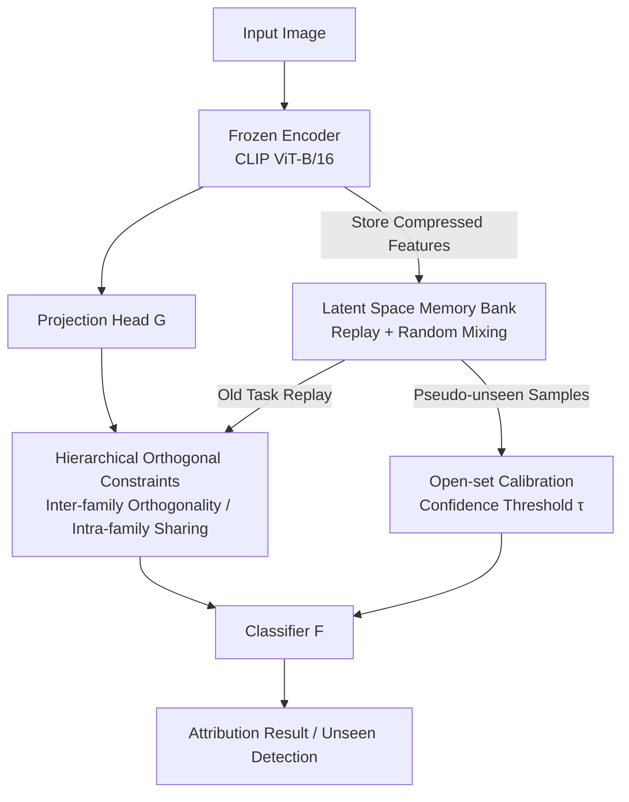

# IncreFA: Breaking the Static Wall of Generative Model Attribution

**Conference**: CVPR 2026  
**arXiv**: [2604.17736](https://arxiv.org/abs/2604.17736)  
**Code**: https://github.com/Ant0ny44/IncreFA (Available)  
**Area**: Image Generation / Generative Model Attribution / Incremental Learning / Open-set Recognition  
**Keywords**: Generative model attribution, incremental learning, hierarchical orthogonal prior, latent space memory, open-set recognition

## TL;DR
This paper redefines the static classification problem of "identifying which generative model produced an image" as **incremental attribution**. By encoding the "lineage" of generative models with hierarchical orthogonal priors and using a latent space memory bank for replay and synthesizing pseudo-unseen samples, the system evolves continuously without forgetting. It achieves SOTA attribution accuracy and a 98.93% unseen detection rate on the new IABench benchmark covering 28 generative models.

## Background & Motivation
**Background**: Generative model attribution (identifying the source generator of an image) mainly follows three technical routes: watermark embedding (invisible tags during generation), classifier fingerprints (learning visual traces of different generators), and latent space inversion (reconstructing latent codes to match suspect models). The classifier route is the dominant paradigm as it does not require model provider cooperation or white-box parameter access.

**Limitations of Prior Work**: New versions or architectures of diffusion, adversarial, and autoregressive generators are released almost monthly. However, existing methods are built on a **closed-set assumption**, where a fixed set of generators is known during training. Once a new model emerges, watermarks require new collaborations, classifiers become obsolete, and inversion requires white-box parameters. Attribution thus becomes a "Whac-A-Mole" moving target.

**Key Challenge**: The root problem is not "identifying known generators," but that the "attribution system itself cannot evolve." Applying standard Class-Incremental Learning (CIL) is insufficient: CIL benchmarks assume classes are **balanced, separable, and domain-independent**. Generative models are the opposite—new diffusion variants inherit massive latent space statistics and style priors from parent models, causing high distribution overlap. Gradient updates drift toward regions occupied by old models, causing **negative transfer even with replay**. Furthermore, existing CIL rarely considers open-set recognition, failing to detect images from unseen generators.

**Goal**: (1) Retain old knowledge while continuously learning new generators (anti-forgetting); (2) Separately model "family-level invariants" and "model-level specificities" to handle distribution overlap; (3) Distinguish "seen vs. unseen" in an expanding open space with minimal false positives.

**Key Insight**: The authors observe that generative models are not independent categories but belong to a **hierarchical lineage** (e.g., GAN, Diffusion, and Autoregressive families; within families, models like SD1.4 $\rightarrow$ 1.5 $\rightarrow$ 2.0 inherit from each other). Since they are structurally hierarchical, the feature space should be as well: orthogonal isolation between families and shared knowledge within families.

**Core Idea**: Transforming static attribution into **structured incremental attribution** using "hierarchical orthogonal priors + latent space memory replay," allowing attribution capabilities to evolve alongside generative models.

## Method

### Overall Architecture
IncreFA runs on a **frozen pre-trained encoder** (CLIP ViT-B/16), training only a lightweight projection head $G(\cdot)$ and a classifier $F(\cdot)$. An input image is first extracted into stable features $\mathbf{f}(x)$ by the frozen encoder, then projected by $G$ into a **hierarchical latent space** $\mathcal{Z}$. This space is explicitly constrained such that "family subspaces are mutually orthogonal, while models within a family are related" (Eq. 2: $\mathcal{Z}'=\bigoplus_{k=1}^{K}\mathcal{P}_k,\ \mathcal{P}_i\perp\mathcal{P}_j$). The classifier $F$ performs both attribution and open-set determination in this space.

The system is supported by two mutually reinforcing mechanisms: **Hierarchical Orthogonal Constraints** shape the latent space geometry, and the **Latent Space Memory Bank** stores compressed encoded features (rather than raw images) for old task replay and "unseen sample" synthesis for open-set calibration. When a new task $\mathcal{T}_t$ arrives (introducing $L=4$ new models), the model updates on new data + replay samples, using an open-set threshold $\tau$ to classify low-confidence samples as unseen.

### Key Designs

**1. Hierarchical Orthogonal Constraints: Embedding Lineage via Learnable Orthogonal Priors**

To address the negative transfer caused by distribution overlap between inherited versions, IncreFA imposes a two-level hierarchical geometry on the latent space. The fine-grained layer ($\mathcal{L}_1$, Eq. 7) calculates a unit-norm prototype $\hat{\mu}_{k,j}$ for each model $\mathcal{M}_{k,j}$, aligning it to a **learnable orthogonal anchor** $\hat{p}_{k,j}$. An orthogonal regularization $\|Q^\top Q-I\|_F^2$ forces all anchors to be mutually orthogonal, ensuring angular separation between models:

$$\mathcal{L}_1=\sum_{k=1}^{K}\sum_{j=1}^{N_k}\big(1-\langle\hat{\mu}_{k,j},\hat{p}_{k,j}\rangle\big)+\|Q^\top Q-I\|_F^2$$

The coarse-grained layer ($\mathcal{L}_2$, Eq. 9) averages $N_k$ model prototypes within a family to obtain a family prototype $\hat{\mu}_k$, aligning it to a family-level anchor $\hat{P}_k$ with inter-family orthogonal regularization $\|C^\top C-I\|_F^2$. Learning these two levels jointly ensures "inter-family isolation and intra-family invariant sharing" are encoded simultaneously.

**2. Latent Space Memory & Random Mixing: Low-cost Replay and Forging Unseen Samples**

To enable continuous learning without storing raw images (privacy/storage concerns), IncreFA maintains a **Latent Space Memory Bank** $\mathcal{B}_{t-1}$ storing only encoded features $\mathbf{f}(x)$. Features are **re-passed through the current $G$** during replay to calculate cross-entropy (Eq. 10), preventing projection head drift. 

Furthermore, "Random Mixing" generates pseudo-unseen samples $z_u=\beta z_1+(1-\beta)z_2$ via linear interpolation between different classes ($\beta\sim U(0,1)$, Eq. 11). These points naturally fall into **low-density regions near decision boundaries**, approximating the transition zones between known classes. This provides a steady stream of "hard negative samples" for open-set calibration without requiring real unseen data.

**3. Open-set Calibration: Compressing Confidence for Unseen Detection**

With pseudo-unseen samples, IncreFA uses a confidence penalty $\mathcal{L}_u$ (Eq. 12) to suppress the maximum softmax confidence: $\mathcal{L}_u=\max(0,\ \max(\mathrm{softmax}(\hat{y}_u))-\tau)$. During inference, a test image is judged as unseen if $\max(\mathrm{softmax}(F(G(\mathbf{f}(x)))))<\tau$ (Eq. 13). The threshold $\tau$ is re-selected after each task using a held-out calibration set.

### Loss & Training
The total objective unifies classification, hierarchical regularization, replay, and open-set calibration (Eq. 15):

$$\mathcal{L}=\mathcal{L}_{cls}+\alpha_1\mathcal{L}_1+\alpha_2\mathcal{L}_2+\alpha_3\mathcal{L}_u+\alpha_4\mathcal{L}_{replay}$$

Hyperparameters are fixed at $\alpha_1=0.2,\ \alpha_2=0.5,\ \alpha_3=0.5,\ \alpha_4=1.0$, and threshold $\tau=0.65$. The backbone is a frozen CLIP ViT-B/16; only $G$ and $F$ are updated using Adam with a learning rate of 1e-3 for 4 epochs per task.

## Key Experimental Results

The authors constructed the **IABench** benchmark: 28 generative models released between 2022–2025 (4 GANs, 2 Autoregressive, 22 Diffusion), split chronologically. Two protocols were used: EP1 (Incremental Attribution) and EP2 (Static Closed-set Attribution).

### Main Results (EP1 Incremental Attribution, Table 1)
Average attribution accuracy and final unseen detection rate (%):

| Method | $\mathcal{T}_0$ | $\mathcal{T}_4$ | $\mathcal{T}_7$ (Last) | Unseen Acc. |
|------|------|------|------|------|
| Vanilla baseline | 99.65 | 44.41 | 35.24 | 69.13 |
| ICaRL (CVPR'17) | 98.12 | 74.66 | 72.31 | 83.00 |
| DGR (CVPR'24) | 98.36 | 75.46 | 75.68 | 94.21 |
| TUNA (CVPR'25) | 99.41 | 75.31 | 63.87 | 92.10 |
| MOS (AAAI'25) | 99.93 | 75.05 | 66.84 | 91.92 |
| **IncreFA (Ours)** | **99.99** | **88.09** | **78.80** | **98.93** |

The final task accuracy of 78.80% outperforms the second-best DGR (75.68%) by **3.12%**. Unseen detection at 98.93% is significantly superior.

### Ablation Study (Table 3)

| Configuration | $\mathcal{T}_7$ Acc. | Unseen Acc. |
|------|------|------|
| baseline | 35.24 | 69.13 |
| + $\mathcal{L}_{replay}$ | 52.99 | 73.98 |
| + $\mathcal{L}_1$ | 73.16 | 72.19 |
| + $\mathcal{L}_2$ | 76.16 | 81.94 |
| + $\mathcal{L}_u$ | 78.80 | **98.93** |

### Key Findings
- **$\mathcal{L}_u$ is the primary driver for unseen detection**: Adding it improves unseen accuracy from 81.94% to 98.93% (+17%) while negligibly affecting closed-set accuracy.
- **Hierarchical constraints are the main anti-forgetting force**: $\mathcal{L}_1$ boosts last-task accuracy from 52.99% to 73.16%, proving the necessity of model-level separation.
- **Gains increase over time**: IncreFA's degradation is the slowest as more tasks are added, highlighting its robustness against forgetting and structural preservation.

## Highlights & Insights
- **Revisiting attribution as an incremental task**: This shift from static classification is a fundamental reframing. The insight that generative models follow a lineage directly informs the hierarchical orthogonal design.
- **Synthesizing unseen samples via Random Mixing**: Linearly interpolating latents between classes effectively targets the low-density "transition zones" of open space, providing high-quality hard negative samples at zero cost.
- **Memory efficiency**: Storing latents instead of raw images facilitates engineering deployment while reducing memory consumption by two orders of magnitude.
- **Frozen CLIP backbone**: Utilizing stable semantic features from CLIP as a foundation ensures the evolving process remains grounded.

## Limitations & Future Work
- **Dependency on frozen CLIP/ViT stability**: If future generators produce traces in the "blind spots" of CLIP's representation, the frozen backbone might fail to extract discriminative features.
- **Manual family definitions**: The hierarchy (GAN/Diffusion/Autoregressive) is pre-defined; how to handle "cross-family hybrid architectures" or adaptively grow the hierarchy remains unexplored.
- **Threshold $\tau$ sensitivity**: Unseen detection depends on re-selecting $\tau$ with a calibration set; the robustness of this threshold in real-world scenarios without representative "unseen" data needs further verification.

## Related Work & Insights
- **vs. Classifier Fingerprint Methods**: These methods fail when new models emerge. IncreFA's hierarchical representation improves static performance (95.93% vs 91.16% for DE-FAKE) and excels in incremental settings.
- **vs. General CIL Methods**: Traditional CIL assumes category independence. By modeling the lineage explicitly, IncreFA outperforms generic baselines (like DGR and MOS) in both accuracy and open-set detection.
- **Insight**: When categories have a known hierarchical/inheritance structure, imposing a two-level orthogonal prior (inter-family orthogonality + intra-family sharing) is a general and lightweight anti-forgetting mechanism.

## Rating
- Novelty: ⭐⭐⭐⭐⭐ 
- Experimental Thoroughness: ⭐⭐⭐⭐ 
- Writing Quality: ⭐⭐⭐⭐⭐ 
- Value: ⭐⭐⭐⭐⭐ 

<!-- RELATED:START -->

<!-- RELATED:END -->

## Related Papers

- [\[CVPR 2026\] Attribution as Retrieval: Model-Agnostic AI-Generated Image Attribution](attribution_as_retrieval_modelagnostic_aigenerated.md)
- [\[CVPR 2026\] Breaking Semantic Boundaries: Distribution-Guided Semantic Exploration for Creative Generation](breaking_semantic_boundaries_distribution-guided_semantic_exploration_for_creati.md)
- [\[CVPR 2026\] VOSR: A Vision-Only Generative Model for Image Super-Resolution](vosr_a_vision_only_generative_model_for_image_super_resolution.md)
- [\[CVPR 2026\] Taming Generative Diffusion Model for Task-Oriented Infrared Imaging](taming_generative_diffusion_model_for_task-oriented_infrared_imaging.md)
- [\[AAAI 2026\] Breaking the Modality Barrier: Generative Modeling for Accurate Molecule Retrieval from Mass Spectra](../../AAAI2026/image_generation/breaking_the_modality_barrier_generative_modeling_for_accurate_molecule_retrieva.md)

<!-- RELATED:END -->
