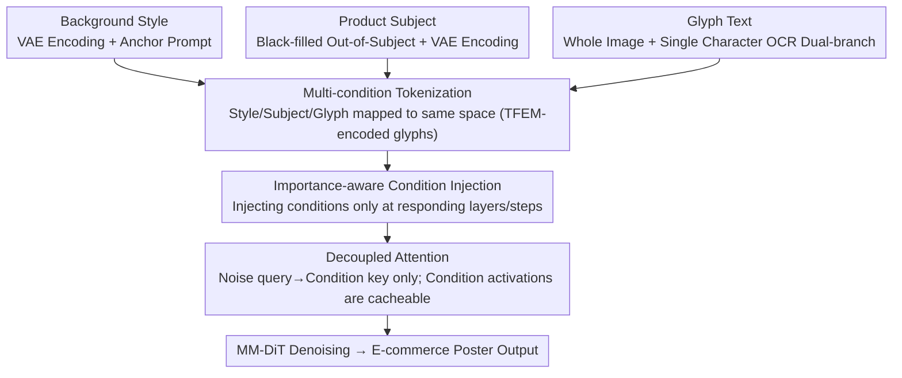

# InnoAds-Composer: Efficient Condition Composition for E-Commerce Poster Generation

**Conference**: CVPR 2026  
**arXiv**: [2603.05898](https://arxiv.org/abs/2603.05898)  
**Code**: None  
**Area**: Image Generation / Controllable Generation  
**Keywords**: E-commerce Poster Generation, Multi-condition Composition, MM-DiT, Text Rendering, Condition Importance Analysis

## TL;DR

InnoAds-Composer is proposed, a single-stage e-commerce poster generation framework based on MM-DiT. It maps product subjects, glyph texts, and background styles into a unified space via tokenization. By combining a Text Feature Enhancement Module (TFEM) and an importance-aware condition injection strategy, it achieves high-quality generation while significantly reducing inference overhead.

## Background & Motivation

E-commerce poster generation requires satisfying three objectives: **product fidelity, text accuracy, and style consistency**. However, existing methods have distinct limitations:

**Limitations of Prior Work**:
- **Unreliable multi-stage pipelines**: Synthesizing the scene before rendering text leads to style inconsistencies and degraded subject fidelity.
- **Difficulty in Chinese text rendering**: Single-stage methods struggle to accurately render complex scripts and small glyphs.
- **Style control dependency on prompts**: Generations often deviate from global styles or semantic constraints.
- **Scarcity of training data**: A lack of datasets containing joint annotations for subjects, text, and styles.

**Key Challenge**: Existing methods cannot jointly control background style, product subjects, and text end-to-end within a single model. Furthermore, concatenating multiple condition tokens leads to quadratic complexity expansion in attention mechanisms.

## Method

### Overall Architecture

E-commerce posters must balance product fidelity, text accuracy, and style unification. Previous approaches either used multi-stage pipelines (causing style disconnection) or single-stage models that failed at rendering small Chinese text. InnoAds-Composer adopts a single-stage approach built on the MM-DiT backbone. It unifies background style, product subjects, and glyph text via tokenization into a shared space. Based on the observation that "different conditions vary in importance across layers and timesteps," the model employs selective injection and prunes redundant attention paths to reduce inference costs without sacrificing quality.

### Key Designs

**1. Multi-condition Tokenization: Mapping Style, Subject, and Glyph to a Unified Space**

The three condition types differ significantly in form. Background style is processed via VAE encoding and patchification to obtain visual tokens $h^i$, or pure text tokens $h^p$, combined with a fixed anchor prompt $h^{p_0}$ as $h^b = \mathcal{C}(h^i, h^{p_0})$. For the product subject, the area outside the subject is filled with a black mask before VAE encoding to obtain $h^s$, suppressing background leakage at the source. For glyphs, the TFEM dual-branch is utilized: Branch 1 encodes the full glyph image via VAE for $h^{c1}$; Branch 2 crops individual characters through an OCR backbone and overlays triple position encodings (absolute position, font size, local position) for $h^{c2}$. Finally, a lightweight character encoder fuses them into $h^c = \mathbf{GlyphEnc}(h^{c1}, h^{c2})$, ensuring stability in rendering small and complex scripts.

**2. Importance-aware Condition Injection: Injecting Conditions Where Most Needed**

Concatenating all condition tokens throughout the sequence results in quadratic attention expansion. The authors diagnosed a pre-trained full-condition model by quantifying the importance of each condition type across layers $b$ and timesteps $t$:

$$S_{ci}(b,t) = \mathbf{Mean}(A^{b,t,c} \odot mask_{ci})$$

The results show non-uniform complementarity: background style dominates early layers/steps; the subject forms high-intensity bands in mid-to-deep layers; glyph importance increases from middle layers to late steps. Based on this, condition tokens are injected only at the most responsive positions (defaulting to 40% style, 50% subject, 20% glyph), drastically shortening the effective sequence.

**3. Decoupled Attention: Removing the Redundant Condition → Noise Path**

Condition tokens evolve slowly during denoising, making the computation of condition queries attending to noise keys largely redundant. Thus, only the noise query $\to$ condition key path is retained:

$$O_n = \mathbf{Attn}(Q_n, [K_n; K_{ci}], [V_n; V_{ci}])$$
$$O_{ci} = \mathbf{Attn}(Q_c, K_{ci}, V_{ci})$$

Consequently, the condition branch no longer depends on the timestep. Activations can be pre-computed and cached, with each inference step incurring only the cost of standard attention.

### Loss & Training

**Two-stage Training**: Stage I trains the complete poster generator with all condition tokens. Stage II performs pruning based on token importance followed by fine-tuning. Timestep sampling is weighted according to the quality distribution of the global importance map to mitigate performance loss from pruning.

## Key Experimental Results

### Main Results

InnoComposer-Bench evaluation (300 samples):

| Method | Sen. Acc↑ | NED↑ | DINO↑ | IoU↑ | CSD↑ | FID↓ |
|------|----------|------|-------|------|------|------|
| Flux-Kontext | - | - | 0.831 | 0.793 | 0.573 | 76.76 |
| PosterMaker | 0.765 | 0.848 | 0.916 | 0.954 | - | 60.55 |
| Qwen-Image-Edit | 0.831 | 0.960 | 0.922 | 0.903 | 0.722 | 69.86 |
| Seedream 4.0 | 0.865 | 0.972 | 0.864 | 0.837 | 0.700 | 64.21 |
| **Ours (Stage I)** | **0.857** | **0.976** | **0.923** | **0.972** | **0.729** | **54.39** |
| Ours (Stage II) | 0.847 | 0.969 | 0.914 | 0.960 | 0.727 | 55.24 |

Efficiency comparison:

| Method | Latency(s) | FLOPs(T) | Memory(G) |
|------|-----------|----------|-----------|
| Flux-Kontext | 76.02 | 218.45 | 55.29 |
| Ours (Stage I) | 55.87 | 165.56 | 39.71 |
| **Ours (Stage II)** | **47.32** | **135.25** | **39.41** |

### Ablation Study

| Configuration | Key Metric | Description |
|------|---------|------|
| w/o TFEM | Sen. Acc drops ~5% | Text rendering quality significantly degrades |
| Random vs Uniform vs Importance Pruning | Importance is significantly superior | Glyphs tolerate 80% pruning, Subject ~50%, Style ~60% |
| Stage I vs Stage II | Quality slight drop, efficiency high gain | Latency reduced by 37.8%, FLOPs reduced by 38.1% |

### Key Findings

- Stage I achieves the best performance across nearly all metrics, with an FID of 54.39 significantly outperforming open-source and commercial competitors.
- Stage II trades minimal quality for nearly 40% inference acceleration, demonstrating the efficiency of selective injection.
- The dual-branch glyph encoding of TFEM is critical for Chinese text rendering.

## Highlights & Insights

- **Condition Importance Visualization**: Systematic analysis of importance distributions of different conditions across layers and timesteps in MM-DiT, revealing non-uniform complementary patterns.
- **Decoupled Attention + Condition Caching**: The condition branch is timestep-independent and cacheable, ensuring inference overhead remains close to mainstream attention.
- **Supportive Dataset InnoComposer-80K**: The first e-commerce poster dataset containing joint annotations for subject, text, and style.

## Limitations & Future Work

- Training data is constructed via synthetic pipelines; background style diversity may be limited by the quality of the generative model.
- Importance analysis is based on fixed attention patterns of pre-trained models; explore if dynamic routing can be learned.
- Lack of extension to video posters or dynamic content.

## Related Work & Insights

- **Flux Series**: Foundation models providing T2I capabilities; this work builds multi-condition control on top of it.
- **PosterMaker**: Previous poster generation method; capable of subject+text but lacks style consistency.
- **Seedream 4.0**: Closed-source commercial model; strong text capabilities but uses "copy-paste" style transfer.

## Rating

- **Novelty**: ★★★★☆ — The combination of importance-aware injection and decoupled attention is innovative.
- **Technical Depth**: ★★★★☆ — Comprehensive condition analysis system and TFEM design.
- **Experimental Thoroughness**: ★★★★☆ — Multi-dimensional metrics, efficiency analysis, and ablations, though the test set is limited to 300 samples.
- **Value**: ★★★★★ — Directly applicable to e-commerce scenarios with significant efficiency gains.

<!-- RELATED:START -->

## Related Papers

- [\[CVPR 2026\] SimplePoster: A Simple Baseline for Product Poster Generation](simpleposter_a_simple_baseline_for_product_poster_generation.md)
- [\[CVPR 2026\] PosterIQ: A Design Perspective Benchmark for Poster Understanding and Generation](posteriq_a_design_perspective_benchmark_for_poster_understanding_and_generation.md)
- [\[CVPR 2026\] DynFusion: Rethinking Condition Fusion for Adaptive Multi-Conditional Text-to-Image Generation](dynfusion_rethinking_condition_fusion_for_adaptive_multi-conditional_text-to-ima.md)
- [\[CVPR 2026\] Scone: Bridging Composition and Distinction in Subject-Driven Image Generation via Unified Understanding-Generation Modeling](scone_bridging_composition_and_distinction_in_subject-driven_image_generation_vi.md)
- [\[CVPR 2026\] PhotoFramer: Multi-modal Image Composition Instruction](photoframer_multi-modal_image_composition_instruction.md)

<!-- RELATED:END -->
