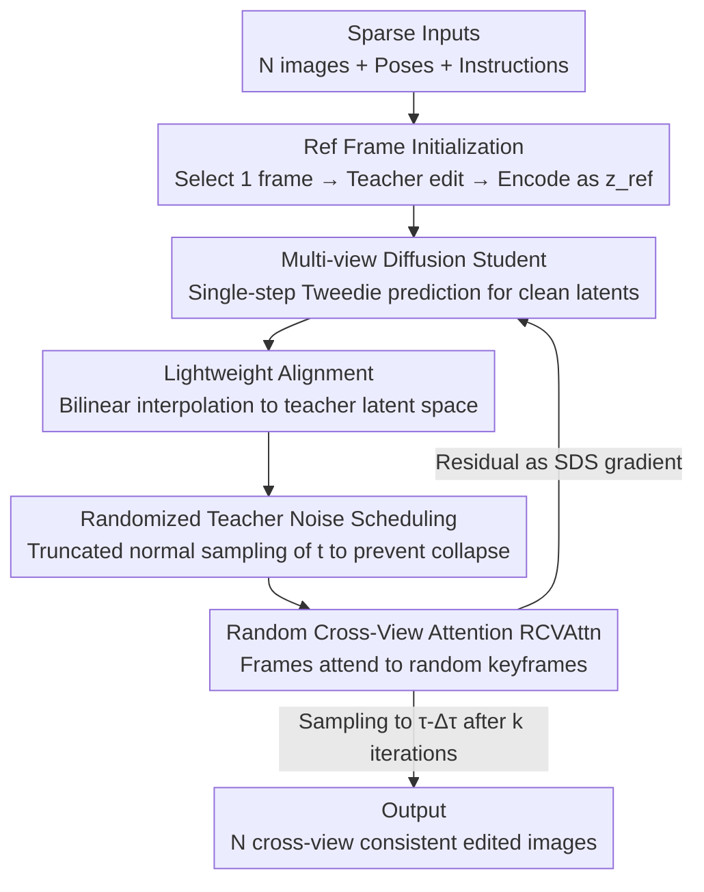

# InstructMix2Mix: Consistent Sparse-View Editing Through Multi-View Model Personalization

**Conference**: CVPR 2026  
**Paper**: [CVF Open Access](https://openaccess.thecvf.com/content/CVPR2026/html/Gilo_InstructMix2Mix_Consistent_Sparse-View_Editing_Through_Multi-View_Model_Personalization_CVPR_2026_paper.html)  
**Code**: Project Page (Mentioned in the paper, refer to the original text for the specific URL⚠️)  
**Area**: Diffusion Models / Image Editing / Multi-view Consistency  
**Keywords**: Multi-view editing, Sparse-view, Score Distillation Sampling, Model personalization, Cross-view attention

## TL;DR
This work distills the editing capabilities of a single-image instruction editor (InstructPix2Pix) into a pre-trained multi-view diffusion model (SEVA) via Score Distillation Sampling (SDS). The latter's data-driven 3D prior serves as an "integrator," enabling consistent cross-view image editing even with only a few sparse views.

## Background & Motivation

**Background**: The mainstream approach for 3D/multi-view image editing involves "leveraging a 2D editor + using an explicit 3D representation as a consistency constraint." This typically fits a scene into a NeRF or 3D Gaussian Splatting (3DGS) followed by iterative updates (Iterative Dataset Update) or Score Distillation Sampling (SDS) using single-image editors like InstructPix2Pix. The rendering equations of NeRF/3DGS provide physical consistency priors that "integrate" single-image edits into cross-view consistent results.

**Limitations of Prior Work**: This paradigm implicitly assumes the availability of **dense** input views to fit NeRF/3DGS properly. In reality, users often have only a few snapshots (sparse views). Under sparse views, 3DGS **overfits** the few training images rather than acting as a cross-view aggregator. NeRF-based methods (e.g., Nerfacto) may even render significant floater artifacts in the source views, resulting in out-of-distribution inputs that cause the 2D editor to fail. Conversely, video-style methods relying solely on "extended self-attention" are stable only under small viewpoint changes and fail to align details under large baseline differences.

**Key Challenge**: Consistency relies on the "integrator." Traditional integrators (NeRF/3DGS) place the 3D prior within the **rendering equations** rather than the network weights. Consequently, they require dense views to "activate" this physical prior. In sparse-view scenarios, the integrator fails, and consistency is lost.

**Goal**: Given only $N$ (primarily $N=4$ in experiments) sparse input images and a text instruction, generate edited results that are both faithful to the instruction and consistent across all views.

**Key Insight**: The authors propose replacing the integrator with one that carries the **3D prior in its weights**—specifically, a multi-view synthesis diffusion model. While such models (e.g., SEVA) are inherently trained to generate view-consistent scenes, they **cannot perform editing**. Thus, the strategy is to combine a "2D teacher who can edit" with a "multi-view student who maintains consistency" by distilling editing capabilities from the former to the latter.

**Core Idea**: Within the SDS framework, replace the traditional neural field integrator (NeRF/3DGS) with a **multi-view diffusion student** and redesign key SDS steps (student query, perturbation scheduling, and cross-view attention for teacher predictions).

## Method

### Overall Architecture

I-Mix2Mix is built upon SDS. Standard SDS is a five-stage iterative loop: ① Student Query (rendering images for the teacher) → ② Student-Teacher Alignment (mapping student output to teacher input space) → ③ Perturbation (adding noise via teacher's forward diffusion) → ④ Teacher Prediction (frozen 2D diffusion teacher provides denoising/editing direction) → ⑤ Student Update (updating the student using the residual between teacher prediction and sampled noise as a gradient). In traditional SDS, the student is a per-scene neural field, and ① is differentiable rendering.

This paper replaces the student with a multi-view diffusion model $\epsilon_\theta$ (SEVA) and the teacher with a single-image instruction editor $\epsilon_\phi$ (InstructPix2Pix). This replacement necessitates redesigning stages ①, ③, and ④. The pipeline: first, a random input frame $I_{ref}$ is edited by the frozen teacher to produce a reference image $E_{ref}$, which is encoded into a reference latent $z_{ref}$ as the student's "clean input frame" (initialization). Subsequently, at each student timestep $\tau$, $k$ distillation iterations are performed to **personalize** the multi-view student to the current scene and instruction. After distillation, the student takes one sampling step to $\tau-\Delta\tau$, nesting until $\tau=0$, outputting $N$ consistent edited views $E_i = D_T(\hat z_0^i)$.

### Key Designs

**1. Multi-view Diffusion Student: Embedding "3D Priors in Weights" into SDS**

Addressing the failure of NeRF/3DGS integrators in sparse views, the authors replace the SDS student with SEVA, a pre-trained multi-view synthesis model. Based on Stable Diffusion 2.1 and adapted for New View Synthesis (NVS), SEVA is trained on vast object/scene datasets. Consequently, its network weights **directly encode data-driven 3D consistency priors**, unlike neural fields that rely on dense views to "activate" physical priors. Thus, even with only 4 images, the student can integrate frame-wise editing signals into geometrically consistent results.

To maintain efficiency, the authors avoid running the full sampling trajectory during every SDS iteration. Instead, they perform **incremental distillation along student timesteps**: starting from $\tau=T$, they sample initial latents $\{\hat\tau_T^i\}\sim\mathcal N(0,\sigma_S^2 I)$. At each step, a **single-step** clean latent prediction $\hat\tau_0(\tau)$ via the Tweedie formula is used as the intermediate student output for teacher evaluation. This single-step prediction reduces peak VRAM by over half for $N=4$ compared to multi-step methods.

**2. Randomized Teacher Noise Scheduling: Preventing Collapse to Trivial Solutions**

Standard SDS samples the teacher timestep $t$ uniformly from $[0.02, 0.98]$. However, early student outputs (at large $\tau$) lie outside the natural image manifold. If a small $t$ is chosen, the resulting noisy image falls outside the teacher's distribution, causing unstable guidance. Conversely, forcing $t \approx \tau$ limits the teacher's ability to provide corrective gradients at small $\tau$.

The authors employ a **randomized schedule**: $t\sim\mathrm{TruncNorm}(\mu=b,\ \sigma=b^{-f},\ a=\tau,\ b=0.95)$, where $f$ controls the skewness toward high-noise levels ($b$). This ensures the teacher **periodically provides strong gradients at high noise levels**, which is found to be effective in avoiding collapse into poor local minima. Ablations show that alternatives (Uniform $t$ or $\tau$-matched $t$) often collapse into near-identity reconstructions—resulting in falsely high CLIP consistency (trivially consistent) but failing to achieve the actual edit (low CLIP Directional score).

**3. Random Cross-View Attention (RCVAttn): Improving Consistency Without Computational Overhead**

Feeding $N$ noisy latents as a batch to the single-image teacher U-Net results in **independent** noise predictions per frame. These conflicting signals, when backpropagated, weaken the student’s multi-view prior. The authors introduce RCVAttn: in each iteration, a random keyframe index $\kappa\sim U\{1,\dots,N\}$ is selected. Every frame $i$ then attends to the tokens of this keyframe: $\mathrm{RCVAttn}(Q,K,V,i)=\mathrm{softmax}\!\big(Q_i K_\kappa^\top/\sqrt d\big)V_\kappa$. Aligning all frames to one keyframe significantly enhances consistency.

Compared to expensive "extended-attention" (all-to-all), RCVAttn **adds zero computational cost**. While non-keyframe quality might slightly decrease, the random selection ensures every frame occasionally serves as the keyframe, preventing systematic degradation.

**4. Lightweight Alignment + Reference Frame Initialization: Bridging Spaces Efficiently**

Since the student and teacher are different latent diffusion models, their latent spaces and dimensions differ. While one could use the student decoder $D_S$ and teacher encoder $E_T$, backpropagating through both is computationally expensive. Inspired by the observation that different representation spaces can often be bridged via simple mappings, the authors simply use **bilinear interpolation** to match teacher dimensions: $\hat z_0^i=\mathcal I_{bilinear}(\hat\tau_0^i; H_T,W_T)$. Ablations show no measurable benefit from a learned mapping, suggesting the student implicitly aligns with the teacher latent space during fine-tuning. This saves 40%+ VRAM compared to decoding/encoding.

For initialization, SEVA requires at least one clean input latent. The authors randomly select an input frame $I_{ref}$, edit it with the 2D teacher to get $E_{ref}$, and use $z_{ref}=E_S(E_{ref})$ as the reference input for all distillation iterations. Ablations show that using the original source frame as the reference (without editing) leads to slower convergence and lower cross-view consistency.

### Loss & Training

The core objective is the SDS gradient: at student timestep $\tau$, $\nabla_\theta\mathcal L_{SDS}=\frac1N\sum_{i=1}^N\big[\epsilon_\phi(\hat z_t^i; y, I_i, t)-\epsilon_i\big]\frac{\partial \hat z_0^i}{\partial\theta}$. The residual between the teacher's predicted noise and the sampled noise $\epsilon_i$ serves as the guidance direction to **update the student weights** (rather than the latents). This approach—updating weights rather than latents—avoids diverging from the target distribution and provides more stability. The student is personalized via $k$ iterations at each $\tau$.

## Key Experimental Results

Evaluations were conducted on scenarios from I-N2N, Tanks and Temples, CO3D, and Mip-NeRF 360. The main experiments used $N=4$ views across 20 different edits. Metrics include: **CLIP Sim.** (frame-wise semantic alignment with prompt), **CLIP Dir.** (alignment of image change direction with prompt change direction), and **CLIP Cons.** (cross-view consistency—measuring relative changes between all $\binom N2$ pairs).

### Main Results

| Method | CLIP Cons.↑ | CLIP Sim.↑ | CLIP Dir.↑ | Note |
|------|------|------|------|------|
| I-N2N | 0.034 | 0.196 | 0.105 | NeRF fitting failed; collapsed in sparse views |
| I-GS2GS | 0.314 | 0.253 | 0.169 | 3DGS overfitted; edits were nearly independent |
| T2VZ | 0.310 | 0.251 | 0.159 | Zero-shot image-to-video; inconsistent details |
| DGE | 0.287 | 0.256 | 0.182 | Extended-attn+3DGS; strong baseline |
| **Ours** | **0.342** | **0.258** | 0.173 | Highest consistency without sacrificing quality |

I-Mix2Mix achieved the best CLIP Cons. while maintaining high CLIP Sim. and CLIP Dir. Qualitative results show that baselines often fail on details (e.g., armor textures on a knight, Face Paint intensity, or skull features changing per view). The proposed method maintains high consistency across viewpoints.

Human Study (vs. DGE, marking inconsistent regions):

| Method | Avg. Inconsistencies↓ | Scene Win Rate↑ | Consistent Scene %↑ | Inconsistent Scene %↓ |
|------|------|------|------|------|
| DGE | 2.02 | 25.0% | 34.0% | 31.0% |
| **Ours** | **1.34** | **75.0%** | **65.0%** | **13.0%** |

### Ablation Study

Ablations on 6 representative edits (red text indicates weak results):

| SDS Stage | Configuration | CLIP Cons. | CLIP Sim. | CLIP Dir. | Interpretation |
|------|------|------|------|------|------|
| — | Student Only | 0.014 | 0.212 | 0.161 | Poor fidelity without teacher |
| — | Teacher Only | 0.228 | 0.252 | 0.184 | Good editing, poor cross-view consistency |
| Init | Source ref. Frame | 0.326 | 0.264 | 0.174 | Consistency drops without pre-editing ref |
| Align | Learned Mapping | 0.287 | 0.259 | 0.180 | No gain over interpolation |
| Sched | Uniform t | 0.363 | 0.260 | 0.146 | Collapses toward identity; low Dir. |
| Sched | τ-matched t | 0.435 | 0.231 | 0.107 | Misleadingly high consistency; no actual edit |
| Prediction | W/O RCVAttn | 0.230 | 0.260 | 0.175 | Consistency drops significantly |
| — | **Full** | 0.337 | 0.263 | 0.178 | Balanced performance |

### Key Findings
- **"High Consistency" $\neq$ "Good"**: Uniform/$\tau$-matched $t$ show higher CLIP Cons. because they collapse to near-identity outputs (performing no edits). Consistency must be evaluated alongside editing performance (CLIP Dir.).
- **Teacher and Student are Both Essential**: The "Student Only" results indicate SEVA alone cannot perform these edits, proving that the method distills new capabilities into the student rather than searching its existing distribution.
- **Efficient Design**: Single-step predictions halved peak VRAM for $N=4$; interpolation saved 40%+ memory; RCVAttn provided throughput advantages over extended-attention.
- **Beyond Editing**: The framework can technically use any image-to-image diffusion model as a teacher. Tests with ControlNet (Depth/Canny→RGB) showed consistent but slightly blurry results.

## Highlights & Insights
- **Smart Integrator Swap**: Replacing "rendering equation priors" with "weight-based priors" directly addresses the root cause of sparse-view failures. 
- **RCVAttn Efficiency**: The "random keyframe rotation" trick provides significant consistency gains with zero overhead, a transferable concept for other cross-view alignment tasks.
- **Anti-collapse Scheduling**: Using a Truncated Normal distribution to favor high-noise gradients periodically solves the SDS identity-mapping collapse.
- **Update Weights, Not Latents**: Updating weights rather than latents provides more stable guidance and prevents divergence from the target distribution.

## Limitations & Future Work
- Backbone dependence: Failures in the teacher (InstructPix2Pix) or student (SEVA) baggage along. Modular design allows for future backbone upgrades.
- **Speed**: Multiple distillation iterations per noise level make it slower than DGE.
- Tasks beyond editing (like ControlNet conditioning) currently lack sharpness, a known SDS-related artifact.
- Quantitative evaluation of 3D consistency is primarily via CLIP proxies; harder geometric metrics (e.g., reprojection error) could be more definitive.

## Related Work & Insights
- **vs. Instruct-NeRF2NeRF / Instruct-GS2GS**: These use NeRF/3DGS as integrators with iterative dataset updates. I-Mix2Mix uses a multi-view student and SDS; the key difference is the location of the 3D prior (rendering equation vs. weights), allowing I-Mix2Mix to function in sparse views.
- **vs. DGE**: DGE uses extended attention for coarse consistency and 3DGS to clean artifacts. In sparse views, 3DGS overfits, leaving DGE with the detail inconsistencies of video editing. I-Mix2Mix offers better consistency and human preference.

## Rating
- Novelty: ⭐⭐⭐⭐⭐ Replacing neural fields with multi-view diffusion models in SDS is an effective reframing.
- Experimental Thoroughness: ⭐⭐⭐⭐ Comprehensive tables, human studies, and ablations, though lacking direct geometric 3D metrics.
- Writing Quality: ⭐⭐⭐⭐⭐ Excellent articulation of the five-stage SDS modifications and the "consistency trap" in ablations.
- Value: ⭐⭐⭐⭐ Directly addresses the practical need for sparse-view editing (e.g., snapshots) with a generalized, modular framework.

<!-- RELATED:START -->

## Related Papers

- [\[CVPR 2026\] Coupled Diffusion Sampling for Training-Free Multi-View Image Editing](coupled_diffusion_sampling_for_training-free_multi-view_image_editing.md)
- [\[CVPR 2026\] Correspondence-Attention Alignment for Multi-View Diffusion Models](correspondence-attention_alignment_for_multi-view_diffusion_models.md)
- [\[CVPR 2026\] LaRP: Efficient Multi-View Inpainting with Latent Reprojection Priors](larp_efficient_multi-view_inpainting_with_latent_reprojection_priors.md)
- [\[CVPR 2025\] SIR-DIFF: Sparse Image Sets Restoration with Multi-View Diffusion Model](../../CVPR2025/image_generation/sir-diff_sparse_image_sets_restoration_with_multi-view_diffusion_model.md)
- [\[ICML 2026\] ViewMask-1-to-3: Multi-View Consistent Image Generation via Multimodal Discrete Diffusion Models](../../ICML2026/image_generation/viewmask-1-to-3_multi-view_consistent_image_generation_via_multimodal_discrete_d.md)

<!-- RELATED:END -->
