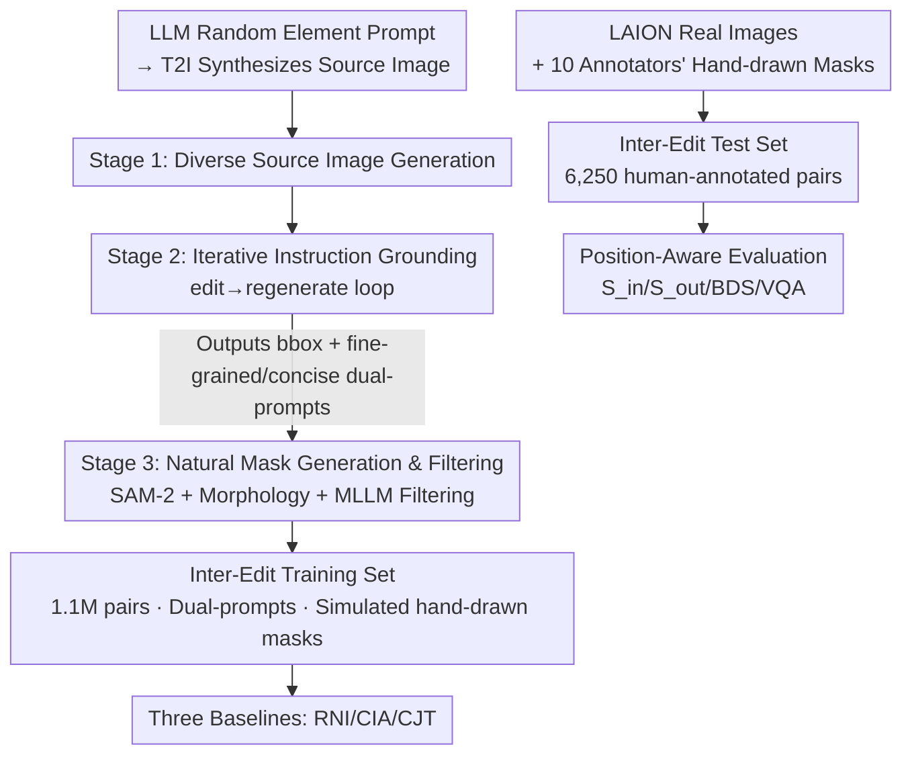

# Inter-Edit: First Benchmark for Interactive Instruction-Based Image Editing

**Conference**: CVPR 2026  
**Paper**: [CVF Open Access](https://openaccess.thecvf.com/content/CVPR2026/html/Liu_Inter-Edit_First_Benchmark_for_Interactive_Instruction-Based_Image_Editing_CVPR_2026_paper.html)  
**Code**: https://github.com/Delong-liu-bupt/Inter-Edit  
**Area**: Image Editing / Diffusion Models / Datasets & Benchmarks  
**Keywords**: Interactive Image Editing, Instruction Editing, Scribble Guidance, Data Generation Pipeline, Position-Aware Evaluation

## TL;DR
To address the image editing dilemma where "pure text cannot specify locations accurately, and precise masks are too tedious to draw," this paper proposes the I3E task (concise instructions + imprecise spatial scribbles). It constructs Inter-Edit, a million-scale automatically synthesized training set, along with a human-annotated test set of 6,250 samples and a suite of position-aware evaluation metrics. Furthermore, it provides three baselines (RNI/CIA/CJT) that substantially Rent SOTA methods (including closed-source systems) in interactive editing.

## Background & Motivation

**Background**: Controllable image editing currently has three major paradigms: instruction-driven (the InstructPix2Pix family, which describes what to modify using natural language), drag-based manipulation (dragging points on objects to change shape/pose), and mask-based inpainting (users drawing masks to define the editing region for inpainting).

**Limitations of Prior Work**: All three approaches have critical vulnerabilities. **Instruction-guided methods** are intuitive, but natural language is inherently poor at describing spatial locations; positioning descriptions like "add a book under the second apple" often fail. **Drag-based methods** can only deform existing content and cannot perform semantic edits like "adding or deleting objects." **Mask-based inpainting** offers precise control over regions, but the generation quality is extremely sensitive to the mask's geometry. To achieve natural boundary blending, user-drawn masks often must be larger than the target object, which is labor-intensive, loses original details, and leaves harsh boundaries.

**Key Challenge**: There exists a trilemma between semantic flexibility, precise spatial control, and a natural, intuitive user experience. Instruction-guided methods sacrifice control, while mask-based methods sacrifice ease of use and naturalness. At a deeper level, existing large-scale datasets generally use segmentation models to obtain masks. However, these segmentation outputs are pixel-level and fragmented, which does not align with the "rough regional intention in the user's mind." Consequently, these datasets are optimized for segmentation rather than editing, departing from the user-centric original intention.

**Goal**: The goal of this paper is to define a new task that enables precise semantic editing with only a short instruction and a rough scribble, while addressing the lack of supporting infrastructure, including the absence of suitable training data, evaluation benchmarks reflecting "imprecise masks," and position-aware metrics.

**Key Insight**: Since real-world users never draw pixel-aligned, precise masks, training data should not rely on segmentation-aligned masks. Instead, "imprecise, hand-drawn" masks should be deliberately simulated, allowing the model to learn to infer from vague spatial intentions and seamlessly integrate edits into the legacy background.

**Core Idea**: Replace "precise text" or "precise masks" with "concise text + imprecise spatial guidance," and build a fully automated pipeline to mass-produce training pairs with simulated hand-drawn masks. Combined with a human-annotated test set and position-aware metrics, the entire new task is established as a reproducible benchmark.

## Method

### Overall Architecture
Strictly speaking, this paper does not just "propose a new model," but rather establishes a new task (I3E) along with its dataset, benchmark, metrics, and baselines as a complete system. The three pillars are: (1) a three-stage fully automated pipeline to synthesize 1.1 million training pairs; (2) a mask generation and filtering strategy aimed at "simulating real-world user annotations"; and (3) a set of position-aware evaluation metrics and three baseline models to make the task functional.

The key to the data pipeline is not merely "calling T2I/MLLM models," but rather its deliberate creation of **dual-prompts** and **non-segmentation-aligned natural masks**—which is the lifeline that distinguishes I3E from previous editing datasets. Thus, a flowchart is utilized to clarify the three stages.

### Key Designs

**1. I3E Task Definition: Replacing Precise Text or Precise Masks with "Concise Instructions + Imprecise Scribbles"**

I3E (Interactive Instruction-based Image Editing) is the foundation of this work. It requires the model to infer the user's vague spatial intent from a short instruction (e.g., "Put a bird here") and a rough hand-drawn scribble, seamlessly harmonizing the edit with the background. This directly targets the prior trilemma: instruction-guided methods lack positioning accuracy, and mask-based methods suffer from heavy user burden. I3E delegates "positioning" to a casual scribble (which does not need to be pixel-aligned) and "what to modify" to brief text, allowing users to control regions precisely with minimal effort. The fundamental difference from inpainting is that I3E performs **full-image generation** rather than only redrawing pixels inside the mask, naturally propagating collateral changes like lighting, shadows, and reflections outside the mask, rather than forming harsh artifact seams at the mask boundary.

**2. Three-Stage "edit-then-regenerate" Data Pipeline: Converting Vague Positioning into Supervised Bboxes + Dual-Prompts**

Training an I3E model requires a massive amount of "(source image, concise instruction, rough region, edited image)" quadruplets, which are impossible to scale to millions manually. This paper designs a fully automated three-stage pipeline (Figure 2a):

- **Stage 1: Diverse Source Image Generation**: Employs an LLM with various random elements to generate diverse synthetic prompts, which are fed to the T2I model to produce initial source images, ensuring high thematic diversity.
- **Stage 2: Iterative Instruction Grounding (Core Innovation)**: A MLLM randomly selects one of four editing classes (Local/Remove/Add/Texture) to generate an edit prompt based on the source image, which is executed by Qwen-Image-Edit-2509 (Q-Edit). The authors observe a key asymmetry: **the success rate of the editing model executing the edit is lower than the MLLM's ability to accurately describe an already "completed edit" post-hoc.** Thus, a "Regenerate" step is introduced: the (source image, edited image) pair is **fed back** into the MLLM, prompting it to re-examine the edits, locate the precise bounding box of the modified area first, and simultaneously output two versions of the prompt—one fine-grained (for pure instruction-based editing) and one concise (paired with spatial information for I3E). This step translates "vague positioning that even the model cannot define clearly" into supervised signals containing bboxes and dual-prompts.
- **Stage 3: Natural Mask Generation and Filtering**: Uses the bbox from Stage 2 to guide SAM-2 to segment the edited region. However, raw pixel-level masks are often fragmented and deviate from human-drawing habits. Therefore, morphological operations (erosion/dilation), dilation, and Gaussian blur are applied as post-processing to "smooth" it into a soft mask that looks like a casual hand scribble. Note that the generated mask here only covers the primary edited subject and excludes collateral changes caused by the subject elsewhere, perfectly matching real user annotation habits. Finally, a strong MLLM acts as an evaluator, utilizing CoT to analyze details before judging success/failure, and successful samples must output another bbox to lower false positives.

The **dual-prompt system** is the ultimate value delivered by this pipeline: each sample contains both a fine-grained prompt of around 17 words (for pure text editing) and a concise prompt of about 8 words (for I3E with masks), serving two editing paradigms with the same dataset.

**3. User-Centric Human-Annotated Test Set: Modeling "Vague Masks" Authentically Rather than Self-Evaluating on Model-Generated Masks**

The authors explicitly point out that model-generated masks might not align with real user behaviors, and thus the test set (Figure 2b) is designed to be **fully human-annotated**. Source images are mainly collected from LAION, with four challenging subsets intentionally curated: artistic styles, low resolution (<480px), low aesthetic scores, and ambiguous edits (e.g., multiple similar objects in the image where positioning is inherently ambiguous). Ten annotators of different genders and ages first check if the edited images generated by Q-Edit match expectations. Once they understand the editing intent, they **intuitively hand-draw masks** and write editing instructions. This deliberately preserves "how humans roughly annotate" in the benchmark, avoiding the self-evaluation bias induced by using model-generated masks.

**4. Position-Aware Evaluation Metrics: Decomposing "Editing Target Correctness + Background Preservation + Natural Boundaries" into Quantifiable Scores**

Traditional metrics (L1/SSIM/CLIP score) are either weakly correlated with human perception or have been proven flawed in spatial reasoning, making them unable to capture the dual objectives of I3E (faithfully executing edits inside the region, while preserving background and naturally propagating collateral changes outside). This paper establishes a suite of metrics, denoting the source image as $I_s$, the edited image as $I_e$, the GT image as $I_{gt}$, and the binary mask as $M$:

- **Inner Region Fidelity $S_{in}$ and Outer Region Preservation $S_{out}$**: Assisted by Alpha-CLIP (whose visual encoder $E_\alpha(I,A)$ emphasizes mask regions during encoding), cosine similarity is calculated:

$$S_{in} = S_{\cos}\big(E_\alpha(I_e, M),\, E_\alpha(I_{gt}, M)\big), \qquad S_{out} = S_{\cos}\big(E_\alpha(I_e, 1-M),\, E_\alpha(I_s, 1-M)\big)$$

$S_{in}$ is computed inside the mask comparing the edited image and the GT image to measure "whether the region to modify is correctly updated"; $S_{out}$ is computed outside the mask comparing the edited image and the source image to measure "whether the region to preserve remains intact," with higher scores being better.

- **Boundary Discontinuity Score (BDS)**: The typical failure mode of mask-based methods is sharp transitions along mask borders. Morphology is first used to extract two disjoint transit bands, inner and outer: $T_{in} = M \setminus \text{Erode}(M,k)$ and $T_{out} = \text{Dilate}(M,k) \setminus M$. Then, the Sobel gradient magnitude $\mathcal{G}(I)=|\nabla I|$ is used as a proxy for local sharpness, taking the absolute difference of the average gradient magnitudes between the inner and outer bands:

$$\text{BDS} = \left| \frac{\| \mathcal{G}(I_{out}) \odot T_{in} \|_1}{\|T_{in}\|_1} - \frac{\| \mathcal{G}(I_{out}) \odot T_{out} \|_1}{\|T_{out}\|_1} \right|$$

BDS values closer to 0 are better, indicating continuous sharpness and natural transition across boundaries. A larger value implies that the boundary is either too blurry or too harsh, meaning visible artifacts exist.

- **VQA Score**: Uses a powerful MLLM (Claude Sonnet 4.5) to output an overall rating $\{S_{edit}, S_{nat}, S_{aes}, S_{align}\} = \Phi_{VQA}(I_s, I_e, M, P_{vqa})$, which evaluates edit success, naturalness, aesthetics, and alignment, respectively. $S_{VQA}$ is the average of these four. The authors also validate through human evaluation that the VQA score is highly correlated with human preferences.

### A Complete Example
Taking "Add a lit desk lamp on the gray sofa near the left armrest" from Figure 2 as an example to walk through the pipeline: In Stage 1, the LLM creates a source image containing a sofa. In Stage 2, the MLLM selects the "Add" class, generates an edit prompt and sends it to Q-Edit for execution. The (source image, image with the lamp added) pair is then fed back to the MLLM, which predicts the bbox of the lamp, producing a fine-grained prompt (17 words with spatial descriptions) and a concise prompt "Add a lit lamp" (8 words). In Stage 3, SAM-2 extracts the lamp mask based on the bbox, which is processed via dilation and Gaussian blur to smooth it into a soft region resembling a casual human scribble. The MLLM filter uses CoT to determine editing success and double-checks the bbox, storing the sample in the dataset. For testing, the same idea is adapted for humans: after understanding the intent of "adding a lamp," annotators hand-draw a rough area on the sofa and write a concise instruction. The model then generates the full image based on this, naturally blending lighting and shadows.

## Key Experimental Results

### Main Results
Comparison of the three baselines (RNI/CIA/CJT) against SOTA instruction-based and mask-based methods on the Inter-Edit test set (↑ higher is better, ↓ lower is better; $S_{VQA}$ is the average of the four automatic scores, and Human Eval. denotes human evaluation):

| Category | Method | LPIPS ↓ | BDS ↓ | $S_{in}$ ↑ | $S_{out}$ ↑ | $S_{VQA}$ ↑ | Human Eval. ↑ |
|------|------|---------|-------|-----------|------------|------------|-----------|
| Instruct | Flux Kontext | 0.407 | 11.207 | 0.958 | 0.957 | 5.314 | 4.558 |
| Instruct | Q-Edit | 0.262 | 5.329 | 0.962 | 0.963 | 5.695 | 5.016 |
| Mask | Flux-Fill | 0.197 | 15.969 | 0.941 | 0.970 | 4.287 | 3.826 |
| Mask | PowerPaint | 0.209 | 49.518 | 0.929 | 0.963 | 3.859 | 3.510 |
| **I3E** | **Ours (RNI)** | **0.191** | 10.485 | **0.976** | **0.974** | **6.431** | 6.672 |
| **I3E** | **Ours (CIA)** | 0.259 | 5.534 | 0.966 | 0.950 | 5.979 | 6.156 |
| **I3E** | **Ours (CJT)** | 0.242 | 5.435 | 0.976 | 0.961 | 6.333 | **6.720** |

The three I3E methods sweep the top three ranks in $S_{in}$, $S_{out}$, $S_{VQA}$, and Human Evaluation. RNI is the strongest in LPIPS, inner/outer region fidelity, and EditSuccess/Alignment (aligning best with the "modify precisely while keeping the background intact" mission objective). However, ControlNet's strict commitment to the mask boundaries makes the transition slightly unnatural, occasionally leaving misaligned shadows outside the editing region, which leads to a higher BDS than the other two methods. CJT leads in naturalness and aesthetics, obtaining the highest human evaluation score, with the trade-off of occasionally affecting partially overlapping adjacent objects at the transition boundary. CIA remains mediocre overall.

### Ablation Study

| Method | Configuration | LPIPS ↓ | BDS ↓ | $S_{in}$ ↑ | $S_{out}$ ↑ | $S_{VQA}$ ↑ |
|------|------|---------|-------|-----------|------------|------------|
| RNI | Full | 0.191 | 10.485 | 0.976 | 0.974 | 6.431 |
| RNI | w/o MLLM Filtering | 0.202 | 10.669 | 0.968 | 0.967 | 6.189 |
| RNI | w/o Mask Post-processing | 0.198 | 12.239 | 0.969 | 0.965 | 6.234 |
| CIA | Full | 0.259 | 5.534 | 0.966 | 0.950 | 5.979 |
| CIA | w/o Fine-tuning | 0.286 | 5.624 | 0.960 | 0.942 | 5.477 |
| CIA | LoRA Rank=16 | 0.265 | 5.545 | 0.963 | 0.950 | 5.906 |
| CIA | LoRA Rank=64 | 0.261 | 5.526 | 0.964 | 0.952 | 5.964 |
| CJT | Full (Rank=32) | 0.242 | 5.435 | 0.976 | 0.961 | 6.333 |
| CJT | LoRA Rank=64 | 0.249 | 5.451 | 0.972 | 0.962 | 6.346 |

### Key Findings
- **Both data quality gates are critical**: Removing the MLLM filter introduces noisy samples, dropping the $S_{VQA}$ of the three methods by 0.2 to 0.3. Removing the mask post-processing hinders the model's generalization on real-world data (BDS degrades significantly, e.g., RNI increases from 10.485 to 12.239), proving that "simulating hand-drawn masks" is essential.
- **Pre-trained editing models have the prototype of I3E but require fine-tuning**: CIA without fine-tuning drops from 0.259 to 0.286 in LPIPS, and from 5.979 to 5.477 in $S_{VQA}$, showing that zero-shot Q-Edit can perform basic interactive editing but falls far short of optimal performance.
- **LoRA rank=32 is the sweet spot**: Ranks below 32 result in performance degradation, while ranks above 32 no longer provide stable gains and may even hurt generalization due to over-fitting dataset characteristics. Thus, 32 is chosen as the default.
- **Controllable text generation is an unexpected highlight**: In the last row of Figure 5, where almost all advanced models fail, our method not only clearly renders the text "Welcome to Garden" but also precisely adjusts the text geometry according to the given mask.

## Highlights & Insights
- **Capturing the overlooked fact that "real user annotations are imprecise"**: Previous large-scale datasets used segmentation masks, optimizing for segmentation rather than editing. Conversely, this work deliberately blurs the masks during training and relies entirely on human-drawn masks for testing to align the task setting with actual interaction—achieving a "human alignment" at the data level.
- **"edit-then-regenerate" exploits a subtle asymmetry**: Editing models have a lower success rate in "generating correctly" than MLLMs have in "describing correctly" post-hoc. By allowing the weaker model to generate and the stronger model to evaluate and produce bboxes + dual-prompts, the uncontrollable generation process is distilled into supervised signals. This technique can be generalized to any "hard to generate, easy to evaluate" data synthesis scenario.
- **The BDS metric is independent and highly reusable**: Quantifying "boundary naturalness" by measuring the Sobel gradient difference between inner and outer transition bands is geometry-based and requires no GT. It can be directly applied to evaluate boundary artifacts of any inpainting/editing methods.
- **Three baselines represent three general approaches to integrating control conditions** (side branch / modifying the input image / multi-image joint input), providing a clear starting point for subsequent research.

## Limitations & Future Work
- **Baselines rather than final solutions**: RNI/CJT/CIA are established as baselines to demonstrate task feasibility and encourage community participation. Each has its bottlenecks (RNI with misaligned shadows, CJT affecting adjacent overlapping objects, CIA being average), and a unified scheme without obvious flaws is yet to be developed.
- **Reliance on closed-source LLMs as evaluators**: Utilizing Claude Sonnet 4.5 for VQA scores and a powerful MLLM for filtering ties both evaluation and data generation to proprietary models, raising concerns about reproducibility cost and stability (although human evaluation is used for cross-validation).
- **Train set is entirely synthetic**: Source images are generated by T2I, and edits are executed by Q-Edit, which may introduce model biases. Although the test set is human-annotated, the source images are sampled from LAION; whether the distribution fully covers real-world editing needs remains to be verified.
- **Future directions listed by the authors**: Introducing adjustable factors to control region alignment levels, reference-guided refinement using GT edit regions, and incorporating "negative scribbles" for selective inhibition—all pointing towards finer-grained interactive control.

## Related Work & Insights
- **vs. InstructPix2Pix / ICEdit / Flux Kontext (Instruction-based)**: These rely strictly on text, which lacks inherent spatial positioning precision and often erroneously modifies non-target regions. This work adds a rough scribble to supply localization, achieving major leads in $S_{in}$ and human evaluation.
- **vs. Flux-Fill / BrushNet / PowerPaint (Mask-based)**: These rely on precise masks for inpainting, showing good background LPIPS but suffering from harsh boundaries (e.g., PowerPaint's BDS reaches 49.5) and an inability to alter lighting/shadows outside the mask. Our work adopts full-image generation, yielding better BDS and naturalness, and only requires a rough scribble instead of a precise mask.
- **vs. Drag-based Methods (e.g., DragGAN family)**: Drag methods can only deform existing elements and cannot perform semantic editing like adding or deleting objects. Our work supports all semantic editing classes, including Add/Remove/Local/Texture.
- **vs. MagicBrush (small yet precise manual editing dataset)**: It is limited to the ten-thousand scale. This work scales it to 1.1 million via an automated pipeline, complemented by a 6,250 human-annotated set to ensure both scale and authenticity.

## Rating
- Novelty: ⭐⭐⭐⭐⭐ Proposes the entirely new I3E task and establishes a complete package of data/benchmark/metrics/baselines. "Vague scribble + concise instruction" serves as a highly practical paradigm supplement.
- Experimental Thoroughness: ⭐⭐⭐⭐ Main tables offer extensive comparisons, and ablation studies cover filtering, post-processing, fine-tuning, and rank choices. However, it lacks cross-dataset generalization and validation across more backbone networks.
- Writing Quality: ⭐⭐⭐⭐⭐ Structurally progressive motivations, clear explanations of the pipeline and metrics, and highly self-contained figures and tables.
- Value: ⭐⭐⭐⭐⭐ Open-sourced dataset and code, with independent and reusable metrics, serving as a highly reusable infrastructure for the interactive editing community.

<!-- RELATED:START -->

## Related Papers

- [\[CVPR 2026\] I2I-Bench: A Comprehensive Benchmark Suite for Image-to-Image Editing Models](i2i-bench_a_comprehensive_benchmark_suite_for_image-to-image_editing_models.md)
- [\[CVPR 2026\] CompBench: Benchmarking Complex Instruction-guided Image Editing](compbench_benchmarking_complex_instruction-guided_image_editing.md)
- [\[CVPR 2026\] HP-Edit: A Human-Preference Post-Training Framework for Image Editing](hp-edit_a_human-preference_post-training_framework_for_image_editing.md)
- [\[CVPR 2026\] DreamOmni2: Multimodal Instruction-based Generation and Editing](dreamomni2_multimodal_instruction-based_generation_and_editing.md)
- [\[CVPR 2026\] MagicQuill V2: Precise and Interactive Image Editing with Layered Visual Cues](magicquill_v2_precise_and_interactive_image_editing_with_layered_visual_cues.md)

<!-- RELATED:END -->
