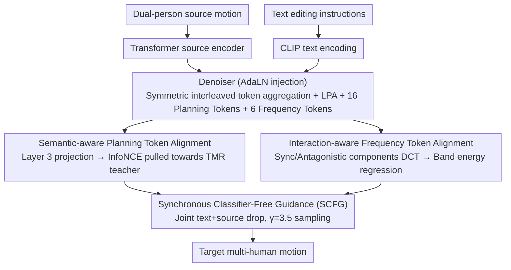

# InterEdit: Navigating Text-Guided Multi-Human 3D Motion Editing

**Conference**: CVPR 2026  
**arXiv**: [2603.13082](https://arxiv.org/abs/2603.13082)  
**Code**: [github.com/YNG916/InterEdit](https://github.com/YNG916/InterEdit)  
**Area**: 3D Human Motion Editing  
**Keywords**: Multi-human motion editing, text-guided diffusion model, interaction-aware frequency domain alignment, semantic planning tokens, TMME  

## TL;DR
This work defines the task of text-guided multi-human 3D motion editing (TMME) for the first time. It constructs the InterEdit3D dataset containing 5,161 source-target-instruction triplets and proposes the InterEdit conditional diffusion model. By using semantic-aware planning tokens to capture high-level editing intentions and interaction-aware frequency tokens to model periodic interaction dynamics, the model outperforms four baselines in instruction following (g2t R@1 30.82%) and source preservation (g2s R@1 17.08%).

## Background & Motivation
**Background**: Text-guided 3D motion editing has made significant progress in single-person scenarios (MotionFix, MotionLab), but multi-human interaction editing remains largely unexplored. In reality, many behaviors involve multi-human interaction—collaboration, competition, physical contact, etc.—requiring multiple participants.

**Limitations of Prior Work**: (1) Lack of paired data for multi-human motion editing (source-target-instruction triplets); (2) Single-person editing methods destroy interaction consistency when simply concatenating dual-human features (MotionFix g2t R@1 is only 3.86%); (3) Multi-human generative methods lack an explicit separation mechanism for "what to change/what to keep," leading to global drift.

**Key Challenge**: Multi-human motion editing must simultaneously satisfy "precise execution of editing instructions" and "maintaining consistency of unedited parts and spatio-temporal coupling." A minor modification by one person could destroy synchronization, spatial consistency, or contact timing.

**Goal**: Given a dual-person source motion and a text editing instruction, generate the target multi-human motion that modifies only the relevant parts as instructed while maintaining consistency in non-edited content and interpersonal interaction.

**Key Insight**: Constrain the editing process from two complementary dimensions: the semantic level (Planning Tokens + motion teacher contrastive learning) and the frequency level (DCT band energy descriptors).

**Core Idea**: Learnable semantic planning tokens guide "what to change," and DCT frequency tokens constrain "how to maintain interaction rhythm." Together, they ensure editing precision and interaction consistency.

## Method

### Overall Architecture
A conditional diffusion model using Start_X parameterization (predicting clean motion directly rather than noise). Inputs include dual-person source motion (non-normalized representation; each person includes global joint position, velocity, 6D rotation, foot-ground contact in $d_m$ dimensions) and CLIP-encoded text instructions. Source motion is encoded via a Transformer to obtain source embeddings, which are injected into the denoiser alongside text embeddings via AdaLN. The denoiser uses symmetric interleaved token aggregation—arranging dual motions as $(x^A_1, x^B_1, x^A_2, x^B_2, ...)$ and its role-reversed version. After Transformer processing, global features are merged, and short-range temporal patterns are refined via an LPA branch. Additionally, 16 planning tokens and 6 frequency control tokens participate in self-attention. DDIM 50-step sampling + SCFG ($\gamma=3.5$) is used for inference.

### Key Designs

**1. Semantic-aware Planning Token Alignment: Clarifying the editing target**

Single-person methods concatenate dual-person features for denoising, lacking an explicit carrier for "high-level editing intention," which makes it difficult for the model to understand the target semantic structure. InterEdit appends $N_M=16$ learnable Planning Tokens to the denoiser sequence. These tokens flow with motion tokens in self-attention but do not predict joints; they focus on internalizing intentions at the semantic level before manifesting as motion. During training, these tokens are extracted from the 3rd Transformer layer and projected into a semantic space as $\tilde{z}^{(k)}$. A frozen TMR teacher encodes the target motion to get $\tilde{z}_{tgt}$ as a positive sample, and InfoNCE is used to pull the planning tokens toward the target semantics:

$$\mathcal{L}_{plan} = -\frac{1}{N_M}\sum_k \log \frac{\exp(\tilde{z}^{(k)\top}\tilde{z}_{tgt}/\tau)}{\sum_n \exp(\tilde{z}^{(k)\top}\tilde{z}_{tgt}^{(n)}/\tau)}$$

Contrastive loss is used instead of MSE/Cosine regression because InfoNCE pushes the target away from other motions in the semantic space, preserving discriminative structure and offering greater flexibility than frame-by-frame fitting.

**2. Interaction-aware Frequency Token Alignment: Locking the rhythm via spectrum**

The real difficulty in multi-human motion lies in "interaction rhythm" such as tempo, synchronization, and phase, which are hard to supervise frame-by-frame. InterEdit decomposes dual-person motion into a synchronous component $z_S=(x^A+x^B)/2$ (capturing joint movements) and an antagonistic component $z_D=x^A-x^B$ (capturing opposing movements). It then applies DCT along the time axis. Energy descriptors are calculated for low, medium, and high bands (cutoffs $r_l=0.08$, $r_m=0.25$, $r_h=0.35$):

$$E(C;b) = \sqrt{\frac{1}{|b|}\sum_{k \in b}C[k]^2 + \epsilon}$$

The 6 energy values (2 signals × 3 bands) are projected into Frequency Control Tokens for self-attention, and the 5th layer regresses the band energy of the target motion. For example, in a fight, low-frequency energy corresponds to overall footwork while high-frequency energy corresponds to rapid strikes. The high-frequency weight is set to 0.25 to avoid noise sensitivity, and tokens are randomly dropped with a 4% probability during training to prevent over-reliance.

**3. Synchronous Classifier-Free Guidance (SCFG): Joint condition management**

The model consumes both text instructions and source motion. Conventional CFG either drops conditions separately (increasing inference cost) or loses guidance space. InterEdit **synchronously** drops both text and source with a 10% probability. Synchronous dropping is critical; dropping only one side allows conditional information to leak into the "unconditional" branch, polluting the guidance direction. Inference combines conditional and unconditional predictions with $\gamma=3.5$.

### Loss & Training
Total loss: $\mathcal{L}_{total} = \mathcal{L}_{motion} + 0.03 \cdot \mathcal{L}_{plan} + 0.01 \cdot \mathcal{L}_{freq}$. Motion loss includes MSE reconstruction + 30× velocity + 30× foot contact + 10× bone length + 3× masked distance map + 0.01× relative orientation. Training utilizes a 1000-step cosine schedule for diffusion and 50-step DDIM sampling. Optimized with AdamW (lr=1e-4 with cosine decay, 10 epoch warmup). The 5-layer Transformer has 16 heads and dim=512. The model has 358.8M parameters (85.0M trainable) and was trained on 8× RTX Pro 6000 Blackwell for 1500 epochs.

## Key Experimental Results

### Main Results

| Method | FID↓ | g2s R@1↑ | g2s R@3↑ | g2t R@1↑ | g2t R@3↑ |
|:---|:---:|:---:|:---:|:---:|:---:|
| MotionFix (Single-person edit) | 2.547 | 2.51 | 6.76 | 3.86 | 7.73 |
| MotionLab (Single-person edit) | 0.550 | 7.90 | 16.43 | 13.26 | 20.69 |
| InterGen (Multi-person gen) | 0.624 | 9.52 | 18.91 | 18.93 | 31.64 |
| TIMotion (Multi-person gen) | 0.445 | 12.54 | 22.33 | 24.97 | 40.68 |
| **Ours (InterEdit)** | **0.371** | **17.08** | **29.32** | **30.82** | **47.65** |

### Ablation Study

| Configuration | g2t R@1 | FID | Description |
|:---|:---:|:---:|:---|
| W/o plan+freq Token | 24.97 | 0.445 | Base diffusion model |
| Only plan Token | 28.72 | 0.367 | Semantic guidance is effective |
| Only freq Token | 28.75 | 0.380 | Frequency constraint is effective |
| **plan+freq combined** | **30.82** | **0.371** | Modules are complementary (Best) |
| freq dropout p=0.04 | Best | - | Optimal balance for regularization |

### Key Findings
- Multi-person generation baselines (InterGen/TIMotion) far outperform single-person editing baselines, highlighting that interaction modeling is the core of multi-human editing.
- Plan and Freq Tokens are effective individually, and their combination provides further gains (g2t R@1 28.7 → 30.8), proving semantic and frequency signals are complementary.
- Human evaluation confirms the advantage, with a 75.5% overall win rate and 81.0% win rate for interaction realism.
- A 4% frequency token dropout provides the best balance between regularization and signal retention.

## Highlights & Insights
- Pioneered the TMME task and constructed the first large-scale multi-human motion editing dataset (5,161 triplets) with 8-person annotation and cross-validation, laying the foundation for the field.
- Frequency token alignment cleverly captures interaction dynamics: mean/difference decomposition → DCT → band energy → learnable tokens, elegantly modeling rhythmic synchronization.
- Using planning tokens as learnable semantic control signals in self-attention is a reusable design paradigm for conditional diffusion.
- The dataset construction pipeline is versatile: motion retrieval → sliding window → TMR encoding → top-2 neighbors → manual annotation.

## Limitations & Future Work
- Authors acknowledge gesture ambiguity issues—confusing self-clapping with high-fiving others.
- Spatial drift in long sequences—difficulty in maintaining strict interpersonal spatial relationships during long, complex movements.
- Only covers dual interactions; 3+ person group motion editing is not addressed.
- The dataset is built based on InterHuman retrieval, so motion diversity is limited by the source data.
- Only supports text control, lacking spatial constraints (trajectory sketches, target positions, etc.).

## Related Work & Insights
- **vs MotionFix/MotionLab (Single-person editing)**: Treating dual-person motions as a single concatenated sequence lacks interaction modeling (g2t R@1 only 3.86%/13.26% vs InterEdit's 30.82%).
- **vs TIMotion (Strongest Baseline)**: As a generation model, TIMotion lacks a "what to change/what to keep" mechanism. InterEdit outperforms it across all metrics (g2t +5.85, g2s +4.54, FID -16.7%).
- **vs InterGen**: A joint denoising diffusion model without editing capabilities. Even after modification, it remains inferior to the interaction-aware InterEdit.
- Frequency token regularization could be transferred to maintain temporal consistency in video generation/editing or audio-video synchronization tasks.

## Rating
- Novelty: ⭐⭐⭐⭐ 
- Experimental Thoroughness: ⭐⭐⭐⭐⭐ 
- Writing Quality: ⭐⭐⭐⭐ 
- Value: ⭐⭐⭐⭐ 

<!-- RELATED:START -->

- **MotionFix**: [arXiv:2405.01234] Text-guided single human motion editing.
- **InterGen**: [arXiv:2308.05678] Multi-person motion generation using joint diffusion.
- **TIMotion**: [arXiv:2401.09123] Interaction-aware multi-human motion synthesis.

<!-- RELATED:END -->

## Related Papers

- [\[CVPR 2026\] Cross-Axis Feature Fusion with Joint-Wise Motion Difference Prediction for Text-Based 3D Human Motion Editing](cross-axis_feature_fusion_with_joint-wise_motion_difference_prediction_for_text-.md)
- [\[CVPR 2026\] Vinedresser3D: Agentic Text-guided 3D Editing](vinedresser3d_agentic_text-guided_3d_editing.md)
- [\[CVPR 2026\] Pico-Banana-400K: A Large-Scale Dataset for Text-Guided Image Editing](pico-banana-400k_a_large-scale_dataset_for_text-guided_image_editing.md)
- [\[CVPR 2026\] Aligning Multi-Character Narrative Image Generation with Multi-Aspect Human Preferences](aligning_multi-character_narrative_image_generation_with_multi-aspect_human_pref.md)
- [\[CVPR 2026\] BiMotion: B-spline Motion for Text-guided Dynamic 3D Character Generation](bimotion_b-spline_motion_for_text-guided_dynamic_3d_character_generation.md)

<!-- RELATED:END -->
