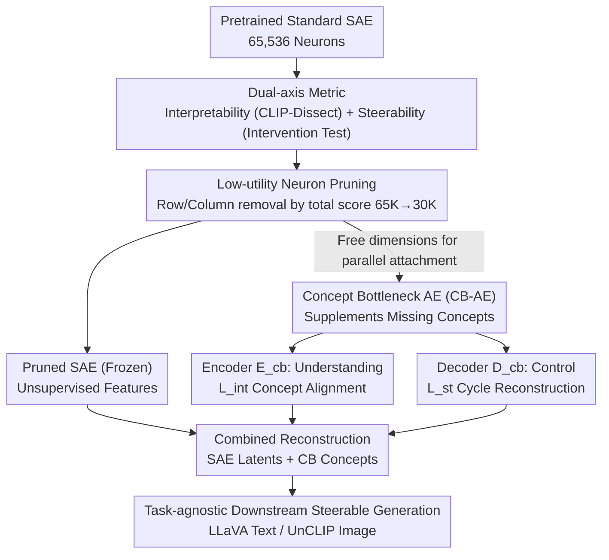

# Interpretable and Steerable Concept Bottleneck Sparse Autoencoders

**Conference**: CVPR 2026  
**arXiv**: [2512.10805](https://arxiv.org/abs/2512.10805)  
**Code**: [GitHub](https://github.com/Trustworthy-ML-Lab/CB-SAE)  
**Area**: Image Generation  
**Keywords**: Sparse Autoencoders, Concept Bottleneck, Interpretability, Steerability, Mechanistic Interpretability

## TL;DR

This work reveals that a majority of neurons (~81%) in Sparse Autoencoders (SAEs) suffer from insufficient interpretability or steerability. It proposes the CB-SAE framework—by pruning low-utility SAE neurons and integrating a concept bottleneck module, it improves interpretability by +32.1% and steerability by +14.5% in LVLM and image generation tasks, respectively.

## Background & Motivation

Sparse Autoencoders (SAEs) have become a foundational tool for mechanistic interpretability, used to decompose dense polysemantic activations in LLMs/VLMs into sparse monosemantic latent variables. However, for practical applications, SAE features must simultaneously satisfy two conditions: being **interpretable** (humans can understand the meaning of each neuron) and **steerable** (intervening in neuron activations reliably changes model output).

Through empirical analysis, this paper identifies two key limitations of SAEs:
1. **Most neurons are impractical**: Among 65,536 SAE neurons, only 18.84% possess both high interpretability and high steerability; 36.26% are low in both.
2. **Insufficient coverage of user-required concepts**: Despite the large dictionary size, 27-45% of ImageNet-related concepts cannot be represented by the SAE.

While Concept Bottleneck Models (CBMs) provide explicit concept control, they fail to discover new features. The **Core Idea** of this paper is to unify the unsupervised discovery capabilities of SAEs with the steerability of CBMs into a single framework.

## Method

### Overall Architecture

CB-SAE aims to resolve the dilemma where SAE dictionaries are "large but impractical": while having tens of thousands of neurons, only a few are both human-understandable and steerable, and concepts of user interest are often missing. Instead of retraining a better SAE from scratch, it performs "subtraction and addition" on a **pretrained standard SAE**. It first scores neurons and prunes the useless ones, then attaches a lightweight "Concept Bottleneck Autoencoder" (CB-AE) module to the freed-up dimensional space to specifically supplement missing user-specified concepts. The pipeline consists of four steps: train a standard SAE → quantify interpretability and steerability for each neuron → prune low-utility neurons based on total scores → train a CB-AE in parallel with the frozen pruned SAE. The final reconstruction is the sum of two parts: the retained SAE latents for unsupervised discovery, and the CB-AE for supervised alignment of specified concepts.

### Key Designs

**1. Dual-axis Metric for Interpretability and Steerability: Quantifying "Understandability" and "Controllability" Separately**

The paper first addresses whether an SAE neuron is useful by scoring interpretability and steerability separately. Interpretability follows CLIP-Dissect, matching each neuron to the most similar concept in a predefined set and using that similarity as a score. Steerability is measured via an intervention test: setting the target neuron activation to a high value $\alpha=50$ while zeroing others, then checking if the downstream model (LLaVA or UnCLIP) output moves toward the concept assigned by CLIP-Dissect via cosine similarity in the embedding space. Decoupling the two axes reveals that a highly interpretable neuron might have weak causal effects, while a steerable neuron might represent abstract or entangled features.

**2. Low-utility Neuron Pruning: Directly removing rows and columns to make space for the CB**

With dual-axis scores, pruning is straightforward: the sum of interpretability and steerability scores is used to rank and remove the bottom $M$ neurons (retaining 30K out of 65K). Implementation-wise, the corresponding rows and columns in the encoder and decoder matrices are deleted: $E'_{sae} = E_{sae}[[\omega]\setminus\mathcal{P},:]$ and $D'_{sae} = D_{sae}[:,[\omega]\setminus\mathcal{P}]$, where $\mathcal{P}$ is the set of pruned indices. This creates space for the concept bottleneck to supplement only the subset of user-desired concepts that the existing SAE cannot represent: $\mathcal{C} = \mathcal{C}_{user} \setminus \mathcal{C}_{rsae}$.

**3. Concept Bottleneck Autoencoder: Encoder for "Understanding" and Decoder for "Control" via Cycle Reconstruction**

A linear concept bottleneck is attached in parallel to the frozen pruned SAE. The encoder $E_{cb} \in \mathbb{R}^{|\mathcal{C}| \times d}$ maps features to concepts, and the decoder $D_{cb} \in \mathbb{R}^{d \times |\mathcal{C}|}$ maps them back. The final reconstruction is:

$$\hat{v}' = D'_{sae}z' + b + D_{cb}\sigma_{cb}(c)$$

where $\sigma_{cb}$ applies top-k sparsification ($k=5$). Crucially, the encoder and decoder are optimized with different objectives. Three objectives are alternated: reconstruction loss $\mathcal{L}_r$ updates both; interpretability loss $\mathcal{L}_{int}$ updates only $E_{cb}$ using CLIP zero-shot pseudo-labels; and steerability loss $\mathcal{L}_{st}$ updates only $D_{cb}$ via a cycle reconstruction—passing the reconstructed $\hat{v}'$ back through $E_{cb}$ to match the pseudo-labels. This cycle reconstruction ensures task-agnosticism.

### Loss & Training

Three objectives are optimized using independent Adam optimizers to adaptively scale gradients without manual weighting:

- $\mathcal{L}_r = \|v - \hat{v}'\|_2^2$: Reconstruction fidelity, updates $E_{cb}, D_{cb}$.
- $\mathcal{L}_{int}$: Cosine-cubed similarity loss, updates $E_{cb}$ (Interpretability).
- $\mathcal{L}_{st}$: Cycle cosine-cubed similarity loss, updates $D_{cb}$ (Steerability).

## Key Experimental Results

### Main Results — LLaVA/UnCLIP Steerable Generation

| Downstream Model | Method | CLIP-Dissect↑ | Monosemanticity↑ | Unit Vector↑ | White Image↑ |
|:---:|:---:|:---:|:---:|:---:|:---:|
| LLaVA-1.5-7B | SAE | 0.154 | 0.517 | 0.198 | 0.203 |
| LLaVA-1.5-7B | **CB-SAE** | **0.244** | **0.556** | **0.261** | **0.250** |
| LLaVA-MORE | SAE | 0.194 | 0.553 | 0.179 | 0.177 |
| LLaVA-MORE | **CB-SAE** | **0.291** | **0.598** | **0.192** | **0.189** |
| UnCLIP | SAE | 0.058 | 0.540 | 0.642 | 0.654 |
| UnCLIP | **CB-SAE** | **0.092** | **0.594** | **0.659** | **0.664** |

Average interpretability gain: +32.1%; steerability gain: +14.5%.

### Ablation Study — Neuron Type Analysis

| Neuron Type | CLIP-Dissect | Unit Vector | White Image |
|:---:|:---:|:---:|:---:|
| All SAE Neurons | 0.154 | 0.198 | 0.203 |
| Pruned SAE Neurons | 0.084 | 0.144 | 0.162 |
| Retained SAE Neurons | 0.238 | 0.263 | 0.252 |
| CB Neurons | **0.323** | 0.231 | 0.219 |
| All CB-SAE Neurons | 0.244 | **0.261** | **0.250** |

### Key Findings

- Four-quadrant distribution of SAE neurons: High Interpretability + High Steerability accounts for only 18.84%, while Low Interpretability + Low Steerability accounts for 36.26%.
- SAE concept coverage drops sharply as the concept set expands: from 96.3% on Broden to only 28.0% on a 20K English vocabulary.
- CB neurons exhibit significantly higher interpretability than SAE neurons (0.323 vs 0.154), validating the necessity of concept supervision.
- Steerability loss $\mathcal{L}_{st}$ contributes a +2.9% gain in steerability without affecting interpretability.
- 30K retained neurons offer a reasonable balance, as keeping too few hurts reconstruction.

## Highlights & Insights

- Systematically reveals the trade-off between SAE interpretability and steerability and quantifies the concept coverage gap.
- Unifying SAE (unsupervised discovery) and CBM (supervised alignment) is a natural and effective design.
- Cycle reconstruction steerability loss is a clever task-agnostic design, allowing the same CB-SAE to control both text and image generation.
- The concept selection strategy (adding only missing concepts) avoids redundancy.

## Limitations & Future Work

- Dependency on CLIP-Dissect for concept assignment, which might be inherently inaccurate.
- Steerability of CB neurons is still lower than that of retained SAE neurons, requiring better or task-specific losses.
- Only validated on CLIP vision encoders; applicability to others (e.g., DINOv2) needs exploration.
- The relationship between the "feature splitting" phenomenon in SAEs and concept coverage gaps remains under-investigated.
- Training depends on pseudo-labels from CLIP zero-shot classifiers, which limits accuracy.

## Related Work & Insights

- **vs Standard SAE**: SAEs are purely unsupervised and offer no guarantee of finding specific concepts; CB-SAE solves this via pruning and enhancement.
- **vs CBM**: CBMs are limited to predefined concepts; CB-SAE retains the ability to discover new features.
- **vs AlignSAE**: A concurrent work. AlignSAE uses orthogonality loss to separate supervised/unsupervised concepts, whereas CB-SAE uses direct pruning. AlignSAE targets text LLMs, while CB-SAE focus on vision models.

## Rating

- Novelty: ⭐⭐⭐⭐ Unifying SAE and CBM is effective; the dual-axis analysis has independent value.
- Experimental Thoroughness: ⭐⭐⭐⭐ Two downstream tasks and detailed ablations, though datasets are limited (mostly ImageNet).
- Writing Quality: ⭐⭐⭐⭐ Clear problem analysis, logical progression, and intuitive visualizations.
- Value: ⭐⭐⭐⭐ Significant push toward practical SAE applications, especially for scenarios requiring specific concept control.

<!-- RELATED:START -->

## Related Papers

- [\[ICLR 2026\] A Probabilistic Hard Concept Bottleneck for Steerable Generative Models](../../ICLR2026/image_generation/a_probabilistic_hard_concept_bottleneck_for_steerable_generative_models.md)
- [\[NeurIPS 2025\] Learning Interpretable Features in Audio Latent Spaces via Sparse Autoencoders](../../NeurIPS2025/image_generation/learning_interpretable_features_in_audio_latent_spaces_via_sparse_autoencoders.md)
- [\[ICML 2026\] SAEmnesia: Erasing Concepts in Diffusion Models with Supervised Sparse Autoencoders](../../ICML2026/image_generation/saemnesia_erasing_concepts_in_diffusion_models_with_supervised_sparse_autoencode.md)
- [\[CVPR 2026\] MeanFlow Transformers with Representation Autoencoders](meanflow_transformers_with_representation_autoencoders.md)
- [\[CVPR 2026\] Guiding Token-Sparse Diffusion Models](guiding_token-sparse_diffusion_models.md)

<!-- RELATED:END -->
