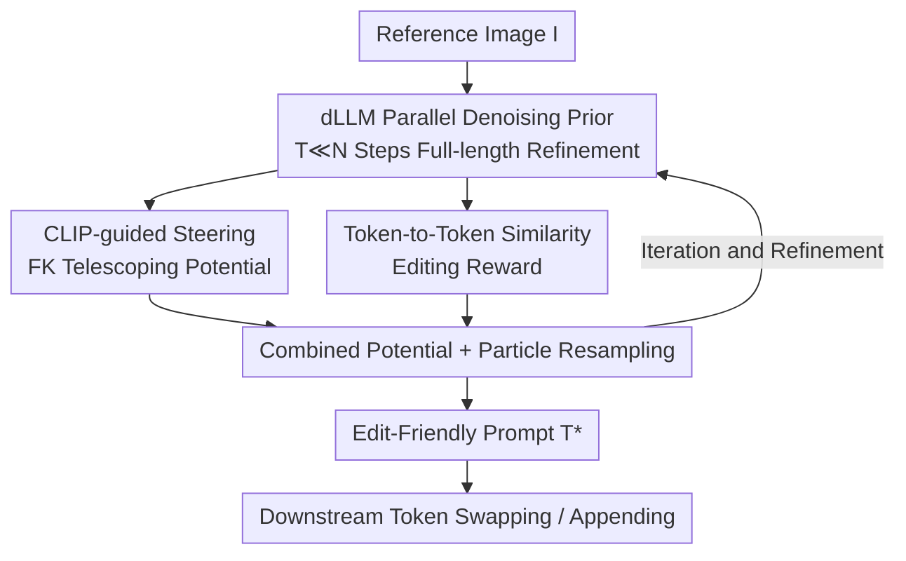

# Interpretable Prompts made Edit-Friendly: Token-to-Token Similarity Reduction in dLLMs for Edit-Friendly Hard Prompt Inversion

**Conference**: CVPR 2026  
**Paper**: [CVF Open Access](https://openaccess.thecvf.com/content/CVPR2026/html/Devulapally_Interpretable_Prompts_made_Edit-Friendly_Token-to-Token_Similarity_Reduction_in_dLLMs_for_CVPR_2026_paper.html)  
**Code**: None  
**Area**: Diffusion Models / Image Generation  
**Keywords**: Hard Prompt Inversion, Discrete Diffusion Language Models (dLLMs), CLIP Guidance, Editable Prompts, Text-to-Image

## TL;DR
For the task of reconstructing text-to-image prompts from a reference image, this paper proposes replacing autoregressive beam search with a discrete diffusion language model (dLLM) for prompt generation. It then simultaneously infuses a CLIP alignment reward and a novel **token-to-token similarity (disentanglement) reward** during the sampling process. This ensures that the inverted prompts are readable, aligned with the reference image, and highly stable under local edits (such as token swapping or appending), while operating approximately 10× faster than hard prompt inversion baselines.

## Background & Motivation

**Background**: Text-to-image (T2I) diffusion models can generate high-quality images from natural language, but crafting an effective prompt still relies on trial and error. **Prompt inversion** automates this process: given a reference image $I$, it finds a text prompt $T$ such that the T2I model can reconstruct the content and style of $I$. Inversion methods are categorized into soft inversion (e.g., Textual Inversion, DreamBooth), which learns continuous embeddings that reconstruct well but are unreadable and uneditable, and hard inversion (e.g., PEZ, VGD), which directly searches for discrete token sequences to yield human-readable prompts.

**Limitations of Prior Work**: In hard inversion, gradient-based methods (like PEZ) often search out semantically chaotic and barely coherent character strings. Recent gradient-free/autoregressive methods (such as VGD) improve fluency but are extremely fragile under downstream token-level edits—swapping "horse" to "zebra" in the prompt often alters not only the subject but also completely changes the background, pose, and clothing. In other words, the prompts are "readable" but "not editable." Moreover, previous evaluations focused strictly on reconstruction fidelity (using CLIP or captioning metrics) and rarely measured editing robustness.

**Key Challenge**: Tokens within a prompt are often **entangled and coupled**. Predicting highly similar token distributions across multiple positions suggests that their semantic roles are bound together, so modifying one portion cascades throughout the image. Good reconstruction does not equal good editability; these two objectives are not explicitly optimized separately in existing decoding processes.

**Goal**: Re-examine hard prompt inversion from an "edit-friendly" perspective, ensuring that the inverted prompts simultaneously satisfy three criteria: (i) high alignment with the reference image; (ii) fluency and readability; and (iii) local, predictable image changes under token swapping or appending, without corrupting unrelated content.

**Key Insight**: The authors attribute editability to the **degree of disentanglement between tokens** and propose that "coupling" signals can be directly extracted from the language model's prediction distributions—without the need to place the T2I model in the inversion loop to calculate expensive cross-attention. At the same time, using a discrete diffusion language model to parallelly refine the entire sequence provides both speedup and global consistency.

**Core Idea**: During dLLM decoding, **CLIP rewards govern alignment, while token-to-token similarity rewards govern disentanglement**. Both rewards guide the sampling trajectory simultaneously via Feynman-Kac steering, producing "readable, aligned, and editable" hard prompts. This method is plug-and-play, requiring no fine-tuning of either the T2I model or the dLLM.

## Method

### Overall Architecture
Given a reference image $I$, the goal is to invert a prompt $T^*$ by explicitly multiplying an editability term $p_{\text{edit}}(T)$ on top of the standard gradient-free objective $p_{\text{LLM}}(T)\,p_{\text{CLIP}}(I\mid T)$ :

$$T^* = \arg\max_{T}\; p_{\text{LLM}}(T)\, p_{\text{CLIP}}(I\mid T)\, p_{\text{edit}}(T)$$

where $p_{\text{LLM}}$ is provided by the dLLM (governing fluency), $p_{\text{CLIP}}$ ensures image-text alignment, and $p_{\text{edit}}$ controls edit-friendliness. The entire pipeline constitutes a **particle-based diffusion steering sampling loop**: starting from a fully noisy sequence, the dLLM parallelly refines the full-length sequence at each step to generate candidate prompts. Each candidate is decoded into text to compute the CLIP reward and the token-to-token similarity (editing) reward. These two rewards are integrated into a "telescoping potential" used to resample $K$ particles, retaining high-scoring trajectories until iterating to $t=0$ to output the final prompt. The resulting prompt can be directly used for downstream token swapping or appending to drive a T2I model for editing.

### Key Designs

**1. dLLM Parallel Denoising Prior: Replacing Autoregressive Beam Search with Diffusion Language Models**

Previous gradient-free hard inversion methods (such as VGD) rely on autoregressive LLMs for token-by-token beam search, requiring repetitive scoring of all prefixes for every added token and repeated evaluation of CLIP on partial prefixes. This results in a complexity that scales linearly with prompt length $N$ ($O(BN\,E_{\text{LM}} + BN\,C_{\text{align}})$). This paper introduces a **discrete diffusion language model (dLLM)** approach: starting from a fully noisy sequence $x_T$, it defines a backward Markov chain

$$p_{\text{dLLM}}(x_T,\dots,x_0) = \pi_{\text{prior}}(x_T)\prod_{t=T-1}^{0} p(x_t\mid x_{t+1})$$

At each step, **all positions are updated in parallel**, decoding $x_t$ into text $\tilde T_t = \text{decode}(x_t)$. Since the number of refinement steps $T \ll N$, complexity is reduced to $O(T\,E_{\text{dLLM}} + T\,C_{\text{align}})$, which transforms many serial expansions into a few parallel refinements—accounting for the ~10× speedup. Simultaneously, refining the entire sequence together naturally ensures global consistency. The dLLM here serves as a fluency prior, proposing globally coherent candidate prompts that are then guided by subsequent rewards for alignment and editability.

**2. CLIP-Guided Steering: Biasing Sampling towards Reference Image Alignment via Feynman-Kac Telescoping Potentials**

A fluency prior alone is insufficient to align with the reference image. This work integrates CLIP guidance directly into the dLLM sampler. Let $r_{\text{CLIP}}(T;I) = \cos\big(f_I(I), f_T(T)\big)$ denote the image-text CLIP similarity (with encoders frozen). A **Feynman-Kac (FK) steering** formulation is used to reweight each backward step, defining a telescoping potential:

$$G_t(x_{T:t}) = \exp\!\Big(\lambda_{\text{CLIP}}\big[r_{\text{CLIP}}(\tilde T_t;I) - r_{\text{CLIP}}(\tilde T_{t+1};I)\big]\Big)$$

This "telescoping" form has an elegant property: when multiplied across all steps, the intermediate terms cancel out, leaving $\prod_{t=0}^{T-1} G_t = \exp\big(\lambda_{\text{CLIP}}\, r_{\text{CLIP}}(\tilde T_0;I)\big)$. Thus, **only the CLIP similarity of the final prompt determines the weight of the entire trajectory**. In practice, at each step, candidates are sampled from $p(x_t\mid x_{t+1})$, decoded to text, evaluated for $r_{\text{CLIP}}$, and resampled according to $G_t$. This maintains the parallel decoding efficiency of dLLMs while steadily driving sampling toward prompts aligned with the reference image.

**3. Token-to-Token Similarity Editing Reward: Extracting and Penalizing "Coupling" Directly from Prediction Distributions**

This is the core innovation of the paper. Under the premise that an edit-friendly prompt requires **disentangled** tokens (where changing one token only modifies its corresponding semantic aspect), a natural but costly approach is keeping the T2I model in the loop to optimize cross-attention (as in PH2P or PRISM). However, constantly querying the model depends heavily on high-dimensional attention tensors and is tightly coupled with specific architectures and tokenizers, leading to high overheads; moreover, attention itself is an imperfect proxy for token importance.

Instead, this paper proposes a **lightweight, model-agnostic** signal computed directly from the dLLM's prediction distributions. At step $t$, the vocabulary logits at position $i$ are $z_i^{(t)}\in\mathbb{R}^V$. These are first mean-centered and then softmaxed:

$$\tilde z_i^{(t)} = z_i^{(t)} - \tfrac{1}{V}\sum_{v} z_i^{(t)}(v),\quad \hat p_i^{(t)} = \text{softmax}(\tilde z_i^{(t)})$$

Stacking $\hat p_i^{(t)}$ for all positions row-wise yields $\hat P^{(t)}\in\mathbb{R}^{N\times V}$. The row-wise Gram matrix is computed as $S^{(t)} = \hat P^{(t)}\hat P^{(t)\top}$, where elements $S^{(t)}_{ij} = \langle \hat p_i^{(t)}, \hat p_j^{(t)}\rangle$ represent the similarity between the prediction distributions at positions $i$ and $j$. **Larger off-diagonal values indicate that the predicted tokens across two positions are highly similar, meaning their roles are entangled, making editing difficult.** Extracting the off-diagonal matrix $\text{Off}(S^{(t)}) = S^{(t)} - I_N$, the coupling is characterized by its mean and variance:

$$\mu_{\text{off}}^{(t)} = \mathbb{E}_{i\neq j}\big[\text{Off}(S^{(t)})_{ij}\big],\quad \sigma_{\text{off}}^{2(t)} = \text{Var}_{i\neq j}\big[\text{Off}(S^{(t)})_{ij}\big]$$

A high $\mu_{\text{off}}$ indicates global entanglement, while a high $\sigma_{\text{off}}$ indicates the presence of a few highly-coupled outlier pairs. Thus, a bounded step-wise editing reward is defined as:

$$r_{\text{edit}}^{(t)} = 1 - \big(\mu_{\text{off}}^{(t)} + \sigma_{\text{off}}^{(t)}\big)$$

The reward escalates only when **both the average coupling and the coupling variance decrease**. It is similarly injected into decoding via a telescoping potential $G_t^{\text{edit}} = \exp\big(\lambda_{\text{edit}}[r_{\text{edit}}^{(t)} - r_{\text{edit}}^{(t+1)}]\big)$. Ultimately, the CLIP and editing rewards are merged into a joint potential:

$$G_t = \exp\!\Big(\lambda_{\text{CLIP}}\big[r_{\text{CLIP}}(\tilde T_t;I) - r_{\text{CLIP}}(\tilde T_{t+1};I)\big] + \lambda_{\text{edit}}\big[r_{\text{edit}}^{(t)} - r_{\text{edit}}^{(t+1)}\big]\Big)$$

This derives the steered final distribution:

$$p_{\text{final}}(x_0\mid I) \propto p_{\text{dLLM}}(x_0\mid I)\,\exp\!\big(\lambda_{\text{CLIP}}\, r_{\text{CLIP}}(x_0;I) + \lambda_{\text{edit}}\, r_{\text{edit}}(x_0)\big)$$

which precisely aligns with the objective in Eq.3: the dLLM ensures fluency, CLIP ensures alignment, and the editing reward ensures disentanglement. Visually, VGD's token-token heatmaps show prominent off-diagonal structures (coupling), whereas the proposed method's heatmaps are approximately diagonal (disentangled), serving as direct evidence for local editability.

### Loss & Training
The proposed method is **training-free** and plug-and-play: it requires no fine-tuning of the T2I model or the dLLM. All steering occurs during inference-time sampling. The core mechanism is particle filter-style steering (Algorithm 1)—maintaining $K$ particles, multinomial-resampling ancestors at each step based on the current potential $\{G_t^i\}$, taking a backward diffusion proposal step $x_{t-1}^i\sim\tau(x_{t-1}\mid x_t^i,c)$, and reweighting with $\frac{p(x_{t-1}^i\mid x_t^i,c)}{\tau(x_{t-1}^i\mid x_t^i,c)}G_{t-1}$, iterating until $t=0$ to output decoded prompts and selecting $T^*$. Key hyperparameters are the steering weights $\lambda_{\text{CLIP}},\lambda_{\text{edit}}\ge 0$. Guidance is computed using CLIP-ViT-H-14, while evaluation is done with CLIP-ViT-G-14 (separated for fairness).

## Key Experimental Results

### Main Results
Across three datasets (MS COCO, Flickr8K, JourneyDB), 200 images were uniformly sampled each, and evaluated over 5 runs to report the mean. Prompt length budgets are 16 / 32 / 64 / ~77 tokens. Text quality is measured via BERTScore (P/R/F1), readability via GPT-2 Perplexity (PPL), and alignment via CLIP-Text (CL-T) and CLIP-Image (CL-I). The following table shows representative results on MS COCO with a ~77 token budget:

| Method | F1 ↑ | PPL ↓ (Readability) | CL-T ↑ | CL-I ↑ |
|------|------|------|--------|--------|
| Captioning [Florence-2] | 0.83 | 22.08 | 0.49 | 0.49 |
| CLIP Interrogator 2.1 | 0.83 | 108.15 | 0.50 | 0.53 |
| PEZ | 0.76 | 1879.27 | 0.15 | 0.66 |
| VGD (Strongest readable baseline) | 0.86 | 21.79 | 0.51 | 0.68 |
| **Ours** | **0.87** | **17.10** | **0.56** | **0.74** |

Key Takeaways: While maintaining or slightly improving prompt accuracy, the proposed method **significantly reduces PPL (best readability)**. It also leads in both CL-T and CL-I. As token length increases, PPL steadily decreases while CL-I improves, showing that more descriptive prompts generate images that are better aligned with the reference image, a benefit that is consistent across all three datasets. Though PEZ achieves decent CL-I, its PPL is exceedingly high (above 1000), making it virtually unreadable.

### Efficiency (Table 2, Single A6000 GPU)

| Method | 16 tok Time ↓ | 77 tok Time ↓ | 77 tok CL-I ↑ |
|------|------|------|------|
| BLIP-2 | 0.80s | 4.80s | 0.53 |
| PEZ | 191.03s | 194.40s | 0.68 |
| VGD | 18.70s | 104.20s | 0.68 |
| **Ours** | 2.43s | **10.50s** | **0.74** |

Compared with the strongest hard inversion baseline, the proposed method is approximately **10× faster than VGD and 95× faster than PEZ**, while yielding higher CL-I. This joint improvement in speed and quality is mainly attributed to the parallel refinement of dLLMs, reducing complexity from $O(BN)$ to $O(T)$.

### Ablation Study (Table 3, 32 tokens)

| Configuration | F1 ↑ | PPL ↓ | CLIP-I ↑ | TIFA ↑ | Time ↓ |
|------|------|-------|----------|--------|--------|
| No Guide (pure dLLM) | 0.80 | 36.91 | 0.62 | 0.74 | 2.12 |
| CLIP Guide | 0.82 | **28.84** | 0.68 | 0.81 | 3.42 |
| Sim. Guide (similarity only) | 0.79 | 45.93 | 0.64 | **0.92** | 4.98 |
| **Ours (CLIP + Sim)** | **0.89** | 33.16 | **0.71** | 0.89 | 5.60 |

### Key Findings
- **The two rewards are complementary and both indispensable**: Adding only CLIP guidance yields the lowest PPL (28.84) but mediocre semantic quality (F1=0.82) and CLIP-I (0.68). Using only the similarity guidance spikes TIFA to 0.92 (highest fidelity on fine-grained attributes) but degrades PPL to 45.93 and results in the lowest F1. Merging both rewards achieves the highest F1 (0.89) and the highest CLIP-I (0.71), producing the best overall alignment.
- **Edit-friendliness is the core selling point**: On downstream token swapping/appending tasks, the proposed method significantly outperforms captioning, BLIP-2, and VGD in both TIFA and GPT-4V scores. Its token-token heatmaps show an approximately diagonal pattern, and qualitatively, swapping "horse" for "zebra" only changes the subject while leaving the background and style intact.
- **Cost**: Guidance introduces computational overhead (Ours 5.60s vs. No Guide 2.12s), but still operates around 10× faster than prior hard inversion baselines, making the trade-off highly worthwhile.

## Highlights & Insights
- **"Editability" is reduced to a differentiable, model-agnostic disentanglement signal**: Portraying inter-token coupling as the off-diagonal energy ($\mu_{\text{off}}+\sigma_{\text{off}}$) of prediction distribution Gram matrices sidesteps expensive, architecture-dependent cross-attention optimization. This idea of extracting coupling directly from logits can be applied to any discrete generation scenario requiring token disentanglement or controllable editing.
- **Elegant application of Feynman-Kac telescoping potentials**: Multiplying the step potentials cancels out intermediate terms, effectively weighting the entire trajectory solely by the reward of the final sample. This enables step-by-step guidance without redundant reward computation, allowing the CLIP and editing rewards to cleanly stack inside a single potential.
- **dLLMs as inversion backbones is an underexplored direction**: Parallel refinement inherently provides global consistency and near-linear speedups. The authors successfully show that dLLMs are highly efficient and accurate backbones for hard prompt inversion.
- **Comprehensive evaluation dimensions**: Extending the evaluation landscape from "pure reconstruction" to "local faithfulness after editing" (via TIFA, GPT-4V, and user studies) aligns much closer with how users interact with prompts in real-world applications.

## Limitations & Future Work
- **Reliance on external scorers**: Utilizing CLIP for alignment, GPT-2 for perplexity, and TIFA or GPT-4V for evaluation exposes the method to biases from these proxy models. Known issues such as CLIP's insensitivity to fine-grained semantic details might propagate into the guided path.
- **Disentanglement is a distribution-level proxy**: Low token-to-token similarity serves as indirect evidence for editability rather than guaranteeing successful edits in every specific trial. For highly compositional prompts or those with strong stylistic dependencies, there may be inherent tension between the disentanglement penalty and the alignment objective (evident as Sim. Guide alone degrades PPL).
- **Time overhead and sensitivity of $\lambda$**: Finding the right balance between the two tilt coefficients requires tuning; the particle count $K$ also impacts cost. The paper lacks a thorough sensitivity analysis of $\lambda_{\text{CLIP}}$ and $\lambda_{\text{edit}}$.
- **Evaluation scale**: The evaluation is conducted on only 200 images per dataset, with the success of editing heavily relying on user studies and GPT-4V evaluation, which introduces higher subjectivity.

## Related Work & Insights
- **vs. Soft Inversion (Textual Inversion / DreamBooth)**: Continuous embeddings are learned to achieve highly faithful reconstruction, but they are unreadable, difficult to edit, and prone to overfitting visual details. Conversely, this work produces discrete human-readable prompts, sacrificing extreme reconstruction fidelity to gain readability and editability.
- **vs. PEZ / PH2P (Gradient-based Hard Inversion)**: Gradient-based methods optimize within the continuous embedding space before projecting back to vocabulary space, leading to disjointed, unreadable strings that align with the reference. This work is gradient-free, using a dLLM prior to guarantee fluency and explicit rewards for edit-friendliness.
- **vs. VGD (Gradient-free Hard Inversion, Strongest Readable Baseline)**: VGD balances visual alignment and fluency using autoregressive LLM beam search, but suffers from heavily coupled tokens, fragile editing, and slow inference. The proposed method replaces autoregressive search with dLLM parallel decoding and token-disentanglement rewards, achieving an ~10× speedup and significantly improving downstream editability.
- **vs. Cross-Attention-based Controllable Editing (e.g., PH2P, PRISM)**: These methods keep the T2I model in the optimization loop to manipulate attention maps, resulting in high overhead and narrow applicability across model architectures. In contrast, this work utilizes a lightweight, model-agnostic prediction distribution signal from the dLLM.

## Rating
- Novelty: ⭐⭐⭐⭐⭐ Formulating "prompt editability" as a differentiable token-to-token disentanglement signal and incorporating both CLIP and editing rewards using FK steering is highly creative.
- Experimental Thoroughness: ⭐⭐⭐⭐ Evaluations across three datasets, four lengths, and multiple metrics—supplemented by ablation studies and user surveys—are relatively complete, though the image size (200 images per dataset) is small and editing evaluations can be subjective.
- Writing Quality: ⭐⭐⭐⭐ Clear motivation and self-contained formulations; the derivations of FK steering and the disentanglement reward are well-explained.
- Value: ⭐⭐⭐⭐ Being plug-and-play, boosting speed by ~10×, and making hard prompts genuinely editable provides high utility for prompt engineering and T2I creation workflows.

<!-- RELATED:START -->

## Related Papers

- [\[CVPR 2026\] Guiding Token-Sparse Diffusion Models](guiding_token-sparse_diffusion_models.md)
- [\[CVPR 2026\] Group Editing: Edit Multiple Images in One Go](group_editing_edit_multiple_images_in_one_go.md)
- [\[CVPR 2026\] Inter-Edit: First Benchmark for Interactive Instruction-Based Image Editing](inter-edit_first_benchmark_for_interactive_instruction-based_image_editing.md)
- [\[CVPR 2026\] HP-Edit: A Human-Preference Post-Training Framework for Image Editing](hp-edit_a_human-preference_post-training_framework_for_image_editing.md)
- [\[CVPR 2026\] Image Generation from Contextually-Contradictory Prompts](image_generation_from_contextually-contradictory_prompts.md)

<!-- RELATED:END -->
