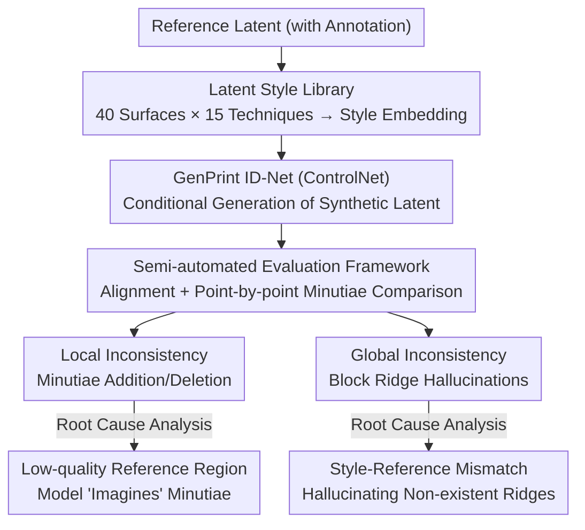

# Intra-finger Variability of Diffusion-based Latent Fingerprint Generation

**Conference**: CVPR 2026  
**arXiv**: [2604.10040](https://arxiv.org/abs/2604.10040)  
**Code**: None  
**Area**: Image Generation/Biometrics  
**Keywords**: Fingerprint synthesis, Diffusion models, Latent fingerprints, Identity consistency, Style diversity

## TL;DR

This paper systematically evaluates the intra-finger variability of fingerprints synthesized by diffusion models. By constructing a latent fingerprint style library containing 40 surfaces and 15 processing techniques, the authors enhance generation diversity and quantify the local/global identity inconsistencies introduced during the generation process.

## Background & Motivation

**Background**: GenAI (GANs and DDPMs) has enabled the generation of high-quality synthetic fingerprint datasets. Fingerprint synthesis is typically divided into two stages: generating a unique identity (inter-finger variability) and generating multiple variants of the same identity (intra-finger variability). In the field of latent fingerprints, the second stage is more critical.

**Limitations of Prior Work**: (1) Existing models rely on global or random style transfer, failing to precisely specify forensic scenarios (e.g., "a latent fingerprint extracted from a glass bottle revealed by fluorescent powder"); (2) The stochastic nature of the generation process may alter fingerprint ridges and minutiae, undermining identity authenticity.

**Key Challenge**: There is a tension between diversity and identity preservation—increasing style diversity may introduce more identity inconsistency.

**Goal**: (1) Enhance the style diversity of latent fingerprint generation; (2) Rigorously quantify identity preservation capabilities.

**Key Insight**: A style library containing 28,000 real latent fingerprints is constructed to achieve precise style control, and a semi-automated framework is designed to evaluate identity consistency.

**Core Idea**: Achieve 40+ controllable latent fingerprint styles through the style library, while revealing local inconsistencies in low-quality regions and global inconsistencies arising from style-reference mismatches in diffusion models.

## Method

### Overall Architecture

Latent fingerprint synthesis usually involves two steps: first creating a unique identity (inter-finger variability), then generating multiple variants with different acquisition styles based on that identity (intra-finger variability). In forensic scenarios, the second step is more vital—the same fingerprint may be extracted from glass bottles, metal handles, or paper, and revealed using powder, chemical, or optical methods, resulting in vastly different appearances. This paper follows the second stage of GenPrint but strengthens both style control and identity evaluation: starting with an annotated reference fingerprint, a style embedding corresponding to a forensic scenario is selected from the style library and fed into a fine-tuned ControlNet (GenPrint's ID-Net) to generate a synthetic latent fingerprint. A semi-automated framework is then used to align the generated image with the reference and conduct point-by-point minutiae comparison to quantify how much and why the identity was altered.

### Key Designs

**1. Latent Fingerprint Style Library: Replacing "Random Style" with "Specifiable Forensic Scenarios"**

GenPrint could originally only apply general or random latent styles and could not precisely generate specific scenarios like "a latent fingerprint on a glass bottle revealed by fluorescent powder." This paper curates 28,000 real latent fingerprints from 7 datasets, categorized by acquisition surface and revelation technique—40 surfaces (glass, metal, paper, etc.) × 15 processing techniques (powder, chemical, optical, etc.), forming 40+ discrete styles. An embedding vector is extracted for each style to serve as a conditional input for GenPrint. Consequently, generation no longer relies on luck but on specifying the appearance of a particular forensic scenario, increasing diversity from a few coarse-grained styles to dozens of controllable styles.

**2. Semi-automated Evaluation Framework for Identity Consistency: Examining Identity Changes at the Minutiae Level**

Automatic matching scores are too coarse to distinguish how identity is compromised. This paper uses annotated reference fingerprints to generate synthetic versions. After alignment, differences are categorized into two types for point-by-point inspection: local inconsistency refers to the addition or deletion of minutiae (initially identified by an automatic detector and then manually verified); global inconsistency refers to ridge hallucinations where the model "draws" entire ridge blocks that do not exist in the reference. This minutiae-level comparison locates specifically which ridges or minutiae were altered, rather than providing just a generic similarity score.

**3. Root Cause Analysis of Inconsistency: Locating the Source of Tension Between Diversity and Identity Preservation**

Identifying where inconsistencies occur is insufficient; understanding why is necessary to guide model improvement. Analysis reveals specific triggers for the two types of inconsistency: local inconsistencies predominantly appear in regions where the reference image quality is poor—the model tends to "fill in" minutiae when information is insufficient or uncertain. Global inconsistencies occur when the reference image does not match the selected style embedding—conflicts between style and content cause the model to hallucinate entire ridge structures absent from the reference. These two root causes correspond exactly to the core tension where "increasing style diversity introduces identity inconsistency," providing clear targets for improvement: strengthening constraints in low-quality regions and ensuring matches between style and reference.

### Loss & Training

The study utilizes GenPrint's ID-Net (fine-tuned on ControlNet), using style embeddings and text prompts as conditions. The training procedure remains unchanged.

## Key Experimental Results

### Main Results

| Evaluation Dimension | Result |
|---------|------|
| Style Coverage | 40 Surfaces × 15 Techniques |
| Data Scale | 28,000 Real Latent Fingerprints |
| Identity Preservation | Mostly preserved, some local inconsistencies |
| Global Hallucination | Occurs during style mismatch |

### Ablation Study

| Condition | Local Inconsistency | Global Inconsistency | Description |
|------|-----------|-----------|------|
| High-quality Reference | Low | Low | Optimal case |
| Low-quality Reference | High | Low | Poor quality regions drive minutiae changes |
| Style Mismatch | Low | High | Inconsistency between reference and style embedding |

### Key Findings

- The generation process preserves identity in most cases, but low-quality regions are more prone to local inconsistencies.
- Mismatch between style embeddings and reference images is the primary cause of global hallucinations.
- These findings provides clear directions for improving synthetic fingerprint generators.

## Highlights & Insights

- **Systematic Identity Consistency Analysis**: Quantifies the identity preservation capability of diffusion-based fingerprint generation at the minutiae level for the first time.
- **Forensic Scenario Controllability**: The style library of 40 surfaces × 15 techniques gives latent fingerprint generation actual forensic training value.
- **Utility of Root Cause Analysis**: The twin root causes of low-quality regions and style mismatch directly guide model refinement.

## Limitations & Future Work

- The semi-automated evaluation still requires manual participation and is not fully automated.
- While the style library coverage is broad, it may still be incomplete.
- The paper identifies inconsistencies but does not propose a method to resolve them.

## Related Work & Insights

- **vs. Wyzykowski et al.**: Only supports 3 coarse-grained styles (good/bad/ugly), whereas this work achieves 40+ fine-grained styles.
- **vs. Joshi et al.**: Uses neural style transfer but lacks style control, whereas this work achieves precise control via a style library.

## Rating

- Novelty: ⭐⭐⭐ (Style library construction is valuable, though methodological innovation is limited)
- Experimental Thoroughness: ⭐⭐⭐⭐ (In-depth and meticulous identity consistency analysis)
- Writing Quality: ⭐⭐⭐⭐ (Problem definition is clear)
- Value: ⭐⭐⭐ (Directly valuable to the forensic and fingerprint recognition communities)

<!-- RELATED:START -->

## Related Papers

- [\[CVPR 2026\] Latent Diffusion Inversion Requires Understanding the Latent Space](latent_diffusion_inversion_requires_understanding_the_latent_space.md)
- [\[CVPR 2026\] A Temporal and Content Co-Awareness Latent Diffusion for Controllable Hand Image Generation](a_temporal_and_content_co-awareness_latent_diffusion_for_controllable_hand_image.md)
- [\[CVPR 2026\] Your Latent Mask is Wrong: Pixel-Equivalent Latent Compositing for Diffusion Models](your_latent_mask_is_wrong_pixel-equivalent_latent_compositing_for_diffusion_mode.md)
- [\[CVPR 2026\] Self-Corrected Image Generation with Explainable Latent Rewards](self-corrected_image_generation_with_explainable_latent_rewards.md)
- [\[CVPR 2026\] Unified Latent Space for Understanding and Generation via Semantic Auto-encoder](unified_latent_space_for_understanding_and_generation_via_semantic_auto-encoder.md)

<!-- RELATED:END -->
