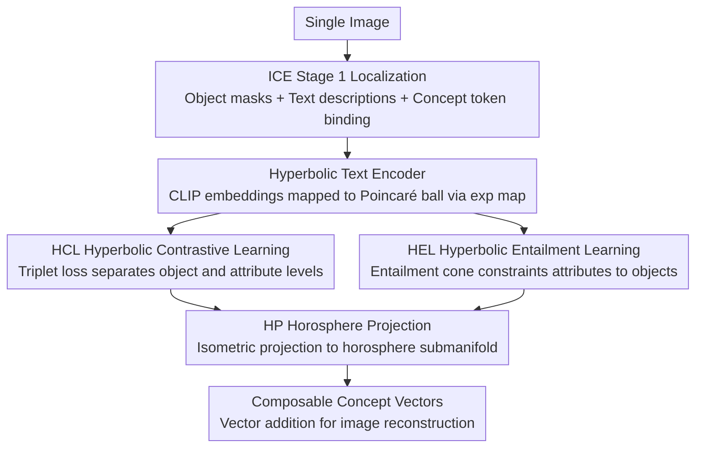

# Intrinsic Concept Extraction Based on Compositional Interpretability

**Conference**: CVPR 2026  
**arXiv**: [2603.11795](https://arxiv.org/abs/2603.11795)  
**Code**: None  
**Area**: Image Generation  
**Keywords**: Concept Extraction, Hyperbolic Space, Compositional Interpretability, Diffusion Models, Concept Disentanglement

## TL;DR

HyperExpress proposes the new task of Compositional Interpretability Intrinsic Concept Extraction (CI-ICE), leveraging the hierarchical modeling capabilities of hyperbolic space and a horosphere projection module to extract composable object-level and attribute-level concepts from a single image, achieving reversible decomposition of complex visual concepts.

## Background & Motivation

**Background**: Unsupervised Concept Extraction (UCE) aims to extract human-understandable visual concepts from a single image. Existing methods such as ConceptExpress and AutoConcept can only extract object-level concepts. While ICE can extract attribute-level concepts, it does not account for composability.

**Core Problem**:
   - Existing methods focus solely on concept disentanglement while neglecting composability, which prevents extracted concepts from being reliably recombined into the original image.
   - CCE methods consider composability but require learning from multiple images containing the same concept.
   - Euclidean space struggles to capture the hierarchical structures and associations between object-level and attribute-level concepts.

**Goal**: This paper proposes the CI-ICE task and the HyperExpress method, learning concept hierarchies through hyperbolic space and ensuring the composability of the concept embedding space via horosphere projection.

## Method

### Overall Architecture

HyperExpress aims to address the challenge of cleanly separating object-level concepts (e.g., robot) from attribute-level concepts (e.g., metal, gold) within a single image, while ensuring these concepts can be reversibly combined to reconstruct the original image. It first utilizes the first stage of ICE to locate main objects, obtain masks and text descriptions, and bind each concept to a learnable token. For an image containing $N$ objects and $M$ attributes per object, a total of $(M{+}1)\times N$ concept tokens and their embeddings are learned. The learning process is conducted in hyperbolic space rather than Euclidean space—since the "object contains attributes" relationship follows a hierarchical tree structure, the exponential capacity of hyperbolic space naturally captures this hierarchy. Specifically, a hyperbolic text encoder projects concept embeddings into the Poincaré ball. Subsequently, Hyperbolic Contrastive Learning (HCL) and Hyperbolic Entailment Learning (HEL) modules extract the concept hierarchy. Finally, a Horosphere Projection (HP) maps embeddings onto a submanifold where "vector addition = concept composition."

### Key Designs

**1. Hyperbolic Text Encoder: Placing Concept Embeddings into a Hierarchical Tree**

Standard CLIP text embeddings reside in Euclidean space where objects and attributes are flat, failing to represent subordinate relationships such as "metal is an attribute of a robot." This module maps CLIP text embeddings onto the Poincaré ball via an exponential map and learns an additional weight $W$ to calibrate the mapping from the standard encoder space to the tangent space. Hierarchical structure is inherent to this geometry: concepts closer to the ball's center are more abstract (object-level), while those closer to the boundary are more specific (attribute-level). All subsequent losses utilize this "abstract center, specific boundary" geometric prior.

**2. Hyperbolic Contrastive Learning Module (HCL): Separating Levels via Distance**

Geometric hierarchy alone is insufficient; different levels and attributes must be actively pushed to their appropriate positions. HCL performs two functions: first, object-attribute differentiation using a hyperbolic triplet loss to force object-level anchors closer to their respective object embeddings than to any attribute embedding, pulling the "object" level toward the center. Second, differentiation between different attributes using an attribute-level triplet loss to maintain discriminability within the same attribute type (e.g., between different colors). Together, these ensure object-level and attribute-level concepts are naturally stratified in hyperbolic space.

**3. Hyperbolic Entailment Learning (HEL): Modeling "Objects Containing Attributes" as Geometric Constraints**

Contrastive loss only handles proximity and cannot enforce directed containment relationships (where an attribute must belong to a specific object). HEL models entailment in the Lorentz model: if concept $i$ entails concept $j$, the spatial angle $\theta(v_i, v_j)$ is required to be smaller than the entailment cone radius $\omega(v_i)$ at vertex $v_i$. Intuitively, this ensures each attribute concept falls within the "cone" projected by its parent object concept. The entailment loss penalizes attributes that stray outside the cone, creating a structured containment that dictates which attributes belong to which objects during composition.

**4. Horosphere Projection Module (HP): Compressing Embeddings onto an "Addable" Submanifold**

While the extracted concept hierarchy is accurate, hyperbolic space does not inherently support linear combinations (e.g., object vector + attribute vector = attributed object). HP identifies $n$ geodesic directions to maximize variance (inspired by HoroPCA) and rotates embeddings via an orthogonal matrix onto a horosphere submanifold. This submanifold inherits the zero-curvature property of horospheres, making vector addition well-defined. Consequently, concept composition simplifies to addition. Since the projection is an isometric transformation, the previously learned hierarchical structure and associations are preserved. For example, adding the learned vectors for "robot," "metal," and "gold" on the submanifold reconstructs "golden robot made of metal," while remaining reversibly decomposable into the original components.

### Loss & Training

The total loss is a weighted sum ($\lambda$) of four components: the diffusion model denoising reconstruction loss, HCL hyperbolic triplet loss (object-level + attribute-level), Wasserstein attention alignment loss, and HEL hyperbolic entailment loss.

## Key Experimental Results

### Main Results

**UCEBench Performance Comparison (Table 1)**:

| Method | SIM^I (%) | SIM^C (%) | ACC^1 (%) | ACC^3 (%) |
|------|-----------|-----------|-----------|-----------|
| Break-A-Scene | 0.627 | 0.773 | 0.174 | 0.282 |
| ConceptExpress | 0.689 | 0.784 | 0.263 | 0.385 |
| AutoConcept | 0.690 | 0.770 | 0.350 | 0.520 |
| ICE | 0.738 | 0.822 | 0.325 | 0.518 |
| **Ours (HyperExpress)** | **0.699** | **0.786** | **0.504** | **0.736** |

**ICBench Performance Comparison (Table 2)**:

| Method | SIM^T-T_obj | SIM^T-T_mat | SIM^T-T_color | SIM^T-V_obj | SIM^T-V_mat | SIM^V-T_color |
|------|------------|------------|--------------|------------|------------|--------------|
| ICE | 0.249 | 0.101 | 0.093 | 0.264 | 0.208 | 0.215 |
| **Ours (HyperExpress)** | **0.280** | **0.115** | **0.098** | **0.305** | **0.211** | **0.222** |

### Ablation Study

| HCL | HEL | HP | SIM^I | SIM^C | ACC^1 | ACC^3 |
|-----|-----|-----|-------|-------|-------|-------|
| Y | N | N | 0.625 | 0.769 | 0.326 | 0.509 |
| Y | Y | N | 0.688 | 0.771 | 0.330 | 0.518 |
| Y | N | Y | 0.621 | 0.765 | 0.348 | 0.522 |
| Y | Y | Y | **0.699** | **0.786** | **0.504** | **0.736** |

### Key Findings

- HyperExpress significantly outperforms baselines in ACC^1 and ACC^3 (0.504 vs 0.350), at the cost of a slightly lower SIM^I compared to ICE.
- Synergy between the three modules is substantial: using only HCL yields an ACC^3 of 0.509, whereas the full three-module configuration reaches 0.736 (+44.6%).
- HP contributes most to composability, while HEL provides the greatest improvement to SIM^I.

## Highlights & Insights

1. **Innovative Task Definition**: CI-ICE requires both disentanglement and composability simultaneously, filling a critical research gap.
2. **Clever Application of Hyperbolic Geometry**: The Poincaré ball's natural hierarchical modeling is effectively utilized to handle concept levels.
3. **Theoretic Guarantee via Isometric Projection**: The isometric nature of HP ensures that the learned concept relationships are preserved during projection.
4. **Interpretable Compositional Paths**: For instance, "robot" + "metal" + "gold" -> "golden robot made of metal" provides a clear path for concept manipulation.

## Limitations & Future Work

1. SIM^I performance is lower than ICE, as composability constraints lead to some loss in fidelity.
2. Dependency on ICE Stage 1 for initial object localization.
3. Increased computational complexity due to hyperbolic space operations.
4. Evaluation is currently limited to the D1 dataset.
5. Attribute types are restricted to color and material.

## Related Work & Insights

- **ICE**: Direct predecessor; performs intrinsic concept extraction from a single image but neglects composability.
- **CCE**: Provides a theoretical framework for composability but requires multiple images for training.
- **HoroPCA**: Inspired the design of the horosphere projection module.
- **Insights**: Hyperbolic space warrants broader exploration in the field of visual concept learning.

## Rating

| Dimension | Score (1-5) | Explanation |
|------|-----------|------|
| Novelty | 4 | New task definition + innovative application of hyperbolic space. |
| Technical Depth | 4 | Rigorous mathematical framework and theoretical proofs. |
| Experimental Thoroughness | 3 | Limited number of datasets and baselines. |
| Writing Quality | 4 | Clear logic and structure. |
| Value | 3 | Task is primarily academic in nature. |
| Total Score | 3.6 | |

<!-- RELATED:START -->

## Related Papers

- [\[CVPR 2025\] ICE: Intrinsic Concept Extraction from a Single Image via Diffusion Models](../../CVPR2025/image_generation/ice_intrinsic_concept_extraction_from_a_single_image_via_diffusion_models.md)
- [\[CVPR 2026\] LumiX: Structured and Coherent Text-to-Intrinsic Generation](lumix_structured_and_coherent_text-to-intrinsic_generation.md)
- [\[CVPR 2026\] ShadowDraw: From Any Object to Shadow-Drawing Compositional Art](shadowdraw_from_any_object_to_shadow-drawing_compositional_art.md)
- [\[CVPR 2026\] Closed-Form Concept Erasure via Double Projections](closed-form_concept_erasure_via_double_projections.md)
- [\[CVPR 2026\] Neighbor-Aware Localized Concept Erasure in Text-to-Image Diffusion Models](neighbor-aware_localized_concept_erasure_in_text-to-image_diffusion_models.md)

<!-- RELATED:END -->
