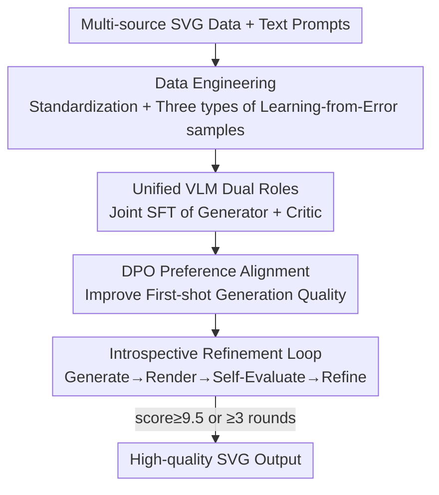

# IntroSVG: Learning from Rendering Feedback for Text-to-SVG Generation via an Introspective Generator-Critic Framework

**Conference**: CVPR 2026  
**Paper**: [CVF Open Access](https://openaccess.thecvf.com/content/CVPR2026/html/Wang_IntroSVG_Learning_from_Rendering_Feedback_for_Text-to-SVG_Generation_via_an_CVPR_2026_paper.html)  
**Code**: https://gitcat-404.github.io/IntroSVGProject/ (Project Page)  
**Area**: Image Generation / Vector Graphics Generation / Multimodal VLM  
**Keywords**: Text-to-SVG, Visual Feedback, Generate-Evaluate-Refine loop, DPO, Learning from Errors

## TL;DR
IntroSVG treats a unified VLM as both a "Generator" and a "Critic," enabling it to render its own SVG code during inference, evaluate scores based on visual feedback, and refine the output. Combined with a training pipeline involving "constructing training data from failed samples + DPO alignment," it achieves SOTA performance across multiple Text-to-SVG metrics (RSR 99.26%, FID 26.18, Aesthetic 4.89).

## Background & Motivation

**Background**: Text-to-SVG (T2S) currently follows two main paradigms: first, optimization-based methods (ClipDraw / VectorFusion / SVGDreamer) that treat SVG path parameters as optimizable variables and backpropagate scores from CLIP or diffusion models after rendering to bitmaps; second, autoregressive methods (LLM4SVG / StarVector / OmniSVG / SVGen) that use LLMs or VLMs to directly generate SVG code sequences. The latter preserves vector editability and has become the mainstream approach.

**Limitations of Prior Work**: Autoregressive training only optimizes the "code sequence" itself; **the entire training process never observes the rendered final image**. Models lacks "eyes" to perceive structural visual feedback and "brains" for self-assessment and iterative refinement. This results in a "one-pass" output paradigm, where quality relies on manual post-selection, and complex icons often suffer from structural chaos or semantic misalignment.

**Key Challenge**: Autoregressive generation writes code token-by-token in the token space, whereas quality judgment occurs in the visual space after "code is rendered into pixels"—these two spaces are **disconnected** in existing training. Models complete the code and consider the task finished without seeing if the rendered output is accurate.

**Goal**: To integrate "explicit visual feedback" into the generation loop, allowing the same model to generate, perceive rendering results, and iteratively refine accordingly.

**Key Insight**: The authors observe that a unified VLM inherently possesses both "code generation" and "image perception" capabilities. Thus, a single model can transition between dual roles—acting as a Critic to "view" its own rendered image after acting as a Generator to write the SVG, then switching back to refine the draft, forming an introspective loop.

**Core Idea**: Use a unified VLM to play the dual roles of generator and critic. A closed loop of "Generation → Rendering → Self-Evaluation → Refinement" introduces visual feedback into the generation process. Simultaneously, failed samples from training are systematically recycled as "error correction" data rather than being discarded.

## Method

### Overall Architecture
The core of IntroSVG is a unified VLM $\mathcal{M}$ (based on Qwen2.5-VL-7B-Instruct) parameterized by $\theta$. It acquires dual "generation" and "critique" capabilities through a three-stage evolution. The pipeline comprises four components: **Data Engineering** (standardization + constructing three types of training samples using early checkpoints and teacher VLMs), **Stage 1 SFT** (joint training of generator and critic on mixed data), **Stage 2 DPO** (preference alignment for generation to improve first-shot quality), and finally, an **Introspective Refinement Loop** during inference (Generate → Render → Evaluate → Refine, until the score target is met or the maximum iterations are reached).

### Key Designs

**1. Data Engineering: Standardization + Three Types of Samples for Learning from Errors**

This step addresses two pain points: chaotic syntax in raw SVG datasets (varying viewBox sizes, inconsistent coordinate precision, mixed relative/absolute paths) and the lack of training signals for error correction. The authors first standardize the data by integrating LLM4SVG, OmniSVG, and SVGen libraries, removing monochromatic or non-renderable samples and those exceeding 8000 tokens. All viewBoxes are normalized to `0 0 200 200`, only five commands (M/L/C/A/Z) are retained, coordinates are rounded to integers, and the `fill` attribute is forced before `d` (path data) to establish a consistent generation order. Ablations (Table 1) show that "absolute commands + integer coordinates" significantly reduce the learning burden, improving RSR from 68.41% to 98.62% and reducing FID from 121.50 to 32.15.

Crucially, they implement "Learning from Errors": drafts are generated for 50,000 prompts using a model pre-trained on direct generation data $D_G^{direct}$. GPT-4o acts as an external expert to analyze drafts and their renderings, producing JSON feedback containing `score / critique / suggestions`. Two types of data are constructed: Critique Data $D_C$ (Input = prompt + rendered image, Output = expert JSON critique) and Correction Data $D_G^{correction}$ (Input = prompt + draft SVG + expert critique, Output = high-quality reference SVG). These failed samples are reused as "correction" data in SFT, negative preference pairs in DPO, and starting points in inference iterations, extracting maximum value instead of being discarded.

**2. Unified VLM Dual Roles: One Model Learning Generation and Critique**

Stage 1 SFT trains the model on mixed data $D_{SFT}=D_G^{direct}\cup D_G^{correction}\cup D_C$ with two parallel objectives. The generator objective minimizes the negative log-likelihood on $D_G=D_G^{direct}\cup D_G^{correction}$:

$$\mathcal{L}_{\text{SFT-G}}(\theta) = -\mathbb{E}_{(X_G,S_{gold})\sim D_G}\big[\log p(S_{gold}\,|\,X_G;\theta)\big]$$

The input $X_G$ takes two forms: a simple prompt $P$ from $D_G^{direct}$ (creation from scratch) or a complex correction prompt containing $(P, S_{fail}, C_{fail})$ from $D_G^{correction}$ (refining from an error). The critic objective trains the model on $D_C$ to predict the expert's structured critique $C$ based on the prompt and rendered image $I$:

$$\mathcal{L}_{\text{SFT-C}}(\theta) = -\mathbb{E}_{(P,I,C)\sim D_C}\big[\log p(C\,|\,P,I;\theta)\big]$$

By using **different prompt formats** within the same weights, the model seamlessly switches between generator and critic roles without requiring an additional reward model.

**3. DPO Preference Alignment: Boosting First-Shot Quality**

The authors argue that higher quality initial drafts are key to successful iterations—the better the draft, the fewer refinement rounds needed. Stage 2 applies DPO specifically to the "generation" capability. Preference data $D_{pref\text{-}G}$ is constructed by generating 5 candidates for 10,000 prompts using $\mathcal{M}_{SFT}$. These are paired automatically based on GPT-4o scores: "renderable preferred" (renderable over non-renderable) and "high score preferred" (when both are renderable, the one with a score difference $>\delta$ wins). The DPO loss follows the standard form:

$$\mathcal{L}_{\text{DPO}} = -\mathbb{E}_{(P_G,S_w,S_l)}\Big[\log\sigma\Big(\beta\big(\log\tfrac{\mathcal{M}_\theta(S_w|P_G)}{\mathcal{M}_{ref}(S_w|P_G)} - \log\tfrac{\mathcal{M}_\theta(S_l|P_G)}{\mathcal{M}_{ref}(S_l|P_G)}\big)\Big)\Big]$$

$\mathcal{M}_{ref}$ is a frozen copy of $\mathcal{M}_{SFT}$. Since DPO is only performed on "generation prompts," it does not significantly degrade the critic capabilities learned during SFT.

**4. Introspective Refinement Loop: Let the Model "See" Its Own Work**

During inference, $\mathcal{M}_{Final}$ runs the "Generate-Introspect-Refine" loop: ① **Generation**: The model takes the prompt $P_0$ (first round) or the correction prompt $P_{gen}$ (subsequent rounds) to output SVG code $S_n$. ② **Critique**: $S_n$ is rendered into image $I_n$. The model switches to the critic role to output a structured evaluation $C_n$ (including a score) based on $(P_0, I_n)$. ③ **Termination**: The loop stops if the score $\geq\tau=9.5$ or the maximum rounds $N_{max}=3$ are reached. ④ **Refinement**: Otherwise, a new correction prompt is constructed using a template $T(P_0,S_n,C_n)$ and the process returns to step ①. This loop leverages the model's own visual perception, allowing for efficient self-correction based on actual visual feedback.

### Loss & Training
SFT performs full-parameter fine-tuning for 3 epochs with AdamW, learning rate $5\times10^{-5}$, and cosine decay. DPO follows for 3 epochs on $\mathcal{M}_{SFT}$ with a learning rate $5\times10^{-6}$ and $\beta=0.1$. Inference uses $N_{max}=3$, $\tau=9.5$, a generation temperature of 0.5, and greedy decoding (temperature 0.0) for critique and correction. All training is based on Qwen2.5-VL-7B-Instruct using 8×A800 80GB GPUs.

## Key Experimental Results

### Main Results
Testing on datasets from LLM4SVG, OmniSVG, and SVGen, IntroSVG (7B) outperforms specialized and large general-purpose models (GPT-4o, Gemini 2.0 Pro, etc.).

| Method | Avg.Token ↓ | RSR% ↑ | FID ↓ | CLIP-T2I ↑ | Aesthetic ↑ | HPS ↑ |
|------|------|------|------|------|------|------|
| Gemini 1.5 Pro (Closed-source) | 356.00 | 100 | 30.52 | 0.2754 | 4.5854 | 0.1981 |
| GPT-4o (Closed-source) | 273.73 | 100 | 37.00 | 0.2748 | 4.4103 | 0.1941 |
| OmniSVG-3B (Specialized) | 2260.54 | 75.36 | 142.38 | 0.2297 | 4.7232 | 0.1877 |
| SVGen-7B (Specialized, Prev. SOTA) | 1531.43 | 84.64 | 26.27 | 0.2339 | 4.5858 | 0.1916 |
| **IntroSVG (Ours, 7B)** | 1707.77 | **99.26** | **26.18** | 0.2529 | **4.8894** | 0.1969 |

> **RSR** (Render Success Rate): % of code successfully rendered by Cairosvg; **FID**: lower is closer to real distribution; **CLIP-T2I**: image-text semantic alignment; **Aesthetic**: pre-trained aesthetic score; **HPS**: Human Preference Score.

While closed-source general models lead in CLIP-T2I (semantic alignment), the specialized 7B model surpasses them in visual fidelity (FID 26.18 vs 30.52) and aesthetics (4.8894 vs 4.5854).

### Ablation Study
Step-by-step performance gains from the base model (Table 3):

| Config | Training Data | Iteration | FID ↓ | CLIP-T2I ↑ | Aesthetic ↑ | HPS ↑ |
|------|---------|------|------|------|------|------|
| Qwen2.5-VL-7B (Base, Zero-shot) | N/A | × | 71.10 | 0.2365 | 4.3240 | 0.1820 |
| $\mathcal{M}_{SFT}$ | $D_{SFT}$ | × | 30.15 | 0.2472 | 4.8069 | 0.1910 |
| $\mathcal{M}_{Final}$ (First-shot) | $D_{SFT}\cup D_{pref\text{-}G}$ | × | 29.76 | 0.2480 | 4.8372 | 0.1919 |
| $\mathcal{M}_{Final}$ (Iterative) | $D_{SFT}\cup D_{pref\text{-}G}$ | ✓ | **26.18** | **0.2529** | **4.8894** | **0.1969** |

Iterative refinement consistently improves quality (Table 4): FID drops from 29.76 (Iter 0) → 28.69 (Iter 1) → 27.65 (Iter 2) → 26.18 (Iter 3).

### Key Findings
- **SFT is the Foundation**: SFT alone reduces FID from 71.10 to 30.15, indicating that mixed SFT data (correction/critique) provides the primary performance boost.
- **DPO Improves First-shot Quality**: DPO slightly lowers FID from 30.15 to 29.76 without iteration, confirming it aligns the model to higher-quality initial drafts.
- **Iterative Loop Reaches SOTA**: Activating iterations further reduces FID to 26.18, achieving optimal metrics.
- **Loop Portability**: Applying the "Generate-Critique-Refine" loop as a zero-shot prompting strategy to models like GPT-4o or Grok-1 also yields gains (e.g., Grok-1's FID improved from 41.39 to 32.85), proving its universality as an inference framework.

## Highlights & Insights
- **Turning "Failed Samples" into Assets**: Failed samples are used as correction data in SFT, negative pairs in DPO, and starting points for inference. This "learning from errors" data loop can be applied to any task where generation can be automatically scored.
- **Dual-Role Single Model**: Functional separation via prompt tokens eliminates the need for an external reward model and allows critique and generation to share the same visual understanding.
- **Visual Feedback in the Loop**: Autoregressive models typically don't "look" at their output; IntroSVG bridges this gap with "Render → Evaluate → Refine."
- **Power of Data Standardization**: Simple coordinate rounding and command normalization improved RSR significantly, highlighting the importance of representation consistency in code generation.

## Limitations & Future Work
- **Heavy Teacher Dependence**: The critique and preference data rely on GPT-4o, capping the critic's potential at the teacher's quality and inheriting its biases.
- **Inference Cost**: Up to 3 rounds of "Generate + Render + Critique" increases latency and compute compared to one-pass generation.
- **CLIP-T2I Lag**: Semantic alignment (0.2529) still lags behind Gemini (0.2754), especially under complex semantic prompts.
- **Future Directions**: Replacing the external teacher with a self-bootstrapping internal critic; using RL (e.g., GRPO) instead of DPO to optimize final iterative quality; adaptive iteration counts.

## Related Work & Insights
- **Comparison with OmniSVG / SVGen**: These are "one-pass" models trained on code sequences; IntroSVG adds a rendering feedback loop and error-learning data engine, resulting in much higher RSR (99.26 vs 84.64).
- **Comparison with Reason-SVG**: While Reason-SVG uses GRPO with rule-based rewards, IntroSVG uses DPO and a visual critic model, avoiding manual reward engineering.
- **Comparison with Optimization-based Methods**: IntroSVG outputs editable code directly rather than optimizing pixel-based loss, which is more efficient for vector editing.

## Rating
- Novelty: ⭐⭐⭐⭐ (Dual-role VLM + error-learning data loop is a strong combination)
- Experimental Thoroughness: ⭐⭐⭐⭐⭐ (Broad comparison across closed/open/specialized models and multi-stage ablation)
- Writing Quality: ⭐⭐⭐⭐ (Clear logic and well-defined methodology)
- Value: ⭐⭐⭐⭐ (Practical approach for integrating visual feedback into SVG generation with portable inference strategies)

<!-- RELATED:START -->

## Related Papers

- [\[CVPR 2026\] Towards Photorealistic and Efficient Bokeh Rendering via Diffusion Framework](towards_photorealistic_and_efficient_bokeh_rendering_via_diffusion_framework.md)
- [\[CVPR 2026\] GlyphPrinter: Region-Grouped Direct Preference Optimization for Glyph-Accurate Visual Text Rendering](glyphprinter_region-grouped_direct_preference_optimization_for_glyph-accurate_vi.md)
- [\[CVPR 2026\] TextPecker: Rewarding Structural Anomaly Quantification for Enhancing Visual Text Rendering](textpecker_rewarding_structural_anomaly_quantification_for_enhancing_visual_text.md)
- [\[CVPR 2026\] DiffGraph: An Automated Agent-driven Model Merging Framework for In-the-Wild Text-to-Image Generation](diffgraph_an_automated_agent-driven_model_merging_framework_for_in-the-wild_text.md)
- [\[CVPR 2026\] Residual Decoder Adapter: ID-Preserving Tokenizer Adaption for Autoregressive Text Rendering](residual_decoder_adapter_id-preserving_tokenizer_adaption_for_autoregressive_tex.md)

<!-- RELATED:END -->
