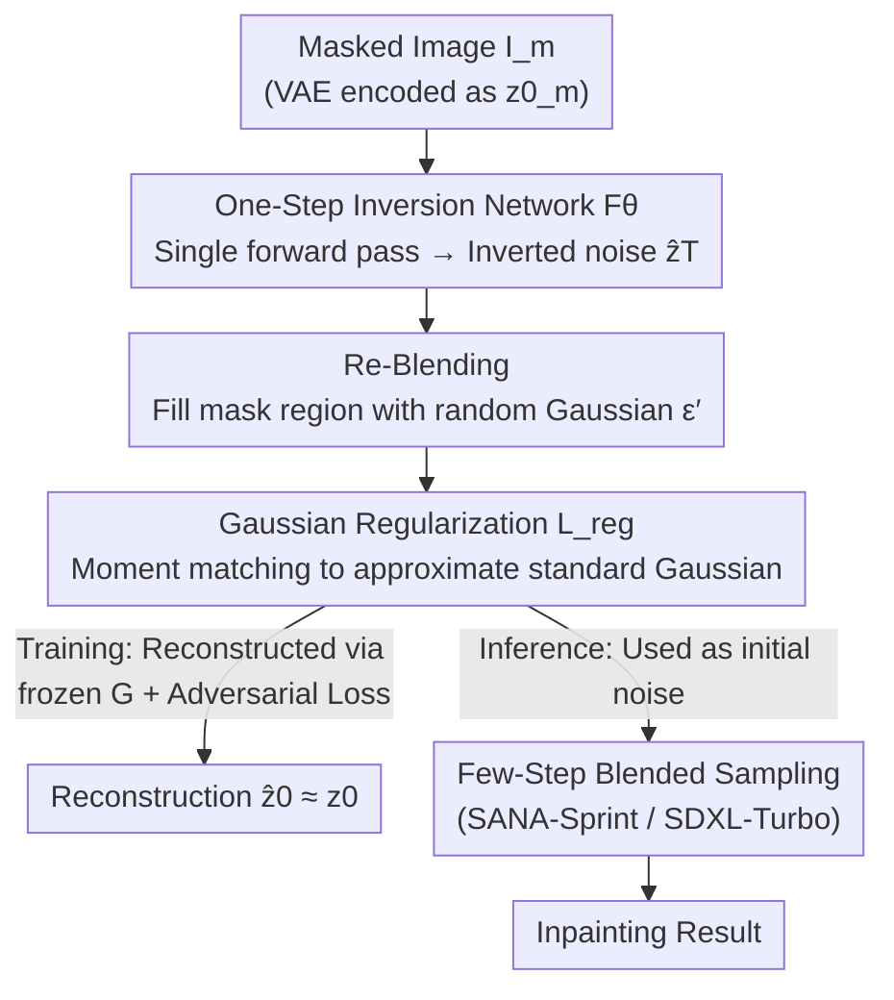

# InverFill: One-Step Inversion for Enhanced Few-Step Diffusion Inpainting

**Conference**: CVPR 2026  
**Paper**: [CVF Open Access](https://openaccess.thecvf.com/content/CVPR2026/html/Vu_InverFill_One-Step_Inversion_for_Enhanced_Few-Step_Diffusion_Inpainting_CVPR_2026_paper.html)  
**Code**: None  
**Area**: Diffusion Models / Image Generation  
**Keywords**: Few-step diffusion, image inpainting, one-step inversion, noise initialization, blended sampling  

## TL;DR
To address the problem of "semantic misalignment and discordance between the inpainted region and background caused by random Gaussian noise initialization in few-step diffusion inpainting," InverFill trains a **one-step inversion network** to map a given masked image into a "semantically aligned" latent noise, replacing the random noise. This is then fed into an off-the-shelf blended sampling pipeline. The method significantly improves few-step inpainting quality in just 2–4 steps with almost zero extra overhead (+0.06s), even matching specialized inpainting models that require real-image supervision.

## Background & Motivation

**Background**: Text-guided image inpainting mainly leverages the priors of large-scale text-to-image diffusion models. Existing approaches generally fall into two categories: one is **fine-tuning** (such as BrushNet/SDXL-Inpainting, which adds trainable branches to a frozen backbone or fine-tunes the entire U-Net with mask conditions), and the other is **training-free** (such as Blended Latent Diffusion (BLD), which blends the "noised latent of the known region" and the "predicted latent of the model" according to the mask at each step of the multi-step denoising process to gradually align the generated content with the background). Both categories can produce high-quality results, but **both rely on dozens to hundreds of sampling steps**, leading to high latency and making real-time deployment difficult.

**Limitations of Prior Work**: Directly applying mature few-step text-to-image models (4–8 steps or even 1 step, such as SANA-Sprint, SDXL-Turbo) to inpainting does not work. BLD's blending strategy is effective in **multi-step** models because each denoising update is very small, allowing the generated content to merge smoothly into the context. However, in **few-step** models, each step is a "large-stride ODE update" with almost no buffer. Once the initial noise is semantically distant from the known region, a few coarse updates cannot correct it, resulting in blurry inpainted regions and artifacts where the style/semantics are disconnected from the background. Currently, the only successful few-step specialized solution, TurboFill, trains an inpainting adapter on a distilled model using 3-step adversarial training, but it is **highly complex to design, requires real-image supervision, is computationally heavy**, and has only been validated on U-Net.

**Key Challenge**: Standard diffusion pipelines **always start from pure Gaussian noise**. This starting point is completely agnostic to the "semantics and structure of the known region," essentially injecting a random initialization unrelated to the context. Multi-step models rely on a large number of denoising steps to slowly correct this mismatch, whereas few-step/one-step models lack this "correction budget," causing the semantic misalignment from initial randomness to persist all the way to the output. Therefore, the root of the problem lies not in the sampling strategy itself, but in the **semantics of the initial noise**.

**Goal**: Provide few-step inpainting with a **semantically aligned initial noise** without retraining the inpainting model or introducing noticeable latency, allowing "a few large-stride updates" to start from a baseline consistent with the background from the very beginning.

**Key Insight**: Diffusion inversion precisely performs the inverse mapping of "image $\rightarrow$ noise latent," which can provide a semantically relevant initialization. However, traditional inversion methods (DDIM Inversion, Null-text, Renoise, GNRI) are iterative and computationally expensive, contradicting the efficiency demands of few-step settings. Recently, SwiftEdit proposed a **one-step** inversion network (mapping an image to noise in a single forward pass) that meets the efficiency requirements. However, it is designed for image **editing**, and directly transferring it to inpainting fails because: (1) It does not handle mask inputs, causing information from visible regions to **leak** into the inverted noise during training; (2) Its reconstruction target does not constrain the inverted noise to conform to a Gaussian prior, leading to distribution mismatch and collapsed reconstructions.

**Core Idea**: Build a **one-step inversion network tailored for inpainting** that takes only the masked image and outputs a semantically aligned noise latent, with two targeted designs to address the two vulnerabilities of SwiftEdit: **Re-Blending** to prevent information leakage from visible regions, and **Gaussian Regularization Loss** to force the inverted noise to match the Gaussian prior. The entire training process is **image-free and requires no image-mask-text triplets** (using a one-step generator to synthesize training data online), seamlessly enhancing any few-step blended sampling pipeline plug-and-play.

## Method

### Overall Architecture

InverFill does not train a new inpainting model. Instead, it trains a lightweight **one-step inversion network $F_\theta$** as a "noise initializer" placed at the very front of an off-the-shelf few-step inpainting pipeline. It consists of **training** and **inference** pipelines:

- **Training (Figure 2)**: Completely image-free. Given a text prompt $c$ and random noise $\epsilon$, a frozen one-step generator $G$ first synthesizes a GT image $I_{gt}$. A multi-shape/multi-brush mask $M$ is randomly sampled to obtain the masked image $I_m$. The latent $z_0^m$ of $I_m$ is fed into $F_\theta$ to predict the inverted noise $\hat z_T$. Through **Re-Blending**, the masked area is filled back with random Gaussian noise to obtain $\hat z_T^{blend}$, which is reconstructed into $\hat z_0$ by the frozen generator $G$. The optimization objective is to reconstruct $z_0$ from $\hat z_0$, ensuring background fidelity and coherence between the masked region and the context, supervised by a joint **reconstruction loss + Gaussian regularization + adversarial loss**.
- **Inference (Figure 3)**: Given a real masked image, $F_\theta$ performs a single forward pass to obtain $\hat z_T$, which is Re-Blended into $\hat z_T^{blend}$ and **used as the initial noise** for standard few-step blended sampling. The rest of the pipeline is identical to BLD, except that the "random Gaussian starting point" is replaced with the "semantically aligned starting point."

### Key Designs

**1. One-Step Masked Inversion Network $F_\theta$: Replacing Random Initialization with Semantically Aligned Noise**

This is the fundamental pain point the method addresses: few-step models start from random Gaussian noise, know nothing about the known regions, and cannot correct this mismatch in just a few large updates. $F_\theta$ directly maps the masked image latent $z_0^m$ (and prompt $c$) to the inverted noise $\hat z_T$ in a single forward pass, so that this noise "carries" the semantic structure of the known regions. Architecturally, it adopts the structure of the one-step generator $G$ and inherits its pre-trained weights for initialization (consistent with SwiftEdit). Training data is synthesized online by $G$: $z_0 = G(\epsilon, c)$, $I_{gt}=D(z_0)$, and a random mask is applied to get $I_m$, eliminating the need for real images or manual triplet annotations. The reconstruction targets are applied in both noise and image spaces, with **the noise loss only calculated on the unmasked region** (as $z_0^m$ has no valid info in the masked region, and penalizing it would interfere with training):

$$\mathcal{L}_{noise} = \|(1-m)\odot\hat z_T - (1-m)\odot\epsilon\|_2^2, \quad \mathcal{L}_{image} = \|\hat z_0 - z_0\|_2^2$$

Why it works: One-step inversion compresses "expensive iterative inversion" into a single forward pass (inference adds only +0.06s), meeting the efficiency demands of few-step pipelines. Meanwhile, it changes the semantics of the initial noise from "random" to "consistent with the background," providing a proper starting point for few-step sampling.

**2. Re-Blending Operation: Blocking Information Leakage from Masked Training**

Directly porting SwiftEdit fails, and this is the first pitfall. Since $F_\theta$ only sees the incomplete masked image $I_m$, and $\mathcal{L}_{noise}$ only supervises the unmasked region, training **biases toward the visible regions**: structural patterns in the image space leak from $I_m$ into $\hat z_T$, while the masked region exhibits low variance and artifacts. Consequently, $\hat z_T$ severely deviates from the Gaussian distribution expected by the diffusion model, causing $G(\hat z_T, c)$ to collapse into artifacts (Figure 5).

The Re-Blending approach is straightforward: during both training and inference, the **masked region of the predicted noise $\hat z_T$ is replaced with freshly sampled random Gaussian noise $\epsilon'$**, pulling the latent representation back to the expected distribution while preserving key semantic features of the unmasked region:

$$\hat z_T^{blend} = \hat z_T \odot (1-m) + \epsilon' \odot m, \quad \hat z_0 = G(\hat z_T^{blend}, c)$$

where $m$ is the mask downsampled to the latent space. Thus, "known regions provide semantics, unknown regions provide clean Gaussian noise," preventing leakage while retaining the benefit of semantic injection—visible regions provide initialization cues and unknown regions are left to the generator's freedom.

**3. Gaussian Regularization Loss $\mathcal{L}_{reg}$: Completely Correcting the Distribution back to Gaussian**

Re-Blending can only **partially** correct the distribution. The problem is: $\mathcal{L}_{noise}$ only supervises the unmasked region, and the $\epsilon'$ filled into the masked region has no direct Gaussian supervision. Although the image loss $\mathcal{L}_{image}$ indirectly encourages coherence between $\epsilon'$ and $\hat z_T$, it does not constrain Gaussian consistency. Therefore, $\hat z_T^{blend}$ still deviates from a standard Gaussian, manifested as "the noise filled in the masked region looks visibly different from the background inverted noise," leading to lost background reconstruction and blurry, low-detail masked regions (Figure 6).

The authors introduce a **moment-matching** regularization to directly constrain the statistical moments of $\hat z_T^{blend}$ to match the theoretical moments of a standard Gaussian. Let $\mu_n$ be the $n$-th order theoretical moment of a standard Gaussian, $D = c\times h\times w$ be the total number of pixels, and the $n$-th order moment matching loss is:

$$\mathcal{L}_n = \left(\frac{1}{D}\sum_{k=1}^{D}\big(\hat z_T^{blend}\big)^n\right)^{\frac{1}{n}} - \mu_n^{\frac{1}{n}}$$

The final loss is $\mathcal{L}_{reg} = \sum_{n\in\{1,2\}}\mathcal{L}_n$, matching the **first-order (mean) and second-order (variance)** moments of the Gaussian. ⚠️ Equation (9) in the original PDF extraction has slight OCR noise; please refer to the original paper for absolute value/summation details. With this term, $\hat z_T^{blend}$ truly conforms to the Gaussian prior, restoring background fidelity and details (confirmed in Ablation Table 2).

**4. Adversarial Loss for Visual Quality Enhancement (LADD-style Distillation)**

Since few-step models are prone to detail loss, the authors adopt the LADD approach to add an adversarial term. A frozen multi-step teacher model $G_{pre}$ provides the latent feature space, in which multiple discriminator heads $D_{\psi,k}$ are attached to its intermediate layers for stable and efficient adversarial supervision. The original image latent $z_0$ is treated as real and the prediction $\hat z_0$ as fake to train the inversion network and discriminators:

$$\mathcal{L}^G_{adv}(\theta) = -\mathbb{E}_{\hat z_0, t}\Big[\sum_k D_{\psi,k}(G_{pre}(\hat z_t, t, c))\Big]$$

The discriminator side uses the hinge loss form (ReLU(1$\mp$·)). It does not alter the semantic alignment core of the first three designs, serving merely as a quality enhancement term. The final objective is a weighted sum: $\mathcal{L}_{final} = \lambda_{recons}\mathcal{L}_{recons} + \lambda_{reg}\mathcal{L_{reg}} + \lambda_{adv}\mathcal{L}_{adv}$.

### Loss & Training
- Total loss: $\mathcal{L}_{final} = \lambda_{recons}\mathcal{L}_{recons} + \lambda_{reg}\mathcal{L}_{reg} + \lambda_{adv}\mathcal{L}_{adv}$, where $\mathcal{L}_{recons} = \lambda_{noise}\mathcal{L}_{noise} + \lambda_{image}\mathcal{L}_{image}$.
- Training data: Completely image-free—prompts are sampled from BrushData and MSCOCO, images are synthesized online by the one-step generator, and masks are randomly sampled with multi-shape/multi-brush.
- Configuration: One version is trained on SANA-Sprint 0.6B (DiT) and another on SDXL-Turbo (U-Net); 4$\times$A100 40GB, 8–10 hours; batch size 32, learning rate $1\times10^{-5}$, AdamW; resolution $1024^2$.

## Key Experimental Results

### Main Results
The evaluation baselines are BrushBench (600 images) and a 535-image test set adapted from MagicBrush. The metrics include human-aligned quality scores (ImageReward IR, HPS v2, Aesthetic Score AS) + text alignment (CLIP). Core conclusion: InverFill **plug-and-playably and stably improves all few-step baselines**, matching 20–30 step methods in just 2–4 steps, with an overhead of only +0.04 to 0.06s.

| Setting | NFEs | BrushBench IR×10 | BrushBench HPS×10² | MagicBrush IR×10 | Runtime(s) |
|------|------|------|------|------|------|
| SANA-Sprint 0.6B | 2 | 11.02 | 26.21 | 2.55 | 0.37 |
| **+ InverFill** | 2 | **11.65** | **27.93** | **3.04** | 0.43 (+0.06) |
| SANA-Sprint 0.6B | 4 | 10.82 | 26.34 | 2.56 | 0.45 |
| **+ InverFill** | 4 | **11.76** | **27.83** | **3.14** | 0.51 (+0.06) |
| SDXL-Turbo | 4 | 11.42 | 28.20 | 3.51 | 0.66 |
| **+ InverFill**| 4 | **12.38** | **28.44** | **3.75** | 0.70 (+0.04) |
| SDXL-Turbo + BrushNet | 4 | 12.56 | 28.26 | 4.20 | 0.70 |
| **+ InverFill** | 4 | **12.63** | **28.43** | 4.15 | 0.74 (+0.04) |
| HD-Painter (multi-step ref) | 30 | 12.82 | 28.17 | — | 23.45 |
| SDXL-Inpainting (multi-step ref) | 30 | 13.16 | 28.92 | — | 3.35 |

Note: SDXL-Turbo + InverFill (4 steps) **outperforms HD-Painter (30 steps)** on key metrics, while the latter is over 30 times slower. Adding InverFill to the specialized model BrushNet still yields gains, showing that it is effective for both blended sampling and specialized inpainting pipelines.

### Ablation Study

| Configuration | IR×10↑ | HPS×10²↑ | AS↑ | CLIP↑ | Description |
|------|------|------|------|------|------|
| w/o $\mathcal{L}_{reg}$ | 11.11 | 26.69 | 6.08 | 27.13 | Re-Blending only, lost background, blurry masked regions |
| w/ $\mathcal{L}_{reg}$ | **11.40** | **27.22** | **6.12** | 27.15 | Gaussian regularization added, background fidelity restored, details recovered |

(SANA-Sprint 0.6B, 2 NFEs, BrushBench, 5000 iterations). Qualitative ablations are also provided (Figure 5/6): removing Re-Blending causes $G$ to directly collapse into artifacts; having only Re-Blending without $\mathcal{L}_{reg}$ still leads to lost background and blurry outputs—both designs are indispensable.

### Enhanced Caption Evaluation
The authors also point out that the original prompts in BrushBench are too short to test text understanding, so they use Qwen3 to expand them into complex prompts containing foreground/background details for re-testing (Table 3). Conclusion: InverFill consistently improves all baselines under the dense-text setting, and SANA-Sprint's CLIP gain is even larger than with simple prompts, indicating that semantic alignment initialization can better utilize large text encoders like Gemma-2.

### Key Findings
- **Both designs are complementary and necessary**: Re-Blending solves "leakage causing $G$ collapse", while Gaussian regularization solves "distribution residuals causing background loss/blurriness." Using either alone is insufficient.
- **Almost zero overhead**: One-step inversion adds only 0.04–0.06s, yet brings 2–4 step results up to multi-step levels, offering extremely high efficiency.
- **Cross-architecture generalization**: Effective on both DiT (SANA-Sprint) and U-Net (SDXL-Turbo), unlike TurboFill which was only validated on U-Net.

## Highlights & Insights
- **Targeting the problem at the initial noise is highly elegant**: What is wrong with few-step inpainting? Instead of modifying the sampler or training a new model, the authors diagnose that the "random Gaussian starting point + lack of correction budget" is the root cause, and resolve it by simply changing the initialization—achieving maximum effect with minimum intervention.
- **Image-free training pipeline**: Relying on a one-step generator for online image-mask-prompt synthesis avoids the expensive real-image triplet supervision of methods like TurboFill, while matching its performance, making it highly attractive for engineering.
- **Gaussian regularization via moment matching**: Forcing the "inverted noise" back to the standard Gaussian prior using first/second-order moment matching is a highly transferable trick—applicable to any scenario where "the output of an inversion network needs to conform to a noise distribution" (e.g., editing, style transfer, diffusion priors for super-resolution).
- **Plug-and-play**: InverFill serves as a front-end noise initializer, completely non-intrusive to downstream pipelines. It can be paired with blended sampling or layered on top of specialized models like BrushNet, offering broad reusability.

## Limitations & Future Work
- **Dependency on the quality of the underlying few-step T2I model**: InverFill only changes the initialization, meaning the upper bound of generation quality is still determined by the base generator; gains are limited when the base model is weak.
- **Masked regions still rely on random noise + generator's freedom**: Re-Blending fills the masked region with clean Gaussian noise, meaning semantic injection only covers the known areas. This might fall short in scenarios demanding tight structural constraints in the masked region (e.g., precise completion of specific objects).
- **Metrics biased toward human preference scores**: Evaluation primarily uses preference/alignment metrics like IR/HPS/AS/CLIP, lacking pixel-level fidelity metrics (e.g., PSNR/LPIPS) or geometric consistency metrics. Some conclusions (e.g., "matching" multi-step methods) need further verification on finer-grained tasks.
- **Atypical formula extraction**: Equation (9) for the moment matching loss in the original PDF extraction contains noise; please refer to the original CVF publication for replication.
- Future directions: Expanding semantic injection to the masked region (e.g., structure priors based on prompts) and exploring integration with more aggressive few-step schemes like Consistency Models.

## Related Work & Insights
- **vs SwiftEdit**: Both are one-step inversion networks, but SwiftEdit is designed for image **editing** and takes complete images. InverFill handles **masked** inputs for inpainting, introducing Re-Blending (anti-leakage) and Gaussian regularization (distribution constraint), which are the two necessary adaptations to transfer one-step inversion to inpainting.
- **vs TurboFill**: TurboFill is another few-step inpainting route, training an adapter with 3-step adversarial training + real image supervision. It is complex to design, computationally heavy, and only validated on U-Net. InverFill is image-free, non-intrusive, cross-architecture (DiT/U-Net), and can complement specialized models.
- **vs Blended Latent Diffusion (BLD)**: InverFill does not alter BLD's blended sampling logic; it merely replaces its random noise starting point with a semantically aligned one—essentially patching the root cause of BLD's failure in the few-step regime.
- **vs Renoise / GNRI etc. (few-step inversion)**: These methods use fixed-point iterations or Newton-Raphson for inversion, which are still iterative with overhead. InverFill adopts a one-step forward network, reducing inversion overhead to a negligible level, which is more aligned with the efficiency goals of few-step pipelines.

## Rating
- Novelty: ⭐⭐⭐⭐ Pinpointing the failure of few-step inpainting to the initial noise and resolving it via custom one-step inversion + Re-Blending + Gaussian regularization is precise in perspective and novel in combination.
- Experimental Thoroughness: ⭐⭐⭐⭐ Covers two architectures, two benchmarks, enhanced captions, runtimes, and ablations, which is quite comprehensive; a lack of hard pixel-level fidelity metrics is slightly regrettable.
- Writing Quality: ⭐⭐⭐⭐ The chain of motivation-diagnosis-design is clear, and Figures 2/3 explain both the training and inference workflows effectively.
- Value: ⭐⭐⭐⭐ Bring few-step inpainting on par with multi-step methods plug-and-playably with near-zero overhead. Highly practical, with transferable tricks.

<!-- RELATED:START -->

## Related Papers

- [\[CVPR 2026\] ImageRAGTurbo: Towards One-step Text-to-Image Generation with Retrieval-Augmented Diffusion Models](imageragturbo_towards_one-step_text-to-image_generation_with_retrieval-augmented.md)
- [\[ICLR 2026\] FARI: Robust One-Step Inversion for Watermarking in Diffusion Models](../../ICLR2026/image_generation/fari_robust_one-step_inversion_for_watermarking_in_diffusion_models.md)
- [\[CVPR 2026\] Few-Step Diffusion Sampling Through Instance-Aware Discretizations](few-step_diffusion_sampling_through_instance-aware_discretizations.md)
- [\[CVPR 2026\] PixelRush: Ultra-Fast, Training-Free High-Resolution Image Generation via One-step Diffusion](pixelrush_ultrafast_trainingfree_highresolution_im.md)
- [\[CVPR 2026\] Uni-DAD: Unified Distillation and Adaptation of Diffusion Models for Few-step Few-shot Image Generation](uni-dad_unified_distillation_and_adaptation_of_diffusion_models_for_few-step_few.md)

<!-- RELATED:END -->
