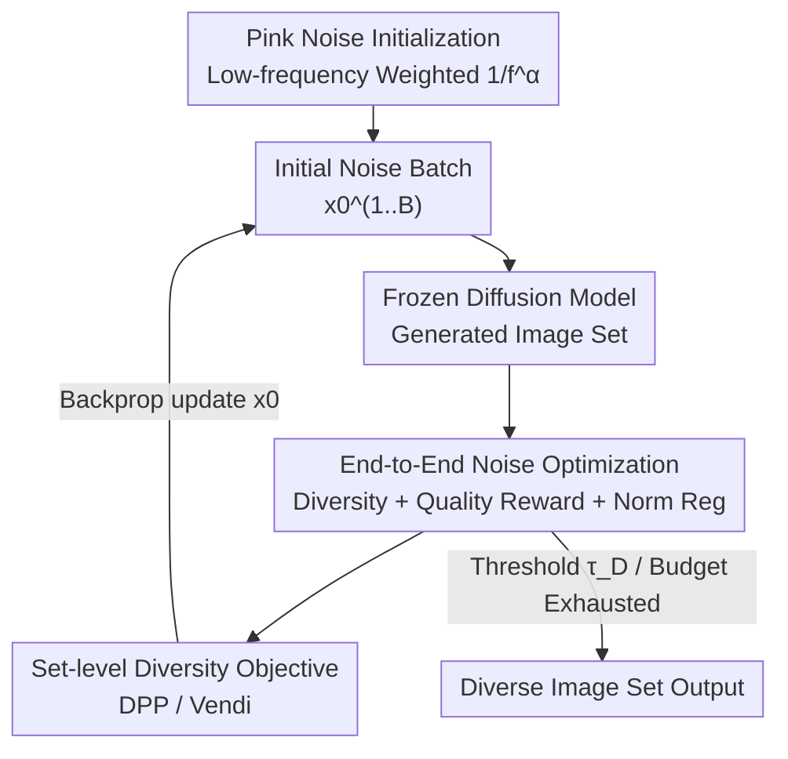

# It's Never Too Late: Noise Optimization for Collapse Recovery in Trained Diffusion Models

**Conference**: CVPR 2026  
**arXiv**: [2601.00090](https://arxiv.org/abs/2601.00090)  
**Code**: https://github.com/anneharrington/divgen (Available)  
**Area**: Diffusion Models / Image Generation  
**Keywords**: Mode Collapse, Noise Optimization, Inference-time Scaling, Generative Diversity, Pink Noise

## TL;DR
To address the mode collapse problem where text-to-image diffusion models produce nearly identical outputs for the same prompt across different samples, this paper proposes an end-to-end gradient optimization of initial noise to push a set of samples apart. Combined with a "Pink Noise" initialization that concentrates energy in low frequencies, the method significantly enhances generation diversity without modifying the model or prompt, and with minimal impact on image quality.

## Background & Motivation
**Background**: While diffusion models generate stunning images, multiple samplings for a fixed prompt using different random seeds often yield highly redundant outputs (Fig. 1: identical cats generated by SDXL-Turbo and Flux.1 [schnell]). Meanwhile, inference-time scaling (using extra computation for better results) has been widely adopted to enhance prompt following and personalization.

**Limitations of Prior Work**: Existing diversity-enhancing approaches fall into two categories: (1) Guidance mechanisms (particle guidance, DPP guidance, CFG variants) that "push" the model towards dispersed samples, often sacrificing quality. (2) Best-of-n / search-based methods (e.g., Parmar et al.) that generate a large pool (e.g., 64 images) and iteratively prune them. The latter relies on luck, incurs high computational and memory overhead, and is difficult to scale beyond small batches.

**Key Challenge**: There is a trade-off between quality and diversity; forcing samples apart often degrades quality. Furthermore, the initial noise—which determines the final image structure—is traditionally treated as a passive random seed rather than an **active** continuous variable for optimization.

**Goal**: To maximize the diversity of a set of outputs for the same prompt by optimizing only the initial noise, while keeping the model, prompt, and target model frozen, without losing image quality.

**Key Insight**: Since test-time noise optimization has proven effective for improving the quality of **single** images (by maximizing a reward), this objective can be shifted to **group** diversity via gradient ascent on noise. Optimization primarily modifies the **low-frequency** components of noise, aligning with the fact that natural images follow a $1/f$ spectrum.

**Core Idea**: Utilize an end-to-end objective comprising "diversity statistics + quality reward + noise norm regularization" to update initial noise. Use "Pink Noise" initialization to pre-weight energy toward low frequencies, which are the most critical bands during optimization.

## Method

### Overall Architecture
The method is an inference-time loop for gradient optimization of initial noise. Starting with a batch of i.i.d. Gaussian noise, images are generated through a **frozen** diffusion model. These images are scored using a diversity objective (e.g., patch-level DINOv2 dissimilarity) and an optional quality reward (e.g., HPSv2 / CLIPScore). Scores are backpropagated to update the initial noise until diversity/quality thresholds are met or the computational budget is exhausted. Prompt, diffusion model, and reward models remain frozen.

### Key Designs

**1. End-to-end Noise Optimization: Differentiable Diversity Objective**

Unlike search-based methods that rely on "rolling the dice" with large pools, this method treats initial noise as a continuous variable. Given a prompt $c$ and a batch $\mathcal{B}=\{\mathbf{x}_0^{(i)}\}_{i=1}^B$, the generated images $\mathbf{x}^{(i)}=g_\theta(\mathbf{x}_0^{(i)},c)$ are used to minimize:

$$\mathcal{L}(\mathcal{B})=-\frac{\lambda_q}{B}\sum_{i=1}^B r_s(\mathbf{x}^{(i)},c)-\lambda_{\mathrm{div}}\,v_\mathcal{B}+\lambda_{\mathrm{reg}}\,\frac{1}{B}\sum_{i=1}^B \mathrm{reg}(\mathbf{x}_0^{(i)})$$

The components are: sample-level quality reward $r_s$ (e.g., CLIPScore), batch-level diversity statistic $v_\mathcal{B}$ (to push samples apart), and noise norm regularization $\mathrm{reg}$ (to keep noise within high-density regions). Diversity $v_\mathcal{B}$ aggregates pairwise distances of features across $P$ patches: $v_\mathcal{B}=\frac{1}{P}\sum_p \frac{2}{B(B-1)}\sum_{i<j} d(f_p(\mathbf{x}^{(i)}),f_p(\mathbf{x}^{(j)}))$, where $d$ is cosine distance. Gradients flow back to $\mathbf{x}_0$ through the **frozen** sampler $g_\theta$.

**2. Set-level Diversity Objectives (DPP / Vendi): Preventing Outlier Exploitation**

A simple pairwise distance average can be "cheated" by making one image an extreme outlier while the others remain identical. To solve this, the method employs Determinant Point Processes (DPP) and Vendi Score. These measure the "volume" or "effective number" of independent samples in the set. User studies (Fig. 6) confirm that image sets optimized with DPP/Vendi are significantly preferred.

**3. Threshold Control + Batch/Sequential Modes: Balanced Trade-offs**

Instead of hard-tuning weights, the method uses two threshold mechanisms: optimization stops when batch diversity $v_\mathcal{B} \ge \tau_\mathcal{D}$, and if a single image's quality $r_s$ falls below $\tau_s$, it is reverted to its previous latent state (used for Flux.1 [schnell]). Norm regularization constrains the noise radius $r=\|\bm{\epsilon}\|$ to the $\chi^d$ distribution by maximizing the log-density $K(\bm{\epsilon})=(d-1)\log\|\bm{\epsilon}\|-\frac{1}{2}\|\bm{\epsilon}\|^2$. Both **batch** (optimizing 4 images simultaneously) and **sequential** (generating one image to be different from previous ones) modes are supported.

**4. Pink Noise Initialization: Targeting the Low-Frequency Band**

Spectral analysis (Fig. 9) reveals that optimization modifies the lowest 1/3 of the frequency band, leaving high frequencies nearly untouched. Since natural images follow a $1/f$ power spectrum, the method uses Pink Noise initialization. White noise $z_\text{white}$ is transformed via 2D FFT, re-weighted by $f_{u,v}^{-\alpha/2}$ ($f_{u,v}=\sqrt{u^2+v^2}$), and inverted back to the spatial domain. This places the initial noise in a region that naturally covers diverse structural layouts.

## Key Experimental Results

Experiments were conducted on SDXL-Turbo and Flux.1 [schnell] (10B+) using A100/H100 GPUs. Benchmarks include GenEval and DPG-Bench (long prompts).

### Main Results

On GenEval using DINOv2 for diversity and CLIPScore for quality (SDXL-Turbo):

| Init | Method | DINO↑ | DreamSim↑ | LPIPS↑ | CLIPScore↑ |
|--------|------|-------|-----------|--------|------------|
| White | i.i.d. | 0.588 | 0.249 | 0.642 | 0.335 |
| White | Parmar et al. | 0.705 | 0.331 | 0.682 | 0.333 |
| White | **Ours** | **0.784** | **0.411** | **0.767** | **0.349** |
| Pink | i.i.d. | 0.642 | 0.305 | 0.729 | 0.328 |
| Pink | Parmar et al. | 0.749 | 0.392 | 0.757 | 0.323 |
| Pink | **Ours** | **0.786** | **0.427** | **0.811** | **0.341** |

Ours significantly outperforms both i.i.d. and search-based baselines across all diversity metrics, with CLIPScore (alignment quality) often improving. Pink noise provides a consistent boost across all methods.

### Ablation Study

Optimization using DPP diversity + HPSv2 quality (GenEval):

| Model | Init | Method | DreamSim↑ | Vendi↑ | HPSv2↑ |
|------|--------|------|-----------|--------|--------|
| SDXL-Turbo | White | i.i.d. | 0.262 | 2.000 | 0.284 |
| SDXL-Turbo | White | Parmar et al. | 0.336 | 2.769 | 0.273 |
| SDXL-Turbo | White | **Ours** | **0.457** | **4.000** | **0.292** |
| Flux.1 | Pink | **Ours** | **0.495** | **3.038** | 0.279 |

In SDXL-Turbo, Vendi reaches the saturation value of 4.0. Flux.1 [schnell] is more sensitive; while diversity increases significantly, HPSv2 decreases slightly (mitigated by the latent reversion mechanism).

### Key Findings
- **Low-frequency modification**: Spectral analysis confirms that 1/3 of the lowest frequencies account for most changes during optimization.
- **Preference for set-level targets**: User studies show DPP/Vendi optimized sets are preferred over pairwise ones.
- **Efficiency**: Ours requires only 6–8 iterations to exceed Parmar et al. (pool size 64/128). SDXL-Turbo takes ~2.07s total.
- **Generalization**: Optimizing for one feature space (DINO) transfers to others (DreamSim, LPIPS).

## Highlights & Insights
- **Noise as an Optimizable Variable**: Elevates "random seeds" to differentiable knobs, allowing for directed sampling.
- **Analysis-driven Design**: The jump from "low-frequency modification" to "Pink Noise initialization" is a robust design loop.
- **Thresholding Strategy**: Using target thresholds instead of loss weights offers better interpretability and stability.
- **Scalability**: Sequential mode allows for large diversified sets without hitting the memory wall of batch candidate pools.

## Limitations & Future Work
- **External Model Dependency**: The quality of results is bound by the preferences and biases of external reward models (DINOv2, HPSv2).
- **Hyperparameter Sensitivity in Flux.1**: Large models require careful balancing and latent reversion.
- **Inference Overhead**: Although faster than search, it still requires multiple backprop passes per prompt.
- **Sampler Focus**: Primarily tested on distilled ODE samplers; performance on SDE samplers (which inherently possess more stochasticity) remains to be explored.

## Related Work & Insights
- **vs. Parmar et al.**: Ours uses proactive gradient optimization relative to their passive pool search, making it faster and more scalable.
- **vs. Particle/DPP Guidance**: Unlike guidance methods that modify dynamics and risk quality drops, Ours works on the noise prior directly.
- **vs. SliderSpace**: While SliderSpace finds LoRA directions for diversity, Ours is pure inference-time and requires no training.

## Rating
- Novelty: ⭐⭐⭐⭐
- Experimental Thoroughness: ⭐⭐⭐⭐
- Writing Quality: ⭐⭐⭐⭐
- Value: ⭐⭐⭐⭐

<!-- RELATED:START -->

- [Parmar et al. 2024] On the Diversity of Text-to-Image Diffusion Models
- [Vendi Score 2023] The Vendi Score: A Diversity Measure for the Machine Learning Era

<!-- RELATED:END -->

## Related Papers

- [\[CVPR 2026\] Taming Preference Mode Collapse via Directional Decoupling Alignment in Diffusion Reinforcement Learning](taming_preference_mode_collapse_via_directional_decoupling_alignment_in_diffusio.md)
- [\[CVPR 2026\] Elucidating the Design Space of Arbitrary-Noise-Based Diffusion Models](eda_arbitrary_noise_diffusion_design_space.md)
- [\[ICLR 2026\] Diverse Text-to-Image Generation via Contrastive Noise Optimization](../../ICLR2026/image_generation/diverse_text-to-image_generation_via_contrastive_noise_optimization.md)
- [\[CVPR 2026\] DiverseGRPO: Mitigating Mode Collapse in Image Generation via Diversity-Aware GRPO](diversegrpo_mitigating_mode_collapse_in_image_generation_via_diversity-aware_grp.md)
- [\[CVPR 2026\] Too Vivid to Be Real? Benchmarking and Calibrating Generative Color Fidelity](too_vivid_to_be_real_benchmarking_and_calibrating_generative_color_fidelity.md)

<!-- RELATED:END -->
