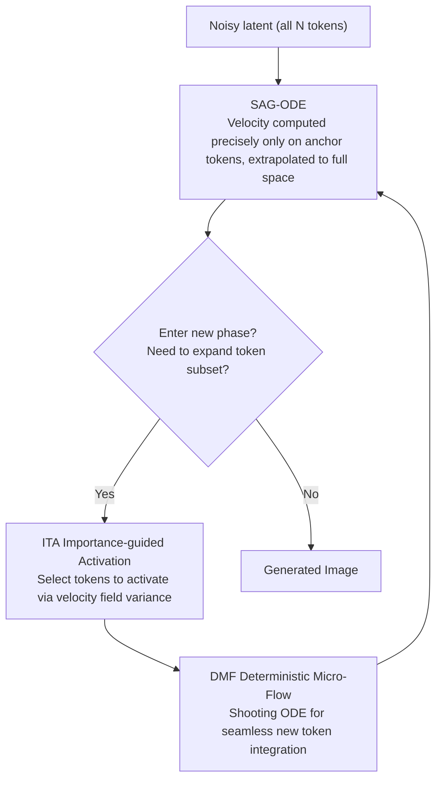

# Just-in-Time: Training-Free Spatial Acceleration for Diffusion Transformers

**Conference**: CVPR2026  
**arXiv**: [2603.10744](https://arxiv.org/abs/2603.10744)  
**Code**: [Project Homepage](https://wenhao-sun77.github.io/JiT/)  
**Area**: Image Generation / Diffusion Model Acceleration  
**Keywords**: Diffusion Transformer, Spatial Acceleration, training-free, Flow Matching, token sparsity, ODE solving

## TL;DR

Ours proposes the Just-in-Time (JiT) framework, which dynamically selects sparse anchor tokens in the spatial domain to drive the evolution of the generation ODE. By designing a deterministic micro-flow to ensure seamless activation of new tokens, it achieves up to 7× acceleration on FLUX.1-dev with almost no loss in quality.

## Background & Motivation

1.  **DiT Computational Bottleneck**: The self-attention complexity of Diffusion Transformers is $\mathcal{O}(N^2)$. Inference latency is extremely high during high-resolution image/video generation, severely constraining real-time interaction and consumer-grade deployment.
2.  **Limitations of Temporal Acceleration**: Existing acceleration methods primarily focus on the temporal domain (high-order solvers, distillation for few-step models), but quality drops significantly at ultra-low step counts, and distillation requires massive retraining resources.
3.  **Ceiling of Caching Methods**: Feature caching methods (TeaCache, TaylorSeer) reuse intermediate activations to reduce computation. However, their quality upper bound is limited by the baseline performance of the corresponding NFE, and they suffer from feature staleness.
4.  **Ignored Spatial Redundancy**: The diffusion generation process features a progressive transition from low-frequency global structures to high-frequency details, yet existing methods perform uniform computation across all spatial regions—an unnecessary waste.
5.  **Limitations of Prior Work in Spatial Methods**: Existing pyramid or hierarchical spatial acceleration methods depend on explicit upsampling and distribution correction, which easily introduce aliasing artifacts and information loss.
6.  **Key Insight**: Global structures are formed in the early stages of generation. Computing only a few critical regions is sufficient to drive the evolution of the complete latent state, while detail-heavy regions can be processed later.

## Method

### Overall Architecture

JiT aims to eliminate spatial computational redundancy in DiT. Since diffusion generation progresses from global structures to fine details, computing the velocity field on a small subset of key anchor tokens during early stages can drive the evolution of the entire latent image. This training-free framework consists of three synergistic components: SAG-ODE calculates precise velocities on sparse anchor tokens and extrapolates them to the full space to evolve the global latent state; Importance-guided Token Activation (ITA) selects anchor tokens based on velocity field variance to focus computation on active regions; and Deterministic Micro-Flow (DMF) uses a shooting ODE to seamlessly integrate new tokens when the generation enters a new phase, preventing sudden transitions.

### Key Designs

**1. SAG-ODE: Computing precisely on anchor tokens, then extrapolating to full space**

Uniform computation across all spatial regions is a major source of waste. SAG-ODE constructs a nested chain of token subsets $\Omega_K \subset \Omega_{K-1} \subset \cdots \subset \Omega_0 = \{1,...,N\}$, expanding from the smallest subset. The generation ODE is formulated as:

$$\frac{d\mathbf{y}(t)}{dt} = \mathbf{\Pi}_k \, \boldsymbol{u}_\theta(\mathbf{S}_k^\top \mathbf{y}(t), t)$$

The augmented lifting operator $\mathbf{\Pi}_k$ serves two functions: the embedding mapping $\mathbf{S}_k \boldsymbol{u}_\theta$ restores the precise velocities of anchor tokens to their full-space positions, while the interpolation operator $\mathcal{I}_k(\boldsymbol{u}_\theta)$ provides spatial approximations for inactive tokens. Crucially, it satisfies the consistency $\mathbf{S}_k^\top(\mathbf{\Pi}_k \boldsymbol{u}_\theta) = \boldsymbol{u}_\theta$, ensuring that the dynamics of anchor tokens are always precisely controlled by the Transformer, thus maintaining quality in key regions.

**2. Importance-guided Token Activation (ITA): Allocating computation via velocity field variance**

Rather than selecting anchor tokens in a fixed grid pattern, ITA uses the local variance of the velocity field to measure how "active" each region is:

$$\mathbf{I}(t) = \mathbb{E}_\mathcal{W}[\boldsymbol{u}_\theta \odot \boldsymbol{u}_\theta] - (\mathbb{E}_\mathcal{W}[\boldsymbol{u}_\theta])^{\odot 2}$$

High variance indicates active generation (typically high-frequency details). By prioritizing these tokens, ITA precisely allocates computational resources where they are most needed, proving more accurate and efficient than static patterns.

**3. DMF (Deterministic Micro-Flow): Enabling seamless token activation without jumps**

Each subset expansion activates a new batch of tokens. If interpolated states are used directly, the statistical distribution fails to align with the true trajectory. DMF first constructs a statistically correct target state for the new tokens:

$$\mathbf{y}_k^\star = \mathbf{Q}_k \left( T_k \Phi_k(\mathbf{S}_k^\top \hat{\mathbf{y}}(1)) + (1-T_k)\epsilon \right)$$

This utilizes the Tweedie formula to predict clean data, combined with structural prior interpolation and proper noise levels. A finite-time shooting ODE then converges the new tokens to this target within a very short interval, preventing noise or discontinuities at phase transitions.

## Key Experimental Results

### Main Results (FLUX.1-dev, Tab.1)

| Method | NFE | Latency (s) | TFLOPs | Speedup | CLIP-IQA↑ | ImageReward↑ | HPSv2.1↑ | GenEval↑ | T2I-Comp↑ |
| :--- | :--- | :--- | :--- | :--- | :--- | :--- | :--- | :--- | :--- |
| FLUX.1-dev | 50 | 25.25 | 2991 | 1.0× | 0.6139 | 1.004 | 30.39 | 0.6565 | 0.4836 |
| TeaCache | 28 | 6.98 | 729 | 4.1× | 0.6003 | 0.964 | 29.68 | 0.6493 | 0.4849 |
| **Ours (JiT)** | 18 | **6.02** | **706** | **4.24×** | **0.6166** | **1.017** | 29.77 | **0.6540** | **0.4991** |
| TeaCache | 28 | 4.53 | 432 | 6.9× | 0.5183 | 0.773 | 27.86 | 0.5837 | 0.4625 |
| **Ours (JiT)** | 11 | **3.67** | **423** | **7.07×** | **0.5397** | **0.975** | **29.02** | **0.6457** | **0.4961** |

- At 4× speedup: Ours is optimal across CLIP-IQA, ImageReward, GenEval, and T2I-Comp, approaching the 50-NFE baseline.
- At 7× speedup: Ours significantly outperforms all competitors, with ImageReward improving from 0.773 to 0.975.

### User Study

| Comparison Method | JiT Preference Rate |
| :--- | :--- |
| vs FLUX.1-dev (12 NFE) | 85.6% |
| vs Bottleneck (14 NFE) | 90.3% |
| vs FLUX.1-dev (7 NFE) | 93.1% |
| vs TaylorSeer (28 NFE) | 89.5% |

In 1000 blind tests, 20 participants significantly preferred the results generated by JiT.

### Ablation Study (T2I-CompBench complex compositions)

| Variant | HPSv2.1↑ | T2I-Comp↑ |
| :--- | :--- | :--- |
| Full JiT | **26.90** | **0.3727** |
| Removing SAG-ODE Interpolation | 24.18 | 0.3414 |
| Removing ITA (using fixed grid) | 26.51 | 0.3670 |
| Removing DMF target construction | 26.04 | 0.3602 |

Removing spatial interpolation leads to a catastrophic decline (inactive regions degrade to noise), verifying the necessity of each component.

## Highlights & Insights

-   **Training-Free**: Requires no retraining or fine-tuning; can be directly applied to pre-trained DiT models.
-   **No-upsampling Design**: Avoids explicit upsampling/downsampling used in traditional spatial acceleration, eliminating a primary source of artifacts.
-   **Mathematical Elegance**: SAG-ODE features a consistency proof (lossless for anchor tokens), and DMF provides strict convergence guarantees via the shooting ODE.
-   **Dynamic Resource Allocation**: The content-aware strategy of ITA based on velocity field variance is more efficient than fixed patterns.
-   **Quality Maintenance under Extreme Acceleration**: Correctly renders high-frequency details like text even at 7× acceleration, showing strong advantages in edge cases.

## Limitations & Future Work

-   Evaluated only on FLUX.1-dev; generalization to other DiTs (SD3, PixArt, etc.) has not yet been demonstrated.
-   Phase scheduling ($\{T_k, m_k\}$) requires manual design and lacks an adaptive scheduling mechanism.
-   The interpolation operator $\mathcal{I}_k$ is relatively simple (spatial smoothing), which may not be precise enough for texture-rich regions.
-   Only verified for image generation; not yet extended to video scenarios where spatial redundancy may be even more significant.
-   The potential for combination with temporal acceleration methods (step distillation) remains unexplored, though they are theoretically orthogonal.
-   Re-sampling noise $\epsilon$ in DMF at each transition may introduce slight stochasticity.

## Related Work & Insights

| Category | Method | Comparison |
| :--- | :--- | :--- |
| Spatial Acceleration | RALU, Bottleneck Sampling | Rely on explicit upsampling and distribution correction, prone to artifacts; JiT is upsampling-free. |
| Cache Acceleration | TeaCache, TaylorSeer | Quality upper bound is constrained by low-NFE baselines; JiT does not have this limitation. |
| Subspace Diffusion | Subspace Diffusion | Conceptually inspired but limited to low-dimensional subspaces; JiT's dynamic token subsetting is more flexible. |
| Pyramidal Methods | Pyramidal Flow | Sequential upsampling and correction; JiT achieves seamless dimensionality transitions via DMF. |

## Rating

-   Novelty: ⭐⭐⭐⭐ Combination of spatial domain sparse token acceleration and micro-flow transition is novel with a clear mathematical framework.
-   Experimental Thoroughness: ⭐⭐⭐⭐ Extensive quantitative/qualitative metrics, user study, and ablation; however, validated only on a single model.
-   Writing Quality: ⭐⭐⭐⭐⭐ Clear motivation, rigorous mathematical derivation, and intuitive diagrams.
-   Value: ⭐⭐⭐⭐ Training-free 7× speedup offers high practical value, though generalization and video extensions require further verification.

<!-- RELATED:START -->

## Related Papers

- [\[CVPR 2026\] Training-free Mixed-Resolution Latent Upsampling for Spatially Accelerated Diffusion Transformers](training-free_mixed-resolution_latent_upsampling_for_spatially_accelerated_diffu.md)
- [\[CVPR 2026\] ResCa: Residual Caching for Diffusion Transformers Acceleration](resca_residual_caching_for_diffusion_transformers_acceleration.md)
- [\[CVPR 2026\] Denoising as Path Planning: Training-Free Acceleration of Diffusion Models with DPCache](dpcache_denoising_path_planning_diffusion_accel.md)
- [\[CVPR 2026\] TAP: A Token-Adaptive Predictor Framework for Training-Free Diffusion Acceleration](tap_a_token-adaptive_predictor_framework_for_training-free_diffusion_acceleratio.md)
- [\[CVPR 2026\] Circuit Mechanisms for Spatial Relation Generation in Diffusion Transformers](circuit_mechanisms_for_spatial_relation_generation_in_diffusion_models.md)

<!-- RELATED:END -->
