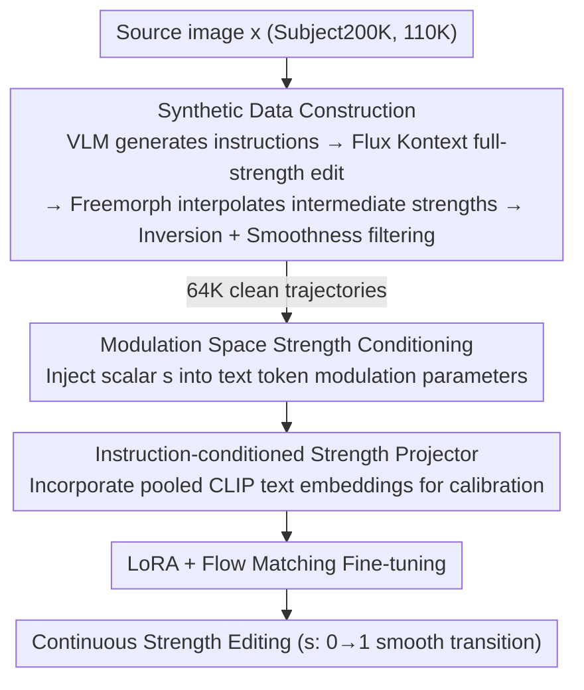

# Kontinuous Kontext: Continuous Strength Control for Instruction-based Image Editing

**Conference**: CVPR 2026  
**Paper**: [CVF Open Access](https://openaccess.thecvf.com/content/CVPR2026/html/Parihar_Kontinuous_Kontext_Continuous_Strength_Control_for_Instruction-based_Image_Editing_CVPR_2026_paper.html)  
**Code**: To be confirmed  
**Area**: Diffusion Models / Image Editing  
**Keywords**: Instruction-based Image Editing, Editing Strength, Continuous Control, Modulation Space, Synthetic Data

## TL;DR
By introducing an additional scalar "editing strength" input to an instruction-based image editing model (Flux Kontext), this work utilizes a lightweight projection network to map the combination of strength and instruction into offsets within the DiT modulation space. This enables any edit to transition smoothly from "no change" to "full edit" without requiring separate training for each individual attribute.

## Background & Motivation
**Background**: Instruction-based image editing (e.g., Instruct-Pix2Pix, Flux Kontext) has become highly versatile, allowing users to modify styles, appearances, and object shapes using natural language.

**Limitations of Prior Work**: Text is a "coarse-grained" interface—it clarifies "what to change" but fails to specify "to what degree." Whether a user wants a subject to look "slightly older" or "much older" cannot be precisely regulated via prompts alone.

**Key Challenge**: Existing continuous control methods either rely on GAN/VAE latent space traversal or require training specific LoRAs/adapters for each attribute (e.g., ConceptSliders, MARBLE). The former is limited to narrow domains, while the latter requires "one set of training per attribute," lacking a unified, generalizable solution. Transitioning latent traversal to diffusion models is difficult: denoising networks lack a naturally compact latent space, text embedding spaces are non-smooth, and LoRA weight interpolation is both computationally expensive and concept-specific.

**Goal**: Develop a unified model capable of continuous strength adjustment for **any attribute** that the base model can already edit, without necessitating any per-attribute training.

**Key Insight**: The authors observe that the **modulation space of DiT is highly decoupled**. Perturbing modulation parameters corresponding to specific words can modify the intensity of that attribute—a simple experiment demonstrated that multiplying text token modulation parameters by a scalar $v\in(0.5, 2.0)$ generates edits of varying strengths while maintaining identity.

**Core Idea**: Treat "editing strength" as an attribute of the instruction. Use a strength projector to map scalar strength into **offsets** for text token modulation parameters, injecting intensity information directly into the modulation space rather than appending it to the text token sequence.

## Method

### Overall Architecture
The approach consists of two main phases. **Phase 1 (Data Construction)**: Since real images lack "same edit, multiple strengths" annotations, the authors synthesize quartets of `(source image x, instruction e, strength s, target edit ys)`. First, an LVLM generates instructions for source images, and Flux Kontext produces "full strength" edits. Then, diffusion morphing is used to interpolate intermediate strengths between the source and full-strength edit. A filtering pipeline is then applied to remove non-smooth or poorly inverted samples. **Phase 2 (Training)**: A strength projector is added to the frozen Flux Kontext to map scalar strength $s$ (combined with CLIP text embeddings) to offsets in the modulation parameters. The model is fine-tuned using LoRA and flow matching loss to learn continuous control of editing strength based on $s$.

### Key Designs

**1. Injecting Strength in Modulation Space instead of Text Tokens: Strength as a "Smooth Knob"**

The most intuitive approach would be to concatenate strength as an extra text token in the instruction. However, early experiments revealed that the **text embedding space is not smooth**, leading to abrupt jumps between adjacent strengths. Instead, modifications are made in the DiT modulation space. Flux Kontext merges pooled instruction embeddings with timestep embeddings to predict modulation parameters $[y_{shift}, y_{scale}]$ for text/visual tokens (structurally equivalent to AdaLN). The proposed strength projector (a small MLP) maps scalar $s\in(0,1)$ to offsets $[\Delta y_{shift}, \Delta y_{scale}]$, which are added back to the original text token modulation parameters. Because the modulation space is highly decoupled, these offsets allow smooth, directional changes in editing strength without destroying image identity—a feat unattainable by the text token approach.

**2. Instruction-conditioned Projector: Adaptive Calibration for Edit Types**

If the projector only received the strength scalar, it would predict the **same offset** for all edits at a given strength, ignoring differences in edit types. Consequently, different attributes (e.g., texture vs. color) would share the same strength curve, causing "uncalibrated" jumps. To solve this, **pooled CLIP text embeddings** are used as additional input to the projector, ensuring the predicted modulation offset depends on the specific instruction. This provides each edit type with a "calibrated" modulation curve, ensuring smooth transitions across various categories like stylization, attributes, textures, backgrounds, and shapes.

**3. Synthetic Data + Dual Filtering: Creating Intermediate Strengths via Morphing**

Training requires supervision for "same edit, multiple strengths," which is unavailable in real datasets. The authors sample 110K images from Subject200K, use Qwen LVLM to generate diverse instructions, and produce full-strength edits $y^*$ via Flux Kontext. **Freemorph**, an off-the-shelf diffusion morphing tool, is used to generate $N=6$ intermediate strengths $s_i = i/N$ between the source and $y^*$. To address issues like Freemorph's semantic non-smoothness or inversion errors, two filters are applied: ① **Trajectory Smoothness**: Defined by the sequence of distances between adjacent images $D=\{d_{i,i+1}\}$, uniformness is measured via KL divergence from a discrete uniform distribution (ideally, changes should grow linearly with strength). ② **Inversion Quality**: LPIPS distance thresholds are applied between the edited image and its inversion reconstruction, as well as between the source and edited images, to discard failed inversions or cases where Flux Kontext failed to make changes.

### Loss & Training
The trainable parameters are limited to the LoRA of Flux Kontext's attention projection matrices and the strength projector; the backbone remains frozen. Training utilizes the standard flow matching loss:

$$L_\theta = \mathbb{E}_{t,x,e,s,y_s}\left[\left\|v_\theta(y_s^t, t, e, x, s) - (\epsilon - x)\right\|_2^2\right]$$

where $y_s^t = (1-t)y_s + t\epsilon$ is the interpolated latent between $y_s$ and Gaussian noise $\epsilon\sim\mathcal{N}(0,1)$, and $v_\theta$ is the Kontinuous Kontext model. For regularization, the slider condition is randomly dropped with a probability of 0.1.

## Key Experimental Results

The evaluation uses PIEBench (excluding non-continuous edits like add/remove), comprising 540 images with individual instructions often containing composite edits. Two metrics are prioritized: **Smoothness** via triangle deficit $\delta_{smooth}$ (measuring second-order consistency between adjacent edits; smaller is smoother, using DreamSim distance); and **Instruction Following** via CLIP directional similarity (CLIP-Dir., aggregated across all strengths).

### Main Results

| Category | Method | $\delta_{smooth}$↓ | CLIP-Dir.↑ |
|----------|------|--------------------|------------|
| Edit + Interpolation | Diffmorpher | 0.371 | 0.181 |
| Edit + Interpolation | Freemorph | 0.365 | 0.189 |
| Edit + Interpolation | WAN-Video (Interpolation) | 0.853 | 0.269 |
| Edit + Interpolation | **Ours** | **0.329** | **0.241** |
| Domain Specific | ConceptSliders | 0.143 | 0.186 |
| Domain Specific | **Ours (Same setting)** | **0.098** | **0.382** |
| Domain Specific | MARBLE | 2.577 | 0.157 |
| Domain Specific | **Ours (Texture setting)** | **0.350** | **0.101** |

Note: WAN-Video's high CLIP-Dir is due to "cheating" by presenting full-strength edits at intermediate stages, but its $\delta_{smooth}$ is extremely high, indicating non-smooth trajectories. ⚠️ In the MARBLE comparison, our low CLIP-Dir is attributed to different contrast settings in the texture domain; it should be viewed alongside the massive improvement in $\delta_{smooth}$ (2.577 → 0.350).

### Ablation Study

| Configuration | $\delta_{smooth}$↓ | CLIP-Dir.↑ | Note |
|------|--------------------|------------|------|
| text-space condn | 1.468 | 0.191 | Inject strength as extra text tokens |
| w/o text projector | 1.092 | 0.141 | Projector without pooled text embeddings |
| w/o filtering | 0.483 | 0.228 | No data filtering |
| **Full (Ours)** | **0.329** | **0.241** | Complete model |

### Key Findings
- **Text token injection is the worst strategy** ($\delta_{smooth}$ 1.468), confirming the motivation that the text embedding space is non-smooth. Placing strength in the modulation space is the most critical design choice.
- **Removing text embedding conditioning from the projector** causes a significant drop ($\delta_{smooth}$ 1.092), proving that "calibrating strength curves by edit type" is mandatory for smooth transitions.
- **Data filtering** effectively improves both smoothness (0.483 → 0.329) and text alignment (0.228 → 0.241), demonstrating the necessity of cleaning synthetic noise.
- When measuring the change between source and strength $s$ via DINO, this method achieves the highest linearity (Pearson $|r|=0.973$, vs. 0.897/0.696 for baselines), indicating truly monotonic and gradual editing behavior.
- Despite training on a moderate 64K filtered dataset, the model generalizes to **out-of-training categories** (e.g., facial attributes, body changes).

## Highlights & Insights
- **Reframing Strength from Latent Space Traversal to Modulation Offset**: This bypasses the difficulty of diffusion models lacking a smooth, compact latent space. By leveraging the decoupled nature of the DiT modulation space, a small MLP achieves unified continuous control. This perspective is transferable to any AdaLN/modulation-based DiT.
- **Instruction-conditioned Projector is Vital**: Different edits require different curves for the same strength scalar. Adding CLIP embeddings for calibration is a subtle but key step in moving from "controllable" to "smoothly usable."
- **Synthetic Data + KL-to-Uniform Filtering**: Using the physical intuition that "distances between adjacent strengths should be uniform" as a filtering criterion is a clean, reusable data cleaning trick for any task requiring continuous interpolation supervision.

## Limitations & Future Work
- **Heavy Dependency on Synthetic Data Quality**: Since intermediate strengths are generated by Freemorph, its inversion errors and non-smoothness are the primary sources of noise, requiring aggressive filtering (110K → 64K).
- **Large Geometric Deformations remain Difficult**: While the model can handle deformations like body shape or glasses, the smoothness of extreme geometric edits has not been fully verified. ⚠️ The paper does not provide independent quantitative tables for geometric edits.
- **Coupling with Flux Kontext's Modulation Space**: The effectiveness relies on the specific architecture of the modulation space; it may not directly apply to non-modulation-based editing models.
- **Potential Improvements**: Using more reliable continuous edit generators (rather than post-processing morphing) or incorporating real multi-strength annotations could further push the smoothness limit.

## Related Work & Insights
- **vs. ConceptSliders**: ConceptSliders trains a LoRA for each attribute and relies on weight interpolation. Ours is a single unified model requires zero per-attribute training and outperforms it in both $\delta_{smooth}$ (0.098 vs. 0.143) and CLIP-Dir (0.382 vs. 0.186).
- **vs. MARBLE**: MARBLE trains adapters on synthetic 3D assets for texture control; however, it often jumps to the final state at low intensities on real images ($\delta_{smooth}$ 2.577). Ours is more stable on real images and supports new attributes out-of-the-box.
- **vs. Freemorph / Diffmorpher (Edit + Interpolation)**: These are post-processing heuristics (interpolation in latent or weight space) that are fragile for diverse edits. Ours integrates strength into the model itself, making it faster and smoother without needing cascaded models.

## Rating
- Novelty: ⭐⭐⭐⭐⭐ Reframing continuous strength control as modulation space offset is a truly unified, zero-attribute-training paradigm.
- Experimental Thoroughness: ⭐⭐⭐⭐ PIEBench + Domain-specific + Ablations + User studies are comprehensive, though quantitative evaluation of extreme geometric shifts is slightly thin.
- Writing Quality: ⭐⭐⭐⭐ Motivation-design-ablation logic is very clear.
- Value: ⭐⭐⭐⭐⭐ Provides a genuinely usable "strength knob" for instruction editing, applicable to modulation-based DiTs with high deployment value.

<!-- RELATED:START -->

## Related Papers

- [\[CVPR 2026\] SliderEdit: Continuous Image Editing with Fine-Grained Instruction Control](slideredit_continuous_image_editing_with_fine-grained_instruction_control.md)
- [\[CVPR 2026\] DreamOmni2: Multimodal Instruction-based Generation and Editing](dreamomni2_multimodal_instruction-based_generation_and_editing.md)
- [\[CVPR 2026\] CompBench: Benchmarking Complex Instruction-guided Image Editing](compbench_benchmarking_complex_instruction-guided_image_editing.md)
- [\[CVPR 2026\] ReasonEdit: Towards Reasoning-Enhanced Image Editing Models](reasonedit_towards_reasoning-enhanced_image_editing_models.md)
- [\[CVPR 2026\] Towards Robust Sequential Decomposition for Complex Image Editing](towards_robust_sequential_decomposition_for_complex_image_editing.md)

<!-- RELATED:END -->
