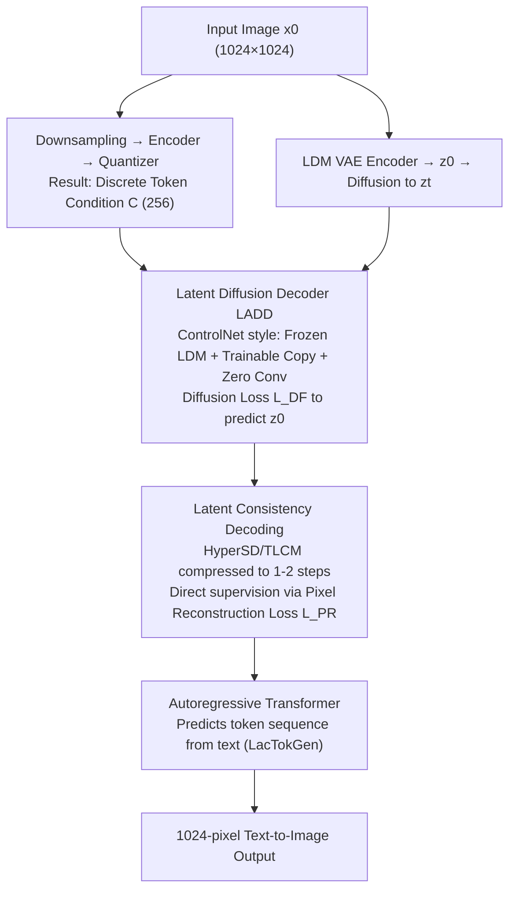

# LacTokGen: Latent Consistency Tokenizer for 1024-pixel Image Generation by 256 Tokens

**Conference**: CVPR 2026  
**Paper**: [CVF Open Access](https://openaccess.thecvf.com/content/CVPR2026/html/Xie_LacTokGen_Latent_Consistency_Tokenizer_for_1024-pixel_Image_Generation_by_256_CVPR_2026_paper.html)  
**Code**: To be confirmed  
**Area**: Image Generation / Image Tokenizer  
**Keywords**: Discrete Tokenizer, Latent Consistency, Autoregressive Generation, High Resolution, 1024-pixel

## TL;DR
The authors propose the LacTok tokenizer, which aligns discrete visual tokens with the compact latent space of a pretrained LDM. By utilizing consistency models to compress LDM decoder multi-step sampling into 1-2 steps for pixel-level supervision, it reconstructs or generates 1024×1024 images using only 256 tokens (16× more compression than VQGAN). An autoregressive transformer is then integrated to form the text-to-image model, LacTokGen.

## Background & Motivation
**Background**: Image tokenizers (VQGAN family) encode images into discrete tokens, which are used with autoregressive models or masked transformers for generation, or integrated into LLMs for unified vision-language understanding and generation.

**Limitations of Prior Work**: Generating 256×256 images from 256 tokens (16× downsampling) is standard, but generating 1024×1024 images requires predicting **4096 tokens**. This results in extremely long sequences, high training/inference costs, and difficulty fitting into LLMs for interleaved vision-language tasks. Existing token compression methods (residual codebooks, 1D tokenization like TiTok/FlexTok) can reduce token counts but **fail to generate high-frequency details at 1024 pixels** (e.g., human faces).

**Key Challenge**: There is a trade-off between "token quantity" and "detail quality" in high-resolution generation—either the token count is too high (high cost) or the details collapse after token reduction.

**Goal**: Construct a tokenizer capable of high-quality reconstruction and generation of high-resolution images using **a small number of discrete tokens**.

**Key Insight**: Noting that LDMs (SD3, FLUX) generate high-quality 1024×1024 images in low-dimensional latent spaces, the authors ask: **Can discrete tokens be aligned to the LDM latent space to leverage its powerful decoder for reconstruction/generation?**

**Core Idea**: Instead of decoding discrete tokens in pixel space, the model **predicts the LDM latent representation $z_0$**. Tokens are aligned to the LDM latent space using diffusion loss, and a Latent Consistency Model (LCM) is employed to compress multi-step sampling into 1-2 steps to introduce pixel-level reconstruction supervision.

## Method

### Overall Architecture
LacTok consists of three components: **a transformer encoder, a quantized codebook, and a Latent Consistency Decoder (LADD)**. The input image follows two paths: one through downsampling + encoder + quantizer to obtain discrete conditional features $C$ (tokens), and another through a pretrained LDM VAE encoder to obtain the latent variable $z_0$ (which is then forward-diffused to $z_t$). LADD takes $C, z_t, t$ as input with the **goal of predicting the latent variable $z_0$ of the original image** (rather than pixels). Training occurs in two stages: the first uses diffusion loss $L_{DF}$ to align tokens with the LDM latent space; the second introduces a consistency model to compress sampling to 1-2 steps, enabling direct supervision via pixel reconstruction loss $L_{PR}$. Finally, an autoregressive transformer is placed atop LacTok to predict discrete token sequences based on text, resulting in the text-to-image model LacTokGen.

### Key Designs

**1. Latent Diffusion Decoder (LADD): Aligning Discrete Tokens to LDM Latent Space instead of Pixel Space**

Traditional tokenizers encode and decode in pixel space, limiting their ability to reconstruct high-frequency details. LacTok reverses this: the task of the decoder $f_\theta$ (LADD) is to **predict the LDM latent variable $z_0$ of the original image based on discrete conditions $C$**. The original image is first encoded by a VAE to obtain $z_0 \in \mathbb{R}^{H/8 \times W/8 \times C}$. The token condition $C$ is obtained by downsampling the image to $H' \times W' \in \{224, 256, 288\}^2$ (the key step for token reduction) followed by an encoder and quantizer. Training uses diffusion loss:

$$L_{DF} = \|f_\theta(z_t, C, t) - \epsilon\|_2^2$$

To ensure training stability, LADD draws inspiration from ControlNet—**freezing pretrained LDM parameters, cloning specific blocks as trainable copies, and connecting them via zero convolutions (ZC)**. The block output is $O = ZC(F_{train}(z_t, C, t)) + F(z_t, t)$, where $F$ is the frozen LDM block and $F_{train}$ is the trainable copy. The visual encoder and quantizer are initialized from a pretrained LlamaGen tokenizer and frozen, training only the LADD to save resources.

**2. Pixel Consistency Decoding: Compressing Multi-step Sampling via Consistency Models for Pixel-level Supervision**

Decoders trained solely with diffusion loss show **significant bias in color and brightness** in reconstructed images (as they predict latent variables which are then decoded via VAE to pixels, leading to error accumulation). The authors intend to use pixel reconstruction loss $L_{PR}$ to align the decoded image with the original, but the multi-step sampling required by diffusion models is memory-intensive and prone to gradient explosion. The solution is to introduce a **Latent Consistency Model** to compress multi-step sampling: using HyperSD (one step) or TLCM (two steps, with stop-gradient on the first step) to accelerate LADD, reconstructing a clean $\hat z_0$ from Gaussian noise in 1-2 steps, allowing gradients to flow back to the decoder:

$$L_{PR} = L_P(\mathrm{Dec}(\hat z_0), x_0)$$

Where $\mathrm{Dec}$ is the LDM's pretrained VAE decoder and $L_P$ is the LPIPS perceptual loss. Versions using HyperSD are denoted **LacTok-H**, and those using TLCM are **LacTok-L**.

**3. Autoregressive Text-to-Image LacTokGen: Next-Token Prediction on Compact Tokens**

To enable generative capabilities, an autoregressive transformer $P_\theta$ is placed on top of LacTok to predict the discrete tokens encoded by LacTok. Text is processed via an encoder to get $f_{text}$, and dimensional alignment is performed through an MLP. Training uses cross-entropy:

$$L_{CE} = -\sum_{i=1}^{L}\log P_\theta(Tok_{i+1}\mid Tok_{i:1}, f_{text})$$

$L$ is the number of tokens representing a single image (only 256). Inference utilizes classifier-free guidance: $\ell_g = \ell_u + s(\ell_c - \ell_u)$. Training data includes 30M images synthesized by FLUX.1-dev plus LAION-Aesthetics-6.5+. Captions with $\le 20$ words are rewritten using Qwen2.5-VL-72B, and 20M high-quality pairs are filtered using ImageReward > 0.9 and MPS > 12.0.

### Loss & Training
Two-stage training: Stage one freezes the visual encoder + quantizer (LlamaGen initialization), training LADD solely with $L_{DF}$ while progressively scaling resolution from 512 to 1024. Stage two integrates the consistency model for $L_{PR}$ pixel supervision. The LacTokGen phase uses $L_{CE} + \text{CFG}$ (with randomized null conditions during training) to train the autoregressive transformer.

## Key Experimental Results

Reconstruction evaluation uses PSNR (P), SSIM (S), rFID, and LPIPS (L), with images resized to 1024×1024 across ImageNet, MSCOCO-2017 5K, MJHQ-5K, and FLUX-5K datasets.

### Main Results

**Reconstruction (256 tokens for 1024 pixels):**

| Method | ImageNet rFID↓ | MSCOCO rFID↓ | MJHQ-5K rFID↓ | MSCOCO L↓ |
|--------|----------------|--------------|---------------|-----------|
| TiTok-S-128 | 2.32 | 12.31 | 14.17 | 0.51 |
| LlamaGen | 3.17 | 11.23 | 13.26 | 0.43 |
| FlexTok | 2.00 | 13.08 | 16.17 | 0.49 |
| **LacTok-H** | 2.78 | **10.80** | **11.34** | **0.41** |

While LacTok-H's rFID on object-centric ImageNet is slightly behind FlexTok/TiTok, it leads across **complex scenes** (MSCOCO/MJHQ) with superior P/S/L metrics, indicating stronger generalization for complex images. On FLUX-5K, LacTok-H achieves an rFID of 12.45, significantly outperforming SeedTok (25.85), TiTok (15.09), and FlexTok (16.14).

**Text-to-Image (GenEval + MSCOCO-2017, 1024 pixels):**

| Method | GenEval Overall↑ | MSCOCO HPSv2↑ | Inference Time (s)↓ |
|--------|------------------|---------------|-------------------|
| LlamaGen (AR) | 0.32 | 0.273 | 7.3 |
| HART (AR) | 0.56 | 0.298 | 0.8 |
| Show-o (AR) | 0.53 | 0.277 | 21.2 |
| SDXL (LDM) | 0.55 | 0.295 | 4.4 |
| SD3 (LDM) | 0.62 | 0.303 | 4.5 |
| FLUX.1-dev (LDM) | 0.68 | 0.306 | 50.2 |
| **LacTokGen-L\*** | **0.73** | **0.304** | 2.4 |

LacTokGen-L* achieves 0.73 on GenEval, surpassing LlamaGen by 0.41 points and SDXL by 0.18, even exceeding SD3 (0.62) and FLUX.1-dev (0.68). Its HPSv2 score (0.304) is comparable to SD3/FLUX, while its inference time is only 2.4s (compared to FLUX's 50.2s).

### Ablation Study

| Config | rFID↓ | P↑ | S↑ | L↓ | Description |
|--------|-------|-----|-----|-----|-------------|
| LlamaGen (baseline) | 13.26 | 19.24 | 0.68 | 0.41 | Pixel space decoding |
| VQ-LADD | 12.72 | 16.53 | 0.63 | 0.47 | Switch to LADD (25-step DDIM) but only diffusion loss |
| VQ-LADD + HyperSD | 14.71 | 16.64 | 0.64 | 0.47 | 1-step acceleration, no pixel loss |
| VQ-LADD + TLCM | 14.40 | 16.82 | 0.65 | 0.45 | 3-step acceleration, no pixel loss |
| **LacTok-H** | **11.34** | 19.16 | 0.68 | **0.38** | Full (Consistency + pixel loss) |

### Key Findings
- **Diffusion loss only (VQ-LADD) leads to color/brightness bias**: P/S/L metrics are worse than LlamaGen, confirming that "predicting latent variables" introduces color distortion—justifying the need for pixel reconstruction loss.
- **Pixel consistency decoding is the main performance driver**: Moving from VQ-LADD to LacTok-H improves rFID (12.72 → 11.34) and LPIPS (0.47 → 0.38), showing that compressing sampling to 1-2 steps for pixel-level supervision restores color and detail.
- **TLCM is stronger than HyperSD**: LacTok-L\*/LacTokGen-L\* versions generally outperform -H\* versions; the authors attribute this to TLCM's additional sampling step, which better restores high-frequency details.
- **Token Count Trade-off**: Increasing from 192 to 256 then 324 tokens yields rFIDs of 12.35 → 11.34 → 11.01; 256 tokens represent a sweet spot for quality/cost (Table 6).
- **Low ImageNet rFID ≠ better generation**: LacTok-H\* has a higher rFID on ImageNet (as its reconstruction distribution matches self-synthesized data rather than ImageNet), yet its T2I performance is stronger, suggesting reconstruction rFID is not necessarily correlated with generation quality.
- **Robustness to CFG scale**: Varying the scale from 1.5 to 7 only slightly shifted HPSv2 from 0.303 to 0.304, showing robustness (Table 7).

## Highlights & Insights
- **"Tokens to predict LDM Latents" is a core paradigm shift**: Moving the tokenizer's decoding battlefield from pixel space to LDM latent space leverages the high-resolution generative power of pretrained LDMs, which is the key to supporting 1024 pixels with just 256 tokens.
- **Consistency models serve dual roles**: They compress multi-step sampling to 1-2 steps for efficiency while making "differentiable pixel reconstruction loss" possible. Using an accelerated model as a "differentiable decoding bridge" is a clever approach applicable to other latent-space tasks requiring pixel oversight.
- **ControlNet-style condition injection**: Freezing the LDM with trainable copies and zero convolutions allows the model to utilize a powerful LDM as a decoder while maintaining training stability—a practical engineering paradigm for re-using large models at low cost.

## Limitations & Future Work
- **Strong dependency on pretrained LDMs**: The method relies on a high-quality pretrained LDM as a decoder; decoding quality is capped by the LDM and its VAE.
- **Massive synthetic data scale**: LacTokGen training requires 30M synthetic and 20M filtered high-quality pairs, creating a high barrier for reproduction. A significant portion of performance gains likely comes from data quality rather than architecture alone. ⚠️ The paper does not quantitatively decouple architecture vs. data contributions.
- **Heavy training pipeline**: Two-stage reconstruction training + progressive resolution + consistency model integration results in a complex pipeline.
- **Future directions**: Exploring joint training of consistency distillation with the codebook/encoder (currently initialized from frozen LlamaGen) or investigating better downsampling resolutions and token allocations to further reduce token counts or improve quality.

## Related Work & Insights
- **vs. VQGAN**: VQGAN decodes in pixel space and requires 4096 tokens for 1024 pixels; LacTok decodes in LDM latent space using 256 tokens (16× compression) with better details like faces.
- **vs. TiTok / FlexTok (1D/Compact Tokenizers)**: While they compress tokens, they cannot generate 1024-pixel high-frequency details and lack validation on large-scale T2I; LacTok supplements high-res detail via the LDM decoder.
- **vs. SeedTok / DiVAE (Diffusion-based Tokenizers)**: While both introduce diffusion to tokenizers, SeedTok has poor reconstruction quality (FLUX-5K rFID 25.85); LacTok achieves SOTA reconstruction via joint diffusion and pixel losses.
- **vs. HART (Hybrid Token AR)**: HART uses a mix of discrete and continuous tokens, making direct integration with LLMs difficult; LacTok's purely discrete tokens are better suited for LLM integration.

## Rating
- Novelty: ⭐⭐⭐⭐⭐ The combination of "discrete tokens predicting LDM latents + consistency model as a differentiable bridge" is a significant new contribution.
- Experimental Thoroughness: ⭐⭐⭐⭐ Multiple benchmarks for reconstruction/generation plus extensive ablations, though the "architecture vs. data" breakdown and exact training costs are lacking.
- Writing Quality: ⭐⭐⭐⭐ Logic is clear with complete formulas, though some notation (H/TLCM variants) is dense.
- Value: ⭐⭐⭐⭐⭐ Using 256 tokens for 1024-pixel AR generation with inference significantly faster than FLUX is highly valuable for high-resolution unified vision-language generation.

<!-- RELATED:START -->

## Related Papers

- [\[CVPR 2026\] Beyond Pixel Simulation: Pathology Image Generation via Diagnostic Semantic Tokens and Prototype Control](beyond_pixel_simulation_pathology_image_generation_via_diagnostic_semantic_token.md)
- [\[CVPR 2026\] PixelDiT: Pixel Diffusion Transformers for Image Generation](pixeldit_pixel_diffusion_transformers_for_image_generation.md)
- [\[CVPR 2026\] Your Latent Mask is Wrong: Pixel-Equivalent Latent Compositing for Diffusion Models](your_latent_mask_is_wrong_pixel-equivalent_latent_compositing_for_diffusion_mode.md)
- [\[CVPR 2026\] FlashDecoder: Real-Time Latent-to-Pixel Streaming Decoder with Transformers](flashdecoder_real-time_latent-to-pixel_streaming_decoder_with_transformers.md)
- [\[CVPR 2026\] SpeeDiff: Scalable Pixel-Anchored End-to-End Latent Diffusion Model](speediff_scalable_pixel-anchored_end-to-end_latent_diffusion_model.md)

<!-- RELATED:END -->
