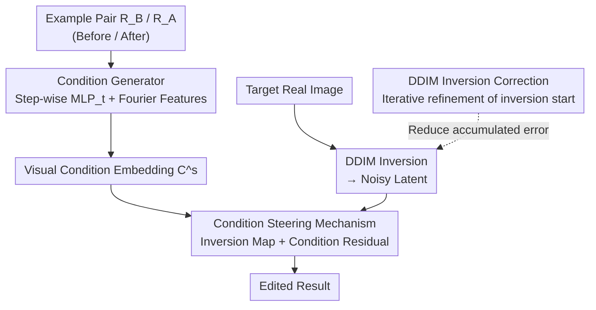

# Language-Free Generative Editing from One Visual Example

**Conference**: CVPR 2026  
**arXiv**: [2603.25441](https://arxiv.org/abs/2603.25441)  
**Code**: [Project Page](https://omaralezaby.github.io/vdc/)  
**Area**: Image Generation  
**Keywords**: Image Editing, Diffusion Models, Visual Conditioning, Language-Free, Training-Free

## TL;DR

This paper reveals that text-guided diffusion models suffer from severe text-visual alignment failures regarding simple visual transformations such as rain, fog, and blur. It proposes the VDC framework, which learns pure visual conditioning signals to guide diffusion editing using only a single pair of visual examples (before and after transformation). The method requires no text and no training, surpassing both text-based and fine-tuning methods in tasks like deraining, dehazing, and denoising.

## Background & Motivation

While text-guided diffusion models have made significant progress in image editing, SOTA methods surprisingly **fail severely on simple daily transformations** like rain, blur, and haze.

Root Cause: Diffusion models are trained on image-caption pairs and only learn concepts explicitly described in captions. **Visual phenomena that are rarely or ambiguously described** (e.g., raindrops, mist) are poorly aligned in the text-visual space—attention maps under the text condition "rain" remain object-centric and are unrelated to rainfall features.

Existing Solutions:
- Fine-tuning: High computational cost and large data requirements.
- Stronger text conditioning: Still fails to overcome the fundamental limitations of text-visual alignment.

Key Insight: **The editing capability of diffusion models is not lost, but hidden by text**. Diffusion models have already encoded rich visual representations; it is feasible to access these representations through vision rather than language.

## Method

### Overall Architecture

The goal of VDC (Visual Diffusion Conditioning) is straightforward: since text cannot accurately describe appearance-level transformations like "rain" or "fog," it bypasses text entirely and uses a pair of example images to demonstrate "how to edit" directly to the diffusion model. Given a pair of matched images—before transformation $R_B$ and after transformation $R_A$ (e.g., "rainy" and "clear" versions of the same scene)—VDC first optimizes a lightweight MLP to compress the editing intent from this pair into a set of pure visual condition embeddings $C^s$. When editing a real image, it is first inverted back to a noisy latent variable using DDIM, and then re-sampled with $C^s$ to obtain the edited result. Finally, an inversion correction step compensates for accumulated errors to preserve the details of the original image. The entire pipeline operates without text or training the diffusion backbone.

### Key Designs

**1. Condition Steering: Formulating editing as "Inversion Map + Residual" instead of generation from scratch**

Once text conditioning is abandoned, the challenge shifts to how to actually modify the image using the visual condition $C^s$. VDC derives a solution from the posterior score function, rewriting the noise prediction at each step as a weighted mixture of conditional and unconditional predictions:

$$\epsilon_\theta(z_t, -C^s) = (1-w)\cdot\epsilon_\theta(z_t, C^s) + w\cdot\epsilon_\theta(z_t, \phi)$$

For "removal" tasks like deraining or dehazing, it takes the negative condition direction to push the sampling away from the high-density regions of the degradation features, effectively "subtracting" rain or fog. Crucially, the target of the edit is the inversion map rather than a new image—the output is formulated as $out = Z(\phi) + Z(C_\theta)$ instead of $out = Z(C_\theta)$. The former preserves the unconditional branch of the original image and only overlays changes brought by the condition, similar to global residual connections in image-to-image networks, thus avoiding structural drift and artifacts common in zero-shot generation.

**2. Condition Generator: Replacing text embeddings with INR-style MLPs for stable optimization of all tokens**

Where does the condition $C^s$ come from? With only one pair of examples, directly optimizing text embeddings is unstable and usually only affects a few tokens. Borrowing from Implicit Neural Representations (INR), VDC uses a 3-layer MLP to map token indices to condition embeddings. The input first passes through a Fourier feature transform to enhance expressiveness, and a separate $\text{MLP}_t$ is trained for each diffusion step $t$. This approach completely detaches from the text space: the MLP is a continuous function that allows natural communication between 77 tokens, enabling them to be optimized as a whole rather than locally adjusting a few embeddings. The optimization objective constrains both the latent and pixel spaces:

$$\mathcal{L} = \|Z_0^B - Z^A\|_2^2 + \|D(Z_0^B) - R_A\|_2^2$$

**3. DDIM Inversion Correction: Iteratively compensating for accumulated inversion errors**

DDIM inversion inherently possesses errors that, when accumulated step-by-step, cause the edited result to deviate from the original image and lose detail. VDC performs an iterative correction at the inversion starting point: it repeatedly runs forward-backward cycles and adjusts the noisy latent variable using the gradient of the reconstruction residual:

$$Z_p \leftarrow Z_p - \text{AdamGrad}(\|\hat{Z}_0 - Z_0\|_2^2)$$

This continues until the inversion latent can more accurately reconstruct the original image. This step introduces no additional modules or complexity but significantly improves perceptual fidelity after editing—removing it in ablations leads to a sharp degradation in LPIPS scores.

### Loss & Training

The condition generator is optimized with a joint loss $\mathcal{L} = \|Z_0^B - Z^A\|_2^2 + \|D(Z_0^B) - R_A\|_2^2$. The latent space term ensures the condition embedding pushes $R_B$ toward the latent representation of $R_A$, while the pixel space term constrains the decoded image to approach the target. Optimization is performed using Adam, with independent MLPs maintained for each diffusion step. The diffusion backbone is not updated during this process.

## Key Experimental Results

### Main Results

| Method | SR FID↓ | DeBlur FID↓ | DeNoise FID↓ | DeRain FID↓ | DeHaze FID↓ | Colorization FID↓ |
|------|---------|------------|-------------|------------|------------|------------------|
| P2P | 126.47 | 45.62 | 142.95 | 139.19 | 44.09 | 121.87 |
| Null-Opt | 73.48 | 51.89 | 160.88 | 167.61 | — | — |
| **Ours (VDC)** | **Best** | **Best** | **Best** | **Best** | **Best** | **Best** |

Ours (VDC) sets new SOTAs across all 6 benchmarks, surpassing training-free and fully fine-tuned text-based editing methods.

### Ablation Study

| Configuration | Effect |
|------|------|
| W/o Inversion Correction | Significant degradation in LPIPS |
| W/o Fourier Features | Unstable condition generation |
| Global Unified Condition (Non-stepwise) | Drop in precision |
| Text Embedding Optimization instead of MLP | Unstable, can only optimize a few tokens |

### Key Findings

- Diffusion model attention maps are completely misaligned under text conditions like "rain"—they remain object-centric rather than focused on the degradation.
- VDC restores attention maps that correctly focus on rain streaks and hazy regions.
- A single visual example pair is sufficient to learn generalizable editing conditions.
- VDC even outperforms specialized trained methods in image restoration tasks.

## Highlights & Insights

- Revealing the fundamental failure of text-visual alignment in appearance-level transformations is a significant contribution in itself.
- The insight that "diffusion editing capabilities are hidden rather than lost" is critical—visual conditioning can unlock capabilities inaccessible to text.
- The INR-inspired condition generator design is elegant: continuous functions combined with Fourier features achieve stable, full-token optimization.
- A true training-free method with computational costs far lower than fine-tuning schemes.

## Limitations & Future Work

- Requires a pair of visual examples (before and after transformation); obtaining such pairs may not always be easy.
- Each new edit requires re-optimization of the condition generator (~100 iterations).
- Only validated on image restoration/degradation tasks; applicability to semantic-level editing (e.g., object replacement) is unknown.
- Dependent on the quality of DDIM inversion; highly complex images may suffer from poor inversion results.

## Related Work & Insights

- **vs Prompt-to-Prompt/Null-Opt**: These methods modify text prompts or attention maps and still rely on text-visual alignment; VDC bypasses text entirely.
- **vs InstructPix2Pix and variants**: These require large-scale instruction fine-tuning datasets and training; VDC requires zero training.
- **vs Diffusion methods for inverse problems**: These assume a known degradation operator (e.g., blur kernel) and cannot handle complex, spatially-varying degradations; VDC learns from visual examples.

## Rating

- Novelty: ⭐⭐⭐⭐⭐ The paradigm shift from text to pure visual conditioning and the revelation of text-visual alignment failure provide significant scientific value.
- Experimental Thoroughness: ⭐⭐⭐⭐ 6 editing benchmarks with multiple baseline comparisons, though semantic editing experiments are missing.
- Writing Quality: ⭐⭐⭐⭐⭐ Extremely clear motivation; the attention map visualization in Fig. 2 is very persuasive.
- Value: ⭐⭐⭐⭐⭐ Highly insightful for diffusion-based editing and image restoration; the framework is concise and practical.

<!-- RELATED:START -->

## Related Papers

- [\[CVPR 2026\] ChordEdit: One-Step Low-Energy Transport for Image Editing](chordedit_one-step_low-energy_transport_for_image_editing.md)
- [\[CVPR 2026\] VisionDirector: Vision-Language Guided Closed-Loop Refinement for Generative Image Synthesis](visiondirector_vision-language_guided_closed-loop_refinement_for_generative_imag.md)
- [\[CVPR 2026\] Coupled Diffusion Sampling for Training-Free Multi-View Image Editing](coupled_diffusion_sampling_for_training-free_multi-view_image_editing.md)
- [\[CVPR 2026\] Group Editing: Edit Multiple Images in One Go](group_editing_edit_multiple_images_in_one_go.md)
- [\[CVPR 2026\] Evaluating Generative Models via One-Dimensional Code Distributions](evaluating_generative_models_via_one-dimensional_code_distributions.md)

<!-- RELATED:END -->
