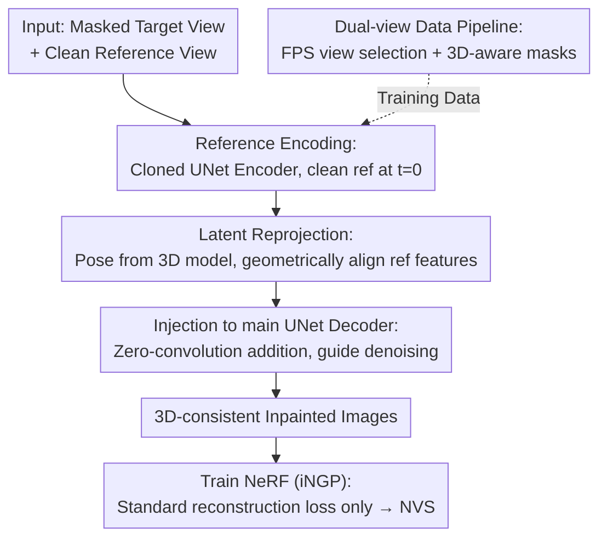

# LaRP: Efficient Multi-View Inpainting with Latent Reprojection Priors

**Conference**: CVPR 2026  
**Paper**: [CVF Open Access](https://openaccess.thecvf.com/content/CVPR2026/html/Zhang_LaRP_Efficient_Multi-View_Inpainting_with_Latent_Reprojection_Priors_CVPR_2026_paper.html)  
**Code**: None  
**Area**: Image Generation / Diffusion Models / 3D Vision  
**Keywords**: Multi-view Inpainting, Diffusion Models, Cross-view Conditioning, 3D Foundation Models, Latent Reprojection

## TL;DR
LaRP transforms a pre-trained 2D diffusion inpainting model into an "innately 3D-aware" multi-view inpainter. It clones a UNet encoder to process clean reference views and reprojects reference features onto the target view coordinates using camera poses estimated by a 3D foundation model. These features are injected into the decoder to guarantee 3D consistency at the source. The resulting images allow for NeRF training using only standard reconstruction loss, achieving quality comparable to SOTA while being approximately 50× faster.

## Background & Motivation

**Background**: Multi-view inpainting aims to remove an object from a set of images of the same scene taken from different perspectives. The core difficulty is "cross-view 3D consistency"—inpainted content must not only be plausible within each view but also satisfy 3D geometric relationships across views. The mainstream approach is a two-stage method: performing independent 2D inpainting for each view, followed by post-hoc 3D optimization using neural scene representations like NeRF or 3DGS, supplemented by specialized losses (perceptual loss, reference appearance propagation, SDS priors) to "align" inconsistent 2D results.

**Limitations of Prior Work**: Two-stage methods delay consistency to the post-processing stage, attempting to "force" alignment between conflicting independent repairs. This is both slow (e.g., SPIn-NeRF ~360 min, MVIP-NeRF ~960 min) and prone to artifacts. MVInpainter, a single-stage method, treats multi-view as a video sequence and propagates appearance via optical flow, but flow is brittle for "non-video" inputs (sparse views, large baselines).

**Key Challenge**: Consistency should be guaranteed "during inpainting" rather than as an afterthought; however, 2D inpainting models are inherently unaware of geometric correspondences between views. Implicit motion cues (flow) are unreliable; what is needed is **explicit and reliable geometric correspondence**.

**Goal**: Enable a pre-trained 2D diffusion inpainting model to "see" reference views and know where reference pixels should land in the target view from the start. This allows for single-stage 3D-consistent inpainting, eliminating expensive post-hoc optimization.

**Key Insight**: Recent 3D foundation models (DUSt3R / VGGT) can robustly estimate pixel-wise 3D correspondences and relative poses between two views in a feed-forward manner. The authors argue that rather than relying on motion, this **explicit geometric correspondence** should be directly injected into the diffusion process.

**Core Idea**: Use a cloned UNet encoder to encode a "clean reference view." Then, use poses estimated by a 3D foundation model to **reproject** these multi-scale latent reference features into the target view's coordinates. Finally, inject these into the primary UNet decoder via zero-convolutions to guide the denoising process with geometrically aligned reference appearance.

## Method

### Overall Architecture
LaRP addresses how to endow a 2D diffusion inpainting model with cross-view consistency during the inpainting process. The pipeline consists of two parts: ① **Inference/Architecture**: Given a masked target view and a clean reference view, a cloned UNet encoder extracts multi-scale latent features of the reference. A 3D foundation model estimates the relative pose from reference to target, reprojecting the reference features into the target view coordinates. These aligned features are added to the corresponding scales of the original UNet decoder using zero-initialized convolutions to guide denoising. The resulting 3D-consistent inpainted images are used directly to train an Instant-NGP NeRF for novel view synthesis. ② **Training/Data**: As LaRP requires "dual-view image pairs" and existing datasets are mostly single-view, the authors designed an automated data pipeline to create pairs from video datasets (FPS view selection + 3D-aware masking). The Objectron dataset is used to generate training pairs with reasonable baselines and masks.

### Key Designs

**1. Reference View Encoding: Cloned UNet Encoder + $t=0$ clean input for high-fidelity multi-scale features**

The challenge in passing reference appearance to the inpainting model is encoding it in a way that is both high-fidelity and within the latent domain of the pre-trained model. LaRP **clones the diffusion UNet encoder as a trainable copy** while freezing the original UNet. The base model receives a 9-channel tensor $X_t=[I,M,Z_t]\in\mathbb{R}^{H\times W\times 9}$ (masked latent $I$, mask $M$, noisy latent $Z_t$). The cloned encoder takes $X_{\text{ref}}=[I_{\text{ref}},M_0,Z_0]$, where $M_0=0$ (the reference is complete) and crucially, **the timestep is fixed at $t=0$**, which makes the noisy latent equivalent to the clean reference latent $Z_0=I_{\text{ref}}$. This ensures the cloned encoder receives noise-free input and outputs deterministic, high-fidelity features. Because it inherits well-trained parameters, feeding an unmasked reference naturally produces meaningful activations—a cleaner approach than the ControlNet route which must learn to interpret geometrically distorted or "holed" reference pixels.

**2. Latent Reprojection: Geometric alignment via 3D foundation models**

Reference activations cannot guide the target view directly because the relationship is **geometric rather than pixel-to-pixel**. LaRP uses a 3D foundation model (VGGT) to estimate 3D properties for each pair: a pixel-wise 3D point map $P_{\text{ref}}\in\mathbb{R}^{H\times W\times 3}$ for the reference, shared intrinsics $K$, and relative pose $[R;t]$. Multi-scale reference activations $F_{\text{ref}}$ are then lifted into a "3D feature point cloud" $\{(P_{\text{ref}}(p),F_{\text{ref}}(p))\}$. Each point $P_p$ is projected to target coordinates $p'\sim K(RP_p+t)$. Using splatting, features are placed at projected locations to yield a conditional feature map $F_{\text{cond}}$ (unprojected "holes" are set to 0). $F_{\text{cond}}$ passes through a zero-initialized convolution and is added to the original UNet **decoder**. Two design choices are critical: first, **reprojection only occurs before injection into the decoder**, ensuring the cloned encoder always processes the "natural" reference appearance; second, explicitly setting holes to 0 gives the model a clear prior to fill those regions using its own generative capacity.

**3. Scalable Dual-View Data Pipeline: FPS Selection + 3D-Aware Masks**

LaRP training requires dual-view pairs, but standard datasets are single-view. The authors automate pair creation from the Objectron video dataset using two components. **FPS selection**: Farthest Point Sampling is applied to camera trajectories ($T_{i+1}=\arg\max_{T_j}\min_{T_k\in S_i} d(T_j,T_k)$) to select spatially uniform frames. View pairs are then sorted by distance, and **sampling is restricted to the 10th-30th percentile** to ensure baselines are neither too close nor too far. **3D-aware masks**: Instead of using the full 2D projection of a 3D bounding box (which might leave too little context for 3D foundation models), the box is bisected by a random line. The smaller portion (30%-50% of the original area) is used as the mask. This provides sufficient context for pose estimation while leaving large continuous object regions as anchors. Ablations show that training on a single category ("chairs") performs nearly as well as full-category training, suggesting geometric rigor is more important than semantic diversity.

### Loss & Training
LaRP is trained on the `stable-diffusion-2-inpainting` UNet. The original UNet is frozen; only the cloned encoder and zero-convolutions are trained. Training involves 20k iterations, batch size 16, a single RTX 4090, AdamW optimizer, and learning rate 1e-5. VGGT estimates include per-point confidence; the bottom 5% least confident points are filtered during training. Final NeRF synthesis uses Instant-NGP trained for 50k steps with **standard reconstruction loss only**.

## Key Experimental Results

### Main Results
Datasets: SPIn-NeRF (10 indoor/outdoor scenes) + 360-USID (wide-baseline 360° scenes). Metrics: MEt3R (multi-view consistency via MASt3R/RAFT backbones), LPIPS/FID, and their masked versions m-LPIPS/m-FID for NeRF rendering.

Multi-view consistency of direct inpainting results (SPIn-NeRF, average of all 60 view pairs):

| Method | MEt3R$_M$↓ | MEt3R$_R$↓ |
|----------|------------|------------|
| LaMa | 0.1374 | 0.1449 |
| LDM (Base) | 0.1790 | 0.1865 |
| MVInpainter-F | 0.1113 | 0.1296 |
| **LaRP (Ours)** | **0.1109** | **0.1293** |

Novel View Synthesis (NVS) quality and time (Time = per scene processing, excluding 2D model pre-training):

| Inpainter | NVS Method | Time↓ | LPIPS↓ | m-FID↓ |
|--------|----------|-------|--------|--------|
| LaMa | SPIn-NeRF | 87 min | 0.5197 | 237.6 |
| LDM† | MALD-NeRF (Prev. SOTA) | 960 min | 0.2288 | 233.3 |
| MVInpainter-F | iNGP | 20 min | 0.2484 | 235.0 |
| **LaRP** | iNGP | **4 min** | 0.3006 | 232.9 |
| **LaRP** | iNGP | 20 min | **0.2458** | **226.9** |

LaRP achieves SOTA on FID/m-FID and is highly competitive on LPIPS. It replaces the 16-hour optimization of MALD-NeRF with 20 minutes of training (~50× speedup); **even a 4-minute training session exceeds the FID of the previous SOTA**.

### Ablation Study

| Variant | MEt3R$_M$↓ | LPIPS↓ | FID↓ | Note |
|------|------------|--------|------|------|
| (a) Pixel Reproj + ControlNet | 0.1301 | 0.2795 | 40.12 | Pixel-space condition, sub-optimal |
| (b) Cross-Attention | 0.1735 | — | — | Fails to learn, same as unconditional |
| (c) Unlocked UNet Decoder | 0.1273 | 0.2650 | 37.18 | Better than (a) but worse than full |
| (d) Single-view Dataset Training | 0.1428 | 0.3081 | 44.15 | Never saw reprojection hole patterns |
| (e) (d) + Latent Dropout | 0.1385 | 0.2913 | 43.29 | Slightly better but lacks dual-view data |
| (f) W/o FPS Selection | 0.1245 | 0.2655 | 36.19 | Consistency and NVS both drop |
| (g) W/o 3D-Aware Masks | 0.1263 | 0.2789 | 35.51 | Worse performance |
| (h) Single-category Data | 0.1174 | 0.2613 | 35.02 | Close to full model |
| (*) Full Model | **0.1109** | **0.2458** | **34.84** | — |

Training efficiency: Unlike MVInpainter-F (8×A100 for 3 days), LaRP trains on a single 4090 for 14 hours. Compared to ControlNet's "sudden convergence" (~7000 steps), LaRP converges in ~2000 steps (3.5× faster).

### Key Findings
- **Latent Space Reprojection > Pixel Space**: Variant (a) vs (*) shows that performing geometric alignment in latent space while preserving pre-trained priors is key to optimal results.
- **Geometric Rigor > Semantic Diversity**: Single-category training (h) performs almost as well as full training, while removing FPS selection (f) or 3D masks (g) leads to significant drops.
- **Dual-view Data is Essential**: Single-view training (d) cannot simulate the sparse, holed patterns of geometric reprojection effectively, even with dropout (e).
- **Frontend Consistency**: LaRP's inpainting is inherently consistent enough that NeRF can be trained with standard reconstruction loss, leading to the ~50× speedup.

## Highlights & Insights
- **The $t=0$ Trick**: Fixing the cloned encoder's timestep at 0 to obtain deterministic, noise-free reference features is a simple but powerful way to get a stable cross-view signal.
- **"Encode then Reproject" Sequence**: Postponing reprojection until just before the decoder ensures the cloned encoder always processes "real" reference appearances, lowering the learning hurdle compared to ControlNet styles.
- **3D Foundation Models as "Correspondence Engines"**: Using these models as feed-forward providers of poses and point maps is an efficient paradigm for injecting 3D priors into 2D models without fine-tuning the 3D models themselves.
- **3D-Aware Masking Logic**: Using integral geometry to bisect bounding boxes ensures enough context is left for the 3D models while providing sufficient area for inpainting, a reusable trick for data generation.

## Limitations & Future Work
- Performance is constrained by upstream dependencies: the LDM's VAE struggles with fine textures (e.g., dense text), and overall quality depends on the accuracy of the 3D foundation model.
- The data pipeline relies on video datasets with 3D object annotations, which are less common than standard image datasets.
- Future work: Upgrading to stronger base models or more accurate 3D foundation models is a direct path to improvement.
- Robustness toward ultra-large scenes or highly reflective/transparent objects has not been fully explored.

## Related Work & Insights
- **vs. Two-stage Methods (SPIn-NeRF / MALD-NeRF)**: These methods are slow and prone to artifacts due to independent 2D repairs; LaRP ensures consistency during repair, allowing 50× faster NeRF training.
- **vs. MVInpainter**: LaRP uses explicit geometric correspondence instead of fragile optical flow, making it more robust for sparse or wide-baseline views.
- **vs. ControlNet Condition**: Standard ControlNet must learn to interpret "warped, holed pixels," whereas LaRP's architecture splits the task, leading to 3.5× faster convergence.

## Rating
- Novelty: ⭐⭐⭐⭐ The $t=0$ encoding and latent reprojection sequence are clever and efficient.
- Experimental Thoroughness: ⭐⭐⭐⭐ Covers consistency, NVS, and efficiency with strong ablations; could benefit from more failed case analysis in complex scenes.
- Writing Quality: ⭐⭐⭐⭐ Clear logical flow from motivation to data pipeline design.
- Value: ⭐⭐⭐⭐ ~50× speedup and single-GPU training make it highly practical for 3D content editing.

<!-- RELATED:START -->

## Related Papers

- [\[CVPR 2026\] InstructMix2Mix: Consistent Sparse-View Editing Through Multi-View Model Personalization](instructmix2mix_consistent_sparse-view_editing_through_multi-view_model_personal.md)
- [\[CVPR 2026\] Correspondence-Attention Alignment for Multi-View Diffusion Models](correspondence-attention_alignment_for_multi-view_diffusion_models.md)
- [\[CVPR 2026\] From Inpainting to Layer Decomposition: Repurposing Generative Inpainting Models for Image Layer Decomposition](from_inpainting_to_layer_decomposition_repurposing_generative_inpainting_models_.md)
- [\[NeurIPS 2025\] A Data-Driven Prism: Multi-View Source Separation with Diffusion Model Priors](../../NeurIPS2025/image_generation/a_data-driven_prism_multi-view_source_separation_with_diffusion_model_priors.md)
- [\[ICLR 2026\] MVCustom: Multi-View Customized Diffusion via Geometric Latent Rendering and Completion](../../ICLR2026/image_generation/mvcustom_multi-view_customized_diffusion_via_geometric_latent_rendering_and_comp.md)

<!-- RELATED:END -->
