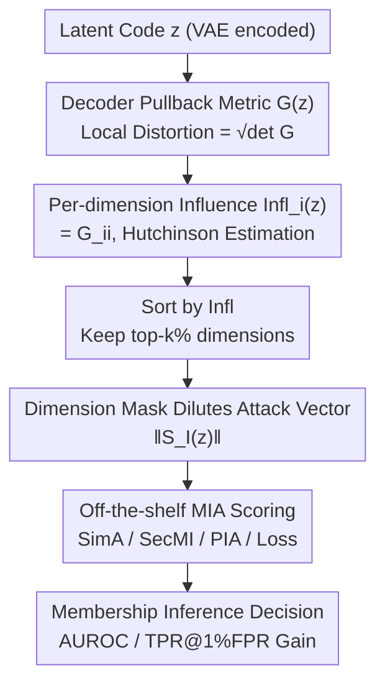

# Latent Diffusion Inversion Requires Understanding the Latent Space

**Conference**: CVPR 2026  
**Paper**: [CVF Open Access](https://openaccess.thecvf.com/content/CVPR2026/html/Rao_Latent_Diffusion_Inversion_Requires_Understanding_the_Latent_Space_CVPR_2026_paper.html)  
**Code**: https://github.com/mx-ethan-rao/VAE2Diffusion.git  
**Area**: Image Generation / Diffusion Model Privacy  
**Keywords**: Latent Diffusion, Membership Inference Attack, Memorization, Riemannian Geometry, VAE Decoder

## TL;DR
This paper identifies that memorization in Latent Diffusion Models (LDM) is **spatially non-uniform** within the latent space—samples or dimensions where the VAE decoder's pullback metric exhibits larger local distortion are memorized more strongly. Accordingly, a filtering method is proposed that ranks dimensions and masks "low-memorization" ones based solely on VAE geometry. This approach consistently improves AUROC by 1–4% and TPR@1%FPR by 1–32% across six datasets and four types of Membership Inference Attacks (MIA).

## Background & Motivation

**Background**: Model inversion aims to recover training samples from a trained generative model, with Membership Inference Attack (MIA)—distinguishing whether a sample was in the training set—serving as a prerequisite task. For data-domain diffusion models, inversion and MIA have been extensively studied; models that memorize more strongly (overfitting) are more vulnerable to MIA, making MIA sensitivity a practical metric for measuring memorization.

**Limitations of Prior Work**: Regarding Latent Diffusion Models (LDM, which perform diffusion on latent codes encoded by a VAE), existing methods (1) focus almost exclusively on the diffusion process itself for inversion, **treating the latent space as a fixed basis and ignoring the role of the accompanying VAE**; (2) show a significant drop in inversion performance compared to data-domain diffusion, leading to the perception that LDMs are "robust" against inversion.

**Key Challenge**: Prior work has observed that changing the strength of latent space regularization significantly alters MIA vulnerability, suggesting that the "latent space structure" influences memorization. However, no study has attributed this to the **geometric properties** of the VAE decoder. Is memorization distributed uniformly across all samples and dimensions, or is it structurally concentrated in specific locations?

**Goal**: To characterize the geometric attributes of the decoder and verify their causal link with memorization and membership leakage, thereby designing a universal filtering pipeline to enhance MIA.

**Key Insight**: The decoder mapping $D:\mathcal{Z}\to\mathcal{X}$ is characterized using the **pullback metric** from Riemannian geometry. Its determinant measures the extent to which the decoder amplifies or compresses local volumes in the latent space (termed "distortion"). The authors empirically find that LDMs more intensely memorize samples located in **high-distortion regions**.

**Core Idea**: Memorization is regulated by decoder geometry (local distortion), and this non-uniformity reaches the level of **individual dimensions**—latent dimensions that contribute more to distortion leak more membership information. Consequently, masking "low-memorization dimensions" from the attack vector before performing the attack can universally improve performance.

## Method

### Overall Architecture
The method revolves around a geometry-driven pipeline: for each latent code $z$, the **local distortion** is first calculated using the VAE decoder's pullback metric (revealing which samples are memorized strongly). This distortion is then subdivided into **per-dimension influence** $\text{Infl}_i$ (revealing which dimensions leak more info) using a Hutchinson estimator. Dimensions are sorted by influence, the top-$k\%$ are retained, and the remaining low-influence dimensions are masked. This yields a "diluted attack statistic" which is fed into any off-the-shelf score-based MIA method (SimA/SecMI/PIA/Loss). The entire process **depends only on the VAE** and is decoupled from specific diffusion attack methods—echoing the title "Latent Diffusion Inversion Requires Understanding the Latent Space."

### Key Designs

**1. Decoder Pullback Metric and Local Distortion: Identifying strongly memorized samples**

To address the limitation of treating latent space as a fixed basis, the authors characterize the decoder using Riemannian geometry. Let the Jacobian of the VAE decoder at point $z$ be $J_D(z)=\partial D(z)/\partial z$. The pullback metric is defined as $G(z)=J_D(z)^\top J_D(z)$, a symmetric semi-positive definite tensor describing how local directions in the latent space are stretched or compressed when mapped to the data space. For an infinitesimal displacement $dz$, the induced distance in data space is $\|dx\|^2=dz^\top G(z)\,dz$. **Local distortion** is taken as the volume change factor $\text{Distortion}(z)=\sqrt{\det(G(z))}$, computed in log form as $\log\sqrt{\det G(z)}=\sum_i\log\sigma_i(J_D(z))$ (where $\sigma_i$ are singular values of the Jacobian). For high-dimensional latent spaces where full singular values are computationally prohibitive, the authors use a **matrix-free randomized SVD** for truncated spectral estimation. A core empirical finding (Fig. 3) shows that when samples are grouped by distortion quartiles, **quartiles with higher distortion yield higher attack AUC**. If the latent distortion is nearly uniform (e.g., CelebA), memorization is also uniform. This attributes memorization to the geometry of the encoder/decoder architecture for the first time.

**2. Per-dimension Influence Metric: Granularizing memorization to single latent dimensions**

Knowing "which samples" are memorized is insufficient. The authors further hypothesize that for a given data point, different latent dimensions contribute unequally to overfitting. **Per-dimension influence** is defined as the relative contribution of a coordinate to the magnitude of the decoder Jacobian:

$$\text{Infl}_i(z):=\left\|\frac{\partial x}{\partial z_i}\right\|_2^2=e_i^\top G(z)\,e_i=G_{ii}(z)$$

Intuitively, for dimensions with large $G_{ii}$, small perturbations in latent space are amplified more in pixel space, resulting in a higher effective SNR during training and a higher likelihood of carrying sample-specific information. Dimensions with very small $G_{ii}$ transmit weak and noisy supervision. To avoid explicitly constructing the full Jacobian, the authors use the **Hutchinson randomized trace estimator** to calculate the diagonal of the Gram matrix: $\text{diag}(J_D^\top J_D)=\mathbb{E}_{v\sim N(0,I)}[(J_D^\top v)\odot(J_D^\top v)]$. The influence is taken as $\text{Infl}_i(z)=\tfrac{1}{2}\log(\mathbb{E}_v[(J_D^\top v)_i^2]+\epsilon)$. $J_D^\top v$ is calculated implicitly using reverse-mode automatic differentiation, with complexity $O(n_{mc}\,T_D)$ scaling linearly with the number of Monte Carlo probes $n_{mc}$. In practice, $n_{mc}=8$ is sufficient across various resolutions.

**3. Dimension Masking to Dilute Attack Statistics: Removing low-memorization noise**

With per-dimension influence, the authors apply a mask to any scalar attack statistic $\|S(z)\|$ (where $S(z)$ is a latent attack vector like score-loss or noise prediction error): only the subset $I$ of coordinates with top-$k\%$ influence is retained, yielding the diluted statistic $\|S_I(z)\|=\|S(z)\odot\mathbb{I}_I\|$. **Mechanism**: The pullback metric $G(z)$ acts as a data-dependent conditioner on the training signal. Coordinates with large $G_{ii}$ receive higher effective SNR during training and carry more sample-specific info, while those with small $G_{ii}$ carry noisy supervision. Masking low-influence dimensions removes noise directions while preserving leakage directions. The paper uses a global $k=40$ (removing the bottom 40% dimensions). Experiments show that while random masking typically degrades performance, masking based on influence consistently improves it across all methods and datasets.

### Loss & Training
This work presents an analysis and attack enhancement method without adding new training losses. MIA evaluation utilizes four existing score-based attacks: **Loss/Naive** (evaluating the denoising objective $\|\omega-\hat\omega_\varepsilon(x_t^\omega,t)\|$ on noisy samples); **SecMI** (measuring the t-error of single-step posterior estimation using deterministic DDIM mapping); **PIA** (calculating consistency error using $t{=}0$ denoised output as proximal initialization); and **SimA** (scaled Loss point estimation at $\omega=0$, $\|\hat\omega_\varepsilon(x^\omega,t)\|$, which is simple and used in most experiments). Hyperparameters for Randomized SVD: target rank $k=20$, oversampling $p=30$, power iterations $q=2$.

## Key Experimental Results

### Main Results
Six datasets (resolutions $32^2$–$512^2$), four threat models, 8×A40. The filtering setting removes the top 40% least-memorized dimensions before calculating the norm. Control experiments drop 40% randomly. Representative results for SimA on three LDMs trained from scratch:

| Dataset | Method | AUC ↑ | ASR ↑ | TPR@1%FPR ↑ |
|--------|------|------|------|------|
| CIFAR-10 | SimA (Random Drop 40%) | 86.44 | 78.80 | 15.92 |
| CIFAR-10 | SimA | 89.10 | 81.63 | 19.88 |
| CIFAR-10 | **SimA (Filtered)** | **91.26** | **83.58** | **24.56** |
| CelebA | SimA | 84.66 | 77.04 | 11.09 |
| CelebA | **SimA (Filtered)** | **88.18** | **80.25** | **17.03** |
| ImageNet | SimA | 69.62 | 64.92 | 3.87 |
| ImageNet | **SimA (Filtered)** | **72.55** | **67.01** | **7.77** |

> Metric Definitions: AUC = Area Under the ROC Curve; ASR = Max balanced accuracy over all thresholds; TPR@1%FPR = True Positive Rate at a threshold where False Positive Rate is < 0.01 (measures attack strength in low-false-alarm zones).

Results on three datasets fine-tuned from pre-trained Stable Diffusion also show consistent gains, with massive improvements in TPR@1%FPR:

| Dataset | Method | AUC ↑ | ASR ↑ | TPR@1%FPR ↑ |
|--------|------|------|------|------|
| Pokémon | SimA | 93.50 | 87.87 | 20.38 |
| Pokémon | **SimA (Filtered)** | **94.83** | **89.68** | **52.04** |
| MS-COCO | SimA | 93.71 | 87.34 | 29.80 |
| MS-COCO | **SimA (Filtered)** | **96.86** | **92.10** | **49.44** |
| Flickr | SimA | 70.04 | 65.96 | 2.59 |
| Flickr | **SimA (Filtered)** | **73.61** | **68.45** | **3.49** |

Average gains across four attacks: AUC +1.1–3.2%, ASR +1.2–3.8%, and TPR@1%FPR ranging from +0.8% to +14.8% (up to +32% for the Loss method on Pokémon).

### Ablation Study

| Configuration | Key Observation | Explanation |
|------|---------|------|
| Masking top 40% low-memorization dimensions | Consistent gain across all metrics | Ours. Effectively removes noise while keeping signals. |
| Randomly dropping 40% dimensions | Usually decreases performance | Proves gains come from "selection" rather than dimensionality reduction. |
| Grouped attack by distortion quartiles | High-distortion quartiles yield much higher AUC | Confirms sample-level non-uniform memorization. |
| High-frequency suppression (Lian et al.) | Performance drops on LDM | Frequency tricks from data-domain do not transfer to LDMs. |

Relationship between distortion and frequency (Table 3, Pearson $r$): On CIFAR-10, distortion correlates with high-frequency magnitude ($r=0.7156$) but not low-frequency ($0.0814$). However, on CelebA, the correlation is reversed ($r=-0.8713$ with low-frequency), indicating distortion cannot be fully explained by pixel-domain frequency energy.

### Key Findings
- **Memorization is spatially non-uniform down to the dimension level**: Sample-level evidence (higher AUC for high-distortion samples) and dimension-level evidence (filtering gains) confirm that specific dimensions contribute disproportionately to leakage.
- **"Correct dimension selection" is critical**: Random dropping decreases performance, while influence-based dropping increases it, ruling out simple denoising via dimensionality reduction.
- **Frequency analysis is not directly transferable**: Nonlinear VAE encoders do not map images to simple Fourier modes. Frequency-based techniques effective in the data-domain fail on SD, necessitating a geometric perspective.

## Highlights & Insights
- **Attributing privacy/memorization to VAE geometry is a novel, overlooked perspective**: While previous studies focused on the diffusion process, this work proves that local distortion in the VAE architecture is the primary cause of memorization non-uniformity in LDMs, giving privacy significance to autoencoder choice.
- **The filtering method is plug-and-play**: It depends only on the VAE and can be applied to various score-based attacks (SimA/SecMI/PIA/Loss) for consistent gains.
- **Hutchinson + Reverse-mode AD makes high-dimensional Jacobians computable**: This avoids explicit construction of the decoder Jacobian, making influence calculation feasible even at $512^2$ resolution.

## Limitations & Future Work
- **Static $k=40\%$ heuristic**: The optimal masking ratio likely varies by dataset or sample. The authors used a fixed 40% for simplicity, meaning reported gains might be conservative.
- **Focus on "Attack Enhancement" rather than "Defense"**: While the method highlights privacy leaks, how to use decoder geometry for defense (e.g., geometry-aware latent regularization) remains an area for future work.
- **Approximation in Truncated Spectral Estimator**: Local distortion relies on top-$K$ singular values; the impact of approximation errors on extreme samples is not fully quantified.

## Related Work & Insights
- **vs. VAE Riemannian Geometry (Arvanitidis et al.)**: Previous work used pullback metrics for interpolation quality and clustering; this is the first application to **privacy**, revealing where LDMs memorize most strongly.
- **vs. Data-domain Diffusion Analysis**: Data-domain denoisers prefer reconstructing high-variance directions (high-frequency), but LDMs operate in a nonlinear semantic latent space where frequency conclusions do not hold.
- **vs. LDM Privacy studies treating VAE as fixed**: Unlike works that treat the autoencoder as a black box, this work explicitly attributes memorization behavior to the geometric properties of the encoder/decoder pair.

## Rating
- Novelty: ⭐⭐⭐⭐⭐ Uses decoder pullback metrics to link LDM memorization to geometry at a granular dimension level.
- Experimental Thoroughness: ⭐⭐⭐⭐⭐ Consistent gains across 6 datasets and 4 attacks with rigorous control experiments.
- Writing Quality: ⭐⭐⭐⭐ Clear geometric motivation and mechanisms; some details (frequency analysis, pseudocode) are in the appendix.
- Value: ⭐⭐⭐⭐ Provides a plug-and-play enhancement for diffusion privacy auditing and offers a new framework for analyzing autoencoder designs.

<!-- RELATED:START -->

## Related Papers

- [\[CVPR 2026\] Unified Latent Space for Understanding and Generation via Semantic Auto-encoder](unified_latent_space_for_understanding_and_generation_via_semantic_auto-encoder.md)
- [\[CVPR 2026\] SpeeDiff: Scalable Pixel-Anchored End-to-End Latent Diffusion Model](speediff_scalable_pixel-anchored_end-to-end_latent_diffusion_model.md)
- [\[CVPR 2026\] Your Latent Mask is Wrong: Pixel-Equivalent Latent Compositing for Diffusion Models](your_latent_mask_is_wrong_pixel-equivalent_latent_compositing_for_diffusion_mode.md)
- [\[CVPR 2026\] Toward Diffusible High-Dimensional Latent Spaces: A Frequency Perspective](toward_diffusible_high-dimensional_latent_spaces_a_frequency_perspective.md)
- [\[CVPR 2026\] A Temporal and Content Co-Awareness Latent Diffusion for Controllable Hand Image Generation](a_temporal_and_content_co-awareness_latent_diffusion_for_controllable_hand_image.md)

<!-- RELATED:END -->
