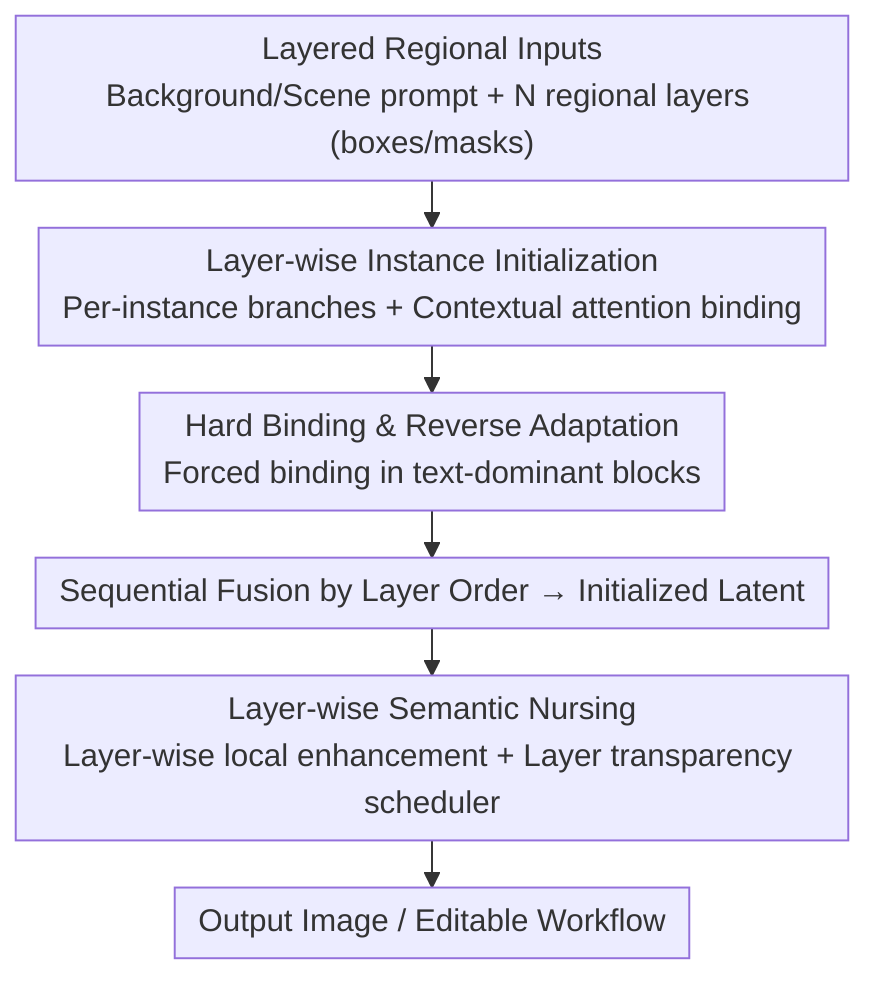

# Layer-wise Instance Binding for Regional and Occlusion Control in Text-to-Image Diffusion Transformers

**Conference**: CVPR 2026  
**Paper**: [CVF Open Access](https://openaccess.thecvf.com/content/CVPR2026/html/Chen_Layer-wise_Instance_Binding_for_Regional_and_Occlusion_Control_in_Text-to-Image_CVPR_2026_paper.html)  
**Code**: Project Page https://littlefatshiba.github.io/layerbind-page  
**Area**: Diffusion Models / Text-to-Image / Regional Layout Control  
**Keywords**: Regional Layout Control, Occlusion Control, Diffusion Transformer, Tuning-free, Joint Attention

## TL;DR
LayerBind proposes a **training-free, plug-and-play** strategy that treats each regional instance in text-to-image DiT models (such as FLUX and SD3.5) as an independent "layer." It leverages the contextual sharing mechanism of joint attention in the early stage of denoising to parallelly initialize individual instance branches, and then fuses them sequentially according to the layer order to establish the layout and occlusion. Subsequently, it refines details using layer-wise attention enhancement and a "layer transparency scheduler," thereby achieving precise regional control and occlusion order control without compromising image quality, while inherently supporting editable generation.

## Background & Motivation
**Background**: In text-to-image generation, "region-instructed layout control" allows users to specify the placement and appearance of each object using bounding boxes/masks and textual descriptions. This serves as a practical tool to realize layout plans parsed by LLMs into images. As the Diffusion Transformer (DiT) has become the mainstream architecture owing to joint attention, the research focus is shifting from U-Net to DiT-native layout controllers.

**Limitations of Prior Work**: Existing DiT layout control methods generally follow two paradigms, each with critical drawbacks. (1) **Training-based** methods (finetuning DiTs or adding layout adapters, such as CreatiLayout) can precisely control the layout but introduce training data biases, significantly **degrading image quality**; (2) **Training-free** methods (injecting semantics via regional prompts, such as RAGD and LaRender) preserve the base model's image quality but **cannot control the occlusion order of objects**, and often suffer from "concept blending," where semantics from different regions are erroneously merged.

**Key Challenge**: Simultaneously achieving "precise regional layout, correct occlusion relations, and high-fidelity image quality" on DiTs remains an unresolved challenge. Existing paradigms only address one aspect at the expense of others. More fundamentally, the authors reveal that prior methods suffer from **temporal misalignment with the model's denoising dynamics**—they attempt to counteract the model's inherent generation tendencies during inappropriate denoising stages.

**Key Insight**: The authors observe a key phenomenon (Fig. 2a/b)—the **layout and occlusion of an image are rigidly established in the extreme early stage of denoising**. Simply rearranging the structure of the latents in this early phase directly alters the final layout and occlusion without modifying the prompt. Benefiting from the ODE sampling properties of rectified flow (where each step's state serves as the initial condition for all subsequent updates), simple early rearrangements **determinstically propagate** along the entire denoising trajectory.

**Core Idea**: Effective layout control should **align with** the model's inherent denoising dynamics rather than opposing them at misaligned stages. Thus, the task is decoupled into two sequential stages: first, establishing layout and occlusion during the early **Layer-wise Instance Initialization** stage, and subsequently refining details while maintaining occlusion integrity during the **Layer-wise Semantic Nursing** stage.

## Method

### Overall Architecture
LayerBind decomposes the task of "region-instructed layout and occlusion control" into two **sequential stages**, which is entirely training-free and serves as a plug-and-play module for off-the-shelf DiT models. The inputs are structured: a background prompt $T_{bg}$ (used in the initialization stage), a holistic scene prompt $T_{scene}$ (used in the nursing stage), and $N$ layered regional inputs—where each layer $i$ contains a regional prompt $T_{reg}^{(i)}$ and a spatial clue $C^{(i)}$ (a bounding box or mask corresponding to token indices $idx^{(i)}$); the layer index $i$ explicitly encodes the occlusion order, from the furthest $i=1$ to the nearest $i=N$. The output is an image that rigorously satisfies spatial layout, occlusion order, and regional semantic fidelity while preserving the base model's image quality.

The first stage operates during the first $\tau_1$ fraction of the denoising steps (the interval $t\in[T,t_1)$): it copies an **instance branch** for each region from the initial latent variable. Leveraging the context-sharing mechanism of joint attention, each branch **independently** generates its own instance while anchoring to the shared background. At the designated early step $t_1$, all branches are fused into the global latent variable according to the layer order, forming an initialized latent with a **fixed layout**. The second stage takes over during $t\in(t_1,t_2]$: inside each attention block, standard global attention runs as usual, alongside a parallel **layer-wise local enhancement** path, where a "layer transparency scheduler" synthesizes each layer's enhancement into the global result according to the occlusion order, thereby maintaining occlusion and enhancing regional details.

### Key Designs

**1. Insights on Early Binding and Two-Stage Decoupling: Aligning with Denoising Dynamics Rather Than Resisting Them**

This design targets the root cause of "temporal misalignment between existing methods and the model's denoising." The authors verify in Fig. 2 that the spatial layout and occlusion of an image are rigidly locked in the **very early stages** of denoising (approximately the first 10%–30% steps), after which the process mainly fills in details. Based on the Euler sampling trajectory of rectified flows $x_{k-1}=x_k+(t_{k-1}-t_k)\,v_\omega(x_k,t_k\mid y)$, each state is an initial condition for all subsequent updates. Consequently, simple rearrangements of the latent structure early on **deterministically propagate** down the entire trajectory. This directly validates the rationality of "early binding”—rather than forcing changes on an already formed layout in later stages, it is superior to establish the layout and occlusion early. Thus, the method is decoupled into two phases: "structure initialization first, followed by semantic nursing for details," with the subsequent three designs implementing these stages.

**2. Layer-wise Instance Initialization: Parallelizing Instance Branch Formation without Detaching from the Background via Context Sharing**

As the core of the first stage, this design addresses "how to precisely place multiple instances without training." At the initial step $t=T$, each branch is copied directly from the global latent variable based on regional indices: $B^{(i)}(t{=}T)\leftarrow I(t{=}T)[idx^{(i)}]$, inherits the RoPE position encoding of its corresponding position. This ensures that the global latent $I$ and all branches $B^{(i)}$ share the same underlying noise structure, inherently promoting global consistency. Each branch is updated using the author-defined "Contextual Attention" (Eq. 3, which is essentially equivalent to attention masking but more efficient): a branch simultaneously incorporates the background context **excluding its own region** $e_{Ibg}^{(i)}$ and its corresponding regional text $e_{Treg}^{(i)}$, formulated as $\hat e_B^{(i)}\leftarrow A_{update}(e_B^{(i)},[e_{Ibg}^{(i)},e_{Treg}^{(i)}])$. Symmetrically, the regional text is updated back by the visual features of the branch (Eq. 6), establishing a local feedback loop that refines the "instance semantics" and "textual guidance" in sync. Crucially, each branch computes attention **independently** without mutual interference, forming clear, unblended instances, while remaining coordinated by anchoring to the shared background.

**3. Hard Binding & Reverse Adaptation: Overcoming "Modal Competition" that Causes Small Objects to be Ignored**

This mechanism targets the most common failure mode during initialization—"modal competition," where dominant background semantics overshadow weaker regional text signals, leading to small or background-similar objects being completely ignored (e.g., the clock/sofa examples in Fig. 7). The authors exploit the observation that certain DiT blocks respond significantly more strongly to text (Fig. 4, such as layer 0 and layers with high text responsiveness). In these "text-dominant blocks," **Hard Binding** (HB) is activated—forcing the instance branches to update **only** from themselves and the guided text, cutting off links with the background: $\hat e_B^{(i)}\leftarrow A_{update}(e_B^{(i)},[e_{Treg}^{(i)}])$, to guarantee small instances receive adequate textual guidance. Concurrently, a **reverse adaptation** is applied, forcing background regions to adapt to the branch regions and "make room" for them: $\hat e_{Ibg}^{(i)}\leftarrow A_{update}(e_{Ibg}^{(i)},[e_{Tbg},e_B^{(i)}])$ (implemented using structured attention masks for asymmetric updates), allowing seamless integration between the instance and the scene boundaries. Ablations show that HB is the **decisive** factor for occlusion success rate (VQAScore). At the end of the initialization stage, at the specified fusion step $t_1$, the $N$ branches are sequentially fused into the global latent according to the occlusion order: the bottom layer is directly merged as $I[idx^{(i)}]\leftarrow B^{(i)}$, while for the occluding upper layers, an optional foreground alpha mask $\alpha_f^{(i)}$ is utilized for compositing: $I[idx^{(i)}]\leftarrow \alpha_f^{(i)}\cdot B^{(i)}+(1-\alpha_f^{(i)})\cdot I[idx^{(i)}]$ (Eq. 9), preventing background interference and improving edge quality.

**4. Layer-wise Semantic Nursing & Layer Transparency Scheduler: Maintaining Occlusion Order while Refining Regional Details**

After the layout structure is established in initialization, the second stage aims to **simultaneously preserve the layout/occlusion and flesh out details** during $t\in(t_1,t_2]$. This stage switches to using the holistic scene prompt $T_{scene}$ as the global text condition. Inside each attention block, standard global attention $\hat e_I^{global}$ is computed as usual; in parallel, a local enhancement is computed for each layer $i$: $\hat e_{local}^{(i)}\leftarrow A_{update}(e_{Ireg}^{(i)},[e_{Treg}^{(i)},e_I])$ (Eq. 10), and the regional text is updated synchronously (Eq. 11). The core is the **layer transparency scheduler**, which iteratively composites these local enhancements onto the global result according to the occlusion order (from the bottom layer $i=1$ to the top layer $N$): $\hat e_{comp}^{(i)}=(1-\alpha_o^{(i)})\cdot\hat e_{comp}^{(i-1)}+\alpha_o^{(i)}\cdot\hat e_{local}^{(i)}$ (Eq. 12), where $\alpha_o^{(i)}=\eta\cdot M^{(i)}$, $\eta$ represents the opacity factor, and $M^{(i)}$ denotes the regional binary mask. This "layer-by-layer superposition" guarantees that **upper-layer semantics robustly cover lower-layer semantics** in overlapping regions—the exact mechanism preserving occlusion order. Furthermore, LSN can inject the correct color and attribute details back into each region even if the initial structure is imperfect (Fig. 9).

### A Concrete Example
Consider "a bee in front of a mouse" as an example: the input specifies two regional layers, where $i=1$ is the mouse (further) and $i=2$ is the bee (closer). During the initialization stage, two branches are copied from the initial latents. The bee branch anchors to the "background excluding the bee region" and absorbs the "glossy bee with detailed wings" text. Since the bee is relatively small, Hard Binding is triggered in the text-dominant blocks, forcing it to attend only to its text to avoid being swallowed by the background, while the background adaptively makes room for it. At $t_1$, fusion is performed in the order of $i=1\to2$. As the top layer, the bee uses an alpha mask to overlay the mouse region, thereby locking the "bee occluding the mouse" relationship in the early latents. In the semantic nursing phase, global attention runs standardly in each block, and the local enhancements of the mouse and bee layers are superimposed from bottom to top using the layer transparency scheduler. At overlapping areas, the bee's semantics overwrite the mouse's, and details (wing textures, fur color) are reinforced, culminating in an image with correct occlusion and uncompromised quality.

## Key Experimental Results

### Main Results
Two main benchmarks are evaluated: T2I-CompBench-3D (two-object occlusion) and **BindBench** (complex 3–5 object occlusion, constructed by the authors). Metrics include UniDet (depth/occlusion relationship), CLIP-G/L (scene/instance-level text-image alignment), OV QA (occlusion-aware score), LAcc/LV QA (layout fidelity), and HPS (image quality). The table below excerpts key columns from T2ICompBench-3D and BindBench ($\uparrow$ indicates higher is better):

| Method (Base Model) | Tuning-free | UniDet$\uparrow$(3D) | OV QA$\uparrow$(3D) | HPS$\uparrow$(3D) | BindBench LV QA$\uparrow$ | BindBench HPS$\uparrow$ |
|------|------|------|------|------|------|------|
| CreatiLayout* (FLUX) | ✗ | 39.37 | 57.03 | 27.38 | 40.99 | 28.73 |
| HybridLayout (FLUX) | ✗ | 41.33 | 47.55 | 26.43 | 43.45 | 29.20 |
| RAGD (FLUX) | ✓ | 30.13 | 31.22 | 26.64 | 20.81 | 22.80 |
| LaRender (IterComp) | ✓ | 37.52 | 35.96 | 27.37 | 42.62 | 26.27 |
| **LayerBind (SD3.5)** | ✓ | 41.37 | **65.78** | 28.36 | 59.73 | 29.03 |
| **LayerBind (FLUX)** | ✓ | **44.97** | 59.49 | **28.25** | **64.81** | **29.66** |

LayerBind achieves a UniDet score of 44.97 on FLUX, surpassing all competitors (including the strongest training-based model, HybridLayout at 41.33), demonstrating that its generated scene depth is more natural. While most methods degrade drastically under the complex occlusions of BindBench, LayerBind’s LV QA (64.81/59.73) and HPS scores robustly maintain the lead, proving its reliability and high quality on challenging scenarios. Additionally, inference overhead (+30% on FLUX) is substantially lower than regional segmentation generation methods such as RAGD (+168%) and HybridLayout (+240%).

General T2I Alignment (T2I-CompBench subset, Table 2, $\uparrow$ indicates higher is better):

| Method | Color | Shape | Texture | Spatial | Numeracy | Complex |
|------|------|------|------|------|------|------|
| FLUX | 77.53 | 60.16 | 69.64 | 39.09 | 59.81 | 37.01 |
| CreatiLayout | 76.94 | 59.92 | 73.45 | 60.33 | 71.51 | 37.45 |
| HybridLayout | 84.15 | **68.82** | **77.31** | 63.39 | 64.57 | 40.15 |
| RAGD | 80.39 | 60.16 | 70.85 | 51.93 | 53.76 | 43.77 |
| **LayerBind+FLUX** | **84.80** | 66.48 | 75.69 | **70.63** | 70.93 | 41.43 |

As a plug-and-play controller, LayerBind leads significantly in difficult tasks such as Spatial (70.63) as well as Numeracy and Complex, demonstrating that it not only controls occlusion but also comprehensively improves T2I alignment without quality degradation.

### Ablation Study
Ablation of the two major components, Hard Binding (HB) and Layer-wise Semantic Nursing (LSN), on BindBench under $\tau_1=0.2$ (Table 3, rows correspond to components progressively enabled, ⚠️ please refer to the original paper for the exact configurations):

| Configuration | CLIP-G$\uparrow$ | CLIP-L$\uparrow$ | VQAScore$\uparrow$ | HPS$\uparrow$ | Description |
|------|------|------|------|------|------|
| Baseline (Both off) | 34.95 | 26.82 | 38.36 | 28.27 | Neither HB nor LSN |
| +HB | 34.73 | 26.90 | 43.65 | 28.64 | Significant boost in occlusion success rate |
| +LSN | 35.78 | 27.80 | 50.98 | 29.64 | Improved details and image quality |
| Full (HB+LSN) | 35.72 | 27.86 | **52.55** | **29.66** | Full model |

### Key Findings
- **HB is the decisive factor for occlusion success rate**: The VQAScore rises from 38.36 to 52.55. HB primarily addresses "modal competition" that causes small or background-similar objects to be ignored (e.g., the clock/sofa examples in Fig. 7).
- **LSN mainly refines details and image quality**: CLIP-L increases from ~26.8 to 27.86 and HPS to 29.66. It is capable of injecting correct color/attribute details back into regions even when the initial structure is imperfect (Fig. 9).
- **Two-stage complementarity**: $\tau_1$ controls structure initialization; a value too high leads to excessive instance-background decoupling. Using a moderate $\tau_1$ to anchor the structure and relying on LSN to fill in semantic details yields a more harmonious output.

## Highlights & Insights
- **True integration of the "layer" concept into the DiT attention mechanism**: Instead of training RGBA transparent layers, it utilizes context sharing in joint attention to let each instance branch share the same noise structure and background context. This allows instances to form independently without detaching, which is the root cause of its superior robustness and fewer missed objects compared to LaRender.
- **"Early binding" is a highly transferable insight**: The early locking of layout/occlusion combined with the deterministic propagation of rectified flow trajectories suggests that many "structural" controls can be shifted to the early stages of denoising, leaving subsequent stages to focus purely on details. This is both time-efficient and robust.
- **Region-branching inherently supports editable generation**: The initialization stage acts as a "shared memory." Changing instances, modifying visibility order, or even performing image composition editing with an arbitrary image background (Fig. 8) only requires updating the corresponding branch while leaving unrelated areas untouched, which is highly practical for interactive creation.
- **The layer transparency scheduler** uses a simple iterative alpha superposition (Eq. 12) to solidly instill the "upper-layer-covers-lower-layer" occlusion semantics into the attention outputs. The concept is clean and reusable.

## Limitations & Future Work
- **Reliance on external layout parsing**: When public layout annotations are absent, GPT-5-mini is employed as the layout parser, meaning the final quality is constrained by the performance of the parser.
- **Heuristically selected hyperparameters**: Parameters such as $\tau_1$ (0.2 for FLUX / 0.25 for SD3.5), $\tau_2$ (0.7), opacity $\eta$ (0.7), and the selection of "text-dominant blocks" are empirically determined, which may require readjustment when transferring across different base models.
- **Issues in extreme crowding**: While Hard Binding successfully prevents objects from being ignored by cutting background links, fusion after independent branch generation can still exhibit boundary coordination artifacts under **extremely crowded/highly overlapping** layouts (which foreground alpha masks only partially alleviate).
- ⚠️ The exact checkmark combinations of HB/LSN for each row in Table 3 are not entirely clear from the cached text; while the quantitative trends are credible, the precise configurations should refer to the original paper.

## Related Work & Insights
- **vs CreatiLayout (Training-based DiT Layout Adaptation)**: CreatiLayout performs full-parameter finetuning, yielding the most stable spatial layouts. However, it still struggles with complex occlusions, and introduces training biases that degrade image quality. LayerBind, being tuning-free, excels in both image quality (HPS) and occlusion (VQAScore) with much more controllable inference overhead.
- **vs LaRender (NeRF-style Layered Rendering Occlusion)**: LaRender explicitly models occlusion using sequential object rendering but places strict demands on layered prompts and frequently misses objects. LayerBind relies on "shared background context + hard binding" to anchor each layer globally, resulting in more robust occlusion and fewer missed objects.
- **vs RAGD / Training-free Regional Prompting**: These methods preserve image quality but fail to control occlusion, easily suffer from concept blending, and suffer from slow generation due to regional segmentation. LayerBind utilizes contextual attention (equivalent to masking, yet more efficient) to handle occlusion while remaining significantly faster (+30% overhead vs. +168% for RAGD).

## Rating
- Novelty: ⭐⭐⭐⭐⭐ Combines "layers + early binding + context-sharing branches" into a training-free occlusion controller, offering a fresh perspective with solid insights.
- Experimental Thoroughness: ⭐⭐⭐⭐ Evaluated on two base models and two benchmarks (including the self-constructed BindBench) with extensive metrics and HB/LSN ablations, though details on a few ablation configurations are slightly ambiguous.
- Writing Quality: ⭐⭐⭐⭐ Clear logical flow from motivation to method and formulations, and well-designed illustrations, though notations are slightly dense and require close reading.
- Value: ⭐⭐⭐⭐⭐ Plug-and-play, preserves image quality, and naturally supports editing, carrying strong practical value for controllable T2I and interactive creation.

<!-- RELATED:START -->

## Related Papers

- [\[CVPR 2026\] SeeThrough3D: Occlusion Aware 3D Control in Text-to-Image Generation](seethrough3d_occlusion_aware_3d_control_in_text-to-image_generation.md)
- [\[CVPR 2026\] Pluggable Pruning with Contiguous Layer Distillation for Diffusion Transformers](pluggable_pruning_with_contiguous_layer_distillation_for_diffusion_transformers.md)
- [\[CVPR 2026\] RegionRoute: Regional Style Transfer with Diffusion Model](regionroute_regional_style_transfer_with_diffusion_model.md)
- [\[CVPR 2026\] From Inpainting to Layer Decomposition: Repurposing Generative Inpainting Models for Image Layer Decomposition](from_inpainting_to_layer_decomposition_repurposing_generative_inpainting_models_.md)
- [\[CVPR 2026\] Region-Adaptive Sampling for Diffusion Transformers](region-adaptive_sampling_for_diffusion_transformers.md)

<!-- RELATED:END -->
