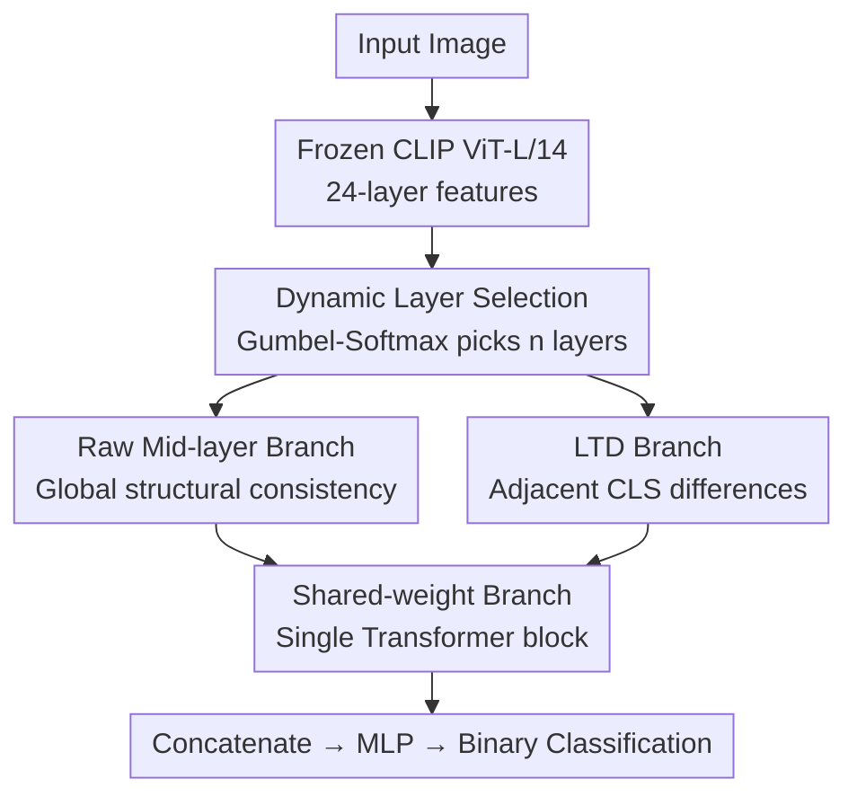

# Layer Consistency Matters: Elegant Latent Transition Discrepancy for Generalizable Synthetic Image Detection

**Conference**: CVPR 2026  
**arXiv**: [2603.10598](https://arxiv.org/abs/2603.10598)  
**Code**: [https://github.com/yywencs/LTD](https://github.com/yywencs/LTD)  
**Area**: Image Generation / AI-Generated Image Detection  
**Keywords**: Synthetic Image Detection, Layer Transition Discrepancy, CLIP-ViT, Cross-domain Generalization, Dynamic Layer Selection

## TL;DR

It is observed that real images exhibit stable inter-layer transitions in the intermediate representations of a frozen CLIP ViT, whereas synthetic images show significant attention mutations. The Layer Transition Discrepancy (LTD) method is proposed to model this difference, achieving a mean Acc of 96.90% on UFD, 99.54% on DRCT-2M, and 91.62% on GenImage, outperforming current SOTAs.

## Background & Motivation

**Background**: Images synthesized by generative models (GANs, Diffusion Models) are becoming increasingly realistic, making fake image detection urgent. Existing methods include: (1) Spatial/frequency-based methods (CNNSpot, NPR, FreqNet), which rely on specific artifacts and generalize poorly; (2) Diffusion-specific detectors (DRCT, LaRE2), which perform poorly on GANs; (3) Frozen CLIP-based methods (UnivFD, RINE, FatFormer), which utilize pre-trained semantic features.

**Limitations of Prior Work**: Low-level artifacts (frequency, texture) evolve with generative models, leading to model-specific biases. Among CLIP-based methods, UnivFD uses only the last layer, ignoring lower-level information, while RINE fuses all layers but introduces noise from irrelevant information.

**Key Challenge**: A model-agnostic, universal detection cue is needed—one that does not rely on specific artifacts but captures the essential difference between real and synthetic images.

**Key Insight**: By analyzing cosine similarity and L2 distance of features across CLIP ViT layers, it was found that real images maintain stable semantic attention consistency (smooth transitions), while synthetic images exhibit abrupt foreground/background attention jumps (high discrepancy). This phenomenon may stem from generative models prioritizing pixel-level realism and high-level semantic alignment while lacking strict physical constraints, causing a failure to maintain spatial correlation when integrating texture into structure.

**Core Idea**: Leverage Layer Transition Discrepancy (LTD)—the difference between adjacent intermediate layers—as a model-agnostic signal to model both global structural consistency and local inter-layer changes.

## Method

### Overall Architecture

The method identifies a detection cue independent of specific generator artifacts. It starts from the observation that when images pass through a frozen CLIP ViT-L/14, the CLS features of real images transition smoothly, while those of synthetic images jump abruptly in middle layers. The pipeline directly models "how layers change" rather than specific fingerprints.

Input images pass through frozen CLIP ViT to extract 24 layers of features. A dynamic layer selection module picks the most discriminative consecutive segment (typically layers 11–19). One branch retains raw intermediate features to monitor global consistency, while the other computes the Layer Transition Discrepancy (LTD) by subtracting adjacent layers to amplify the jump. Both branches, augmented with CLS tokens and position encodings, are processed by a **weight-sharing** Transformer block for interaction before being concatenated for MLP-based binary classification.

### Key Designs

**1. Dynamic Layer Selection: Learning the Most Discriminative Layers**

Fixed layer selection is risky as artifacts vary across models. Signals are concentrated in middle layers, while shallow (0–7) and deep (16–23) layers have limited discriminative power. The starting index $s$ for $n$ consecutive layers is made learnable. Using learnable logits $\boldsymbol{\pi} \in \mathbb{R}^C$ (where $C = l - n + 1$), the Gumbel-Softmax trick enables end-to-end differentiable selection of the window during training.

**2. Layer Transition Discrepancy (LTD): Focusing on Inter-layer Change**

Using raw features can introduce irrelevant semantic noise. LTD focuses on the difference between adjacent layers. For $n$ selected layers $\{\mathbf{f}_s^{(k)}\}_{k=1}^n$, the CLS tokens are subtracted: $\mathbf{d}_s^{(k)} = \mathbf{f}_s^{(k+1)} - \mathbf{f}_s^{(k)}$. This operation cancels out shared content and highlights how representations "move" between layers.

**3. Dual-branch Weight Sharing: Aligning Consistency and Jumps**

To preserve both global structure and local transitions, the raw branch $\mathbf{F}_s = [\mathbf{f}_s, \mathbf{f}_{cls}, \mathbf{f}_p]$ and LTD branch $\mathbf{D} = [\mathbf{d}, \mathbf{d}_{cls}, \mathbf{d}_p]$ are fed into the **same** trainable Transformer block. Weight sharing forces distinct features into a unified semantic space, facilitating joint discrimination. Ablations show combining both branches significantly improves mean Acc from ~89% to 98.22%.

### Loss & Training

Standard binary cross-entropy loss is used. Training utilizes only 2 classes of ProGAN data (chair + tvmonitor) and converges within 5 epochs. With a frozen CLIP backbone, the few trainable parameters allow training to complete in minutes on a single RTX 4090.

## Key Experimental Results

### Main Results

| Dataset | Metric | Ours (LTD) | ForgeLens | FatFormer | Gain |
| :--- | :--- | :--- | :--- | :--- | :--- |
| UFD | Mean Acc | 96.90% | 95.56% | 95.98% | +0.92% |
| UFD | Mean AP | 99.51% | 99.11% | 99.15% | +0.36% |
| DRCT-2M | Mean Acc | 99.54% | 98.22% | - | +1.32% |
| DRCT-2M | Mean AP | 99.99% | 99.76% | - | +0.23% |
| GenImage | Mean Acc | 91.62% | 89.18% | 84.34% | +2.44% |
| GenImage | Mean AP | 97.17% | 96.76% | 95.01% | +0.41% |

### Ablation Study

| Configuration | UFD Acc | DRCT-2M Acc | Mean Acc | Description |
| :--- | :--- | :--- | :--- | :--- |
| Raw ML. only | 84.92% | 92.75% | 88.84% | Raw mid-layer features only |
| Raw ML. + Pos.Enc | 94.22% | 96.12% | 95.17% | Added position encoding |
| LTD only | 86.42% | 93.50% | 89.96% | LTD features only |
| LTD + Pos.Enc | 92.43% | 94.01% | 93.22% | LTD with position encoding |
| Full model | 96.90% | 99.54% | 98.22% | Complete dual-branch model |

### Key Findings
- Real images maintain stable attention consistency in ViT middle layers (approx. Layers 11-19), while synthetic images show jumps.
- Middle layers (8-15) are more discriminative than shallow (0-7) or deep (16-23) layers.
- The optimal window is 5 consecutive layers; more or fewer layers degrade performance.
- Training on just 2 categories generalizes to 16 different GAN and DM generators.
- Robust against JPEG compression (QF 60-100) and downsampling (0.5x-1.0x).

## Highlights & Insights
- **Novel Detection Cue**: Identified inter-layer transition discrepancy as a model-agnostic feature, providing inherent cross-domain generalization.
- **High Efficiency**: Training completes in minutes with only 2 categories and 5 epochs.
- **Superior Speed**: Faster inference than FatFormer due to the lightweight dual-branch head and frozen backbone.
- **Physical Prior**: Generative models lack structural continuity constraints in intermediate layers, creating a "window" for forensic detection.

## Limitations & Future Work
- Midjourney Acc on GenImage is only 62.97%, showing room for improvement on high-quality commercial models.
- Heavy reliance on CLIP ViT representations; if CLIP is integrated into the generation process, performance may drop.
- Gumbel-Softmax reduces to a fixed selection during inference, lacking per-image adaptivity.
- LTD currently uses only CLS tokens, ignoring potential local discrepancy information in spatial tokens.

## Related Work & Insights
- **vs UnivFD**: UnivFD uses only the last layer for linear probing; LTD uses inter-layer differences, improving mean Acc by 11%.
- **vs FatFormer/RINE**: These methods fuse all layers, introducing noise; LTD focuses on changes to suppress redundancy.
- **vs NPR/FreqNet**: These rely on low-level artifacts (upsampling/spectrum) and fail on diffusion models; LTD utilizes structural consistency effective for both GANs and DMs.
- **Insight**: Intermediate representations of large pre-trained models contain rich forensic signals; inter-layer dynamics are more discriminative than single-layer features.

## Rating
- Novelty: ⭐⭐⭐⭐ Discovers a new, insightful detection cue.
- Experimental Thoroughness: ⭐⭐⭐⭐⭐ Comprehensive testing on 3 benchmarks and 16+ generators.
- Writing Quality: ⭐⭐⭐⭐ Clear motivation and convincing visualizations.
- Value: ⭐⭐⭐⭐ High practical value due to training efficiency and generalization.

<!-- RELATED:START -->

## Related Papers

- [\[CVPR 2026\] From Inpainting to Layer Decomposition: Repurposing Generative Inpainting Models for Image Layer Decomposition](from_inpainting_to_layer_decomposition_repurposing_generative_inpainting_models_.md)
- [\[CVPR 2026\] LacTokGen: Latent Consistency Tokenizer for 1024-pixel Image Generation by 256 Tokens](lactokgen_latent_consistency_tokenizer_for_1024-pixel_image_generation_by_256_to.md)
- [\[ICCV 2025\] ForgeLens: Data-Efficient Forgery Focus for Generalizable Forgery Image Detection](../../ICCV2025/image_generation/forgelens_data-efficient_forgery_focus_for_generalizable_forgery_image_detection.md)
- [\[NeurIPS 2025\] FerretNet: Efficient Synthetic Image Detection via Local Pixel Dependencies](../../NeurIPS2025/image_generation/ferretnet_efficient_synthetic_image_detection_via_local_pixel_dependencies.md)
- [\[CVPR 2026\] Transition Models: Rethinking the Generative Learning Objective](transition_models_rethinking_the_generative_learning_objective.md)

<!-- RELATED:END -->
