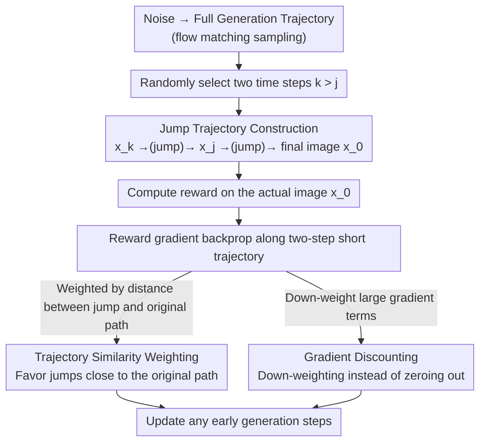

# LeapAlign: Post-Training Flow Matching Models at Any Generation Step by Building Two-Step Trajectories

**Conference**: CVPR 2026  
**arXiv**: [2604.15311](https://arxiv.org/abs/2604.15311)  
**Code**: [rockeycoss.github.io/leapalign/](https://rockeycoss.github.io/leapalign/)  
**Area**: Image Generation  
**Keywords**: flow matching, post-training, reward alignment, human preference, diffusion model

## TL;DR

The paper proposes LeapAlign, which shortens long generation paths into two-step jump trajectories. This enables reward gradients to backpropagate directly to early generation steps. Combined with trajectory similarity weighting and gradient discounting strategies, it achieves efficient post-training alignment for flow matching models.

## Background & Motivation

Aligning flow matching models with human preferences is a critical research direction. While GRPO methods borrowed from LLMs introduce significant stochasticity and variance, direct gradient methods leverage the differentiability of the flow matching sampling process for faster and more stable convergence. However, backpropagation through long trajectories faces two major challenges: (1) excessive memory consumption from long activation chains and (2) gradient explosion. Consequently, existing methods often only update a single step near the final image, failing to optimize early steps that determine the global structure.

## Method

### Overall Architecture

LeapAlign addresses the challenge where "reward gradients cannot update early generation steps during flow matching alignment." Early steps dictate the global structure and composition of an image, but full-trajectory backpropagation leads to both OOM (Out-of-Memory) issues and gradient explosion. In each iteration, LeapAlign first samples a complete trajectory from noise to image and randomly selects two time steps $k > j$ to construct a "two-step jump trajectory": the first step jumps from $x_k$ to $x_j$, and the second jumps from $x_j$ to the final image $x_0$. While the reward is still calculated on the actual generated image, the gradient is only backpropagated through this short trajectory, allowing any early step to be updated.

### Key Designs

**1. Jump Trajectory Construction: Compressing long paths into two steps to enable early-step updates**

The primary obstacles for long-trajectory backpropagation are memory overhead and gradient explosion, forcing prior methods to modify only the final step. LeapAlign utilizes the single-step jump prediction property of rectified flow matching, $\hat{x}_{j|k} = x_k - (k-j) v_\theta(x_k, k)$, to compress the full multi-step trajectory into just two steps. By randomizing the start and end time steps $(k, j)$, the method covers any generation step, including the early steps crucial for global structure.

**2. Trajectory Similarity Weighting: Favoring jumps closer to the original path**

Jump trajectories are approximations and possess errors relative to the actual multi-step path. Learning from trajectories with high deviation can be detrimental. The authors measure similarity using the distance between the jump prediction and the actual intermediate latent code. Higher training weights are assigned to jump trajectories that align closely with the original path, concentrating learning signals on reliable jumps and improving training efficiency.

**3. Gradient Discounting instead of Truncation: Retaining multi-step dependencies without explosion**

To prevent gradient explosion, DRTune completely removes nested gradient terms, which discards dependency information across time steps. LeapAlign instead down-weights gradient terms with excessive magnitudes rather than nullifying them. This suppresses explosion risks while preserving cross-step learning signals—a key factor for its ability to stably update early steps.

### Loss & Training

The objective is reward maximization, backpropagated through the two-step jump trajectories. The method supports updating multiple steps per trajectory with constant memory overhead (only two steps of backpropagation).

## Key Experimental Results

### Main Results

Comparison of fine-tuned Flux models against SOTA methods:

| Metric | DRTune | DanceGRPO | MixGRPO | LeapAlign |
|------|--------|-----------|---------|-----------|
| HPSv2.1 | Baseline | Medium | Medium | **Best** |
| HPSv3 | Baseline | Medium | Medium | **Best** |
| PickScore | Baseline | Medium | Medium | **Best** |
| GenEval | Baseline | Medium | Medium | **Best** |

The method consistently outperforms GRPO and direct gradient methods across all evaluation metrics.

### Ablation Study

- Updating early steps contributes significantly to improving global structure.
- Gradient Discounting vs. Gradient Truncation: The former retains more information and is more stable.
- Trajectory similarity weighting enhances convergence speed and final performance.

### Key Findings

- Fine-tuning early steps is critical for improving image layout and composition.
- Two-step trajectories are sufficient to capture effective cross-step gradient information.
- Reward improvement speed is significantly faster than DRTune.

## Highlights & Insights

- The construction of jump trajectories reduces memory overhead from $O(T)$ to a constant.
- The "down-weighting instead of truncation" strategy for preserving gradient signals is simple yet effective.
- This is the first practical implementation of direct gradient updates for early steps in flow matching models.

## Limitations & Future Work

- The approximation quality of jump predictions depends on the linearity of the underlying flow matching model.
- The alignment quality is directly determined by the quality of the reward model.
- Generalization to non-image generation flow matching applications has not yet been verified.

## Related Work & Insights

- Jump trajectory techniques could be applied to post-training for other differentiable sampling processes with long sequences.
- The gradient discounting strategy provides a reference for other training scenarios prone to gradient explosion.
- The performance gap compared to GRPO methods confirms the advantages of direct gradient methods in flow matching.

## Rating

8/10 — The method design is concise and effective, solving the core bottleneck of direct gradient methods with thorough experimentation.

<!-- RELATED:START -->

## Related Papers

- [\[CVPR 2026\] BiFM: Bidirectional Flow Matching for Few-Step Image Editing and Generation](bifm_bidirectional_flow_matching_for_few-step_image_editing_and_generation.md)
- [\[CVPR 2026\] RenderFlow: Single-Step Neural Rendering via Flow Matching](renderflow_single-step_neural_rendering_via_flow_matching.md)
- [\[CVPR 2026\] FlowSteer: Guiding Few-Step Image Synthesis with Authentic Trajectories](flowsteer_guiding_few-step_image_synthesis_with_authentic_trajectories.md)
- [\[CVPR 2026\] Self-Evaluation Unlocks Any-Step Text-to-Image Generation](self-evaluation_unlocks_any-step_text-to-image_generation.md)
- [\[CVPR 2026\] Stable Mean Flow: Lyapunov-Inspired One-Step Flow Matching](stable_mean_flow_lyapunov-inspired_one-step_flow_matching.md)

<!-- RELATED:END -->
