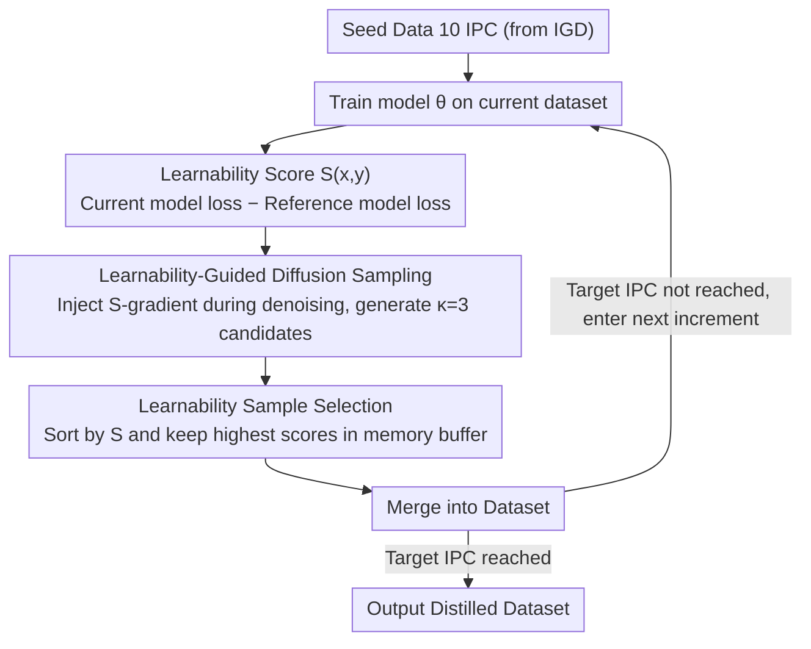

# Learnability-Guided Diffusion for Dataset Distillation

**Conference**: CVPR 2026  
**arXiv**: [2604.00519](https://arxiv.org/abs/2604.00519)  
**Code**: [https://jachansantiago.github.io/learnability-guided-distillation/](https://jachansantiago.github.io/learnability-guided-distillation/)  
**Area**: Image Generation / Dataset Distillation  
**Keywords**: Dataset Distillation, Learnability Guidance, Diffusion Models, Incremental Synthesis, Redundancy Analysis

## TL;DR

Proposes LGD, a learnability-driven incremental dataset distillation framework that constructs the distilled dataset in stages. Each stage generates training samples that are complementary rather than redundant by conditioning on the current model state. By injecting learnability gradient guidance during diffusion sampling, it reduces inter-sample information redundancy (which is 80-90% in existing methods) by 39.1%. It achieves 60.1% accuracy on ImageNet-1K (50 IPC) and 87.2% on ImageNette (100 IPC).

## Background & Motivation

**Background**: Dataset distillation aims to synthesize a small alternative dataset from a large one, enabling models trained on it to achieve performance comparable to those trained on full data. Early methods utilized pixel-level optimization to match training trajectories (gradient matching, trajectory matching), but these are computationally infeasible for high-resolution datasets. Recent methods (DiT, Minimax Diffusion, IGD, MGD3) leverage pre-trained diffusion models to synthesize distilled data, significantly reducing costs.

**Limitations of Prior Work**: The core issue with existing methods is **severe sample redundancy**. If a 50 IPC distilled dataset is split into five disjoint 10 IPC subsets, any single subset can capture 80-90% of the training signals of the others. This redundancy stems from: (1) methods optimizing for visual diversity (DiT) ignore training signal similarity; (2) methods matching average training trajectories (IGD) force all samples to converge to similar gradient profiles—producing "medium-strength" gradients that are sub-optimal for any specific training stage.

**Key Challenge**: Model training is naturally phased—early stages require strong gradients to establish coarse features, while later stages require fine-grained gradients to polish details. A single sample cannot simultaneously satisfy both needs, yet optimizing for "average" trajectories produces these compromised samples rather than stage-specific ones.

**Key Insight**: Reframe distillation as a **sequential learning problem**. Given a partially distilled dataset and a model trained on it, generate new samples that maximize the marginal learning gain.

**Core Idea**: Learnability guidance—evaluate "what the current model can learn from a sample" at each stage (high loss for the current model but low loss for a reference model indicates a sample is learnable rather than noise). During diffusion sampling, learnability score gradients are injected to guide the generation toward such samples.

## Method

### Overall Architecture

The paper addresses a specific pain point: existing distillation methods generate all samples at once, leading to high information redundancy. LGD shifts from "one-time generation" to "stage-wise incremental generation," where newly generated samples are aware of existing ones and focus on what the current model lacks.

The process is an incremental loop: the target dataset $\mathcal{D}$ is divided into $K$ increments $\mathcal{I}_1, \dots, \mathcal{I}_K$. Starting from seed data (e.g., IGD’s 10 IPC), a model $\theta_0$ is trained to convergence. The diffusion model then performs sampling steered by "learnability" gradients to generate candidates. These candidates are ranked by learnability, and the most valuable ones are merged into the dataset. The model is then retrained on the augmented set for the next round. Since each generation is conditioned on the **current model state**, the dataset grows from easy to hard, effectively forming an automated curriculum.

### Key Designs

**1. Learnability Score: Quantifying Sample Value**

To determine if a candidate sample is valuable to the current model, LGD uses a score that maximizes current model loss (not yet learned) while subtracting a reference model's loss as regularization:

$$\mathcal{S}(x,y) = \mathcal{L}(\theta_{i-1}, x, y) - \omega \cdot \mathcal{L}(\theta^*, x, y)$$

where $\theta_{i-1}$ is the current incremental model and $\theta^*$ is a reference model trained on the full dataset. Subtracting the $\theta^*$ term ensures that samples which are difficult even for a "well-informed" reference model (likely noise) are penalized. High $\mathcal{S}$ specifically identifies a **learnable knowledge gap**.

**2. Learnability-Guided Diffusion Sampling: Steering toward High-Value Regions**

To ensure the diffusion model generates high-score samples, LGD adapts classifier guidance by replacing category probability gradients with learnability score gradients. The noise prediction at each step is modified:

$$\tilde{\epsilon}_\phi(x_t, t, y) = \epsilon_\phi(x_t, t, y) + \lambda \cdot \rho_t \cdot \nabla_{x_t} \mathcal{S}(x_t, y)$$

The scaling factor $\rho_t = \sqrt{1-\bar{\alpha}_t}\,\dfrac{\|\epsilon_\phi\|}{\|\nabla_{x_t}\mathcal{S}\|}$ normalizes the guidance magnitude across different noise levels. Guidance is only applied during intermediate time steps ($t \in [10, 45]$ out of 50) to influence content without destroying global structure or fine details.

**3. Learnability Sample Selection: Final Filtering**

Despite guided sampling, stochasticity may still yield low-learnability samples. LGD generates $\kappa = 3$ candidates for each slot and retains only the one with the highest learnability score. Candidates are selected and written into a memory buffer $\mathcal{M}^c$, where diversity guidance (cosine distance repulsion) ensures new samples are distinct from previously generated ones.

### Loss & Training

The optimization objective for each increment aims to maximize marginal learning gain:

$$\mathcal{I}_i^* = \arg\max_{\mathcal{I}} \left[ \mathcal{L}(\theta_{i-1}, \mathcal{I}) - \mathcal{L}(\theta^*, \mathcal{I}) \right]$$

Key hyperparameters include guidance scale $\lambda = 15$, reference weight $\omega = 0.5$, candidate ratio $\kappa = 3$, and deviation guidance $\gamma = 50$. Seed data follows IGD's 10 IPC, with 10 IPC added per stage.

## Key Experimental Results

### Main Results

| Dataset | IPC | Model | Ours (LGD) | IGD | MGD3 | DiT | Gain (vs IGD) |
|--------|-----|------|---------|-----|------|-----|-------------|
| ImageNette | 50 | ResNet-18 | 85.0% | 81.0% | 81.5% | 75.2% | +4.0% |
| ImageNette | 100 | ResNet-18 | 86.9% | 84.4% | 85.6% | 77.8% | +2.5% |
| ImageNette | 100 | ConvNet-6 | 87.2% | 84.5% | 86.5% | 78.2% | +2.7% |
| ImageWoof | 100 | ResNet-18 | 72.9% | 70.6% | 71.3% | 62.3% | +2.3% |
| ImageNet-1K | 50 | ResNet-18 | 60.1% | 59.8% | 60.2% | 52.9% | +0.3% |

### Ablation Study (Redundancy Analysis)

| Method | Cross-increment Avg Accuracy | Redundancy Level | Description |
|------|----------------|---------|------|
| DiT | 94.7% | Highest | Subsets are almost perfectly interchangeable |
| IGD | 87.1% | High | Slight improvement but still significant overlap |
| LGD (Ours) | 57.65% | Significantly Reduced | Increments are complementary; redundancy down 39.1% |

### Key Findings
- **High Redundancy**: Existing methods like DiT show cross-subset accuracies of 91-98%, signifying extreme redundancy.
- **New Information**: LGD shows larger loss spikes at each incremental stage (Avg $\Delta=0.20$ vs DiT's $0.06$), indicating the addition of truly new knowledge.
- **Steady Improvement**: LGD performance scales consistently from 64.1% (10 IPC) to 89.1% (100 IPC), whereas DiT stagnates after 50 IPC.
- **Distribution Quality**: Visualizations show LGD samples are more "informative" and "harder," with the lowest JS divergence to the original data distribution.
- **Generalization**: Data distilled on ResNet-AP-10 (50 IPC) achieves 85.0% when tested on ResNet-18.

## Highlights & Insights
- **Redundancy Diagnostic**: The incremental partitioning and cross-evaluation methodology serves as a general diagnostic tool for analyzing any distillation method's information distribution.
- **Distillation as Curriculum**: Automatically forms an easy-to-hard curriculum where "difficulty" is defined by the model's evolving state rather than predefined heuristics.
- **Learnable Knowledge Gap**: The concept of targeting samples with high current loss and low reference loss effectively filters out redundant "knowns" and unlearnable "noise."
- **Empirical Revelation**: The discovery of 80-90% redundancy in existing SOTA methods highlights the fundamental bottleneck in the field.

## Limitations & Future Work
- **Large-scale Performance**: On ImageNet-1K, LGD (60.1%) performs similarly to MGD3 (60.2%), suggesting incremental advantages diminish on very large datasets.
- **Overhead**: Requires a pre-trained reference model $\theta^*$, increasing preparation costs.
- **Efficiency**: Incremental generation is slower than one-time generation due to repeated model inference and gradient-guided sampling.
- **Seed Dependency**: Relies on the quality of the initial 10 IPC seed data.
- **Hyperparameter Selection**: Optimal configuration of the number of increments $K$ and IPC per increment remains dataset-dependent.

## Related Work & Insights
- **vs IGD (Influence-Guided Diffusion)**: IGD matches average training gradients, leading to similar profiles; LGD conditions on the specific state to ensure complementarity.
- **vs Minimax Diffusion**: Minimax balances diversity and representativeness but ignores training signal redundancy; LGD directly optimizes marginal info gain.
- **Insight**: Data efficiency is driven not by individual sample quality, but by inter-sample information complementarity. Evaluation should focus on marginal rather than average gain.

## Rating
- **Novelty**: ⭐⭐⭐⭐⭐ (Reframing distillation as incremental learning is highly original)
- **Experimental Thoroughness**: ⭐⭐⭐⭐ (In-depth redundancy analysis; less significant gains on ImageNet-1K)
- **Writing Quality**: ⭐⭐⭐⭐⭐ (Excellent motivation and precise definitions)
- **Value**: ⭐⭐⭐⭐ (The diagnostic framework is highly valuable for future research)

## Related Papers

- [\[ICCV 2025\] CaO2: Rectifying Inconsistencies in Diffusion-Based Dataset Distillation](../../ICCV2025/image_generation/cao2_rectifying_inconsistencies_in_diffusion-based_dataset_distillation.md)
- [\[ICML 2025\] Taming Diffusion for Dataset Distillation with High Representativeness (D³HR)](../../ICML2025/image_generation/taming_diffusion_for_dataset_distillation_with_high_representativeness.md)
- [\[CVPR 2026\] Pico-Banana-400K: A Large-Scale Dataset for Text-Guided Image Editing](pico-banana-400k_a_large-scale_dataset_for_text-guided_image_editing.md)
- [\[CVPR 2026\] RecTok: Reconstruction Distillation along Rectified Flow](rectok_reconstruction_distillation_along_rectified_flow.md)
- [\[CVPR 2026\] Pluggable Pruning with Contiguous Layer Distillation for Diffusion Transformers](pluggable_pruning_with_contiguous_layer_distillation_for_diffusion_transformers.md)

<!-- RELATED:END -->

<!-- RELATED:START -->

## Related Papers

- [\[ICCV 2025\] CaO2: Rectifying Inconsistencies in Diffusion-Based Dataset Distillation](../../ICCV2025/image_generation/cao2_rectifying_inconsistencies_in_diffusion-based_dataset_distillation.md)
- [\[ICML 2025\] Taming Diffusion for Dataset Distillation with High Representativeness (D³HR)](../../ICML2025/image_generation/taming_diffusion_for_dataset_distillation_with_high_representativeness.md)
- [\[CVPR 2026\] Pico-Banana-400K: A Large-Scale Dataset for Text-Guided Image Editing](pico-banana-400k_a_large-scale_dataset_for_text-guided_image_editing.md)
- [\[CVPR 2026\] RecTok: Reconstruction Distillation along Rectified Flow](rectok_reconstruction_distillation_along_rectified_flow.md)
- [\[CVPR 2026\] Pluggable Pruning with Contiguous Layer Distillation for Diffusion Transformers](pluggable_pruning_with_contiguous_layer_distillation_for_diffusion_transformers.md)

<!-- RELATED:END -->
