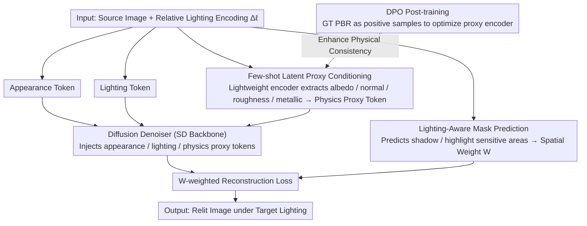

# Learning Latent Proxies for Controllable Single-Image Relighting

**Conference**: CVPR 2026  
**arXiv**: [2603.15555](https://arxiv.org/abs/2603.15555)  
**Code**: None  
**Area**: Image Relighting / Diffusion Models  
**Keywords**: Single-image Relighting, PBR Priors, Latent Proxy Encoder, DPO Post-training, Lighting-aware Mask

## TL;DR

LightCtrl is a diffusion-based framework for single-image relighting. It utilizes a few-shot latent proxy encoder to provide lightweight material-geometry priors, a lighting-aware mask to guide spatially selective denoising, and DPO post-training to enhance physical consistency. This enables precise, continuous control over lighting direction, intensity, and color temperature, outperforming existing methods on both synthetic and real-world scenes.

## Background & Motivation

Single-image relighting is an ill-posed problem: shadows, highlights, and diffuse reflections depend on unobservable geometry and materials, and minor lighting changes can lead to large, non-linear alterations in appearance. Existing methods face distinct limitations:

**Intrinsic/G-buffer methods** (e.g., Neural LightRig) require dense PBR supervision, which is fragile and expensive to obtain.

**Pure latent methods** (e.g., LBM) lack physical grounding, leading to unreliable direction and intensity control.

**End-to-end methods** (e.g., IC-Light) perform well on portraits but lack geometric awareness, making them difficult to generalize to complex scenes.

**Key Insight**: Precise relighting does not require full intrinsic decomposition; sparse but physically meaningful cues—indicating **where** lighting should change and **how materials** respond—are sufficient to guide the diffusion model. This motivates the design of a lightweight proxy + mask approach.

## Method

### Overall Architecture

LightCtrl addresses the tension between the "lack of physical information" and "controllability" in single-image relighting. It avoids the heavy burden of dense PBR decomposition used in intrinsic methods while retaining physical constraints absent in pure latent methods. The framework incorporates three sets of lightweight cues into a Stable Diffusion backbone.

**Mechanism**: Given a source image $x_s^{\ell_s}$ and a relative lighting encoding $\Delta\ell$ (differences in direction, intensity, and temperature), the network generates the result under target lighting $\hat{x}_s^{\ell_t} = f_\theta(x_s^{\ell_s}, \Delta\ell)$. The source image is encoded into an appearance token $t_{\mathrm{img}}$, while $\Delta\ell$ is encoded into a lighting token $t_{\mathrm{light}}$. A separate lightweight encoder extracts a physics proxy token $t_{\mathrm{phys}}$ from the source image to provide material-geometry priors. These three tokens are injected into the denoiser. Finally, a lighting-aware spatial weight map $W$ is used to weight the reconstruction loss:

$$\mathcal{L}_{\mathrm{diff}} = \|W \odot (\epsilon - \epsilon_\theta(z_t, t \mid t_{\mathrm{img}}, t_{\mathrm{light}}, t_{\mathrm{phys}}))\|_2^2$$

### Key Designs

**1. Few-shot Latent Proxy Conditioning: Replacing dense intrinsic decomposition with "sufficient" material-geometry hints**

Pure latent methods fail to control lighting direction and intensity because they lack knowledge of scene geometry and materials. The compromise here is a lightweight encoder-decoder $E_\phi$ that predicts a compact set of latent proxies $\hat{\mathcal{B}} = \{a, n, r, m\} \in \mathbb{R}^{H \times W \times 8}$ (albedo, normals, roughness, metallic) from the source image. This encoder is supervised only on a small number of samples with PBR annotations using a combined loss:

$$\mathcal{L}_{\text{proxy}} = \lambda_a\|a-\hat{a}\|_1 + \lambda_n(1-\langle n, \hat{n}\rangle) + \lambda_r\|r-\hat{r}\|_1 + \lambda_m \mathrm{BCE}(m, \hat{m})$$

The goal is not pixel-perfect PBR reconstruction. These proxy maps are spatially pooled and projected into a condition token $t_{\text{proxy}} = f_{\text{proj}}(E_\phi(x_s^{\ell_s})) \in \mathbb{R}^{1 \times 768}$. This provides hints (e.g., "this area is metallic, that area is rough") to constrain the denoising trajectory rather than serving as an exact supervision signal. This provides a physical handle for the diffusion model while reducing PBR annotation requirements to a few-shot level.

**2. Lighting-Aware Mask Prediction: Concentrating computation on pixels that actually change**

When lighting changes, only a small portion of the image—such as shadow boundaries and highlights—undergoes significant alteration. Optimizing all pixels equally can submerge details in sensitive areas. Ours derives a ground-truth soft mask from the luminance difference between source-target pairs, normalizing a weighted term of log-luminance difference and a robust difference term:

$$M_{\mathrm{gt}} = \mathcal{N}\left(\alpha|\log Y_t - \log Y_s| + (1-\alpha)D_{\mathrm{robust}}(Y_s, Y_t)\right)$$

Since the target image is unavailable during inference, a lightweight predictor $M_\theta = m_\theta(x_s^{\ell_s}, \Delta\ell)$ is trained to predict these changes using the source image and lighting parameters (aligned via BCE + Dice loss). The predicted mask is converted into a spatial weight map $W$ to modulate the noise reconstruction loss, directing the denoiser to focus on lighting-sensitive regions.

**3. DPO Post-training for Latent Encoders: Filling the gaps in sparse PBR supervision**

The proxy encoder, trained on few-shot PBR data, may struggle with physical consistency. Ours adopts Direct Preference Optimization (DPO) from RLHF: keeping the diffusion backbone frozen, preference post-training is performed on the PBR encoder $E_\phi$. GT PBR maps are treated as positive samples $y_{\text{pos}}$, and current encoder outputs as negative samples $y_{\text{neg}}$. A physical reward $\Delta r = r(y_{\text{pos}}) - r(y_{\text{neg}})$ is defined based on L1/angular/BCE metrics. A frozen reference encoder provides a stable likelihood baseline. This forces the encoder to converge toward physically compliant outputs without additional annotations.

### Loss & Training

- The backbone is fully fine-tuned on ScaLight to learn generalizable light transport priors.
- The Proxy branch undergoes few-shot training followed by DPO post-training for stability.
- The final diffusion objective uses lighting-aware spatial weighting $W$.
- The **ScaLight** dataset is constructed: 300k+ controllable 3D objects, 1M+ rendered images with systematic variations in lighting direction, intensity, and temperature, including full camera-light metadata.

## Key Experimental Results

### Main Results

Evaluated on the ScaLight test set across three types of lighting variations:

| Method | Condition Type | Temp RMSE↓/PSNR↑ | Pos RMSE↓/PSNR↑ | Energy RMSE↓/PSNR↑ |
|------|---------|-----------------|-----------------|-------------------|
| IC-Light | text | 0.397/8.21 | 0.375/8.65 | 0.380/8.63 |
| LBM | image | 0.064/27.8 | 0.084/23.1 | 0.073/25.3 |
| LumiNet | image | 0.172/15.8 | 0.146/17.8 | 0.164/16.2 |
| **Ours (full)** | **Light Info** | **0.053/30.2** | **0.074/25.6** | **0.083/27.1** |

Scene-level (MIIW) evaluation:

| Method | RMSE↓ | SSIM↑ | PSNR↑ |
|------|-------|-------|-------|
| IC-Light | 0.413 | 0.337 | 7.94 |
| LumiNet | 0.139 | 0.904 | 17.20 |
| **Ours** | 0.167 | 0.655 | **18.30** |

User Preference Study (N=35): 55.73% for scenes, **81.45%** for objects.

### Ablation Study

| Configuration | Temp RMSE↓ | Pos PSNR↑ | Energy PSNR↑ |
|------|-----------|-----------|-------------|
| w/o proxy | 0.062 | 22.4 | 18.0 |
| w/o mask | 0.073 | 20.5 | 23.2 |
| w/o DPO | 0.114 | 19.8 | 17.5 |
| **Full** | **0.053** | **25.6** | **27.1** |

### Key Findings

- DPO post-training identifies as the most critical component across all lighting types (RMSE doubles without it).
- Lighting-aware masks are essential for lighting direction changes (shadow boundary accuracy).
- User preference reached 81.45% at the object level, significantly exceeding IC-Light (11.45%) and LumiNet (4.3%).

## Highlights & Insights

- **"Middle Path" Philosophy**: Does not pursue full intrinsic decomposition nor abandon physical foundations; instead uses sparse physical cues to constrain diffusion.
- **Introduction of DPO for PBR**: Applying the RLHF paradigm to intrinsic estimation is a novel cross-domain application.
- **ScaLight Dataset**: 300k objects with systematic lighting parameters fill a void in controllable object-level relighting data.

## Limitations & Future Work

- Scene-level performance still lags behind object-level results; complex global light transport (long-distance shadows) remains a weakness.
- High-frequency geometry and strong specularities are prone to over-smoothing due to limited high-frequency constraints in the proxy.
- Training is primarily on synthetic data; real-world generalization relies on fine-tuning.

## Related Work & Insights

- **IC-Light**: Strong for portraits but lacks physical modeling; ours complements this with physical priors.
- **Neural LightRig**: Uses a dense G-buffer pipeline; ours replaces this with a few-shot proxy.
- **LBM**: Latent space interpolation with weak physical grounding; ours enhances controllability via proxy+mask.

## Rating

- **Novelty**: ★★★★☆ — The combination of latent proxy and DPO post-training is innovative.
- **Technical Depth**: ★★★★☆ — Complementary three-module design with thorough ablation validation.
- **Experimental Thoroughness**: ★★★★★ — Comprehensive evaluation across synthetic, real-world, and user studies.
- **Value**: ★★★★☆ — Practical continuous lighting control, though complex scenes require further improvement.

<!-- RELATED:START -->

## Related Papers

- [\[CVPR 2026\] SplitFlux: Learning to Decouple Content and Style from a Single Image](splitflux_learning_to_decouple_content_and_style_from_a_single_image.md)
- [\[CVPR 2026\] A Temporal and Content Co-Awareness Latent Diffusion for Controllable Hand Image Generation](a_temporal_and_content_co-awareness_latent_diffusion_for_controllable_hand_image.md)
- [\[CVPR 2026\] PhyCo: Learning Controllable Physical Priors for Generative Motion](phyco_learning_controllable_physical_priors_for_generative_motion.md)
- [\[CVPR 2025\] ScribbleLight: Single Image Indoor Relighting with Scribbles](../../CVPR2025/image_generation/scribblelight_single_image_indoor_relighting_with_scribbles.md)
- [\[CVPR 2026\] Efficient and Training-Free Single-Image Diffusion Models](efficient_and_training-free_single-image_diffusion_models.md)

<!-- RELATED:END -->
