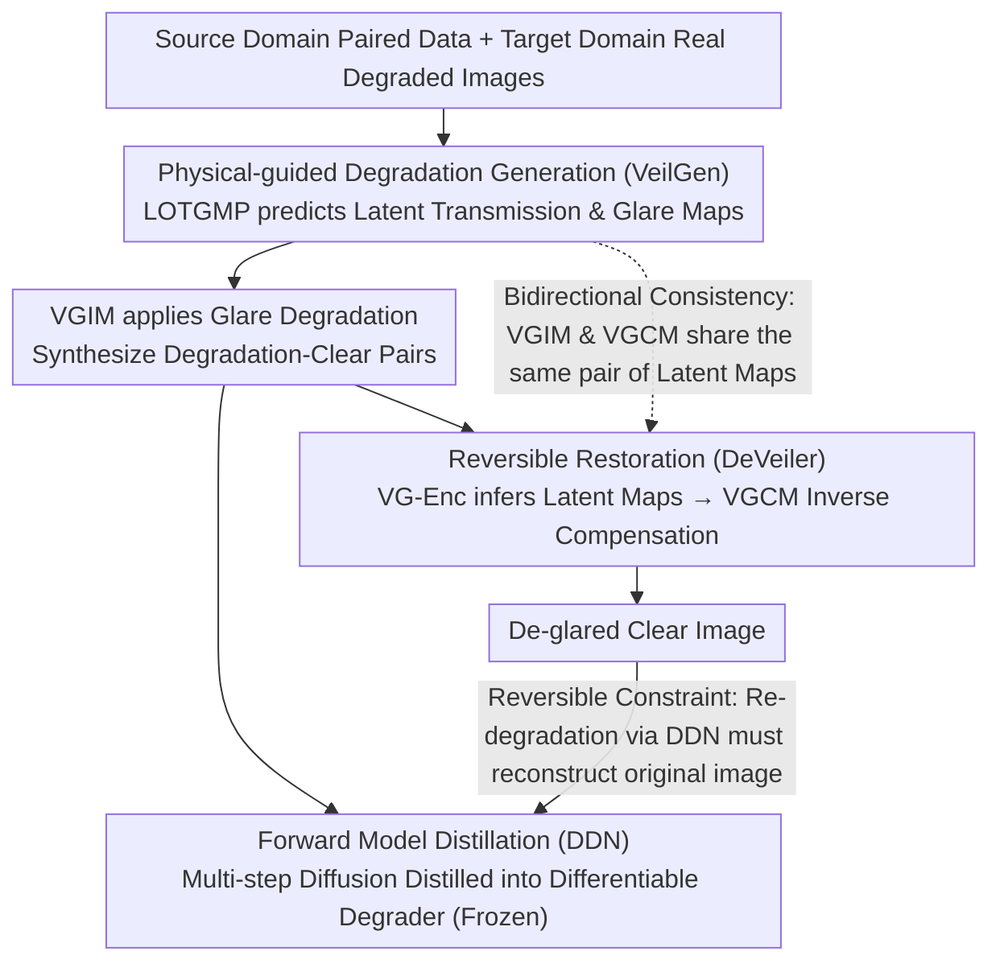

# Learning Latent Transmission and Glare Maps for Lens Veiling Glare Removal

**Conference**: CVPR 2026  
**arXiv**: [2511.17353](https://arxiv.org/abs/2511.17353)  
**Code**: [GitHub](https://github.com/XiaolongQian/DeVeiler)  
**Area**: Image Generation  
**Keywords**: veiling glare removal, simplified optical systems, Stable Diffusion, physical-guided generation, reversible restoration

## TL;DR

This paper proposes the VeilGen + DeVeiler framework, which employs a physical-guided Stable Diffusion generative model to learn latent transmission and glare maps for synthesizing realistic compound degradation training data. By training a restoration network with reversible constraints, it achieves joint removal of aberrations and veiling glare in simplified optical systems.

## Background & Motivation

1. **Compound Degradation in Simplified Optical Systems**: Compact optical systems, such as singlet lenses and metalenses, suffer not only from aberration blur but also from veiling glare caused by non-ideal optical surfaces and coatings, leading to a global loss of contrast. Existing Computational Aberration Correction (CAC) methods cannot handle this compound degradation.
2. **Lack of Real Paired Data**: Physically accurate glare simulation requires full optomechanical models and non-sequential ray tracing, which is computationally expensive and prohibits large-scale data generation.
3. **Inapplicability of Existing Methods**: Dehazing methods are based on atmospheric scattering models (depth-dependent), which are incompatible with internal lens scattering (depth-independent). Lens flare removal methods target structured artifacts (bright spots/streaks) and fail to address diffuse veiling glare.
4. **Black-box Issue of Generative Models**: Existing SD-based degradation generation methods lack physical constraints, leading to unstable generation quality and a lack of meaningful guidance signals for restoration networks.

## Method

### Overall Architecture

To address the compound degradation of aberration blur and veiling glare in simplified lenses, the primary challenge is the acquisition of real-world degraded-clear image pairs. The authors' Strategy is to employ a physically-constrained generator to "create" physically plausible degraded images, which are then used to train a restoration network. The pipeline consists of three stages: first, using VeilGen to embed scattering physics into Stable Diffusion for paired data generation; second, distilling the forward degradation process into a lightweight differentiable degrader (DDN); and finally, training the restoration network (DeVeiler) while using the frozen DDN to constrain "restoration" and "degradation" as inverse operations.

The modeling is based on a physical model that decomposes degradation into aberration and glare:

$$I_{de}^{p} = \underbrace{(I_c^{p} \otimes K^{p})}_{I_{ab}^{p}} \cdot T^{p} + I_g^{p}$$

where $K^p$ is the local Point Spread Function (PSF), $T^p$ is the transmission map describing contrast decay, and $I_g^p$ is the glare map. The restoration goal is to recover $I_c$ from the observation $I_{de}$, which is a highly ill-posed blind inverse problem. Learning and reusing the physical quantities $T^p$ and $I_g^p$ is the core mechanism of the proposed method.

### Key Designs

**1. Physical-guided Degradation Generation (LOTGMP + VGIM): Encoding Scattering Physics into Diffusion Models**

Since standard SD-based degradation generation is a black box, it lacks stability and meaningful guidance. The authors explicitly embed the transmission and glare from the degradation model into the diffusion process. Two modules accomplish this: the Latent Optical Transmission and Glare Map Predictor (LOTGMP) predicts latent maps $c_{vg} = (z_{trans}, z_{glare})$ (representing transmission and glare in latent space) from noise $z_t$, target degradation latent $z_{de}^{\mathcal{T}}$, and timestep $t$. The Veiling Glare Insertion Module (VGIM) then modulates features using these latent maps to simulate forward degradation. A hybrid training strategy is used: source domain data (paired but glare-free screen-captured data) is mapped to $(\mathbf{1}, \mathbf{0})$, while target domain data (real compound degradation without pairs) is predicted by LOTGMP. This allows the generator to learn aberration correspondences while migrating the statistical distribution of real glare.

**2. Forward Model Distillation (DDN): Compressing Multi-step Diffusion into a Differentiable Degrader**

VeilGen requires multi-step diffusion sampling, which is too computationally expensive for the restoration network's training loop. The authors distill it into a lightweight Distilled Degradation Network (DDN), which approximates VeilGen's output given $(I_c, c_{vg})$. Once distilled, DDN is frozen and serves as a cheap, differentiable, single-forward degradation operator. This is a prerequisite for the reversible constraint: without it, the "re-degradation for alignment" supervision cannot be invoked frequently during training.

**3. Reversible Restoration (VG-Enc + VGCM + Reversible Constraint): Learning Restoration as the Inverse of Degradation**

DeVeiler explicitly learns the inverse process of degradation rather than a black-box mapping. It uses a Glare Encoder (VG-Enc) to infer latent maps $\hat{c}_{vg}$ from degraded images and a Glare Compensation Module (VGCM) for inverse feature modulation. VGCM and the generation-side VGIM are designed to be structurally symmetric. The key reversible constraint is: passing the restored image $I_c$ and predicted latent maps $\hat{c}_{vg}$ into the frozen DDN for re-degradation, requiring the result to reconstruct the original observation $I_{de}$. This cycle locks "restoration" and "degradation" as an inverse pair, forcing the network to understand the degradation process rather than memorizing statistical shortcuts. A byproduct is that $\hat{c}_{vg}$ becomes physically interpretable.

**4. Bidirectional Consistency: Necessity of Joint Forward-Inverse Latent Maps**

The authors discovered that if the latent maps predicted by LOTGMP are only used on one side (e.g., only in VGCM during restoration), performance decreases due to domain mismatch between generation and restoration. Only by involving the same latent maps in both generation (VGIM) and restoration (VGCM) can the symmetric structures calibrate feature semantics, effectively utilizing physical priors. This mechanism accounts for a +0.82 dB improvement in the ablation study.

### Loss & Training

The VeilGen generation loss is weighted by domain:

$$\mathcal{L}_{gen} = p \, \mathcal{L}_{\mathcal{S}} + (1-p) \, \mathcal{L}_{\mathcal{T}}$$

where $p = 0.3$ balances the source domain $\mathcal{S}$ and target domain $\mathcal{T}$. DDN uses L1 distillation to align with VeilGen's output: $\mathcal{L}_{distill} = \|DDN(I_c, c_{vg}) - VeilGen(I_c, c_{vg})\|_1$. The reversible constraint for restoration is $\mathcal{L}_{rev} = \|DDN(I_c, \hat{c}_{vg}) - I_{de}\|_1$, combined with reconstruction loss for the total objective: $\mathcal{L}_{total} = \mathcal{L}_{rec} + \lambda_{rev} \mathcal{L}_{rev}$. DeVeiler is trained in two phases: Phase I pre-trains on the source domain for basic aberration correction, while Phase II fine-tunes on hybrid data with VeilGen-synthesized pairs.

## Key Experimental Results

### Main Results: Screen-Compound Domain (Full-reference)

| Method | Type | Screen-SL PSNR↑ | SSIM↑ | LPIPS↓ | Screen-MRL PSNR↑ | SSIM↑ | LPIPS↓ |
|------|------|---------|-------|--------|----------|-------|--------|
| SwinIR | Single-deg | 18.18 | 0.686 | 0.298 | 19.34 | 0.722 | 0.354 |
| NAFNet | Single-deg | 18.75 | 0.684 | 0.363 | 18.91 | 0.723 | 0.377 |
| DiffBIR | Single-deg | 17.95 | 0.621 | 0.398 | 18.70 | 0.625 | 0.412 |
| SwinIR+Flare7K++ | Cascade | 21.67 | 0.723 | 0.297 | 20.74 | 0.745 | 0.336 |
| QDMR | Domain Adapt | 18.45 | 0.681 | 0.291 | 20.67 | 0.725 | 0.315 |
| **Ours (DeVeiler)** | **Domain Adapt** | **22.38** | **0.729** | **0.261** | **21.57** | **0.746** | **0.301** |

Ours achieves a +0.71 dB PSNR Gain over the strongest competitor (SwinIR+Flare7K++) on Screen-SL, with a 12.1% improvement in LPIPS.

### Main Results: Realworld-Compound Domain (No-reference)

| Method | Real-SL (CLIPIQA↑/Q-Align↑/NIQE↓) | Real-MRL (CLIPIQA↑/Q-Align↑/NIQE↓) |
|------|-------------------------------------|--------------------------------------|
| SwinIR | 0.424 / 3.518 / 5.710 | 0.374 / 3.191 / 6.696 |
| SwinIR+DiffDehaze | 0.573 / 3.679 / 6.141 | 0.437 / 3.542 / 5.230 |
| QDMR | 0.405 / 3.864 / 4.773 | 0.376 / 3.337 / 5.509 |
| **Ours (DeVeiler)** | **0.607** / **3.987** / **4.448** | **0.440** / **3.586** / **5.296** |

In real-world scenarios without ground truth, DeVeiler maintains leadership across most metrics, verifying its generalization capability.

### Ablation Study

| Configuration | PSNR↑ | SSIM↑ | LPIPS↓ | Description |
|------|-------|-------|--------|------|
| w/o LOTGMP | 20.82 | 0.708 | 0.273 | No physical prior guidance |
| LOTGMP w/o SD Prior | 21.39 | 0.708 | 0.268 | Lacks diffusion context |
| Full VeilGen | 21.56 | 0.712 | 0.264 | SD prior is crucial for quality |
| Unidirectional VGCM | 20.83 | 0.712 | 0.264 | No gain due to domain mismatch |
| **Bidirectional VGIM/VGCM** | **22.38** | **0.729** | **0.261** | Reversible constraint yields +0.82 dB |

**Key Finding**: Unidirectional use of latent maps (via concatenation or VGCM only) is ineffective or even harmful. Effective utilization of physical priors requires bidirectional consistency constraints through symmetric VGIM/VGCM structures.

## Highlights & Insights

- **Physical-guided vs. Black-box Generation**: Explicitly embedding transmission and glare into the SD generation process ensures synthesized data is physically meaningful.
- **Sophisticated Reversible Constraint Design**: Unifying restoration and degradation as mutual inverse operations via symmetric VGIM/VGCM structures and frozen DDN cycle consistency.
- **Strong Interpretability**: Features within VGCM can be visualized to verify the localization and suppression of low-transmission or high-glare regions.
- **High Practicality**: Validated on real singlet and metalense-refractive hybrid systems, covering applications in AR/VR and mobile photography.
- **Efficient Inference**: Compared to DiffBIR (66s) or DiffDehaze (92s), DeVeiler offers significantly lower inference latency.

## Limitations & Future Work

- **Dependency on Paired Source Data**: The framework requires paired aberration-clear data from screen capture, making it inapplicable to purely unsupervised scenarios.
- **Degradation Coupling Assumption**: Modeling aberration and glare as sequential degradations may oversimplify complex physical processes like optical crosstalk.
- **Limited Data Scale**: The Screen-Compound test set consists of only 42/25 images; statistical significance requires larger-scale validation.
- **Distillation Error**: DDN distillation from VeilGen introduces approximation errors, potentially affecting coverage of extreme glare scenarios.

## Rating

- ⭐⭐⭐⭐ **Novelty**: The approach of embedding physical scattering into diffusion generation combined with reversible restoration is highly novel.
- ⭐⭐⭐⭐ **Value**: Directly addresses real-world pain points in AR/VR and mobile photography with acceptable inference speed.
- ⭐⭐⭐ **Experimental Thoroughness**: Extensive comparisons across two optical systems, though the test set size is relatively small.
- ⭐⭐⭐⭐ **Writing Quality**: Problem definition is clear, the three-stage framework is logical, and the ablation studies are convincing.

<!-- RELATED:START -->

## Related Papers

- [\[CVPR 2026\] Learning Latent Proxies for Controllable Single-Image Relighting](learning_latent_proxies_for_controllable_single-image_relighting.md)
- [\[CVPR 2026\] Precise Object and Effect Removal with Adaptive Target-Aware Attention](precise_object_and_effect_removal_with_adaptive_target-aware_attention.md)
- [\[CVPR 2026\] Object-WIPER: Training-Free Object and Associated Effect Removal in Videos](object-wiper_training-free_object_and_associated_effect_removal_in_videos.md)
- [\[CVPR 2026\] EffectErase: Joint Video Object Removal and Insertion for High-Quality Effect Erasing](effecterase_joint_video_object_removal_and_insertion_for_high-quality_effect_era.md)
- [\[CVPR 2026\] Towards Robust Content Watermarking Against Removal and Forgery Attacks](towards_robust_content_watermarking_against_removal_and_forgery_attacks.md)

<!-- RELATED:END -->
