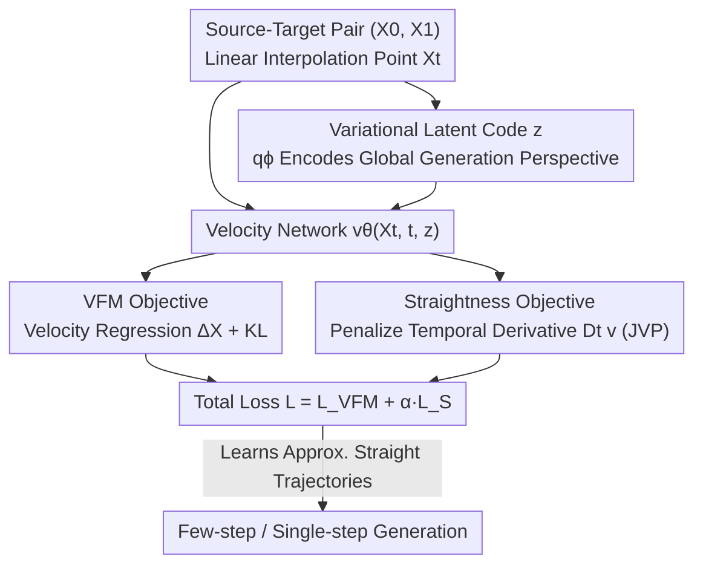

# Learning Straight Flows: Variational Flow Matching for Efficient Generation

**Conference**: CVPR 2026  
**Paper**: [CVF Open Access](https://openaccess.thecvf.com/content/CVPR2026/html/Ma_Learning_Straight_Flows_Variational_Flow_Matching_for_Efficient_Generation_CVPR_2026_paper.html)  
**Code**: None  
**Area**: Image Generation / Diffusion and Flow Matching  
**Keywords**: Flow Matching, Straight Trajectories, Variational Latent Code, Few-step Generation, ODE Sampling

## TL;DR
To address the issue where Flow Matching (FM) suffers from intersections of interpolation trajectories due to independent coupling, leading to curved generation paths and requiring many ODE integration steps, this paper proposes **Straight Variational Flow Matching (S-VFM)**. By injecting a VAE-coded variational latent code $z$ ("global generation perspective") into the velocity field to resolve directional ambiguity at intersection points, and leveraging a "straightness objective" that penalizes the temporal derivative of the velocity field along the trajectory, S-VFM learns approximately straight paths in an end-to-end manner. This achieves competitive or even superior FID scores with significantly fewer NFEs on CIFAR-10 and ImageNet 256.

## Background & Motivation

**Background**: Flow Matching (FM) defines a velocity field $v^X(x,t)$ to guide an ODE $\dot X_t = v^X(X_t,t)$ to transport a simple prior (Gaussian noise) to a complex data distribution. During training, linear interpolation $X_t=(1-t)X_0+tX_1$ is used as the target trajectory, and the loss function regresses the network velocity to the conditional velocity $\Delta^X=X_1-X_0$.

**Limitations of Prior Work**: Although linear interpolation is used in training, the actual **generation trajectories learned by FM are curved**. Curved trajectories lead to large integration errors in single-step Euler methods, requiring many ODE steps to maintain generation quality, which compromises efficiency. Three main approaches exist to 'straighten' the trajectories—modifying coupling strategies to reduce intersections, Rectified Flow with iterative multi-round distillation to approximate optimal transport, and Consistency/Mean-Velocity models enforcing temporal consistency. However, these methods are generally hindered by discrete approximation errors, training instability, and convergence difficulties. Furthermore, distillation-based methods require multiple rounds of training, suffer from error accumulation, and the final models rarely outperform the initial directly trained versions.

**Key Challenge**: This paper uncovers an overlooked, **fundamental contradiction**: the **independent coupling** $\rho(x_0,x_1)=\rho_0(x_0)\rho_1(x_1)$ used by FM naturally causes a large number of linear interpolations to **intersect** at some $X_t$. At these intersection points, the marginal velocity $v^X(x,t)=\mathbb{E}[\Delta^X\mid X_t=x]$ is an average of several conflicting directions; thus, the non-intersection functional $V\big((X_0,X_1)\big)>0$. The paper mathematically proves: straight trajectory $\Leftrightarrow V=0 \Leftrightarrow$ the temporal derivative of the velocity field along the trajectory $D_t v^X=0$. In other words, **as long as the independent coupling structure is maintained, any attempt to directly learn straight trajectories is self-contradictory**—this is the root cause of instability and hard convergence in previous methods.

**Goal / Key Insight**: Instead of trying to force straight lines under the "inevitable intersection of independent coupling" framework, it is better to **equip the model with the ability to resolve the correct path direction even at intersection points**. The authors observe that FM is a Markovian process, predicting velocity step-by-step solely based on the current $X_{t_i}$ without a "global view" of the entire trajectory, which is the root cause of intersections and curvature.

**Core Idea**: Introduce a variational latent code $z$ to provide the velocity field with a "global generation perspective" for each source-target pair, allowing it to navigate the correct direction when interpolation lines intersect. Concurrently, a straightness objective is employed to penalize the temporal derivative of the velocity towards zero. By combining these two ideas, the ideal straight interpolation $Z$ and the FM trajectory $X$ become compatible under the independent coupling framework, enabling the end-to-end learning of approximately straight trajectories.

## Method

### Overall Architecture
S-VFM integrates Variational Flow Matching and a straightness objective into an end-to-end trainable generative framework. The inputs are source-target pairs $(X_0,X_1)$ and their linear interpolation points $X_t$. A posterior encoder $q_\phi$ compresses $(X_0,X_1,X_t,t)$ into a variational latent code $z$, which carries the global information of the overall trajectory's endpoints. The velocity network is modified to $v_\theta(X_t,t,z)$, taking the current point, time, and latent code as inputs. During training, two objectives are optimized in parallel: the VFM objective regresses the velocity to $\Delta^X$ while constraining the posterior of $z$ close to the prior via KL divergence, whereas the straightness objective computes the temporal derivative $D_t v$ along the trajectory using JVP and penalizes it towards zero. During inference, one only needs to sample a single $z$ from the prior $p(z)$ and reuse it throughout the entire generation path. Since the trajectories are nearly straight, high-quality images can be generated in just a few steps or even a single step.

### Key Designs

**1. Variational Latent Code $z$: Equipping the Velocity Field with a "Global Generation Perspective" to Resolve Directional Ambiguity at Intersections**

The trajectory of FM is curved because it only inspects the current sample at each step, having no awareness of "where to go" for the whole trajectory, and thus simply averages conflicting directions where multiple interpolation lines cross. S-VFM follows the concept of Variational Flow Matching, introducing a latent code encoded by a VAE:

$$q_\phi(z\mid X_0,X_1,X_t,t)=\mathcal{N}\big(z;\,\mu_\phi(\cdot),\,\sigma_\phi(\cdot)\big),$$

which explicitly incorporates the "global generation perspective" from the source and target endpoints $(X_0,X_1)$. The velocity field is upgraded to $v_\theta(X_t,t,z)$, and the training objective is:

$$\mathcal{L}_{\mathrm{VFM}}(\theta,\phi)=\mathbb{E}\big[\|v_\theta(X_t,t,z)-\Delta^X\|^2\big]+\beta\,D_{\mathrm{KL}}\big(q_\phi(z\mid\cdot)\,\|\,p(z)\big),$$

where the KL term pulls the posterior towards the prior $p(z)=\mathcal{N}(0,I)$, controlled by the intensity parameter $\beta$. The key is not to directly eliminate the intersections of $X$ (which is fundamentally impossible under independent coupling), but rather that with the global information provided by $z$, even if two interpolation lines cross at $X_t$, the model can untangle the directions based on "which target I am heading to this time". Because the latent code handles the intersection, the ideal straight interpolation $Z$ and the FM trajectory $X$ become **compatible** under independent coupling—representing a fundamental distinction from standard FM.

**2. Straightness Objective: Penalizing the Temporal Derivative of the Velocity Field along the Trajectory towards Zero**

The paper first mathematically formulates "straightness" as an optimizable quantity: defining the total temporal derivative along the characteristic curve as:

$$\frac{d}{dt}v(x,t)=\frac{\partial v}{\partial t}+\big(\nabla_x v(x,t)\big)\,v(x,t),$$

and proving (Theorem 5) that the trajectory is straight ($V\big((X_0,X_1)\big)=0$) if and only if $D_t v^X(X_t,t)=0$. Directly applying this to the velocity in FM would conflict with the FM objective (as independent coupling intersections make marginal velocities inherently incompatible with straight lines). However, once the velocity field is conditioned on the latent code $z$, the temporal derivative must also incorporate the change of $z$ over time:

$$D_t v(X_t,t,z)=\partial_{X_t}v\cdot v^X+\partial_t v+\partial_z v\cdot \tfrac{dz}{dt},$$

where $\tfrac{dz}{dt}=\partial_{X_t}z\cdot v^X+\partial_t z$ (since the endpoints $X_0,X_1$ are fixed, making their derivatives w.r.t $t$ zero). After substituting the marginal velocity with the conditional velocity $\Delta^X$ as per convention, the straightness loss is formulated as:

$$\mathcal{L}_{\mathrm{S}}(\theta,\phi)=\mathbb{E}\Big[\big\|\partial_{X_t}v\cdot\Delta^X+\partial_t v+\partial_z v\cdot(\partial_{X_t}z\cdot\Delta^X+\partial_t z)\big\|^2\Big].$$

These temporal derivatives are essentially Jacobian-vector products (JVP) of each function with the corresponding tangent vector. In implementation, the authors emphasize using `torch.autograd.functional.jvp` (which retains the computation graph to support backpropagation) rather than the forward-mode `torch.func.jvp` used in some prior works (which does not retain the graph and makes backpropagation impossible). This is an easy-to-miss engineering pitfall.

**3. Weighted Combination of Dual Objectives + Single $z$ Throughout Inference**

The total loss combines "generation capability" and "straight-path traversal" with a weight factor:

$$\mathcal{L}(\theta,\phi)=\mathcal{L}_{\mathrm{VFM}}(\theta,\phi)+\alpha\,\mathcal{L}_{\mathrm{S}}(\theta,\phi),$$

where $\alpha$ tunes the straightness strength and $\beta$ tunes the KL weight (experimentally set to $\alpha=10,\ \beta=10^{-2}$). The benefit of this end-to-end framework over distillation or multi-stage pipelines is that there is no need to decide "when to stop training and when to start distilling", and there is no error accumulation from passing errors from a previous model to a successor; training can proceed continuously to yield further improvements. The inference phase is even simpler—sample **a single** latent code $z$ from the prior $p(z)$ and reuse it for the entire integration from $t=0\to1$:

$$X_{t_{i+1}}=X_{t_i}+(t_{i+1}-t_i)\,v_\theta(X_{t_i},t_i,z).$$

Since the trajectories are close to straight lines, the required integration steps are significantly fewer than standard FM.

### Loss & Training
The architecture of the posterior network $q_\phi$ is shared with the velocity network $v_\theta$: on CIFAR-10, $v_\theta$ uses a UNet (including self-attention at 16×16 and bottleneck layers), while $q_\phi$ uses a similar encoder that concatenates $[X_0,X_1,X_t]$ along the channel dimension, conditions $t$ using adaptive group normalization, and outputs 768-dimensional $\mu_\phi$ and $\sigma_\phi$. On ImageNet 256, a SiT-XL transformer is used as the backbone; $q_\phi$ uses half of the blocks of SiT, followed by global average pooling and an MLP to predict $\mu_\phi$ and $\sigma_\phi$. Training samples $z$ from the posterior $q_\phi$, while testing samples $z$ from the prior $p(z)$. Two conditioning mechanisms for latent injection are explored: **adaptive normalization** ($z$ is added to the time embedding before scaling and shifting) and **bottleneck sum** ($z$ is weighted and added into the middle activations at the lowest resolution). In experiments, the former performs overall better.

## Key Experimental Results

### Main Results
We evaluate generation quality on CIFAR-10 ($32\times32$) using FID under different NFEs (number of function evaluations), comparing S-VFM against FM, Rectified Flow, and the Consistency/Mean-Velocity family:

| Method | #Params | NFE=1 | NFE=2 | NFE=5 | NFE=10 | Adaptive |
|------|---------|-------|-------|-------|--------|----------|
| Flow Matching | 36.5M | — | 166.65 | 36.19 | 14.4 | 3.66 |
| VFM | 60.6M | — | 97.83 | 13.12 | 5.34 | 2.49 |
| 2-Rectified Flow | 36.5M | 12.21 | 4.85 | — | — | 3.36 |
| MeanFlow | 55M | 2.92 | 2.23 | 2.84 | 2.27 | — |
| IMM | 55M | 3.20 | 1.98 | — | — | — |
| **S-VFM (bottleneck sum)** | 60.6M | 2.94 | 2.28 | 2.09 | 2.06 | 2.01 |
| **S-VFM (adaptive norm)** | 60.6M | **2.81** | 2.16 | 2.02 | **1.97** | **1.95** |

On ImageNet $256\times256$, using the SiT-XL/2 backbone, following a unified training recipe and generating 50K images to compute FID:

| Method | #Params | NFE | FID |
|------|---------|-----|-----|
| Shortcut-XL/2 | 675M | 1 | 10.60 |
| MeanFlow-XL/2 | 676M | 1 | 3.43 |
| **S-VFM-XL/2** | 677M | 1 | **3.31** |
| MeanFlow-XL/2 | 676M | 2 | 2.93 |
| **S-VFM-XL/2** | 677M | 2 | **2.86** |

### Ablation Study

| Configuration | Key Observation | Notes |
|------|---------|------|
| Latent conditioning: adaptive norm vs bottleneck sum | adaptive norm is superior across all NFE ranges (e.g., NFE=1: 2.81 vs 2.94) | Adaptive normalization is a superior latent injection scheme |
| Removing straightness objective (= VFM) | NFE=2 FID degrades from ~2.16 to 97.83; requires NFE $\approx 250$ to be usable | The straightness objective is key to few-step generation |
| Removing latent code (= normal FM) | NFE=2 FID is 166.65, with severely curved trajectories | "Global generation perspective" is indispensable for resolving intersections |
| Hyperparameters $\alpha=10,\ \beta=10^{-2}$ | S-VFM achieves the best performance under this combination | $\alpha$ controls straightness strength, $\beta$ controls KL regularization |

### Key Findings
- **Real Few-Step Capability**: The FID of S-VFM decreases **monotonically** as NFE increases (CIFAR-10 NFE=1 $\rightarrow$ 10: 2.81 $\rightarrow$ 1.97, Dopri5 adaptive step is 1.95), whereas Consistency/Mean-Velocity models actually degrade at higher NFEs (such as CT increasing to 11.4/23.9 at NFE=5/10)—demonstrating that S-VFM indeed learns consistently straight trajectories instead of just overfitting to a specific step count.
- **Latent Controls Semantics, Noise Controls Layout**: Fixing the initial noise and varying $z$ results in generated images that maintain similar colors and spatial layouts, while the object category/instance changes according to $z$. This proves that the "global perspective" provided by $z$ indeed encodes the destination of the trajectory.
- **More Efficient Training**: Comparing the training iteration curves on ImageNet, S-VFM (with NFE=10) consistently achieves lower FIDs than SiT and VFM (with NFE=250) under the same number of training iterations, delivering both training and inference efficiency.

## Highlights & Insights
- **Formulating "Straightness" as an Optimizable Quantity**: By utilizing the non-intersection functional $V$ to construct an equivalence chain: "Straight Trajectory $\Longleftrightarrow V=0 \Longleftrightarrow$ zero temporal derivative of velocity", this theoretical bridge turns an intuitive concept into a directly minimizable loss function, which serves as the backbone of this method.
- **Resolving Ambiguity, Not Eliminating Intersections**: Unlike previous approaches that try to physically eliminate the intersections of $X$ (via modified coupling, distillation, or consistency constraints), S-VFM takes the opposite path. It accepts that intersections are inevitable under independent coupling, but instead gives the model a "global perspective" to resolve the correct direction at the intersection points. This cleverly bypasses the bottleneck of "independent coupling must intersect."
- **JVP Implementation Details as Reusable Engineering Lessons**: One must use `torch.autograd.functional.jvp` (which retains the computation graph) instead of forward-mode `torch.func.jvp`. This is a valuable lesson for any work seeking to perform backpropagation on quantities like the temporal derivative of velocity along a trajectory.
- **End-to-End vs. Distillation**: Incorporating straightness as a loss term rather than a multi-stage process relieves practitioners of the hyperparameter-scheduling challenge of "when to stop training and start distilling" and circumvents error propagation, allowing continuous optimization.

## Limitations & Future Work
- **Theoretical Guarantee vs. Practical Reachability**: While the paper proves that $Z$ and $X$ are compatible after conditioning on $z$, the extent to which the latent code actually suppresses the temporal derivative to zero and whether this holds for complex, ultra-high-resolution data is evaluated only indirectly via FIDs and visualizations, lacking direct quantification of the residuals of $V$ or $D_t v$.
- **Parameter and Computational Overhead**: Introducing the posterior network $q_\phi$ increases parameters from 36.5M to 60.6M on CIFAR-10. Moreover, computing JVP adds derivative calculation overhead. While single-step generation is faster, training is heavier per step. The wall-clock training time breakdown is not extensively detailed.
- **Hyperparameter Sensitivity**: The values of $\alpha$ and $\beta$ (10 / 1e-2) significantly influence the results. Although the paper claims to conduct sensitivity analyses, the main text does not contain a complete ablation table. Caution is advised when transferring these parameters across datasets (⚠️ refer to the Ablation section in the original text for detailed scanning of $\alpha,\beta$).
- **Future Directions**: Utilizing the straightness residual as an explicit monitoring/early-stopping signal, or expanding the latent code to a time-varying $z_t$ to handle longer and more curved trajectories, could further push the FID for few-step generation.

## Related Work & Insights
- **vs. Rectified Flow / Distillation**: These methods flatten trajectory pairs through iterative multi-round retraining to approximate optimal transport at the cost of multiple rounds of training, error accumulation, and difficulty in surpassing the performance of the initial model. S-VFM is single-stage and end-to-end, free from distillation scheduling and error propagation.
- **vs. Consistency / Mean-Velocity Models (CT, iCT, MeanFlow, IMM, Shortcut)**: These models enforce consistency across different timesteps to approximate straight lines but heavily rely on bootstrapping, require meticulous scheduling, and suffer from discrete approximation errors and unstable training. S-VFM uses a combination of a variational latent code and a straightness objective, opening a distinct and robust path that does not degrade at high NFEs.
- **vs. Original VFM**: S-VFM introduces a straightness objective (penalizing $D_t v$) atop VFM's latent framework, transforming VFM from a method that "generates well but requires high NFEs due to curved trajectories" to one that is "straight-pathed and ready for few-step generation" (e.g., on CIFAR-10, VFM scores 97.83 FID at NFE=2, whereas S-VFM drops to 2.16).

## Rating
- Novelty: ⭐⭐⭐⭐⭐ Formulating "trajectory straightness" as an optimizable temporal derivative and utilizing a variational latent to resolve ambiguity rather than physically eliminating intersections represents clear conceptual and methodological novelty.
- Experimental Thoroughness: ⭐⭐⭐⭐ Extensive validation on synthetic, CIFAR-10, and ImageNet 256 datasets across a wide range of NFEs, though complete ablation tables for $\alpha,\beta$ are not fully displayed in the main text.
- Writing Quality: ⭐⭐⭐⭐ Rigorous theoretical foundations (definitions/lemmas/theorems) and a logical chain of motivation, though the formulas occasionally contain minor OCR noise.
- Value: ⭐⭐⭐⭐ Offers a novel, end-to-end, continuously optimizable, and non-degrading path for few-step/single-step generation, bearing practical value for efficient diffusion and flow-based generative models.

<!-- RELATED:START -->

## Related Papers

- [\[CVPR 2026\] MPDiT: Multi-Patch Global-to-Local Transformer Architecture for Efficient Flow Matching](mpdit_multi-patch_global-to-local_transformer_architecture_for_efficient_flow_ma.md)
- [\[CVPR 2026\] Frequency-Aware Flow Matching for High-Quality Image Generation](freqflow_frequency_aware_flow_matching.md)
- [\[CVPR 2026\] Flow Matching for Multimodal Distributions](flow_matching_for_multimodal_distributions.md)
- [\[ICML 2026\] The Coupling Within: Flow Matching via Distilled Normalizing Flows](../../ICML2026/image_generation/the_coupling_within_flow_matching_via_distilled_normalizing_flows.md)
- [\[ICLR 2026\] Purrception: Variational Flow Matching for Vector-Quantized Image Generation](../../ICLR2026/image_generation/purrception_variational_flow_matching_for_vector-quantized_image_generation.md)

<!-- RELATED:END -->
