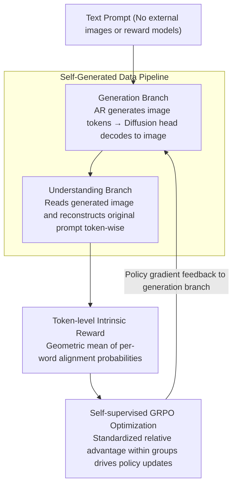

# Learning to Generate via Understanding: Understanding-Driven Intrinsic Rewarding for Unified Multimodal Models

**Conference**: CVPR 2026  
**arXiv**: [2603.06043](https://arxiv.org/abs/2603.06043)  
**Area**: Image Generation / Unified Multimodal Models  
**Keywords**: Unified Multimodal Models (UMM), Self-supervised Reinforcement Learning, Intrinsic Reward, Text-Image Alignment, GRPO, Understanding-driven Generation

## TL;DR
Ours proposes GvU, which leverages the visual understanding branch of a Unified Multimodal Model (UMM) as an intrinsic reward signal. By constructing a self-supervised RL framework (based on GRPO) through token-level text-image alignment probabilities, it iteratively improves T2I generation quality without external supervision. It achieves a 43.3% improvement on GenEval++, and the enhanced generation in turn promotes fine-grained understanding.

## Background & Motivation

**Background**: UMMs integrate visual understanding and generation by sharing a backbone, theoretically enabling T2I tasks with complex instruction following. Representative models include Chameleon, Emu3, Janus, BAGEL, Show-o, BLIP3-o, etc.

**Core Problem**: UMMs suffer from a severe **understanding-generation asymmetry**—the understanding branch is typically much stronger than the generation branch. Joint training of both tasks also leads to negative transfer, where optimizing one task harms the other.

**Limitations of Prior Work**: Traditional RL uses image-level external rewards (e.g., ImageReward, PickScore), which are too coarse to capture subtle semantics, prone to reward hacking, and dependent on external models.

**Key Insight**: Understanding (Image $\rightarrow$ Text) and generation (Text $\rightarrow$ Image) are dual tasks. The existing strong understanding capability of a UMM can naturally serve as a "teacher" to evaluate the alignment between its own generated images and texts without external supervision.

**Core Idea**: Use the UMM's understanding branch to calculate the conditional probability of each token in the original prompt given the generated image as a fine-grained intrinsic reward to drive self-supervised GRPO RL.

## Method

### Overall Architecture
GvU aims to resolve the "strong understanding, weak generation" asymmetry in UMMs: since the same model can already understand images well, its understanding branch is used as a teacher for its generation branch. The entire pipeline operates in a closed loop on a hybrid AR+Diffusion architecture (X-Omni). Given only a batch of text-only prompts, the generation branch first renders the prompts into images. The understanding branch then reads these images and evaluates, token-by-token, how well they align with the original prompts. The alignment probabilities are directly used as rewards, which are finally fed back to the generation branch using GRPO. The entire cycle does not touch external image data or external reward models; the model produces its own data, evaluates its own rewards, and improves itself.

### Key Designs

**1. Self-Generated Data Pipeline: Closing the training loop using only text prompts**

Traditional RL fine-tuning for T2I requires either paired real images or an external reward model, meaning both data and supervision come from outside. GvU pulls this chain entirely inside the model: given a text prompt $T = T_{1:L}$, the generation branch autoregressively outputs image tokens $I_{1:L_I}$, which are decoded into a pixel image via a diffusion head. This image, along with a system instruction, is fed back into the understanding branch. The understanding branch reconstructs the original prompt autoregressively, and the conditional token probabilities generated during this process serve as the alignment signals. Since images are self-generated and rewards are self-calculated, the process only requires a batch of prompts and does not depend on external images or models.

**2. Token-level Intrinsic Reward: Refining "alignment" to every word for dense feedback**

Image-level rewards like ImageReward or PickScore provide only one score for the entire image. This granularity is too coarse to detect subtle errors (e.g., "red" rendered as "blue") and is vulnerable to reward hacking. GvU instead computes conditional probabilities token-by-token in the understanding branch: for the $j$-th word in the original prompt,

$$p_\theta(T_j \mid \mathbf{X}_{j-1}) = \text{Softmax}\big(\text{Logits}_\theta(\mathbf{X}_{j-1})[T_j]\big)$$

The alignment of the entire sentence is calculated as the geometric mean to eliminate bias from sentence length:

$$P(T_{1:L} \mid I) = \Big(\prod_{j=1}^{L} p_\theta(T_j \mid \mathbf{X}_{j-1})\Big)^{1/L}$$

The resulting reward is dense—semantic points like color, quantity, and position each fall onto the probability of their corresponding tokens. If a detail is rendered incorrectly, the corresponding token probability drops, providing feedback precise to specific words rather than the whole image.

**3. Self-supervised GRPO Optimization: Driving policy updates with relative rewards**

GvU uses GRPO as an optimizer that does not rely on external supervision: for each prompt, $G$ trajectories are sampled. Each trajectory receives its own alignment reward $R_i = P(T \mid I_i)$. Within-group standardization is then performed to obtain the relative advantage:

$$A_i = \frac{R_i - \text{mean}(\{R_i\})}{\text{std}(\{R_i\})}$$

Samples that align better than the group average are reinforced, while those that perform worse are penalized. This allows estimating advantage using only the relative quality of a sample set, eliminating the need for a separate value function or an external reward model. Training uses LoRA fine-tuning on 50k text prompts with controllable overhead.

### Loss & Training
The final objective maximizes the GRPO target with clipping and KL constraints, where the KL term prevents the policy from deviating too far from the reference model:

$$\mathcal{J}_{GRPO}(\theta) = \mathbb{E}\left[\frac{1}{G}\sum_{i=1}^{G}\min\left(r_i(\theta)A_i, \text{clip}(r_i(\theta),1-\epsilon,1+\epsilon)A_i\right) - \beta D_{KL}(\pi_\theta \| \pi_{ref})\right]$$

## Key Experimental Results

### Main Results: GenEval Benchmark

| Model | Single Obj↑ | Two Obj↑ | Count↑ | Color↑ | Pos↑ | Attr. Bind↑ | Overall↑ |
|------|---------|---------|-------|-------|-------|-----------|----------|
| FLUX.1-dev | 0.99 | 0.81 | 0.79 | 0.74 | 0.20 | 0.47 | 0.67 |
| Janus-Pro | 0.99 | 0.89 | 0.59 | 0.90 | 0.79 | 0.66 | 0.80 |
| BAGEL | 0.99 | 0.94 | 0.80 | 0.87 | 0.64 | 0.63 | 0.81 |
| X-Omni (base) | 1.00 | 0.94 | 0.60 | 0.85 | 0.40 | 0.26 | 0.68 |
| **GvU** | 1.00 | 0.96 | 0.74 | **0.92** | 0.61 | 0.58 | **0.81** |
| **GvU†** | **1.00** | **0.97** | 0.80 | **0.93** | 0.68 | 0.65 | **0.84** |

### Main Results: GenEval++ Benchmark

| Model | Color↑ | Count↑ | Color/Pos↑ | Pos/Count↑ | Pos/Size↑ | Multi-Count↑ | Overall↑ |
|------|--------|--------|-----------|-----------|-----------|-------------|----------|
| FLUX.1-dev | 0.350 | 0.625 | 0.275 | 0.200 | 0.375 | 0.225 | 0.314 |
| BAGEL | 0.325 | 0.600 | 0.325 | 0.250 | 0.475 | 0.375 | 0.371 |
| X-Omni (base) | 0.225 | 0.500 | 0.325 | 0.150 | 0.475 | 0.275 | 0.282 |
| **GvU** | 0.300 | 0.400 | **0.575** | **0.525** | **0.675** | 0.400 | **0.404** |

### Ablation Study: Synchronous Improvement in Understanding (MMT-Bench Sub-tasks)

| Model | Overall | Recognition↑ | Hallucination↑ | Hallu. Detection↑ | Reasoning↑ | Knowledge↑ |
|------|---------|----------|----------|----------|----------|----------|
| Base | 49.76 | 51.21 | 45.57 | 66.25 | 70.0 | 38.46 |
| **GvU** | **49.92** | **52.58** | **50.63** | **68.75** | **75.0** | **42.31** |

### Ablation Study: Weak Base vs. Normal Base

| Base Model | GenEval Gain | Gap Size |
|------|-------------|----------|
| Normal Base | 0.68→0.81 (+19.1%) | Smaller |
| **Weak Base** | **0.21→0.50 (+138.1%)** | **Larger** |

### Key Findings
- **Gain**: Achieved a 43.3% improvement on GenEval++ (0.282 $\rightarrow$ 0.404), with the most significant gains in mixed categories (pos/count, pos/size).
- Intrinsic rewards grow **stably and continuously** during RL training, showing a cumulative rather than abrupt effect.
- **Synergy**: Enhanced generation conversely promotes fine-grained understanding: visual hallucination detection +5.06, common sense reasoning +5.0.
- Weak base models with larger understanding-generation gaps benefit more (+138.1% vs +19.1%), validating the "understanding-guiding-generation" mechanism.
- Rewards drop significantly when counting/color/spatial words are removed from prompts, verifying the sensitivity of intrinsic rewards to fine-grained semantics.

## Highlights & Insights
- **Self-Teaching Paradigm**: The UMM understanding branch acts as the "teacher" and the generation branch as the "student," eliminating the need for external reward models.
- **Token-level Reward**: Much finer granularity than image-level rewards, capable of distinguishing subtle semantics like color, quantity, and position.
- **Co-enhancement**: First empirical evidence showing that enhancing generation in UMMs can backward-improve fine-grained understanding.
- **General Framework**: Applicable to any UMM with an AR+Diffusion hybrid architecture.

## Limitations & Future Work
- The magnitude of improvement in understanding is still relatively small (MMT-Bench total score only +0.16); co-enhancement requires further exploration.
- Validated only on the X-Omni architecture; more generalization experiments on other UMM architectures are needed.
- Training requires multiple samples per prompt (G-group sampling in GRPO), resulting in high computational costs.

## Rating
- Novelty: ⭐⭐⭐⭐⭐ First to propose token-level intrinsic reward + self-supervised RL to bridge the UMM understanding-generation gap.
- Experimental Thoroughness: ⭐⭐⭐⭐ GenEval/GenEval++/DPG-Bench + understanding benchmarks + weak base ablation.
- Writing Quality: ⭐⭐⭐⭐ Clear derivation of formulas and well-motivated.
- Value: ⭐⭐⭐⭐ Open-source RL framework + no additional data labeling required.

<!-- RELATED:START -->

## Related Papers

- [\[NeurIPS 2025\] Co-Reinforcement Learning for Unified Multimodal Understanding and Generation](../../NeurIPS2025/image_generation/coreinforcement_learning_for_unified_multimodal_understandin.md)
- [\[CVPR 2026\] Scone: Bridging Composition and Distinction in Subject-Driven Image Generation via Unified Understanding-Generation Modeling](scone_bridging_composition_and_distinction_in_subject-driven_image_generation_vi.md)
- [\[CVPR 2026\] ParaUni: Enhance Generation in Unified Multimodal Model with Reinforcement-driven Hierarchical Parallel Information Interaction](parauni_enhance_generation_in_unified_multimodal_model_with_reinforcement-driven.md)
- [\[CVPR 2026\] Unified Latent Space for Understanding and Generation via Semantic Auto-encoder](unified_latent_space_for_understanding_and_generation_via_semantic_auto-encoder.md)
- [\[CVPR 2026\] Enhancing Spatial Understanding in Image Generation via Reward Modeling](enhancing_spatial_understanding_in_image_generation_via_reward_modeling.md)

<!-- RELATED:END -->
