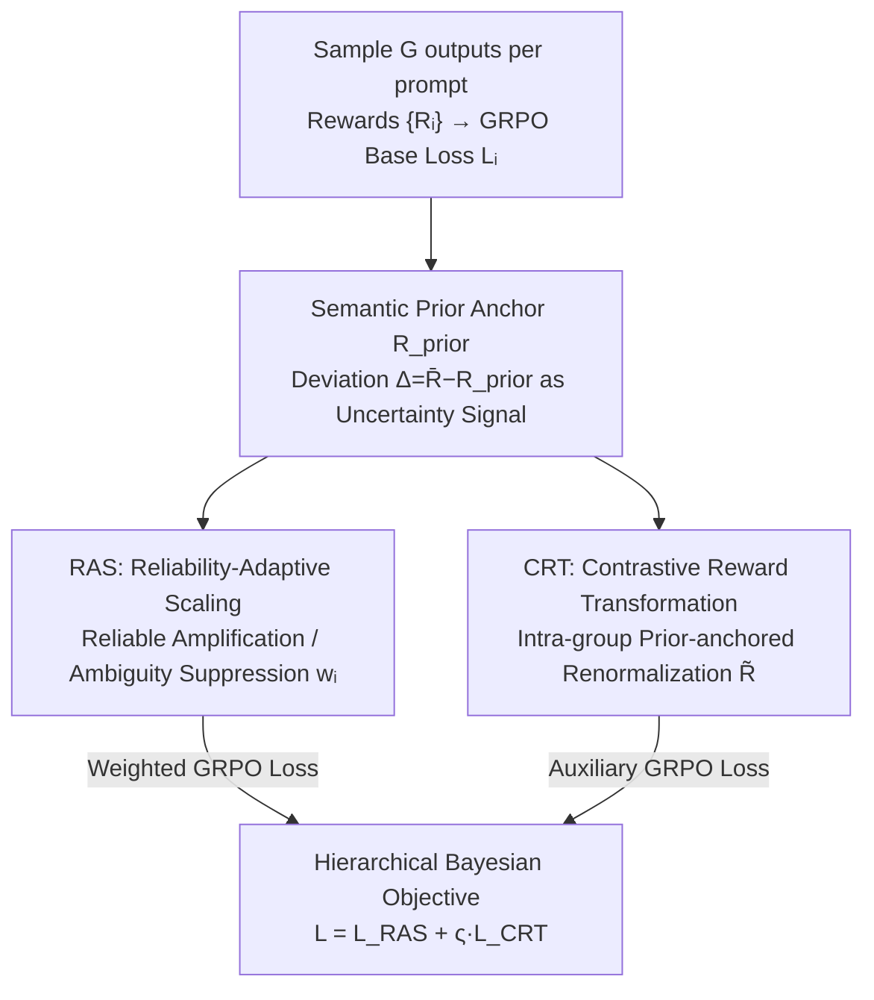

# Learning What to Trust: Bayesian Prior-Guided Optimization for Visual Generation

**Conference**: CVPR 2026  
**Paper**: [CVF Open Access](https://openaccess.thecvf.com/content/CVPR2026/html/Liu_Learning_What_to_Trust_Bayesian_Prior-Guided_Optimization_for_Visual_Generation_CVPR_2026_paper.html)  
**Code**: To be confirmed  
**Area**: Image/Video Generation / RL Post-training  
**Keywords**: GRPO, Reward Uncertainty, Bayesian Prior, Visual Generation, Post-training Alignment

## TL;DR
BPGO introduces a "semantic prior anchor" to the GRPO post-training for visual generation. It utilizes the deviation between observed rewards and the prior as an uncertainty signal to perform Bayesian trust allocation across groups (amplifying reliable groups, suppressing ambiguous ones) and prior-anchored reward renormalization within groups (expanding confident deviations, compressing ambiguous scores). It achieves faster convergence and stronger semantic alignment than standard GRPO and DanceGRPO in text-to-image, text-to-video, and image-to-video generation.

## Background & Motivation

**Background**: Text-to-image/video generation has advanced significantly through diffusion architectures combined with RL post-training (aligned with human preferences/perceptual feedback). Among these, GRPO (Group Relative Policy Optimization) has become a lightweight backbone for visual post-training because it eliminates the need for an independent value network by using "intra-group normalized rewards" as a baseline, saving approximately 50% VRAM. DanceGRPO further extends this to diffusion/rectified flows and multi-paradigm generation.

**Limitations of Prior Work**: Despite improvements in visual quality, **text-visual semantic alignment** remains a persistent issue—models often generate results that "look reasonable but do not match the semantics." The root cause is the **inherent many-to-many relationship** in text-visual correspondence: a single video can have multiple semantically equivalent but differently worded descriptions ("gymnastics spin" / "turning around" / "two rotations"), and a single prompt can correspond to multiple videos with different trajectories, styles, or camera angles that all satisfy the description.

**Key Challenge**: This many-to-many relationship makes the signals provided by reward models **uncertain and weakly discriminative**. Existing GRPO methods treat rewards as **consistent scalar feedback**, assuming all rewards are equally reliable. Consequently, reliable and useful rewards are **under-utilized**, while noisy rewards are **overfitted**—the model fails to sufficiently learn from good signals and is misled by bad ones.

**Goal**: Explicitly model reward uncertainty within the GRPO framework to allow the optimization to "learn what to trust and how much"—allocating trust across groups while enhancing discriminability within groups.

**Key Insight**: Rather than trusting all prompt groups equally, a **semantic prior anchor** $R_{\text{prior}}$ (representing the expected reward of a semantically clear and typical prompt) is introduced. The "deviation of the observed reward from the prior" $\Delta_i = \bar R_i - R_{\text{prior}}$ is used as a measure of **prior-data conflict**: positive deviation indicates reliable, well-aligned groups, while negative deviation indicates ambiguity or reward model uncertainty. This aligns with empirical Bayesian/shrinkage logic—deviation from the prior suggests a noisy signal. This allows modulating the credibility of each observation **without training an additional uncertainty estimator**.

**Core Idea**: Transforming GRPO into a Bayesian prior-guided hierarchical optimization using a semantic prior anchor—adjusting "trust" at the group level and "sharpness" within groups.

## Method

### Overall Architecture
BPGO is a modified version of GRPO (omitting the KL term following recent studies). Its core consists of two complementary modules running in parallel with the base GRPO loss: **Reliability-Adaptive Scaling (RAS)**, which redistributes learning intensity based on group-level reward reliability (macro trust), and **Contrastive Reward Transformation (CRT)**, which stretches rewards relative to the prior within groups to enhance discriminability (micro contrast).

Workflow: For each prompt, sample $G$ candidate outputs and calculate rewards $\{R_i^j\}$ → compute the base GRPO loss $L_i$ → RAS calculates group weights $w_i$ to amplify gradients for "mastered" reliable groups and attenuate gradients for "struggling" ambiguous groups → CRT renormalizes rewards into auxiliary rewards $\tilde R_i^j$ and computes an auxiliary loss $L_{\text{CRT}}$ via GRPO → both are weighted and combined into the total loss. This constitutes a hierarchical Bayesian posterior update: RAS adjusts inter-group posterior trust, and CRT adjusts intra-group posterior sharpness.

### Key Designs

**1. Semantic Prior Anchor and Deviation Signal: Prior-Deviance as Uncertainty without Extra Estimators**

The limitation is that GRPO treats all rewards as equally reliable, unable to distinguish which rewards should be trusted. BPGO defines a semantic prior $R_{\text{prior}}$ for each sample, representing the expected reward for semantically clear prompts (estimated via calibrated data or moving averages during training, varying by task). For an observed reward $\bar R_i$, the deviation $\Delta_i = \bar R_i - R_{\text{prior}}$ quantifies "how much the observation deviates from the prior": positive deviation indicates reliable alignment; negative implies ambiguity. The clever part is **avoiding an additional uncertainty estimator** by directly using this "prior-data conflict" as a credibility signal in the sense of empirical Bayesian/shrinkage—deviations are treated as noise to modulate updates. It performs position bias correction at the group level (Bayesian posterior mean adjustment) and precision modulation at the individual level.

**2. Reliability-Adaptive Scaling (RAS): Inter-group Bayesian Trust Allocation**

To address "learning too little from reliable groups and being misled by noisy ones," RAS uses a smooth, differentiable trust function to redistribute learning intensity based on group-level deviation:

$$w_i = f(\bar R_i - R_{\text{prior}}) = 1 + \alpha\left[2\sigma\big(k(\bar R_i - R_{\text{prior}})\big) - 1\right]$$

where $\sigma(\cdot)$ is the sigmoid function, $\alpha$ controls scaling magnitude, and $k$ controls transition sharpness. When $\bar R_i > R_{\text{prior}}$, then $w_i > 1$ amplifies high-confidence group gradients; when $\bar R_i < R_{\text{prior}}$, then $w_i < 1$ softly weakens uncertain groups. Weighted loss: $L_{\text{RAS}}^{(i)} = w_i^{\text{group}}\cdot L_{\text{GRPO}}^{(i)}$. This continuous formula acts like a **Bayesian update gain**—dynamically determining the extent to which the posterior policy depends on the current evidence, naturally linking to curriculum learning: taking amplified gradients from "mastered" groups and attenuated ones from "struggling" groups to focus capacity on credible semantic regions.

**3. Contrastive Reward Transformation (CRT): Intra-group Prior-anchored Renormalization**

The problem is that internal reward differences within a group are often small, and standard normalization in GRPO flattens these differences. CRT performs **geometric stretching** relative to the prior within the group, magnifying samples that confidently deviate and compressing ambiguous ones:

$$\tilde R_i^j = g(R_i^j - R_{\text{prior}}) = \left(\alpha\,(R_i^j - R_{\text{prior}}) + \mathbb 1\{R_i^j > R_{\text{prior}}\}\right)\exp(R_i^j)$$

where $\alpha>0$ is a contrastive factor, and the indicator function $\mathbb 1\{\cdot\}$ adds weight to samples exceeding the prior. The transformed auxiliary rewards $\{\tilde R_i^j\}$ are used to compute an auxiliary loss $L_{\text{CRT}}^{(i)} = L_{\text{GRPO}}(\{\tilde R_i^j\})$, adding to the original loss $L_{\text{sample}}^{(i)} = L_{\text{GRPO}}(\{R_i^j\}) + \varsigma\cdot L_{\text{CRT}}^{(i)}$. This sharpens intra-group discriminability without changing the ranking, strengthening the policy gradient signal.

**4. Hierarchical Total Objective: Unifying Macro Trust and Micro Sharpness**

Combining RAS and CRT, the full objective across $N$ prompt groups is:

$$L_{\text{BPGO}} = \frac{1}{N}\sum_{i=1}^{N} w_i^{\text{group}}\big[L_{\text{GRPO}}(\{R_i^j\})\big] + \varsigma\,L_{\text{CRT}}^{(i)}$$

This forms a hierarchical Bayesian prior-guided update: RAS adjusts cross-group posterior trust (macro reliability), and CRT adjusts intra-group posterior sharpness (micro contrast). Intuitively, the model first decides "which groups are worth learning from" and then "maximizes the distinction between good and bad samples" within those groups.

### Loss & Training
Based on GRPO (KL term omitted). Group size $G=8$ for video and $G=12$ for images. Priors are task-specific: T2V uses rewards generated by SFT models as anchored priors; I2V (Wan2.2-14B) uses the first frame's text-alignment as a natural baseline; T2I uses a moving average of group rewards to smooth fluctuations.

## Key Experimental Results

### Main Results
Evaluated on three tasks: T2V (Wan2.1-1.3B), I2V (Wan2.2-14B MoE), and T2I (FLUX), all initialized from SFT checkpoints. T2V/I2V use VideoCLIP-XL as the reward; metrics include VideoAlign (VA) and Qwen3-VL-Embedding. T2I uses HPSv2 as reward; PickScore and ImageReward are additional metrics.

| Task | Method | VideoClipXL ↑ | VA-TA ↑ | VA-overall ↑ | Qwen3-VL-Emb ↑ |
|------|------|---------------|---------|--------------|----------------|
| T2V | Wan2.1 (base) | 2.6563 | 1.0638 | 0.0939 | 0.6741 |
| T2V | GRPO† | 2.6714 | 0.8984 | -0.5411 | 0.6722 |
| T2V | BPGO (Ours) | 2.6788 | 1.1193 | -0.0478 | 0.6754 |
| I2V | Wan2.2 (base) | 2.6726 | 1.0633 | -0.7623 | 0.6741 |
| I2V | GRPO† | ⚠️ 2.0713 | 0.2307 | -1.8932 | 0.6885 |
| I2V | BPGO (Ours) | 2.6855 | 1.0589 | -1.0491 | 0.6890 |

Note: † denotes author's implementation of DanceGRPO/GRPO. VA-TA is the text-alignment sub-score. ⚠️ The VideoClipXL=2.0713 for GRPO† in I2V is significantly lower than the base, suggesting implementation/OCR issues; refer to the original text.

| Task | Method | HPSv2 ↑ | PickScore ↑ | ImageReward ↑ |
|------|------|---------|-------------|---------------|
| T2I | FLUX (base) | 0.2398 | 0.2270 | 1.1482 |
| T2I | GRPO† | 0.2564 | 0.2242 | 1.0607 |
| T2I | BPGO (Ours) | 0.2434 | 0.2288 | 1.2136 |

On T2V, VA-TA increased from 0.8984 to 1.1193 (+24.6%). On T2I, PickScore (0.2242→0.2288) and ImageReward (1.0607→1.2136) both improved.

### Ablation Study

**RAS / CRT Decomposition (Tab. 3)**:

| Task | Config | VideoClipXL ↑ | VA-TA ↑ | VA-overall ↑ |
|------|------|---------------|---------|--------------|
| T2V | Only RAS | 2.7042 | 1.2327 | -0.4838 |
| T2V | Only CRT | 2.6844 | 1.1751 | 0.0876 |
| T2V | RAS+CRT | 2.6788 | 1.1193 | -0.0478 |
| I2V | Only RAS | 2.6681 | 1.0361 | -0.8429 |
| I2V | Only CRT | ⚠️ 2.0682 | 0.2162 | -1.6573 |
| I2V | RAS+CRT | 2.6855 | 1.0589 | -1.0491 |

### Key Findings
- **BPGO outperforms base and GRPO post-training**: It effectively enhances reward discriminability in scenarios with uncertain text-visual correspondence, with VA-TA in T2V jumping by +24.6%.
- **I2V is harder but stable**: In image-to-video, reward noise is magnified by complex motion. While standard GRPO† collapses (VideoClipXL drops to 2.07), BPGO maintains a stable VA-TA (1.0589).
- **RAS and CRT serve different purposes**: RAS alone can yield higher values in specific metrics, but RAS+CRT is more robust in high-noise scenarios like I2V.
- **Faster convergence and lower oscillation**: BPGO ensures more consistent updates by amplifying confident deviations.
- **Human preference metrics benefit most**: ImageReward (human preference alignment) shows the most significant gain in T2I.

## Highlights & Insights
- **Leveraging "deviation from prior" as free uncertainty**: Avoids training expensive uncertainty estimators by treating the data-prior conflict as an empirical Bayesian signal—a lightweight and theoretically sound approach.
- **Clean "macro trust + micro sharpness" hierarchy**: RAS handles whether to trust a group, while CRT handles distinguishing samples within it, both requiring near-zero extra computation.
- **Addressing "many-to-many ambiguity" in visual generation**: Identifies the inherent text-visual ambiguity as the root cause of GRPO failure and provides a practical fix more fundamental than just switching reward models.

## Limitations & Future Work
- **Prior selection depends on task knowledge**: Different priors are used for different tasks; incorrect priors could misclassify reliable groups as ambiguous.
- **Hyperparameter sensitivity**: $\alpha, k, \varsigma$ require tuning, and $\alpha$ significantly impacts VA-overall.
- **Metric dependency**: Evaluation relies heavily on models like VideoCLIP-XL/HPSv2, which are the source of the "uncertainty."
- ⚠️ Multiple values in the tables/formulas may be impacted by OCR noise; directions are reliable, but exact numbers should be verified.

## Related Work & Insights
- **vs Standard GRPO / DanceGRPO**: These treat group-normalized rewards as equally reliable scalar feedback; BPGO introduces semantic prior anchors to explicitly model uncertainty.
- **vs LLM Sample Reweighted GRPO**: LLM training has shown success in reweighting based on difficulty; BPGO migrates this to visual generation and adds intra-group contrastive transformation.

## Rating
- Novelty: ⭐⭐⭐⭐ Introducing the "deviation from prior as uncertainty" concept into visual GRPO is clever and computationally efficient.
- Experimental Thoroughness: ⭐⭐⭐⭐ Covers T2V/I2V/T2I with ablations, though some data points in the I2V implementations look abnormal.
- Writing Quality: ⭐⭐⭐ Motivation and mechanisms are clear, but OCR noise in the open version affects readability.
- Value: ⭐⭐⭐⭐ A practical enhancement for GRPO post-training with low overhead for noisy visual alignment.

<!-- RELATED:START -->

## Related Papers

- [\[CVPR 2026\] Seeing What Matters: Visual Preference Policy Optimization for Visual Generation](seeing_what_matters_visual_preference_policy_optimization_for_visual_generation.md)
- [\[CVPR 2026\] LoFA: Learning to Predict Personalized Prior for Fast Adaptation of Visual Generative Models](lofa_learning_to_predict_personalized_prior_for_fast_adaptation_of_visual_genera.md)
- [\[ICML 2026\] Bayesian Tensor Decomposition with Diffusion Model Prior](../../ICML2026/image_generation/bayesian_tensor_decomposition_with_diffusion_model_prior.md)
- [\[CVPR 2026\] Identity-Preserving Image-to-Video Generation via Reward-Guided Optimization](identity-preserving_image-to-video_generation_via_reward-guided_optimization.md)
- [\[CVPR 2026\] ThinkGen: Generalized Thinking for Visual Generation](thinkgen_generalized_thinking_for_visual_generation.md)

<!-- RELATED:END -->
