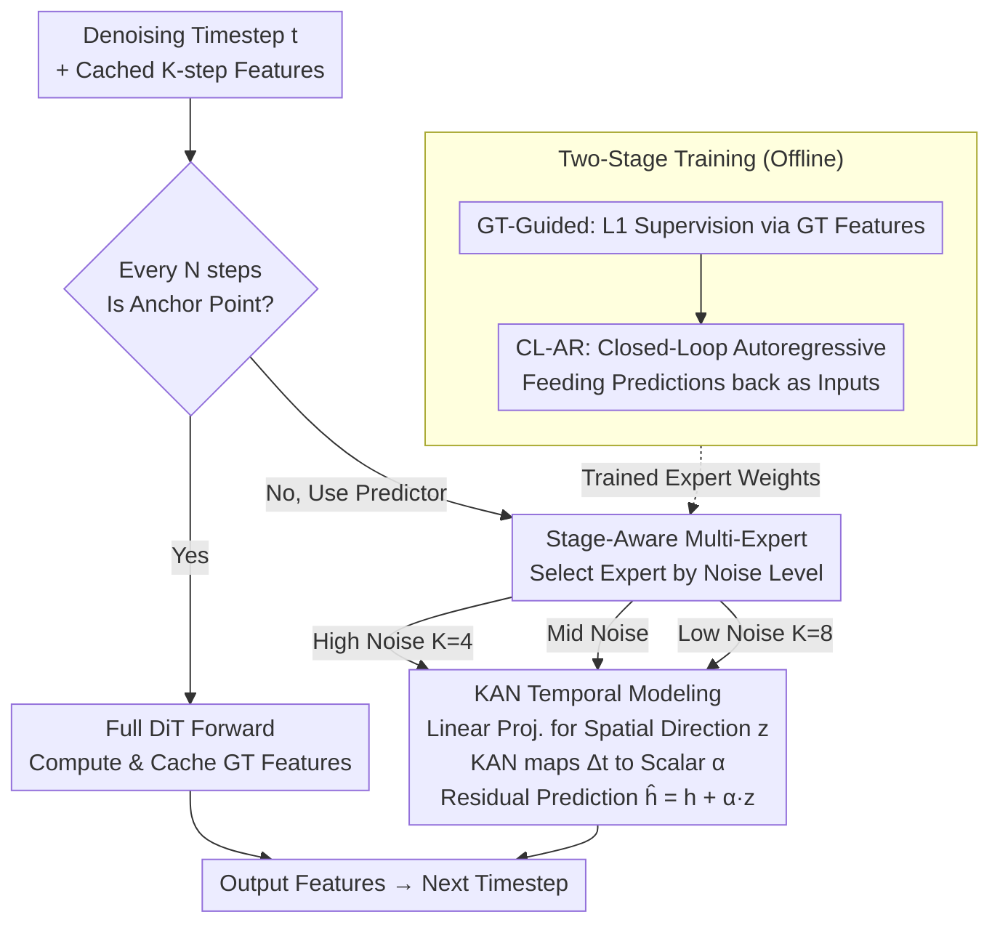

# LESA: Learnable Stage-Aware Predictors for Diffusion Model Acceleration

**Conference**: CVPR 2026  
**arXiv**: [2602.20497](https://arxiv.org/abs/2602.20497)  
**Area**: Image Generation / Diffusion Model Acceleration  
**Keywords**: Diffusion Model Acceleration, Feature Caching, KAN, Stage-Aware, DiT, Text-to-Image, Text-to-Video

## TL;DR
The LESA framework is proposed, utilizing Kolmogorov-Arnold Networks (KAN) as learnable temporal predictors. By combining a multi-stage multi-expert architecture with a two-stage training strategy, it achieves $5\times$ acceleration on FLUX with only a $1.0\%$ quality degradation. On Qwen-Image, it achieves $6.25\times$ acceleration with a $20.2\%$ quality improvement over TaylorSeer, and on HunyuanVideo, it yields a $24.7\%$ PSNR improvement at $5\times$ acceleration.

## Background & Motivation

**Background**: DiT architectures have achieved exceptional results in image and video generation, but the inference overhead of deep Transformers and multi-step denoising is substantial. Feature Caching leverages temporal redundancy between adjacent timesteps to accelerate inference and has become a prominent research direction.

**Classification of Existing Solutions**: (a) Cache-Then-Reuse (directly reusing features from the previous step, e.g., PAB, DBCache) — ignores temporal evolution, leading to error accumulation; (b) Cache-Then-Forecast (predicting via Taylor expansion, e.g., TaylorSeer, FORA) — assumes smooth and continuous feature evolution, whereas actual diffusion processes are **stage-dependent**.

**Key Insight**: Through cosine similarity and PCA trajectory analysis, feature dynamics in the diffusion process exhibit three stages: a high-noise stage with drastic and unstable changes, a middle stage with stable continuity, and a low-noise stage for refining details. A single fixed prediction strategy cannot adapt to these variations.

**Core Idea**: Utilizing **learnable** KANs instead of training-free polynomial predictions, and assigning **specialized expert predictors** to each noise stage to explicitly model stage-dependent dynamics.

## Method

### Overall Architecture

LESA aims to address the conflict between slow DiT diffusion inference and high temporal redundancy. The approach involves computing the DiT forward pass only every $N$ steps (anchor points). For other timesteps, a lightweight learnable predictor extrapolates the current features directly from $K$ cached historical steps, skipping the entire DiT forward pass. The key lies in using multiple KAN experts specialized for different noise stages rather than a fixed polynomial, explicitly fitting the non-uniform dynamics across "high-noise turbulence, mid-stage stability, and low-noise refinement."

### Key Designs

**1. KAN Temporal Modeling: Replacing Training-Free Taylor Extrapolation with Learnable Functions**

Cache-Then-Forecast methods (TaylorSeer, FORA) assume features evolve smoothly and can be predicted via Taylor expansion. However, diffusion features are stage-dependent, and fixed polynomials cannot fit them perfectly. LESA decouples prediction into spatial and temporal dimensions: a linear projection compresses $K$ cached features into a spatial direction $\mathbf{z} = \mathbf{W}[\mathbf{h}_{t+K-1},...,\mathbf{h}_t] + b$. Subsequently, KAN takes the relative timestep offset $\Delta t$ in the temporal domain to output a scalar modulation factor $\alpha = f_{KAN}(\Delta t_{L-1},...,\Delta t_0) = \sum_{m=1}^{M} w_m \phi_m(a_m^\top \Delta \mathbf{t})$. Finally, the residual prediction is $\hat{\mathbf{h}}_{t-1} = \mathbf{h}_t + \alpha \mathbf{z}$. This "linear spatial/KAN temporal" separation allows KAN to utilize the Kolmogorov-Arnold representation theorem to fit temporal patterns with learnable univariate basis functions $\phi_m$. It is more flexible than Taylor expansion and more parameter-efficient than MLP—each expert consists only of a linear projection and a small KAN module, with parameters far fewer than the base DiT.

**2. Stage-Aware Multi-Expert: One Predictor Cannot Cover the Entire Trajectory**

Analysis via cosine similarity and PCA shows three distinct feature dynamic phases. LESA partitions the denoising process into three segments based on noise levels, each with an independent expert: the high-noise expert uses a shorter window $K=4$ to track initial turbulence, the mid-noise expert handles stable continuity, and the low-noise expert uses a longer window $K=8$ to maintain detail refinement. Using optimized windows and parameters for each segment avoids the dilemma of "short windows wasting capacity in stable segments" and "long windows lagging during drastic changes."

**3. Two-Stage Training: Learning Accuracy and Stability**

If predictors are trained only with ground-truth (GT) supervision, errors in their own predictions during inference cause gradual drift. LESA first performs GT-Guided Training: using intermediate GT features calculated by the base model as supervision with L1 loss to ensure "accuracy." It then performs CL-AR (Closed-Loop Autoregressive) training: allowing the predictor to feed its own erroneous previous predictions back as input to simulate inference-time error accumulation. This step is critical; models trained only on GT degrade quickly during inference, whereas closed-loop training ensures robustness against drift.

## Key Experimental Results

### Main Results: FLUX.1-dev Text-to-Image

| Method | FLOPs Gain | ImageReward↑ | CLIP Score↑ | PSNR↑ | LPIPS↓ |
|------|----------|-------------|-------------|-------|--------|
| Original 50 steps | 1.00× | 0.99 | 32.64 | ∞ | 0.00 |
| TaylorSeer (N=6,O=2) | 4.99× | 1.02 | 32.53 | 28.94 | 0.40 |
| TeaCache (l=1.0) | 4.54× | 0.84 | 31.88 | 28.61 | 0.48 |
| **LESA (N=7)** | **5.00×** | **0.98** | **32.88** | **30.17** | **0.32** |
| TaylorSeer (N=9,O=2) | 6.24× | 0.86 | 32.04 | 28.38 | 0.51 |
| **LESA (N=10)** | **6.25×** | **0.91** | **32.65** | **29.65** | **0.40** |

### Main Results: Qwen-Image Text-to-Image

| Method | FLOPs Gain | ImageReward↑ | PSNR↑ | LPIPS↓ |
|------|----------|-------|-------|--------|
| TaylorSeer (N=6,O=2) | 5.00× | 1.01 | 28.58 | 0.46 |
| **LESA (N=7)** | **5.00×** | **1.15** | **30.18** | **0.25** |
| TaylorSeer (N=8,O=2) | 6.24× | 0.84 | 28.14 | 0.68 |
| **LESA (N=10)** | **6.25×** | **1.01** | **29.23** | **0.34** |

### Main Results: HunyuanVideo Text-to-Video

| Method | FLOPs Gain | PSNR↑ | SSIM↑ | LPIPS↓ |
|------|----------|-------|-------|--------|
| TaylorSeer (N=5,O=1) | 5.00× | 17.29 | 0.55 | 0.42 |
| TeaCache (l=0.4) | 4.55× | 18.25 | 0.61 | 0.38 |
| **LESA (N=7)** | **5.00×** | **21.43** | **0.72** | **0.29** |
| **LESA (N=8)** | **5.56×** | **21.05** | **0.70** | **0.32** |

### Ablation Study (FLUX, N=5)

| Stage Split | Temporal Module | PSNR↑ | LPIPS↓ |
|----------|----------|-------|--------|
| ✗ | MLP | 30.29 | 0.31 |
| ✗ | KAN | 30.77 | 0.25 |
| ✔ | MLP | 30.76 | 0.25 |
| **✔** | **KAN** | **30.96** | **0.24** |

### Key Findings
- At $5\times$ acceleration, FLUX ImageReward drops by only $1.0\%$ ($0.99\to 0.98$), achieving **nearly lossless acceleration**.
- On Qwen-Image at $6.25\times$ acceleration, LESA outperforms TaylorSeer in ImageReward by $20.2\%$ ($0.84\to 1.01$).
- On HunyuanVideo at $5\times$ acceleration, PSNR exceeds TaylorSeer by $24.7\%$ ($17.29\to 21.43$).
- The combination of KAN and stage partitioning yields optimal results; both are indispensable.
- Effective on distilled models (FLUX-schnell, Qwen-Lightning) as well.
- At high acceleration ratios ($6\times+$), training-free methods significantly degrade (†), while LESA remains competitive.

## Highlights & Insights
- **KAN for Temporal Modeling**: Utilizes the function representation power of KAR theorems for learnable temporal extrapolation, proving more flexible than Taylor and more parameter-efficient than MLP.
- **Stage-Aware Design**: Explicitly models the non-uniform dynamics of the diffusion process, which is both intuitive and experimentally validated.
- **Closed-Loop Autoregressive Training**: This is a critical engineering factor; models trained only on GT accumulate errors rapidly during inference, while CL-AR training significantly enhances robustness.
- Strong generalization across models (FLUX/Qwen/HunyuanVideo) and tasks (T2I/T2V).

## Limitations & Future Work
- Requires pre-running the base model to collect feature trajectories for training data.
- The predictor must be retrained for each new model, making it not fully plug-and-play.
- Stage boundaries are manually set; adaptive partitioning has not yet been explored.

## Rating
- Novelty: ⭐⭐⭐⭐ KAN + Stage-aware predictor is a novel combination.
- Experimental Thoroughness: ⭐⭐⭐⭐⭐ 3 T2I models + 1 T2V model + distilled models + comprehensive ablations.
- Writing Quality: ⭐⭐⭐⭐ Solid analysis and clear visualizations.
- Value: ⭐⭐⭐⭐⭐ Significant practical inference acceleration results.

<!-- RELATED:START -->

## Related Papers

- [\[CVPR 2026\] TC-Padé: Trajectory-Consistent Padé Approximation for Diffusion Acceleration](tc-padé_trajectory-consistent_padé_approximation_for_diffusion_acceleration.md)
- [\[CVPR 2026\] Denoising as Path Planning: Training-Free Acceleration of Diffusion Models with DPCache](dpcache_denoising_path_planning_diffusion_accel.md)
- [\[CVPR 2026\] SenCache: Accelerating Diffusion Model Inference via Sensitivity-Aware Caching](sencache_accelerating_diffusion_model_inference_via_sensitivity-aware_caching.md)
- [\[CVPR 2026\] ResCa: Residual Caching for Diffusion Transformers Acceleration](resca_residual_caching_for_diffusion_transformers_acceleration.md)
- [\[CVPR 2026\] Adaptive Spectral Feature Forecasting for Diffusion Sampling Acceleration](adaptive_spectral_feature_forecasting_for_diffusion_sampling_acceleration.md)

<!-- RELATED:END -->
