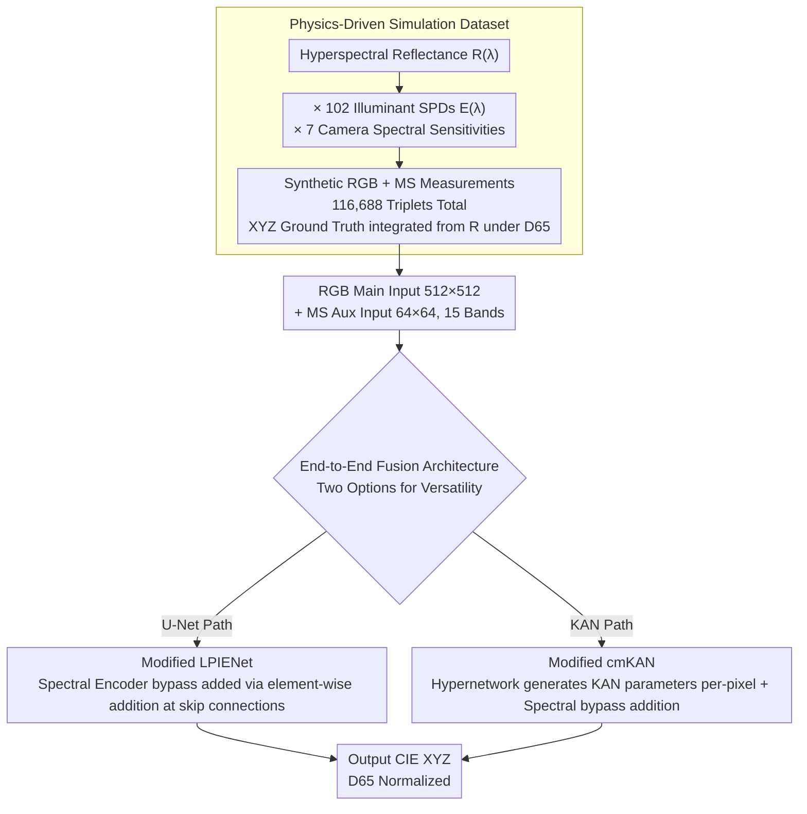

# Leveraging Multispectral Sensors for Color Correction in Mobile Cameras

**Conference**: CVPR 2026  
**arXiv**: [2512.08441](https://arxiv.org/abs/2512.08441)  
**Code**: [Project Page](https://lucacogo.github.io/Mobile-Spectral-CC/)  
**Area**: Image Generation/Image Processing  
**Keywords**: Multispectral Sensors, Color Correction, Auto White Balance, Sensor Fusion, Mobile Cameras

## TL;DR

A unified end-to-end color correction framework is proposed to jointly fuse data from a high-resolution RGB sensor and an auxiliary low-resolution multispectral (MS) sensor. By integrating illuminant estimation, illuminant compensation, and color space conversion into a single model, color error ($\Delta E_{00}$) is reduced by up to 50% compared to RGB-only and MS-only baselines.

## Background & Motivation

Color correction is a foundational component of the camera imaging pipeline, responsible for converting raw sensor measurements into a device-independent standard color space (e.g., CIE XYZ). Traditional pipelines adopt a modular design: Auto White Balance (AWB, consisting of illuminant estimation + compensation) is performed first, followed by Color Space Conversion (CST). However, the independent processing of these steps leads to cumulative error propagation.

Key Challenge: RGB sensors have only three wide-band channels, providing very limited spectral information, which makes it impossible to reliably decouple surface reflectance $R(\lambda)$ and illuminant power distribution $E(\lambda)$—an underdetermined problem. Although recent advances in nanophotonics have enabled compact snapshot multispectral (MS) sensors (e.g., 15 narrow-band channels), existing methods typically use MS data only during the illuminant estimation stage and discard it thereafter, wasting valuable spectral information.

Key Insight: Integrate multispectral information throughout all stages of the color correction pipeline (illuminant estimation, compensation, and CST) rather than just the first step. Core Idea: Perform end-to-end joint modeling of RGB+MS dual inputs to implicitly complete all correction steps within a unified framework, fully utilizing spectral constraints to enhance color accuracy.

## Method

### Overall Architecture

Traditional camera pipelines decompose color correction into three serial steps—AWB (Estimation + Compensation) and then CST. Each step is processed independently, causing errors to accumulate. Furthermore, even when mobile phones are equipped with MS sensors, current solutions discard the spectral information after illuminant estimation. This paper compresses the entire pipeline into an end-to-end model: high-resolution RGB images ($512 \times 512$) serve as the primary input, while low-resolution MS images ($64 \times 64$, 15 narrow-band channels) serve as auxiliary input. Features from both paths are extracted via encoders and fused to directly output results in the CIE XYZ color space normalized to D65. There is no longer an explicit boundary between "estimation → compensation → conversion"; all steps are learned implicitly within the network. To demonstrate that this fusion strategy is not dependent on a specific network, the authors validate its versatility by grafting it onto two lightweight image-to-image architectures (LPIENet and cmKAN).

### Key Designs

**1. LPIENet Modification: Adding a spectral bypass to the U-Net with convergence at skip connections**

The original LPIENet is a U-Net style restoration network with 3 encoders and 2 decoders, well-suited for pixel-wise transformations requiring spatial consistency. To incorporate MS information, the authors add an auxiliary spectral encoder branch consisting of 3 IRA blocks. No downsampling is performed on this branch (as the MS input is already small at $64 \times 64$). MS features are aligned to the scales of the RGB backbone and injected via element-wise addition at the skip connections. IRA blocks are chosen for this bypass because they combine MobileNet-style depthwise separable convolutions with parallel channel/spatial attention, capturing correlations between spectral channels within a low parameter budget—the standard version has 220K parameters, while a small version is compressed to 60K, suitable for mobile deployment.

**2. cmKAN Modification: Using a hypernetwork to generate spatially-varying KAN parameters to model color mapping as smooth curves**

The approach of cmKAN differs from U-Net: it uses a hypernetwork to generate parameters for KAN layers at each pixel location, applying different non-linear color transformations to various regions of the image. The KAN layers utilize 3rd-order B-splines with a grid size of 5. Since B-splines are piecewise smooth curves, they align with the physical intuition that color correction inputs and outputs should be continuous and smooth without jumps. The MS fusion method remains an additive bypass: a 3-layer convolutional spectral encoder is added to the generator, and its outputs are added element-wise to the Illuminant Estimator (IE) outputs at two feature levels. The modified cmKAN requires only 18K parameters, making it the most compact configuration while achieving the highest color accuracy.

**3. Physics-driven simulation dataset: Synthesizing data where RGB+MS+GT triplets are unavailable**

Training this method requires triplets of "RGB image, MS image, and device-independent XYZ ground truth" for the same scene. Such paired data is non-existent in reality as ground truth requires pixel-wise hyperspectral reflectance. The authors start with reflectance spectra $R(\lambda)$ from two public hyperspectral datasets and multiply them by 102 illuminant power distributions $E(\lambda)$ and 7 camera spectral sensitivities (including both mobile and mirrorless cameras). Following the imaging equation, they synthesize RGB and MS measurements, resulting in 116,688 triplets. XYZ ground truth is obtained by integrating reflectance under D65. To simulate real-world conditions, realistic acquisition noise is included. Additionally, a version with spatial misalignment between RGB and MS was created to test the framework's robustness to geometric mismatches.

### Loss & Training

End-to-end training is conducted using $\Delta E_{00}$ color difference between the output and the D65 XYZ ground truth as the optimization objective. Data is split at the scene level (80% training / 20% testing, with 20% of training reserved for validation) to prevent leakage from adjacent pixels of the same scene. For the misaligned dataset version, full retraining is unnecessary—only the spectral encoder bypass needs fine-tuning to adapt to new displacement patterns.

## Key Experimental Results

### Main Results

| Dataset | Metric | Ours (Best cmKAN-light) | Best Trad. Method (FC4) | Gain |
|--------|------|------|----------|------|
| Aligned-Mirrorless | $\Delta E_{00}$ Mean | 1.60 | 3.28 | -51.2% |
| Aligned-Mirrorless | $\Delta E_{00}$ Median | 1.30 | 2.86 | -54.5% |
| Aligned-Mobile | $\Delta E_{00}$ Mean | 1.47 | 3.16 | -53.5% |
| Aligned-Mobile | $\Delta E_{00}$ Median | 1.19 | 2.75 | -56.7% |
| Misaligned-Mirrorless | $\Delta E_{00}$ Mean | 1.76 | 3.25 (SpectralFC4) | -45.8% |
| Misaligned-Mobile | $\Delta E_{00}$ Mean | 1.62 | 3.19 (SpectralFC4) | -49.2% |

### Ablation Study

| Configuration | Key Metric ($\Delta E_{00}$ Mean) | Description |
|------|---------|------|
| cmKAN-light (RGB+MS) | 1.60 | Best performance, 18K parameters |
| LPIENet (RGB+MS) | 1.74 | 220K parameters, slightly behind cmKAN |
| LPIENet-small (RGB+MS) | 2.09 | 60K parameters |
| SpectralFC4 (Trad. + MS) | 3.25 | MS used only for illuminant estimation |
| FC4 (Trad. + RGB) | 3.28 | Pure RGB method |
| GW (Gray World) | 7.80 | Statistical approach, highest error |

### Key Findings

- End-to-end methods provide a qualitative leap in color accuracy compared to traditional modular pipelines: $\Delta E_{00}$ drops from 3+ to approximately 1.5.
- cmKAN-light achieves the best performance with only 18K parameters, demonstrating the inherent advantage of KAN structures in color mapping tasks.
- On misaligned datasets, fine-tuning only the spectral encoder maintains high performance, showing robustness to geometric mismatch.
- The benefit of using MS data throughout the pipeline significantly outweighs strategies that only use MS for illuminant estimation (SpectralFC4 vs. Ours).

## Highlights & Insights

- The transition from modular pipelines to "end-to-end joint modeling" is highly effective, preventing error propagation between stages.
- The extremely small model size (18K-220K parameters) is ideal for mobile deployment, which is the most likely application scenario for MS sensors.
- Demonstrating framework versatility by modifying two distinct architectures (U-Net and KAN) strengthens the method's credibility.
- The physics-driven simulation approach is sound, utilizing real hyperspectral data, real camera sensitivities, and real illuminant SPDs.

## Limitations & Future Work

- The dataset is entirely based on simulation; although physics-driven, a domain gap remains between simulated and real sensor pairs.
- Evaluations are restricted to static scenes, without considering temporal consistency in video modes.
- The low spatial resolution of MS sensors ($64 \times 64$) may limit color correction quality in regions with fine textures.
- Currently, only single-illuminant scenes are validated; mixed lighting scenarios (e.g., indoor artificial + natural light) are not covered.
- While KAN models have few parameters, their inference latency is not fully discussed in the paper.

## Related Work & Insights

- **vs FC4/ConvMean (Traditional Pipeline)**: Traditional methods process color correction in steps and use only RGB, resulting in $\Delta E_{00}$ around 3.2-3.5; the proposed end-to-end + MS fusion reduces this to ~1.5.
- **vs SpectralFC4/SpectralConvMean**: These methods use MS data but only for illuminant estimation, discarding it afterward; the proposed method utilizes MS throughout the pipeline, reducing error by approximately 50%.
- **vs QU**: Cross-camera adaptation methods require fine-tuning and show limited performance ($\Delta E_{00}$ 5.3-6.4).
- **Insight**: As the cost and size of multispectral sensors allow integration into mobile devices, end-to-end utilization of their information is more promising than traditional stepped approaches.

## Rating

- Novelty: ⭐⭐⭐⭐ The end-to-end RGB+MS fusion for color correction is a novel concept, and dual-architecture validation is persuasive.
- Experimental Thoroughness: ⭐⭐⭐⭐ Includes various camera sensitivities, aligned and misaligned settings, and comprehensive statistical metrics.
- Writing Quality: ⭐⭐⭐⭐ Clear physical modeling and comprehensive review of related work.
- Value: ⭐⭐⭐⭐ Highly relevant for the application of multispectral sensors in mobile computational photography.

<!-- RELATED:START -->

## Related Papers

- [\[CVPR 2026\] Leveraging Verifier-Based Reinforcement Learning in Image Editing](leveraging_verifier-based_reinforcement_learning_in_image_editing.md)
- [\[CVPR 2026\] GenColorBench: A Color Evaluation Benchmark for Text-to-Image Generation](gencolorbench_a_color_evaluation_benchmark_for_text-to-image_generation.md)
- [\[CVPR 2026\] Too Vivid to Be Real? Benchmarking and Calibrating Generative Color Fidelity](too_vivid_to_be_real_benchmarking_and_calibrating_generative_color_fidelity.md)
- [\[CVPR 2026\] Ar2Can: An Architect and an Artist Leveraging a Canvas for Multi-Human Generation](ar2can_an_architect_and_an_artist_leveraging_a_canvas_for_multi-human_generation.md)
- [\[CVPR 2025\] GCC: Generative Color Constancy via Diffusing a Color Checker](../../CVPR2025/image_generation/gcc_generative_color_constancy_via_diffusing_a_color_checker.md)

<!-- RELATED:END -->
