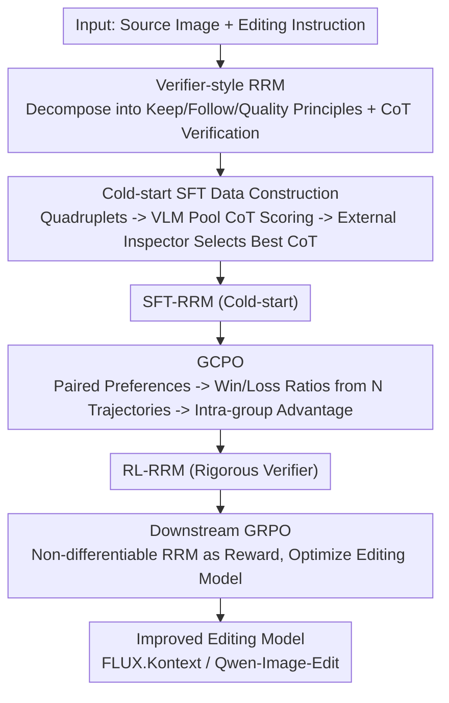

# Leveraging Verifier-Based Reinforcement Learning in Image Editing

**Conference**: CVPR 2026  
**Paper**: [CVF Open Access](https://openaccess.thecvf.com/content/CVPR2026/html/Guo_Leveraging_Verifier-Based_Reinforcement_Learning_in_Image_Editing_CVPR_2026_paper.html)  
**Code**: None  
**Area**: Image Generation / Alignment RLHF / Multimodal VLM  
**Keywords**: Image Editing, Reward Model, Reinforcement Learning, Chain-of-Thought Verifier, GRPO

## TL;DR
Edit-R1 proposes a "verifier-style reasoning reward model" (RRM) to replace coarse global scoring in image editing. It decomposes editing instructions into verifiable principles (Keep/Follow/Quality), uses Chain-of-Thought (CoT) for point-by-point verification, and aggregates them into fine-grained scores. A new RL algorithm, GCPO, is introduced to optimize "point-wise reasoning rewards" using paired preference data, boosting the 7B RRM to 82.2% preference prediction accuracy. Finally, this RRM serves as the reward signal for GRPO to optimize editing models like FLUX.Kontext and Qwen-Image-Edit, delivering consistent quality improvements.

## Background & Motivation

**Background**: In text-to-image (T2I) generation, RLHF has become a core post-training step, utilizing powerful reward models and optimization algorithms like GRPO to align models with human preferences. However, in image **editing**, the application of RLHF remains limited, with research still largely focused on pre-training and SFT stages.

**Limitations of Prior Work**: Evaluation in editing is more granular than in T2I, as it must simultaneously monitor instruction fidelity (did it change what was asked?), preservation of unedited regions (did it keep what should be kept?), and overall quality. Most existing reward models act as "global scorers," where a general VLM outputs a scalar score (e.g., EditScore). These fail to distinguish specific requirements and struggle to balance complex dimensions, resulting in **biased or even hallucinatory feedback**.

**Key Challenge**: Editing quality is essentially a "conjunction of multiple sub-requirements," but a scalar score compresses these into a single number, making it impossible to locate which requirement went unmet. The path forward is to shift from a "scorer" to a "reasoning verifier"—explicitly decomposing instructions, verifying sub-tasks individually, and then aggregating the results.

**Goal**: ① Construct a reliable verifier that follows a structured reasoning process and aligns with human preferences. ② Since this verifier generates multi-step reasoning via discrete token sampling, it is **inherently non-differentiable**; thus, an RL framework must be designed to optimize downstream editing models using it.

**Key Insight**: A key to DeepSeek-R1's success is its "verifiable reward." The authors port this concept to vision: letting the reward model perform principle decomposition and CoT verification to provide structured, principle-based feedback.

**Core Idea**: Build a verifier-based RRM (instructions decomposed into principles $\to$ CoT step-by-step verification $\to$ fine-grained score aggregation). Align it with human preferences via two-stage training (cold-start SFT + a new algorithm, GCPO), and finally use GRPO to optimize editing models using this non-differentiable RRM as the reward.

## Method

### Overall Architecture
Edit-R1 is centered around the Reasoning Reward Model (RRM) and proceeds in three serial stages. **Phase 1 (Cold-start SFT)**: Construction of a large-scale, editing-specific SFT dataset. Instructions are decomposed into "Keep/Follow/Quality" principles. Multiple editing models generate candidates to form quadruplets. A VLM pool performs CoT verification and scoring for each candidate across multiple trajectories. An external VLM acts as a "quality inspector" to select the CoT trajectory with the highest verification accuracy as the SFT supervision, resulting in SFT-RRM. **Phase 2 (GCPO)**: Further alignment using ~10,000 human preference pairs (winner $x_w$ / loser $x_l$). Since standard GRPO/DPO does not fit "point-wise reasoning output vs. paired preferences," the authors propose GCPO. The RRM samples $N$ trajectories for each image, calculates win/loss ratios via cross-group comparisons as rewards, and computes intra-group advantages to refine SFT-RRM into the more rigorous RL-RRM. **Phase 3 (Downstream GRPO)**: The trained non-differentiable RL-RRM serves as the reward signal for Flow-GRPO to optimize downstream editing models (FLUX.Kontext / Qwen-Image-Edit).

### Key Designs

**1. Verifier-style Reasoning Reward Model (RRM): Decomposing Instructions into Verifiable Principles**

To address the issue where global scorers cannot locate specific failures and are prone to bias/hallucination, RRM no longer outputs a single number immediately. Instead, a VLM first **decomposes the editing task into a set of verifiable principles** $P=\{p_k\}_{k=1}^K$, covering three core facets: (a) **Keep**—elements intended to remain unchanged; (b) **Follow**—modifications required by the instruction; (c) **Quality**—general visual integrity and fidelity. This per-sample decomposition "factorizes" the editing task, allowing the model to explicitly distinguish between what should be preserved vs. modified. Subsequently, the RRM uses CoT to verify the edited image against each principle, weighting these results into a final scalar score. This is a **generative, point-wise** verifier that integrates three elements: principles, CoT thinking, and RL learning.

**2. Cold-start SFT Data Construction: Four-step Pipeline + External Inspection**

The RRM's capability is built on a curated SFT dataset via four steps. **① Principle Decomposition**: 200k samples are taken from the Imgedit benchmark (including 100k "hard samples" filtered by GPT-4o). Seed-1.5-VL decomposes each instruction into the three principle types. **② Large-scale Quadruplet Generation**: For each (source image, instruction), multiple editing models (e.g., Flux-Kontext, Bagel, SeedEdit3.0) produce diverse candidates, forming ~2 million quadruplets $(x_{\text{edit}},x_{\text{ref}},q,P)$. **③ VLM CoT Point-wise Scoring**: A VLM pool performs CoT for each quadruplet, verifying each principle and aggregating scores. Multiple "thinking+scoring" candidates are sampled per quadruplet by varying prompts and temperatures. **④ External Verification for CoT Selection**: SeedVLM-1.5 acts as a point-wise inspector to re-verify every principle in each reasoning trajectory. **Only the CoT trajectory with the highest verification accuracy** enters the SFT set. Ablations show "Think+Verify" improves Qwen-7B accuracy from 68.9% to 75.4%, proving both decomposition and filtering are critical.

**3. GCPO: Optimizing "Point-wise Rewards" with Paired Preferences**

The cold-started RRM may still hallucinate or misjudge editing magnitude. The challenge is that RRM produces **point-wise** output (reasoning + score), while human preferences are **paired** (A is better than B). GCPO treats the RRM $R_\phi$ itself as the policy to be optimized. For each preference pair $(x_w, x_l)$, RRM samples $N$ trajectories to get score sets $\{\tau^w_j\}$ and $\{\tau^l_j\}$. It then performs **exhaustive cross-group paired comparisons** to calculate ratios: the win ratio for a winner candidate is $r^w_j=\frac{1}{N}\sum_k \mathbb{1}\{\tau^w_j>\tau^l_k\}$. The loss ratio for a loser candidate is $r^l_j=\frac{1}{N}\sum_k \mathbb{1}\{\tau^l_j<\tau^w_k\}$. **Discarding the original pairs**, the advantage is calculated independently within each rollout group (winner/loser) as $A^w_j=r^w_j-\bar r^w$ and $A^l_j=r^l_j-\bar r^l$. This injects "paired supervision" into a "point-wise scorer."

**4. Downstream GRPO: Non-differentiable RRM as Reward**

Methods like REFL require differentiable rewards. Since RRM produces scores via discrete token sampling, it is non-differentiable. The authors use GRPO instead: the editing model $\pi_\theta(\cdot,c)$ acts as the policy, sampling a group of $G$ edited images for each context $c$. The RRM verifies each image to provide a global reward $\tau_i=\Phi(R_\phi(x^i_0,c,P))$. Intra-group normalization yields the advantage $A_i=\frac{\tau_i-\text{mean}}{\text{std}+\epsilon}$, which is used with a clipped objective and KL regularization for updates. Flow-GRPO is used with group size $G=24$ and KL coefficient $\beta=0.04$.

### Loss & Training
The RRM is based on open-source Qwen-VL-2.5 (3B/7B). The GCPO loss $L_{\text{GCPO}}(\phi)$ is the sum of PPO-style clipped surrogate losses for the winner and loser groups, excluding the KL term; advantages are centralized within groups as per Equation (3). Downstream editing uses Flow-GRPO ($G=24, \beta=0.04$) for post-training FLUX.Kontext and Qwen-Image-Edit.

## Key Experimental Results

### Main Results
Reward Model Evaluation: Tested on an internal benchmark (5000 samples with human pairwise labels) and the public EditRewardBench. Downstream Evaluation: GEdit-Bench-EN, reporting SC (Semantic Consistency), PQ (Perceptual Quality), and O (Overall, geometric mean of SC and PQ).

Accuracy of Reward Models on internal benchmark (T/V/T+V = Think/Verify/Think+Verify):

| Model | T | V | T+V | +GCPO |
|-------|------|------|------|-------|
| Seed-1.5-VL (API) | 72.2% | — | 79.3% | — |
| Seed-1.6-VL (API) | 71.2% | 69.4% | 77.2% | — |
| Qwen-3B (Ours) | 64.1% | 66.1% | 69.3% | 72.0% |
| **Qwen-7B (Ours)** | 68.9% | 70.9% | 75.4% | **82.2%** |

The 7B RL-RRM reaches 82.2%, surpassing the closed-source Seed-1.5-VL (79.3%). On the public EditRewardBench (all 7B models):

| Method | Accuracy |
|--------|--------|
| EditScore-7B | 65.9% |
| EditScore-7B + Reasoning Expansion | 72.7% |
| Ours RRM (SFT only) | 73.3% |
| **Ours RRM (SFT+GCPO)** | **78.2%** |

Downstream Editing (GEdit-Bench-EN):

| Model | SC↑ | PQ↑ | O↑ |
|-------|-----|-----|-----|
| FLUX.Kontext | 6.27 | 7.25 | 5.77 |
| FLUX.Kontext + RL-RRM(7B) | **6.86** | 7.20 | **6.24** |
| Qwen-Edit | 7.94 | 7.78 | 7.45 |
| Qwen-Edit + RL-RRM(7B) | 7.99 | 7.76 | 7.50 |

Optimizing FLUX.Kontext increased the overall score O from 5.77 to 6.24. On the highly optimized Qwen-Edit, improvements were modest (7.45 $\to$ 7.50), though the difficult "Motion Change" category saw a 15.2% relative gain (4.01 $\to$ 4.62).

### Ablation Study

| Configuration | Key Metric | Description |
|---------------|------------|-------------|
| Think only (Qwen-7B) | 68.9% | CoT reasoning only |
| Think+Verify (Qwen-7B) | 75.4% | Adding external verification filtering, +6.5 points |
| + GCPO | 82.2% | Pairwise preference alignment, +6.8 points |
| VIESCORE Prompt SFT | 68.3% | Reference baseline, weaker than full SFT |
| Remove Verify step | Significant Drop⚠️ | Strict data filtering is crucial |

### Key Findings
- **GCPO turns RM into a "stricter judge"**: Training curves show RL-RRM gives lower training rewards but yields higher evaluation rewards, indicating GCPO makes the RM more rigorous.
- **"Verify" filtering is essential**: Removing the external verification step leads to a significant performance drop, proving that strict data filtering is key for cold-start quality.
- **Short-board improvement**: The 15.2% gain in "Motion Change" suggests the framework is particularly effective at addressing specific model weaknesses.

## Highlights & Insights
- **Paradigm shift from "Scorer to Verifier"**: Replacing a scalar score with principle-based CoT verification makes feedback structured, interpretable, and localized. This is ideal for tasks with "conjunctive sub-requirements."
- **GCPO solves a real problem**: It bridges the gap between partnered preference data and point-wise reasoning RMs.
- **Non-differentiable rewards drive GRPO**: The work cleanly ports LLM RLVR experiences to vision editing by using GRPO with a black-box reasoning RM.
- **Interpretability byproduct**: RRM's CoT explains *why* an edit is poor, which is useful for debugging editing models.

## Limitations & Future Work
- **Diminishing returns on strong baselines**: Modest gains on Qwen-Edit suggest that once a model is highly optimized, the benefits of RM-driven RL may saturate.
- **Evaluation Bias**: The overall score O is evaluated by GPT-4.1, which may have its own biases.
- **Heavy Pipeline**: The dependence on multiple strong VLMs for data construction limits reproducibility and ties RRM quality to upstream VLM capabilities.
- **Unanalyzed Error Propagation**: The quality of principle decomposition dictates the RM's ceiling, yet the impact of decomposition errors isn't fully analyzed.

## Related Work & Insights
- **vs. EditScore**: EditScore uses direct scalar scoring; RRM uses principle decomposition + CoT, outperforming EditScore-7B (78.2% vs 65.9%).
- **vs. REFL**: RRM avoids the instability and reward-hacking risks of differentiable rewards by using black-box GRPO.
- **vs. DPO**: While DPO optimizes directly on preferences, GCPO maintains exploration by using group-wise advantages in an RL framework.

## Rating
- Novelty: ⭐⭐⭐⭐ The combination of "Verifier-style RRM + GCPO" is a clear new paradigm for editing RLHF.
- Experimental Thoroughness: ⭐⭐⭐⭐ Comprehensive evaluation across dual benchmarks and model families.
- Writing Quality: ⭐⭐⭐⭐ Logical flow from motivation to application; clear capacity comparison tables.
- Value: ⭐⭐⭐⭐ Provides a reusable reward modeling and alignment paradigm for image editing.

<!-- RELATED:START -->

## Related Papers

- [\[CVPR 2026\] The Image as Its Own Reward: Reinforcement Learning with Adversarial Reward for Image Generation](the_image_as_its_own_reward_reinforcement_learning_with_adversarial_reward_for_i.md)
- [\[CVPR 2026\] Ar2Can: An Architect and an Artist Leveraging a Canvas for Multi-Human Generation](ar2can_an_architect_and_an_artist_leveraging_a_canvas_for_multi-human_generation.md)
- [\[CVPR 2025\] Trust Your Critic: Robust Reward Modeling and Reinforcement Learning for Faithful Image Editing and Generation](../../CVPR2025/image_generation/trust_your_critic_robust_reward_modeling_and_reinforcement_learning_for_faithful.md)
- [\[CVPR 2026\] HiCoGen: Hierarchical Compositional Text-to-Image Generation in Diffusion Models via Reinforcement Learning](hicogen_hierarchical_compositional_text-to-image_generation_in_diffusion_models_.md)
- [\[CVPR 2026\] PaCo-RL: Advancing Reinforcement Learning for Consistent Image Generation with Pairwise Reward Modeling](paco-rl_advancing_reinforcement_learning_for_consistent_image_generation_with_pa.md)

<!-- RELATED:END -->
