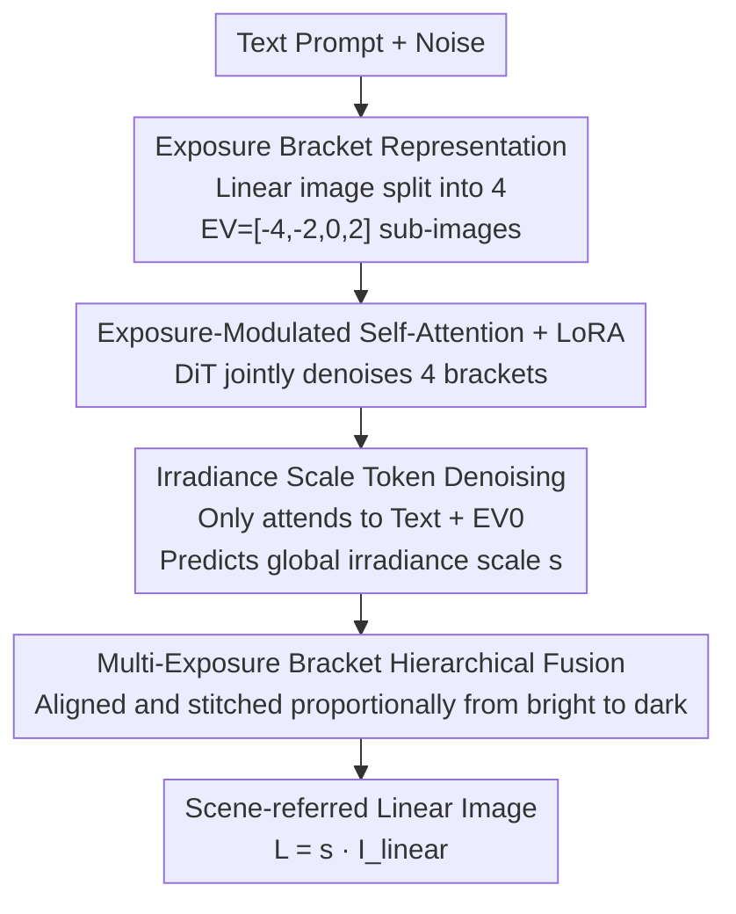

# Linear Image Generation by Synthesizing Exposure Brackets

**Conference**: CVPR 2026  
**Paper**: [CVF Open Access](https://openaccess.thecvf.com/content/CVPR2026/html/Dai_Linear_Image_Generation_by_Synthesizing_Exposure_Brackets_CVPR_2026_paper.html)  
**Code**: Project Page https://ykdai.github.io/projects/raw_gen  
**Area**: Diffusion Models / Image Generation  
**Keywords**: Linear Image Generation, Exposure Bracketing, Flow Matching, DiT, High Dynamic Range (HDR)

## TL;DR
Addressing the limitation that existing generative models only produce ISP-compressed sRGB display images lack editing flexibility, this paper proposes the task of text-to-linear image generation. A high-dynamic-range linear image is split into four "exposure brackets" with different exposure levels. A Flux-based flow matching DiT concurrently generates the bracket sequence and irradiance scale, which are then fused into a scene-referred linear image, outperforming various modified baselines with an FID of 28.29.

## Background & Motivation
**Background**: Images encountered in daily life are almost exclusively display-referred—photons hitting the sensor undergo a complete ISP pipeline (tone mapping, stylization, dynamic range compression). Each pixel encodes "visual appeal" rather than "actual scene radiance." In contrast, linear/scene-referred images record the true irradiance of each pixel on the imaging plane without non-linear tone mapping. These images possess higher dynamic range and bit depth, providing significantly more space for post-processing adjustments such as exposure and white balance (see Fig. 1/2 in the paper).

**Limitations of Prior Work**: Modern generative models (Flux, SD series) are trained almost exclusively on display-referred data like LAION-5B. While the outputs are aesthetically pleasing, their brightness and contrast are constrained by the display dynamic range. Scenes containing both strong highlights and deep shadows are flattened into tone-mapped images; adjusting exposure in post-processing leads to highlight clipping or crushed blacks. Users wishing to edit linear images must first convert them to sRGB, a process that permanently discards dynamic range information.

**Key Challenge**: Direct training of a linear image generation model faces two major barriers. First is **data scarcity**: scene-referred images are typically proprietary to photographers, with only tone-mapped versions available publicly, preventing the use of massive datasets common in standard diffusion models. Second, and more fundamentally, **pre-trained VAEs cannot accommodate linear images**: VAEs in latent diffusion are trained on display images with limited intensity ranges. When faced with high-bit-depth, wide-dynamic-range linear data, they fail to preserve highlights and shadow details simultaneously. Information loss in dark areas after encoding-decoding is severe (Fig. 3), resulting in images that appear captured by a sensor with insufficient dynamic range—extreme highlights and shadows are either truncated or compressed.

**Goal**: The task is decomposed to: (1) bypass the dynamic range bottleneck of the VAE to reliably synthesize high-bit-depth content; (2) efficiently adapt to the linear domain despite limited data; (3) ensure generated linear images are directly compatible with professional post-processing and downstream conditional generation (editing, ControlNet).

**Key Insight**: Inspiration is drawn from **exposure bracketing** in photography. Since a VAE cannot fit a single high-dynamic-range frame, the linear image is decomposed into several exposure sub-images, each covering a specific segment of the dynamic range and falling within the VAE’s optimal $[0, 1]$ range.

**Core Idea**: Instead of "directly generating a single high-dynamic-range linear image," the method "synthesizes a set of exposure brackets and fuses them." A Flux-based flow matching DiT jointly generates four exposure brackets and a global irradiance scale token, followed by hierarchical fusion to assemble the final scene-referred linear image.

## Method

### Overall Architecture
The method tackles "Text → Scene-referred Linear Image." Because the VAE cannot directly reconstruct high-dynamic-range linear images, the pipeline adopts a circumventive route: the linear image is first decomposed using preset exposure values $EV=[-4,-2,0,2]$ into $K=4$ exposure bracket sub-images $I_k=\mathrm{call}(I_{linear}\cdot 2^{ev_k},0,1)$, ensuring each fits within the VAE's range. These four images share the same VAE encoder and are concatenated along the sequence dimension into a unified latent $z_{all}\in\mathbb{R}^{KL\times C}$. The generation side starts from two sets of Gaussian noise: one for the latents of the four brackets $z_t$, and another for a $1\times C$ irradiance scale token $R$. They pass through $N_1$ MM-DiT blocks (with LoRA) and $N_2$ Single-DiT blocks (with LoRA + exposure-modulated self-attention). After flow matching denoising, the bracket tokens are decoded by the VAE into four exposure brackets, and the irradiance scale token is projected back to a scalar $s$. Finally, a "multi-exposure bracket fusion" module blends the four brackets into the final linear image $\hat I_{linear}$, and $s$ recovers the physical irradiance $L=s\cdot\hat I_{linear}$.

### Key Designs

**1. Exposure Bracketing Representation: Decomposing HDR into VAE-compatible segments**

This is the fundamental strategy to bypass the VAE bottleneck. Given a normalized linear image $I_{linear}$ and exposure values $EV=[-4,-2,0,2]$, each bracket $I_k=\mathrm{clip}(I_{linear}\cdot 2^{ev_k},0,1)$ is equivalent to capturing the same scene with different shutter speeds. The $ev_{-4}$ bracket brightens dark areas to reveal shadow details, while the $ev_{2}$ bracket darkens highlights to preserve bright details. Since each is clipped to $[0,1]$, they can be encoded-decoded by a pre-trained VAE without loss. Concatenating them along the sequence dimension allows the model to express a wide dynamic range using the union of multiple narrow-dynamic-range images.

**2. Exposure-Modulated Self-Attention + 3D-RoPE: Maintaining structural alignment across exposures**

The four brackets must represent the same scene at different exposures. Exposure-Modulated Self-Attention performs joint attention across all brackets, allowing the model to adjust brightness flexibly while maintaining structural alignment and detail consistency. To distinguish which bracket a token belongs to, 2D coordinates $(i,j)$ are extended to 3D tuples $(index, i, j)$, where $index=k\in\{0,\dots,K-1\}$ represents the bracket ID (3D-RoPE). Tokens at the same spatial location across different exposures share spatial semantics via $(i,j)$ but are decoupled by the $index$. LoRA fine-tuning (rank 64, $\alpha$=128) ensures the Flux backbone remains stable under the rapidly changing exposure distributions.

**3. Irradiance Scale Token Denoising: Explicit physical brightness prediction**

Recovering physical irradiance $L=s\cdot I_{linear}$ requires the global scale $s$. Instead of a separate regression head, $s$ is treated as a token participating in the denoising process. The log-irradiance $s_l=\log_{10}(s)$ is discretized into 20 bins over $[-6, 4]$, encoded as a one-hot $s_d$, and projected into the diffusion sequence via $t_s=Ws_d$. During inference, the updated token is projected back to the bin space $\hat s_d=\mathrm{softmax}(\hat t_sW^\top)$ and the expectation is taken. A dedicated **attention mask** ensures the scale token only attends to text tokens and the EV0 (reference exposure) bracket tokens, preventing bias from overexposed or underexposed brackets. Ablations show this strategy (MAE 0.737) outperforms various global pooling + MLP alternatives.

**4. Multi-Exposure Bracket Hierarchical Fusion: Seamless reconstruction of the linear image**

Fusion proceeds from the brightest bracket, iteratively merging darker ones. For adjacent brackets $\hat I_k, \hat I_{k+1}$, a three-channel ratio vector $r_k$ is calculated in non-saturated regions to align brightness transitions. At each step $k$, a soft mask $M_k\in[0,1]^{H\times W\times 3}$ identifies areas where the current bracket provides high-fidelity, non-saturated information. The fusion follows $\hat I_{fused}\leftarrow \hat I_{fused}\cdot(1-M_k)+(\hat I_k\cdot r_k)\cdot M_k$. This recursive weighting ensures smooth transitions and radiometric consistency.

### Loss & Training
The model is trained within a flow matching framework with a total loss $L=L_{img}+\lambda_{rad}L_{rad}+\lambda_{bracket}L_{bracket}$ ($\lambda_{rad}=1.0$, $\lambda_{bracket}=0.5$):

- **Image Flow Matching Loss** $L_{img}$: Learns the velocity field mapping noise back to clean bracket latents.
- **Irradiance Scale Loss** $L_{rad}$: Supervises the irradiance token in the same velocity space.
- **Bracket Consistency Loss** $L_{bracket}$: Enforces the physical multiplicative irradiance ratios between exposure frames and the EV0 reference in pixel space.

Training data includes 25k images from RAISE and self-collected RAW images, pre-processed through demosaicing, CCM/LUT conversion to camera-independent RGB, white balance unification (5000K), and conversion via CIE-XYZ. Irradiance scale $s$ is robustly estimated using 0.5/0.9 quantiles. The backbone is Flux-dev, trained on 4×A100 GPUs for 10,000 steps with bf16.

## Key Experimental Results

Evaluation is performed on the MIT-Adobe FiveK dataset. Metrics include **LS** (dynamic range related score), **AS** (Aesthetic Score), **NIQE** (blind image quality), and **CLIP Sim.** (text-image consistency).

### Main Results
Since no direct "linear image generation" method previously existed, three types of baselines were adapted for comparison:

| Type / Model | FID ↓ | AS ↑ | NIQE ↓ | CLIP Sim. ↑ | LS ↑ |
|------|------|------|------|------|------|
| T2I Finetuned Flux | 32.12 | 4.712 | 5.304 | 25.90 | / |
| T2V Finetuned Wan 2.1 | / | 4.537 | 5.411 | 24.79 | 1.12 |
| T2I Inflated CameraCtrl (w/ F) | 37.25 | 5.230 | 4.131 | **26.89** | 8.97 |
| T2I Inflated Gen. Photo. (w/ F) | 40.17 | 4.619 | 4.514 | 23.71 | 7.11 |
| **Ours** | **28.29** | **5.700** | **3.658** | 26.02 | **23.06** |

Ours achieves an LS of 23.06, nearly doubling the strongest baseline (CameraCtrl at 8.97), indicating that the exposure bracketing scheme effectively expands the dynamic range. Ours also leads in FID, AS, and NIQE.

### Ablation Study: Irradiance Scale Estimation

| Configuration | MAE ↓ | Description |
|------|------|------|
| Text-MLP | 0.782 | Only text token pooling + MLP |
| Image-MLP | 1.213 | Only image token pooling + MLP |
| Merge-MLP | 0.792 | Concat text + image pooling + MLP |
| **Ours (token denoising)** | **0.737** | Irradiance token participates in joint denoising |

### Key Findings
- **Exposure bracketing is the key to dynamic range**: The LS score of our method is approximately 2.6x that of the best baseline, validating that "splitting brackets to bypass VAE" is far more effective than forcing HDR content into the VAE.
- **T2V approaches (Wan 2.1) are ineffective**: The 4x temporal downsampling in T2V compresses the four exposure brackets into a single latent, causing severe distribution mismatch that fine-tuning cannot resolve.
- **Irradiance scale token denoising outperforms global pooling**: MAE 0.737 is superior to pooling methods, as token denoising leverages both text semantics and image spatial cues through attention.

## Highlights & Insights
- **"Decomposing content unsuitable for the model into suitable parts" is a reusable paradigm**: Exposure bracketing uses multiple narrow-range images to represent one wide-range image, bypassing VAE limits. This is applicable to any generation task where target signals exceed pre-trained encoder ranges (e.g., high-bit-depth medical or HDR panoramas).
- **Treating scalar physical quantities as tokens with directional attention masks is elegant**: Allowing the scale token to attend only to specific frames prevents contamination of image fidelity while ensuring robust global brightness estimation.
- **Transferring large-scale T2I priors to new physical domains is cost-effective**: Using Flux + LoRA with only 25k images and 10k steps demonstrates that aesthetic priors can be efficiently migrated to linear spaces.

## Limitations & Future Work
- **Fixed exposure values and bracket counts**: $EV=[-4, -2, 0, 2]$ and $K=4$ are fixed hyperparameters. Their sufficiency for extreme HDR scenes (e.g., sun + deep shadow) or adaptive selection is not discussed.
- **Dependency on private/collected RAW data**: The training set is small (25k), which may limit generalization to rare content categories outside the training distribution.
- **Heuristic fusion as post-processing**: The hierarchical fusion relies on hand-crafted soft masks and ratio alignments; end-to-end learnable fusion is a potential future direction.

## Related Work & Insights
- **vs Bracket Diffusion**: Both use "multi-exposure brackets," but Bracket Diffusion relies on test-time optimization and takes minutes per image; ours is a feed-forward DiT.
- **vs sRGB-to-RAW Reconstruction**: Those methods assume a reversible ISP; ours establishes a "linear image generation prior" directly from text, filling the void in direct RAW/linear image generation.
- **vs T2I Inflation**: Traditional temporal modules for video are not designed for linear dynamic ranges, leading to significantly lower LS scores compared to our bracket-based approach.

## Rating
- Novelty: ⭐⭐⭐⭐⭐ First text-to-linear framework; clear reasoning for bypassing VAE limits via brackets.
- Experimental Thoroughness: ⭐⭐⭐⭐ Solid main results and scale estimation ablations; lacks direct competitors due to task novelty.
- Writing Quality: ⭐⭐⭐⭐ Clear motivation and illustrations.
- Value: ⭐⭐⭐⭐ Links generative models to professional photography; paradigm is transferable to other high-bit-depth tasks.

<!-- RELATED:START -->

## Related Papers

- [\[ICCV 2025\] LiT: Delving into a Simple Linear Diffusion Transformer for Image Generation](../../ICCV2025/image_generation/lit_delving_into_a_simple_linear_diffusion_transformer_for_image_generation.md)
- [\[CVPR 2025\] LEDiff: Latent Exposure Diffusion for HDR Generation](../../CVPR2025/image_generation/lediff_latent_exposure_diffusion_for_hdr_generation.md)
- [\[CVPR 2026\] Gated Condition Injection without Multimodal Attention: Towards Controllable Linear-Attention Transformers](gated_condition_injection_without_multimodal_attention_towards_controllable_line.md)
- [\[CVPR 2026\] Beyond Fixed Formulas: Data-Driven Linear Predictor for Efficient Diffusion Models](beyond_fixed_formulas_data-driven_linear_predictor_for_efficient_diffusion_model.md)
- [\[CVPR 2026\] Frequency-Aware Flow Matching for High-Quality Image Generation](freqflow_frequency_aware_flow_matching.md)

<!-- RELATED:END -->
