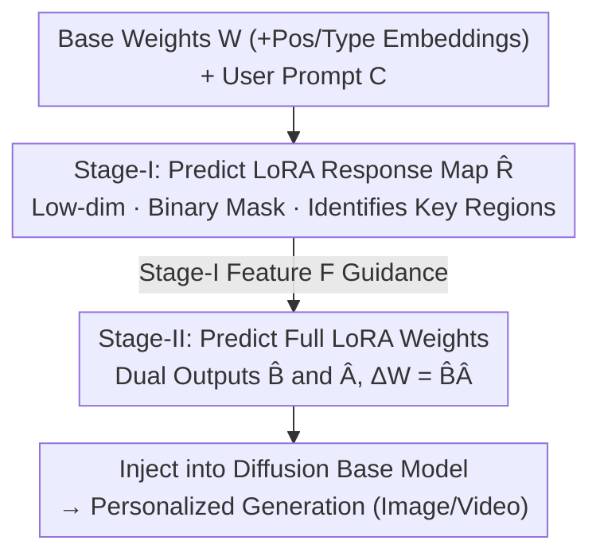

# LoFA: Learning to Predict Personalized Prior for Fast Adaptation of Visual Generative Models

**Conference**: CVPR 2026  
**Paper**: [CVF Open Access](https://openaccess.thecvf.com/content/CVPR2026/html/Hao_LoFA_Learning_to_Predict_Personalized_Prior_for_Fast_Adaptation_of_CVPR_2026_paper.html)  
**Code**: Project Page https://jaeger416.github.io/lofa (Code and pre-trained models promised to be open-sourced)  
**Area**: Diffusion Models / Image Generation / Personalization  
**Keywords**: Hypernetwork, LoRA Prediction, Fast Adaptation, Personalized Generation, Video Generation

## TL;DR
LoFA uses a hypernetwork to directly predict "full, uncompressed" personalized LoRA weights within seconds. It first identifies structured "response map" patterns in the changes of LoRA relative to base model weights. Then, it utilizes a two-stage hypernetwork to predict these response maps first, followed by utilizing them to guide the prediction of final LoRA weights. This allows it to meet or even exceed the performance of traditional LoRA, which requires hours of per-instance fine-tuning, across various conditions such as text, pose, style, and faces.

## Background & Motivation
**Background**: Personalizing large-scale visual generative models (text/image/video) to specific user needs is typically achieved by training a separate LoRA (Low-Rank Adaptation) adapter for each requirement. This decomposes the residual weights $\Delta W$ into two low-rank matrices $B\in\mathbb{R}^{m\times r}$ and $A\in\mathbb{R}^{r\times n}$, such that the final weights are $W' = W + BA$.

**Limitations of Prior Work**: Per-instance LoRA fine-tuning requires specialized data collection and several hours of optimization, making it nearly unusable for real-world scenarios requiring rapid response. A few hypernetwork-based methods attempt to predict adaptation weights directly at inference time. However, learning a mapping from low-dimensional fine-grained prompts to high-dimensional complex LoRA distributions is extremely difficult. To simplify learning, these methods generally compress LoRA weights into a low-dimensional space via autoencoders or matrix decomposition, which inevitably leads to information loss and limits model capacity. Consequently, they have only been validated in restricted scenarios like subject identity personalization in images.

**Key Challenge**: Speed requires direct prediction of LoRA, but direct prediction faces the difficulty of brute-force "low-dim prompt $\to$ high-dim LoRA" mapping. Conversely, bypassing this by compressing LoRA sacrifices expressivity. Achieving speed, zero compression, and fine-grained prompt handling simultaneously is a major hurdle.

**Goal**: To create a universal framework capable of directly predicting **full, uncompressed** personalized LoRA weights from diverse and fine-grained user prompts, supporting various personalization tasks for both images and videos.

**Key Insight**: Instead of learning a brute-force "prompt $\to$ LoRA" mapping, the authors observe the structure of LoRA itself. Since LoRA is a residual $\Delta$ on the base model weights, they focus on the relative change (ratio map) between $\Delta W$ and $W$. They discovered that clear structured patterns emerge within this relative change, and these patterns are much lower-dimensional and simpler than the LoRA weights themselves.

**Core Idea**: Embed an inductive bias—predicting a low-dimensional LoRA response map first and using it to guide the prediction of full LoRA weights—into the hypernetwork. This structured guidance replaces brute-force mapping, thereby preserving full expressivity while stabilizing the learning process.

## Method

### Overall Architecture
During training, given a triplet (user condition $C$, target LoRA weights $\Delta W$, base model weights $W$), LoFA learns a two-stage Transformer hypernetwork $f$ aimed at predicting $\Delta W$ from $C$ and $W$, i.e., $f(C, W)\to\Delta W$. The key lies in splitting this prediction into two steps: **Stage I** predicts only a low-dimensional, simple "response map" that identifies which base model parameters are significantly modified by the prompt. **Stage II** inherits the network and learned response knowledge from Stage I to predict the full LoRA matrices $B$ and $A$. At inference time, given a new prompt, the hypernetwork outputs the corresponding $\Delta W$ in seconds, which is then injected into the base model.

The pipeline comprises: Base model weights $W$ (with positional/type embeddings) + user prompt $C$ as input $\to$ Stage-I predicts response map $\hat{R}$ $\to$ Stage-II uses Stage-I feature guidance to predict full LoRA weights $\to$ Injection into the diffusion model for personalized generation. Both stages share an architecture where "base model weights are input and the prompt is injected via cross-attention."

### Key Designs

**1. LoRA Response Map: Discovering and Utilizing Structured Patterns**

This is the foundation of the paper. Directly predicting full LoRA is difficult, forcing existing methods to use compression. This work takes a different perspective by focusing on the "relative change" of the LoRA residual against the base model. For the $i$-th parameter in a layer, the normalized response magnitude is defined as $m_i = |\Delta w_i / w_i|$. The authors found that approximately 50%–80% of parameters have a response below 2%. Thus, a binary mask response map $R = \{r_i \mid r_i = 1 \text{ if } m_i > 2\% \text{ else } 0\}$ is generated. $r_i=1$ marks "useful parameters" and $r_i=0$ marks "negligible parameters." Visualizations show that $R$ exhibits distinct but structured distributions across different tasks, varying with network depth and module type (e.g., query/key projections). By soft-injecting this map into the hypernetwork, the model can prioritize key adaptation regions, simplifying and stabilizing learning. Crucially, as the map is only "guidance," the final output retains full LoRA parameter counts without losing expressivity.

**2. Stage-I Response Map Prediction: Learning "Where to Change" via Low-dim Supervision**

The first stage is a Transformer hypernetwork $f_\theta$ that takes the base model's original parameters $W$ as input to predict the response map $R$. Internally, self-attention captures implicit correlations between parameters, and cross-attention injects the user condition $C$. Since $R$ varies with depth and module type, each block's $R$ is treated as a sample. The authors introduce two learnable embeddings: a blockwise positional embedding $E_{pos}$ for layer depth and a block-type embedding $E_{type}$ for module role. The learning objective is $f_\theta(W + E_{pos} + E_{type}, C)\to\hat{R}$, where $\hat{R}$ is activated via Sigmoid. Training uses standard cross-entropy $L_{stage1} = -R\log\hat{R}$. Because the response map is much simpler than LoRA, this step converges stably and provides a reliable prior for the second stage.

**3. Stage-II Response-Guided Full LoRA Prediction: Uncompressed Weights with Full Expressivity**

The second stage $f_\phi$ reuses the Transformer backbone from Stage I (initialized with Stage-I weights to inherit response priors and parameter dependencies). The MLP head is replaced with two independent parameter prediction heads to output $B$ and $A$, such that $\Delta W = BA$. Crucially, it employs additional cross-attention in specific blocks to attend to the final layer features $F_{stage1}$ from the Stage-I model, passing on the "where to change" knowledge: $f_\phi(W + E_{pos} + E_{type}, C, F_{stage1})\to(\hat{B}, \hat{A})$. Training utilizes two complementary objectives: a reconstruction loss $L_{recon} = \|A-\hat{A}\|_1 + \|B-\hat{B}\|_1$ to ensure structural rationality, and a diffusion loss that injects predicted LoRA into the base model to perform task-level supervision under the Flow Matching paradigm: $L_{diff} = \mathbb{E}_{x_0,t,\epsilon}[\|\epsilon - \epsilon_\theta(x_t, t; \hat{A}, \hat{B})\|_2^2]$. This ensures the generative behavior aligns with the target. The total objective is $L_{stage2} = \lambda_{recon}L_{recon} + \lambda_{diff}L_{diff}$. The output is **full and uncompressed**, avoiding information loss.

**4. Architecture with Base Weights as Input and Prompts via Cross-Attention**

Contrary to the brute-force route of using prompts as the primary input, LoFA treats the base model weights $W$ as the input, with user prompts $C$ serving only as conditional signals via cross-attention. The intuition is that since LoRA is a relative adaptation of $W$, learning changes given $W$ is easier than generating high-dimensional weights from a low-dimensional prompt in a vacuum. Ablation studies (Tab. 4 "prompt input") confirm that using the prompt as the primary input significantly degrades performance.

### Loss & Training
- Stage-I: Cross-entropy $L_{stage1} = -R\log\hat{R}$ to learn only the response map.
- Stage-II: $L_{stage2} = \lambda_{recon}L_{recon} + \lambda_{diff}L_{diff}$, where $L_{recon}$ is L1 reconstruction for $A$ and $B$, and $L_{diff}$ provides diffusion-level task supervision under Flow Matching.
- The Stage-II Transformer is initialized by Stage-I and reads Stage-I features $F_{stage1}$ via cross-attention.
- Video tasks use WAN2.1-1.3B as the base model; image tasks use Stable Diffusion XL. Pose conditions use multi-layer 3D convolutions as a pose encoder, while style/face conditions use CLIP-ViT-L features projected via MLP.

## Key Experimental Results

### Main Results
Task 1: Personalized human motion video generation conditioned on text/pose (Base model WAN2.1-1.3B). 2,630 LoRAs were trained to form a text-LoRA dataset, with 60 unseen motion categories (877 pairs) for validation. Metrics: FVD (distribution similarity, ↓), CLIP-T (text-video alignment, ↑), Dynamic Degree (motion quality from VBench, ↑).

| Method | FVD ↓ | CLIP-T ↑ | Dynamic Degree ↑ |
|--------|-------|----------|------------------|
| LoRA [16] (Per-instance opt.) | 609.5 | 0.3662 | 0.2269 |
| Text-to-LoRA [4] (Direct predict) | 907.5 | 0.3541 | 0.0745 |
| **LoFA-Text (Ours)** | **589.8** | **0.3719** | 0.2283 |
| **LoFA-Pose (Ours)** | 610.7 | 0.3687 | **0.2297** |

LoFA significantly outperforms the direct prediction baseline Text-to-LoRA and achieves better FVD/CLIP-T scores than LoRA fine-tuning which takes hours. The authors suggest that while per-instance LoRA might slightly overfit specialized tasks, LoFA learns a more generalized motion prior across multiple tasks.

Task 3: Identity-personalized image generation (Base model SDXL, trained on 3,100 DreamBooth LoRAs).

| Method | Face Sim ↑ | DINO ↑ | CLIP-I ↑ | Face Div ↑ | Time ↓ |
|--------|-----------|--------|----------|-----------|--------|
| DreamBooth [37] (Per-instance) | 0.488 | 0.460 | 0.544 | 47.3 | 1h |
| DiffLoRA [53] (Direct predict) | 0.461 | 0.427 | 0.517 | 46.8 | 20s |
| HyperDreamBooth [38] (W/ opt.) | 0.527 | 0.462 | 0.565 | 46.1 | 274s |
| **LoFA (Ours)** | **0.548** | **0.497** | **0.600** | **50.3** | **3.7s** |

LoFA leads in all metrics with an inference time of only 3.7 seconds (compared to 274s for HyperDreamBooth due to its required optimization and 1 hour for DreamBooth). In video stylization (Tab. 2), LoFA's CSD-Score (0.427), CLIP-T (0.2943), and Dynamic Degree (2.394) also exceed per-instance LoRA.

### Ablation Study
Tab. 4 ablates key components across three tasks (Video: FVD/D.D., Stylization: CSD/CLIP-T, Face: Face Sim/DINO):

| Configuration | FVD ↓ | D.D. ↑ | CSD ↑ | Face Sim ↑ | Description |
|---------------|-------|--------|-------|------------|-------------|
| Full Model | 589.8 | 0.2283 | 0.427 | 0.548 | Two-stage + Response guidance |
| w/o res. | 665.4 | 0.2117 | 0.394 | 0.497 | Single-stage; significant drop |
| lightweight | 655.1 | 0.2090 | 0.408 | 0.527 | Implicit features; inferior to map |
| prompt input | 653.7 | 0.2058 | 0.411 | 0.529 | Brute-force mapping drop |

### Key Findings
- **Response Map Prediction (Stage-I) is the most critical design**: Removing it reduces the model to single-stage direct prediction, causing performance drops across all tasks (most notably in video), proving the importance of the response distribution prior.
- **Guidance validity**: On the validation set, the cosine similarity between the Stage-I predicted map and the ground truth is 0.77. The Stage-II predicted LoRA's implied response map has 0.91 similarity with Stage-I and 0.83 with ground truth, indicating Stage-II successfully focuses on high-response regions.
- **Scalability**: LoFA continues to benefit as more training LoRA pairs are added (Fig. 8), whereas baselines like Text-to-LoRA plateaus due to limited capacity.
- **Conditioning Strength**: Text-conditioning (using T5-XXL) provides stronger semantics and higher CLIP-T/quality than pose-conditioning, although pose-conditioning remains competitive in motion quality (Dynamic Degree).

## Highlights & Insights
- **Bypassing Brute-force Mapping**: Instead of mapping low-dim prompts to high-dim weights directly, LoFA identifies structured "response maps" as low-dim, learnable intermediates. This "coarse-to-fine" approach using structured intermediates can be transferred to other parameter-prediction tasks.
- **Speed without Compression**: While previous direct prediction methods relied on compression (sacrificing expressivity), LoFA uses "base weights as input + response guidance" to reduce learning difficulty while outputting full LoRA weights. It rivals/exceeds fine-tuning in just 3.7 seconds.
- **Verifiable Intermediates**: The use of cosine similarity to verify that Stage-I predicts correctly and Stage-II follows the guidance turns a quality metric into a quantifiable intermediate assessment.

## Limitations & Future Work
- The training stage requires a massive dataset of pre-trained per-instance LoRAs (e.g., 2,630 for video, 3,100 for faces). While inference is fast, the initial system construction cost is high—a point the paper does not emphasize heavily.
- Video experiments were limited to WAN2.1-1.3B; scalability to larger video models remains unverified.
- Pose-driven quality still lags slightly behind text-driven quality; unified representation for cross-modal conditions needs improvement.
- The 2% threshold for response maps is empirical; its robustness across models and tasks requires further validation.

## Related Work & Insights
- **vs HyperDreamBooth [38]**: Both use hypernetworks, but HyperDreamBooth requires post-optimization (274s) and compressed LoRA, focusing on identity. LoFA is faster (3.7s), uses uncompressed weights, and supports multiple tasks.
- **vs DiffLoRA [53]**: DiffLoRA avoids post-optimization but uses autoencoders to compress LoRA, leading to semantic loss. LoFA preserves expressivity (Face Sim 0.548 vs 0.461).
- **vs Text-to-LoRA [4]**: Originally for LLMs. When scaled to video, the brute-force mapping struggles with capacity (FVD 907.5). LoFA's structured guidance drops FVD to 589.8.

## Rating
- Novelty: ⭐⭐⭐⭐⭐ The "LoRA Response Map" and two-stage guidance are truly novel and transferable.
- Experimental Thoroughness: ⭐⭐⭐⭐ Coverage of four condition types and two generation domains is comprehensive; however, base models are relatively small and training-side costs are under-discussed.
- Writing Quality: ⭐⭐⭐⭐ Clear logical chain. The visualization and verification of the response map are highlights.
- Value: ⭐⭐⭐⭐⭐ Reducing personalization from hours to seconds without quality loss has direct practical value.

<!-- RELATED:START -->

## Related Papers

- [\[CVPR 2026\] Learning What to Trust: Bayesian Prior-Guided Optimization for Visual Generation](learning_what_to_trust_bayesian_prior-guided_optimization_for_visual_generation.md)
- [\[CVPR 2026\] Transition Models: Rethinking the Generative Learning Objective](transition_models_rethinking_the_generative_learning_objective.md)
- [\[CVPR 2026\] DCoAR: Deep Concept Injection into Unified Autoregressive Models for Personalized Text-to-Image Generation](dcoar_deep_concept_injection_into_unified_autoregressive_models_for_personalized.md)
- [\[ICML 2026\] Compression as Adaptation: Implicit Visual Representation with Diffusion Foundation Models](../../ICML2026/image_generation/compression_as_adaptation_implicit_visual_representation_with_diffusion_foundati.md)
- [\[CVPR 2026\] Language-Free Generative Editing from One Visual Example](language-free_generative_editing_from_one_visual_example.md)

<!-- RELATED:END -->
