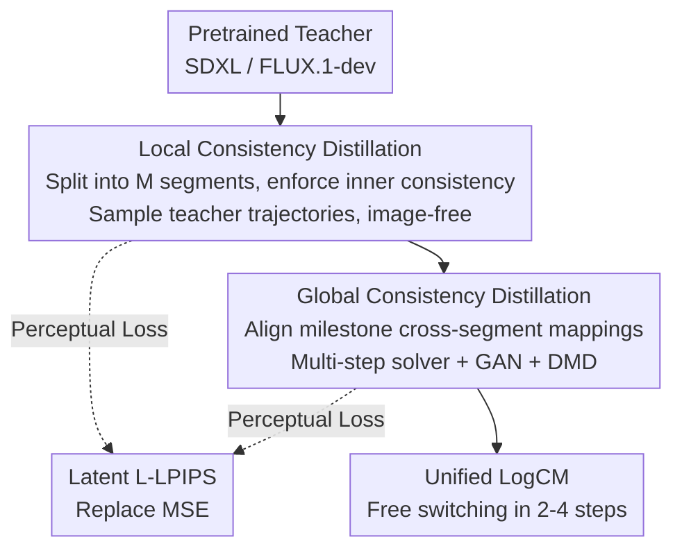

# LogCD: Local-to-global Consistency Distillation for Few-step Image Generation

**Conference**: CVPR 2026  
**Paper**: [CVF Open Access](https://openaccess.thecvf.com/content/CVPR2026/html/Xie_LogCD_Local-to-global_Consistency_Distillation_for_Few-step_Image_Generation_CVPR_2026_paper.html)  
**Code**: None  
**Area**: Diffusion Models / Image Generation  
**Keywords**: Diffusion Acceleration, Consistency Distillation, Few-step Sampling, Image-free Distillation, SDXL/FLUX  

## TL;DR
LogCD utilizes a two-stage "local-to-global" consistency distillation to compress large diffusion/rectified flow models (e.g., SDXL / FLUX.1-dev) into unified 2–4 step sampling models. Without requiring any training images, it enables SDXL to achieve a 33.5 CLIP score in 3-step sampling with only 70 A100 hours, approaching the performance of the 25-step teacher model.

## Background & Motivation
**Background**: Latent diffusion models (LDMs, such as SDXL) and rectified flow models (RFMs, such as FLUX.1-dev) can generate high-quality images but require dozens or hundreds of model forwards during sampling, leading to slow inference and high computational costs. Distilling them into rapid models with one- or few-step sampling is a current research hotspot, with representative methods including LCM, SDXL-Lightning, PCM, DMD2, HyperSD, Flash SDXL, etc.

**Limitations of Prior Work**: These methods generally face a trade-off dilemma—either requiring large amounts of high-quality image-text training data and lengthy training times (e.g., DMD2 requires 3840 A100 hours), or suffering from severe degradation in image quality and **text-image alignment** when compressed to fewer than 4 steps (e.g., LCM/PCM generate blurry images at 4 steps). Although HyperSD improves consistency models using multi-stage distillation, it introduces redundant sub-trajectory consistency distillation and a complex training workflow, resulting in a significant drop in text-image alignment and massive training overhead (800 A100 hours).

**Key Challenge**: Learning global consistency across the entire time interval $[0,T]$ in a single shot is inherently difficult—single-stage distillation (LCM/PCM) struggles to converge, while multi-stage distillation (HyperSD) consumes excessive resources. Image quality, text-image alignment, and training costs pull against each other.

**Goal**: The authors make a realistic assessment—**one-step generation is not necessarily optimal in practical applications**, and many scenarios can tolerate 2–4 steps to trade for better image quality. Hence, the goal is to build a **unified model** that can freely switch between 2/3/4 steps (where more steps yield better quality) with extremely low training costs.

**Key Insight**: A divide-and-conquer approach. Instead of directly tackling consistency across the entire trajectory, $[0,T]$ is partitioned into several short segments to learn local consistency within each segment (a simpler task), followed by a global phase to align mapping across different segment boundaries.

**Core Idea**: A two-stage pipeline consisting of "local consistency distillation + global consistency distillation", paired with latent-perceptual loss (L-LPIPS) and an **image-free** training strategy, to cheaply distill large models into unified few-step samplers.

## Method

### Overall Architecture
The input to LogCD is a pretrained teacher diffusion/rectified flow model (SDXL or FLUX.1-dev), and the output is a student model LogCM that only trains LoRA (rank=64), enabling 2–4 step sampling. The entire pipeline runs sequentially in two stages: **Stage 1 Local CD** cuts the timeline $[0,T]$ into $M$ sub-intervals (default $M=8$) and enforces consistency within each interval, allowing the model to first learn to sample high-quality images in $M$ steps; **Stage 2 Global CD** only enforces consistency between predefined milestone time steps $\{t^s_{step}\}$, learning the mapping of large step-skips across intervals to compress the step count down to 2–4. Both stages employ an **image-free strategy**: the local stage takes training samples from the teacher's sampling trajectory, while the global stage utilizes synthetic images generated by the student itself. At the perceptual level, an L-LPIPS loss trained in the latent space is introduced to replace MSE.

### Key Designs

**1. Local Consistency Distillation: Decomposing "global trajectory consistency" into simpler sub-tasks of "consistency within each small segment"**

Directly learning consistency across the entire $[0,T]$ is overly difficult (a common failure mode of LCM/PCM). LogCD applies divide-and-conquer: it cuts the timeline into $M$ sub-intervals with milestones defined as $0=t^0_{step}<t^1_{step}<\cdots<t^M_{step}=T$, and **enforces consistency only within each interval $[t^s_{step},t^{s+1}_{step}]$**. That is, any point within an interval is mapped to the fixed endpoint $t^s_{step}$ of that interval. The loss takes an MSE form:

$$L^{MSE}_{LoCD}=\big\|g_\theta(z_{t_m},t_m,t^s_{step},c)-\mathrm{sg}(g_\theta(z_{t_n},t_n,t^s_{step},c))\big\|_2^2$$

where $t_n=t_m-skip$, and $g_\theta(z_{t_m},t_m,t^s_{step},c)=\Psi(z_{t_m},f_\theta(z_{t_m},c,t_m),t_m,t^s_{step})$. Several key engineering design choices: ① **Fixed interval endpoints** $t^s_{step}$ are used, unlike CTM/HyperSD which randomly samples endpoints, avoiding redundant objectives and leading to faster convergence; ② skip is set to 20 to speed up convergence; ③ **stop-gradient (sg) is used to replace the EMA model**, saving GPU memory; ④ CFG is explicitly integrated into the target: $\hat\epsilon_{\theta_0}(z_t,c,w,t):=\epsilon_{\theta_0}(z_t,\varnothing,t)+w(\epsilon_{\theta_0}(z_t,c,t)-\epsilon_{\theta_0}(z_t,\varnothing,t))$, as high-quality text-image alignment relies heavily on CFG. This stage allows the model to first acquire the capability to sample good images in $M$ steps, which serves as the foundation for reducing steps later.

**2. Global Consistency Distillation: Aligning only the "actually used" milestone cross-segment mappings to compress steps down to 2–4**

Local CD only guarantees consistency within $M$ steps. Once the step count decreases (increasing the sampling step size), discretization errors skyrocket, causing image quality to degrade. Global CD explicitly teaches the model to learn state mappings **across different intervals**: unlike original CD which forces "any point on the trajectory to map directly to real data", global CD **enforces consistency only between predefined milestones $\{t^s_{step}\}$**, discarding trajectories that will never be visited during inference. This simplifies mapping learning and aligns training with inference. In this stage, skip directly becomes a large step-skip of $T/M$, accelerating convergence. However, large step-skips amplify discretization errors of a single-step solver. To address this, the authors employ a **multi-step solver**: dividing the interval $T/M$ evenly into $p$ parts and using a $p$-step solver with CFG to estimate $\hat z_{t_n}$ (default $p=3$). The MSE loss is formulated as:

$$L^{MSE}_{GoCD}=\big\|f_\theta(\hat z_{t_m},c,t_m)-\mathrm{sg}(f_\theta(\hat z_{t_n},c,t_n))\big\|_2^2,\quad t_n=t_m-T/M$$

Under high-resolution generation, pure MSE fails to capture distribution discrepancies, so two levels of distribution-level constraints are stacked: a **GAN loss** $L^{GAN}_{GoCD}$, which aligns the distribution consistency between the student's outputs at adjacent milestones $\tilde z^0_{t_m}$ and $\tilde z^0_{t_n}$, rather than aligning "student output vs. real data"; and an **image-free DMD loss** $L^{DMD}_{GoCD}$, which pulls the generation distribution closer to the real distribution using a pretrained score model and a fake score model. The total loss is $L_{GoCD}=L^{MSE}_{GoCD}+\lambda_1 L^{GAN}_{GoCD}+\lambda_2 L^{DMD}_{GoCD}$ (with $\lambda_1=0.1, \lambda_2=1$ on SDXL). With this design, global CD for SDXL requires only 3K iterations to yield quality results.

**3. Latent L-LPIPS: Supplementing perceptual consistency without decoding back to pixel space**

MSE only constrains numerical consistency in the latent space and fails to capture perceptual features. Conversely, while LPIPS aligns well with human perception, it is designed for the **pixel space**—decoding latent codes back to pixels to compute LPIPS drastically increases GPU memory and training time. The authors directly **train a latent-space version of LPIPS (L-LPIPS) from scratch**: based on VGG, trained on the BAPPS dataset, with the input channels modified to match the channel count of the latent representation $z_0$, and removing 3 max-pooling layers (since LDM/RFM latents are already 8x downsampled). The training cost is extremely low (1 A100, 10 epochs). Once trained, the consistency losses $L^{LLP}_{LoCD}$ and $L^{LLP}_{GoCD}$ calculated by L-LPIPS are used to replace the MSE terms in both stages, injecting perceptual consistency without decoding and at almost zero extra cost.

**4. Image-Free Distillation Strategy: Neither stage relies on any real image-text data**

To completely eliminate dependency on high-quality image-text datasets, training samples for both stages are "self-contained". In the local CD stage: starting from pure Gaussian noise $z_T$, an off-the-shelf ODE solver (DDIM for LDM, Euler for RFM) runs the teacher's denoising iterations to obtain $z_{t_m}$ as training data. Note that for smaller $t_m$, more iteration steps must be performed to obtain cleaner $z_{t_m}$ (as noisy samples from direct single-step prediction are too poor in quality). This differs from BOOT/Imagine Flash which utilize student-generated data, because local CD must align strongly with the **teacher's** ODE trajectory, demanding teacher generation. In the global CD stage: the current student runs $q$ steps (default $q=4$) to generate synthetic images $\hat z_0$, which are then diffused with noise to obtain $\hat z_{t_m}$. This entire image-free strategy is a primary reason why the training cost is a tiny fraction of competing methods.

### Loss & Training
In both stages, only LoRA (rank=64) is trained, with the student initialized from the teacher. For SDXL: 12K local CD iterations + 3K global CD iterations. For FLUX.1-dev: 6K local iterations + 6K global iterations. The local CD learning rate is $10^{-4}$, and the global CD is $10^{-5}$, using AdamW on 4×A100 GPUs. The discriminator uses the teacher's frozen U-Net as its backbone, with several lightweight residual convolutional heads (only the heads are trained). Hyperparameters include $M=8$, CFG scale $w=7.0$, teacher solver steps $p=3$, and student denoising steps $q=4$. For FLUX.1-dev, due to DMD loss exceeding GPU memory, $\lambda_2$ is set to 0.

## Key Experimental Results

### Main Results
On the SDXL teacher model, SOTA acceleration methods are compared on MSCOCO-2017 5K and MJHQ-5K (CS=CLIP Score↑, FID↓, IR=ImageReward↑, TH=Training A100 Hours↓):

| Method | Steps | CS (MSCOCO)↑ | FID↓ | IR↑ | CS (MJHQ)↑ | FID↓ | Training Duration (TH)↓ |
|------|------|------|------|------|------|------|------|
| DDIM Teacher | 25 | 34.1 | 23.8 | 0.84 | 36.0 | 16.7 | 0 |
| LCM | 4 | 32.5 | 27.8 | 0.51 | 34.1 | 21.8 | 32 |
| SDXL-Lightning | 4 | 33.0 | 29.6 | 0.72 | 33.9 | 20.7 | - |
| PCM | 4 | 32.5 | 33.6 | 0.63 | 33.5 | 27.8 | - |
| DMD2 | 4 | 33.3 | **25.3** | 0.91 | 35.2 | 18.3 | 3840 |
| HyperSD | 4 | 32.8 | 35.2 | 1.15* | 34.1 | 23.8 | 800 |
| Flash SDXL | 4 | 32.6 | 26.9 | 0.40 | 33.5 | 24.2 | 176(H100) |
| **LogCM (Ours)** | 3 | **33.5** | 26.0 | 0.94 | **35.1** | 17.9 | **70** |
| **LogCM (Ours)** | 4 | **33.5** | 25.9 | 0.95 | **35.2** | 17.8 | **70** |

\*HyperSD's IR is directly optimized using ImageReward, making the comparison slightly unfair; its 4-step version without IR optimization achieves only 0.78 IR, which is lower than 3-step LogCM.

Key points: 3-step LogCM comprehensively outperforms 4-step competitors in CS/IR, with training costs of only 1.8% of DMD2 and 9% of HyperSD. Its CS approaches the 25-step teacher model, and its IR even surpasses the teacher (thanks to the DMD loss pulling the generation closer to the real distribution). On FLUX.1-dev, 4-step LogCM (training only 662M LoRA) approaches the 25-step teacher, achieving approximately 4× inference speedup.

### Ablation Study
Adding components step-by-step under SDXL with 4-step sampling (Table 3):

| Configuration | CS↑ | FID↓ | IR↑ | Description |
|------|------|------|------|------|
| Only $L^{MSE}_{LoCD}$ | 32.4 | 27.9 | 0.52 | Local CD only (MSE) |
| Only $L^{LLP}_{LoCD}$ | 32.5 | 26.7 | 0.62 | L-LPIPS replacing MSE, all metrics improve |
| + Global $L^{LLP}_{GoCD}$ | 33.1 | 26.4 | 0.76 | Cross-segment consistency, significant CS/IR gains |
| + $L^{GAN}_{GoCD}$| 33.4 | 26.2 | 0.82 | GAN distribution consistency |
| + $L^{DMD}_{GoCD}$ (Full) | **33.5** | **25.9** | **0.95** | Full loss, best overall metrics |

Number of intervals $M$ (Table 4): Improvement is significant from $M = 4 \to 8$, and saturates after 8 (a single interval is too long and hard to optimize when $M=4$). Teacher solver steps $p$ (Table 5): Continuous improvement from $p = 1 \to 4$, proving that a multi-step solver reduces discretization errors under large steps. Student denoising steps $q$ (Table 6): Performance basically saturates after $q \ge 3$ (3-step sampling is already sufficient to generate high-quality synthetic images).

### Key Findings
- **Both stages are indispensable**: Performing only local CD (32.4 CS) leads to a performance drop when reducing steps; adding global CD boosts the CS to 33.1, serving as the core mechanism to support unified 2–4 step sampling.
- **DMD loss contributes most to "texture/quality" improvement**: Elevating IR from 0.82 to 0.95, bringing the generation distribution closest to real data.
- **Single model with variable step counts**: A unified model supports 2/3/4 steps, with more steps yielding better IR; in contrast, Lightning/PCM/DMD2 require individual checkpoints for each specific step count.

## Highlights & Insights
- **"Local-to-Global" Divide-and-Conquer Distillation**: Breaking down hard-to-learn global consistency into easy-to-learn segmented consistency followed by cross-segment alignment. This elegant formulation directly translates to fast convergence (only 3K iterations for SDXL global CD) and serves as a highly transferable paradigm for other consistency/trajectory distillation tasks.
- **L-LPIPS Translating Perceptual Loss into the Latent Space**: Modifying channels and removing three pooling layers allows LPIPS to be calculated directly in the 8x downsampled latent space. This bypasses computationally expensive decodings back to the pixel space, injecting perceptual consistency at almost zero cost—a trick widely applicable to perceptual constraints in any latent generative models.
- **Completely Image-Free + LoRA-Only**: Relying entirely on teacher- or student-generated training samples and updating only 662M LoRA parameters. Achieving comparable results to DMD2 (which takes thousands of hours) in just 70 A100 hours showcases extreme engineering cost-efficiency.
- **Global CD's GAN Aligning "Adjacent Student Milestones" rather than "Student vs. Real"**: Embedding distribution consistency constraints within the consistency framework itself is an unconventional yet highly self-consistent design.

## Limitations & Future Work
- **Not pursuing one-step generation**: The authors deliberately bypass 1-step generation, targeting 2–4 steps; it is not the optimal solution for extreme low-latency (single-step) scenarios.
- **Heavy GPU memory overhead of DMD loss**: Facing out-of-memory issues on FLUX.1-dev forced disabling DMD ($\lambda_2=0$). This suggests this branch is difficult to scale to larger models, weakening the distribution alignment of the FLUX version.
- **Performance ceiling bounded by the teacher**: As a distillation approach, the upper bounds of CS/FID are largely governed by the teacher model, making it hard to surpass the full-step teacher (except for IR).
- **Multiple hyperparameters to tune**: Hyperparameters like $M$, $p$, $q$, $skip$, $\lambda_1$, and $\lambda_2$ require empirical tuning, which may need recalibration when switching to a different base model.

## Related Work & Insights
- **vs. LCM/PCM**: LCM and PCM perform single-stage, global, or segmented consistency distillation, which tends to yield blurry images in very few steps. LogCD utilizes a two-stage local-to-global approach, yielding significantly better image quality and text-image alignment within 4 steps (raising CS from 32.5 to 33.5).
- **vs. HyperSD**: While both are multi-stage, HyperSD introduces redundant sub-trajectory consistency and a complex pipeline, taking 800 training hours and suffering from text-image alignment degradation. LogCD only aligns milestone cross-segment mappings, discarding useless trajectories and outperforming HyperSD's CS/FID at only 9% of its training cost.
- **vs. DMD2**: DMD2 relies on improved distribution matching distillation and massive training (3840 hours). LogCD treats DMD as a single component of global CD, achieving superior CS/IR with only 1.8% of the training time (though FID is slightly trailing).
- **vs. BOOT / Imagine Flash**: While also adopting an image-free/synthetic data paradigm, they utilize student-generated data. LogCD insists on using teacher-generated data during the local phase because strict alignment along the teacher's ODE trajectory is required.

## Rating
- Novelty: ⭐⭐⭐⭐ The combination of local-to-global divide-and-conquer distillation, latent LPIPS, and image-free strategy is solid. While individual innovations are moderate, the engineering integration is highly cohesive.
- Experimental Thoroughness: ⭐⭐⭐⭐⭐ Evaluated on dual base models (SDXL/FLUX) and three datasets, with five ablation tables covering $M/p/q$ and each loss term.
- Writing Quality: ⭐⭐⭐⭐ Clear methodological structure and complete mathematical equations, though some notations are slightly dense.
- Value: ⭐⭐⭐⭐⭐ Outperforms/matches thousand-hour training methods in just 70 A100 hours. The unified variable step-count model offers extremely high deployment value.

<!-- RELATED:START -->

## Related Papers

- [\[CVPR 2026\] Uni-DAD: Unified Distillation and Adaptation of Diffusion Models for Few-step Few-shot Image Generation](uni-dad_unified_distillation_and_adaptation_of_diffusion_models_for_few-step_few.md)
- [\[CVPR 2026\] Few-Step Diffusion Sampling Through Instance-Aware Discretizations](few-step_diffusion_sampling_through_instance-aware_discretizations.md)
- [\[CVPR 2026\] Flash-DMD: Towards High-Fidelity Few-Step Image Generation with Efficient Distillation and Joint Reinforcement Learning](flash-dmd_towards_high-fidelity_few-step_image_generation_with_efficient_distill.md)
- [\[CVPR 2026\] BiFM: Bidirectional Flow Matching for Few-Step Image Editing and Generation](bifm_bidirectional_flow_matching_for_few-step_image_editing_and_generation.md)
- [\[CVPR 2026\] Beyond Patches: Global-aware Autoregressive Model for Multimodal Few-Shot Font Generation](beyond_patches_global-aware_autoregressive_model_for_multimodal_few-shot_font_ge.md)

<!-- RELATED:END -->
