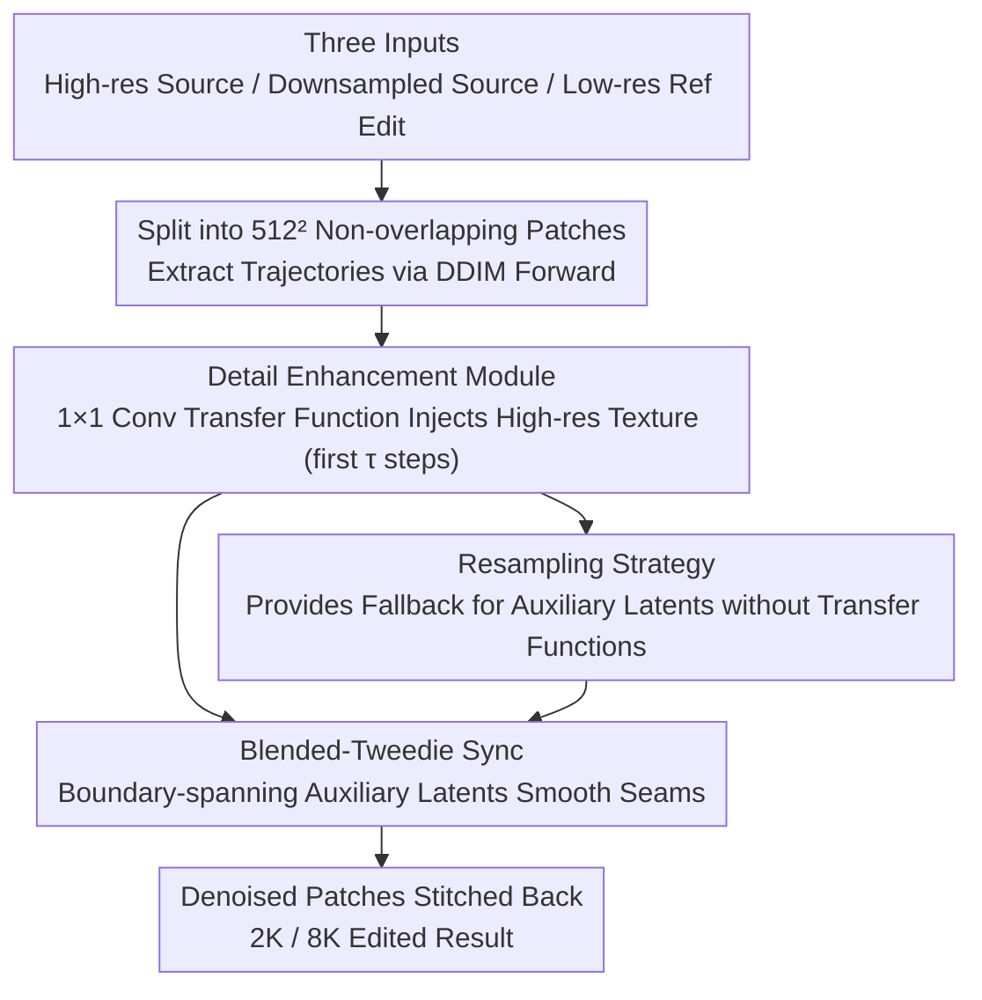

# Low-Resolution Editing is All You Need for High-Resolution Editing

**Conference**: CVPR 2026  
**arXiv**: [2511.19945](https://arxiv.org/abs/2511.19945)  
**Code**: None  
**Area**: Diffusion Models / Image Editing  
**Keywords**: High-Resolution Image Editing, Test-Time Optimization, Detail Transfer Function, Patch Synchronization, Diffusion Models

## TL;DR
ScaleEdit introduces the first formalization of high-resolution image editing. It achieves high-quality editing at 2K or even 8K resolution via test-time optimization by learning a $1 \times 1$ convolutional transfer function in the intermediate feature space of pre-trained generative models to inject fine-grained textures from the source image, combined with a Blended-Tweedie-based patch synchronization strategy to ensure global consistency.

## Background & Motivation

1. **Background**: Text-driven image editing methods (e.g., Step1X-Edit, ICEdit, KV-Edit, Nano Banana) have achieved excellent results at low resolutions ($\le 1$K) but are limited by the input resolution of pre-trained models, preventing direct processing of larger images.

2. **Limitations of Prior Work**: Naive solutions involving low-resolution editing followed by super-resolution (SR) fail to recover micro-textures from the source image. This is because the editing process is not conditioned on the high-resolution source, leading to detail loss during downsampling that cannot be reconstructed from the low-resolution edited result.

3. **Key Challenge**: High-resolution editing requires maintaining both semantic correctness and fine-grained texture fidelity. However, because the resolution of pre-trained generative models is fixed (typically $512^2$), direct operation at high resolution is infeasible.

4. **Goal**: How can strong priors from low-resolution editing methods be utilized while faithfully preserving fine details from high-resolution source images?

5. **Key Insight**: A core observation is that low-resolution trajectories and high-resolution trajectories exhibit a learnable mapping relationship in the intermediate feature space of the diffusion process. By learning this mapping via a lightweight feature transfer function, high-resolution details can be injected into low-resolution editing outputs.

6. **Core Idea**: Using a learnable $1 \times 1$ convolution as a feature transfer function, fine details from the high-resolution source image are injected into the generation trajectory of the low-resolution edit during inverse diffusion, complemented by non-overlapping patch synchronization to eliminate boundary artifacts.

## Method

### Overall Architecture
ScaleEdit addresses the problem where pre-trained models only accept $512^2$ inputs while the target images are 2K or 8K, requiring the preservation of micro-textures that vanish upon downsampling. The solution splits the large image into non-overlapping patches equal to the model's native resolution, allowing each patch to be processed by the original model, while subsequently restoring details and inter-patch consistency.

The pipeline begins with three inputs: the high-resolution source $I_{\text{src}}^{\text{high}}$, its downsampled version $I_{\text{src}}^{\text{low}}$, and a low-resolution reference $I_{\text{ref}}^{\text{low}}$ edited via standard methods like Nano Banana. The process follows three steps: first, each image is divided into $N \times M$ patches, and the diffusion trajectories are extracted via the DDIM forward process; second, a feature transfer function is learned for each patch to "pour" high-resolution source details into the editing trajectory; finally, Blended-Tweedie with resampling is employed to smooth the seams between adjacent patches. This process involves no network training and instead relies entirely on test-time optimization for each image.

### Key Designs

**1. Detail Enhancement Module: Injecting Source Textures into Edits**

Low-resolution editing provides correct semantics but loses micro-textures—a failure point for "edit-then-SR" pipelines since details lost during downsampling cannot be hallucinated accurately. ScaleEdit attaches a timestep-dependent transfer function $\Delta\mathbf{h}_t[i]=\phi_\theta(\mathbf{h}_t[i],t)$ in the intermediate feature space, implemented as a lightweight $1 \times 1$ convolution. The optimization objective is to align the low-res source trajectory with the high-res source trajectory:

$$\mathcal{L}=\big\|\mathbf{x}_{t-1}^{high}[i]-f^{rev}(\tilde{\mathbf{x}}_t[i],t;\Delta\mathbf{h}_t[i])\big\|_2^2$$

The learned transfer function is then applied to the reverse denoising process of the reference image to inject details. A $1 \times 1$ convolution is used instead of a constant vector because large semantic edits (e.g., cat $\to$ dog) require spatially varying feature adjustments; the $1 \times 1$ convolution adaptively mixes features per-channel, preserving spatial layout while enabling fine-grained adjustment. A control parameter $\tau$ ensures the transfer function only operates during the first $\tau$ steps, balancing detail injection and content preservation.

**2. Blended-Tweedie Synchronization: Ensuring Inter-patch Consistency**

When patches are denoised independently, visible seams appear at boundaries. ScaleEdit constructs auxiliary latents $\tilde{\mathbf{A}}_t[i,i+1]$ by joining the bottom of one patch with the top of an adjacent one. Since this auxiliary latent spans the boundary during denoising, its Tweedie one-step estimate $\hat{\mathbf{x}}_{t\to 0}^{aux}$ naturally provides smoother transitions. This is then linearly blended with the individual Tweedie estimates of the original patches using a weight:

$$\mathbf{M}(v,t)=\frac{2v}{H_p}\cdot\Big(1-\frac{t}{\tau}\Big)$$

The weight increases as the pixel position $v$ moves from the patch center to the boundary and strengthens as the timestep $t$ decreases. This "welds" the boundaries while leaving the center regions largely unaffected.

**3. Resampling Strategy: Decoupling Sync and Transfer Functions**

Auxiliary latents are temporary constructs and lack a corresponding transfer function $\Delta\mathbf{h}_t$, while optimizing functions for them would be computationally expensive. ScaleEdit bypasses this by first taking a detail-injected latent $\tilde{\mathbf{y}}_{t-1}[i]$ and performing a forward step without the transfer function: $\tilde{\mathbf{y}}_t^{rsp}[i]=f^{fwd}(\tilde{\mathbf{y}}_{t-1}[i],t-1)$. This produces a resampled latent that retains details but is no longer dependent on $\Delta\mathbf{h}_t$. Synchronization is then performed using these resampled latents, decoupling sync from detail injection at the cost of one extra forward-reverse pair.

### A Full Example
Processing a 2K source: The image is split into approximately $4 \times 4 = 16$ non-overlapping patches of $512^2$ resolution. DDIM forward trajectories are extracted (Total $T=50$). During the first $\tau=15$ steps, each patch optimizes its own $1 \times 1$ conv transfer function to inject high-res textures. Simultaneously, auxiliary latents at the boundaries of adjacent patches are used with Blended-Tweedie to eliminate seams. After 15 steps, the transfer functions are disabled, and the remaining 35 steps perform standard denoising. Stitched back together, the results yield a 2K edit with preserved micro-textures and no visible seams.

### Loss & Training

ScaleEdit uses pure test-time optimization and requires no training. Transfer functions are optimized independently for each patch and timestep. The implementation uses Stable Diffusion v2.1-base or FLUX.1-dev with $T=50$, $\tau=15$, and null prompts. Accurate reconstruction is ensured via Null-text inversion, and Nano Banana is used for the initial low-resolution edit.

## Key Experimental Results

### Main Results

| Method | HaarPSI↑ | M-MSE↓ | M-SSIM↑ | M-PSNR↑ | LPIPS↓ |
|------|---------|--------|---------|---------|--------|
| **1K-editing** | | | | | |
| DiT-SR | 0.335 | 0.058 | 0.695 | 21.53 | 0.477 |
| PiSA-SR | 0.328 | 0.058 | 0.668 | 21.27 | 0.465 |
| **Ours** | **0.342** | **0.054** | **0.739** | **22.13** | **0.460** |
| **2K-editing** | | | | | |
| DiT-SR | 0.316 | 0.057 | 0.754 | 21.38 | 0.507 |
| PiSA-SR | 0.312 | 0.056 | 0.755 | 21.32 | 0.472 |
| **Ours** | **0.331** | **0.053** | **0.806** | **21.96** | **0.496** |

### Ablation Study

| Configuration | Key Metric | Description |
|------|---------|------|
| W/o Sync | Visible boundary artifacts | Independent denoising produces obvious seams |
| W/ Sync | Smooth boundaries | Blended-Tweedie + Resampling eliminates artifacts |
| Constant Vector vs. 1×1 Conv | Latter is significantly better | Spatially adaptive transfer functions are more robust |

### Key Findings

- ScaleEdit consistently outperforms SR baseline methods, validating that the "edit-then-SR" pipeline cannot recover original source details.
- Advantages in Masked metrics (M-MSE, M-SSIM, M-PSNR) are particularly significant, indicating better preservation of regions intended to remain unchanged.
- The method generalizes to Transformer architectures like FLUX and is not limited to U-Net.
- Scalability to 8K resolution is demonstrated without additional training.

## Highlights & Insights

- Formalizes the high-resolution image editing task for the first time, distinguishing it from simple "edit + SR" pipelines.
- Clever transfer function design using $1 \times 1$ convolutions allows for channel-wise adaptive mixing in feature space, being both lightweight and effective.
- The non-overlapping synchronization strategy significantly reduces computational overhead compared to traditional overlapping inference methods.
- The test-time optimization framework requires no training data and is compatible with various editing methods and generative models.

## Limitations & Future Work

- Inference is relatively slow due to the per-image optimization (requiring multiple forward/reverse and optimization iterations).
- The hyperparameter $\tau$ needs manual tuning to balance detail transfer and content preservation.
- Performance depends on the quality of the low-resolution edit; if the low-res edit fails, the high-res result cannot be salvaged.
- Patch size is fixed to the model's native resolution and lacks flexibility.
- Evaluated primarily on Stable Diffusion and FLUX; other architectures remain unverified.

## Related Work & Insights

- The transfer function design draws inspiration from Null-text inversion by optimizing learnable parameters to align forward and reverse trajectories.
- Challenges in patch synchronization are common in video diffusion and panorama generation; the Blended-Tweedie strategy may have broader applications.
- High-resolution content creation is a major industrial demand that has been under-addressed in academia.

## Rating

- Novelty: ⭐⭐⭐⭐⭐ First to define high-res editing; novel transfer function and sync strategy.
- Experimental Thoroughness: ⭐⭐⭐⭐ Quantitative, qualitative, ablation, and 8K demos, though the dataset is small (100 images).
- Writing Quality: ⭐⭐⭐⭐⭐ Clear problem definition, rigorous derivation, and high-quality illustrations.
- Value: ⭐⭐⭐⭐ Addresses a practical need with a plug-and-play framework.

<!-- RELATED:START -->

## Related Papers

- [\[CVPR 2026\] HierEdit: Region-Aware Hierarchical Diffusion for Efficient High-Resolution Editing](hieredit_region-aware_hierarchical_diffusion_for_efficient_high-resolution_editi.md)
- [\[CVPR 2026\] VINS-120K: Ultra High-Resolution Image Editing with A Large-Scale Dataset](vins-120k_ultra_high-resolution_image_editing_with_a_large-scale_dataset.md)
- [\[CVPR 2026\] Training-free, Perceptually Consistent Low-Resolution Previews with High-Resolution Image for Efficient Workflows of Diffusion Models](training-free_perceptually_consistent_low-resolution_previews.md)
- [\[CVPR 2026\] Towards High-resolution and Disentangled Reference-based Sketch Colorization](towards_high-resolution_and_disentangled_reference-based_sketch_colorization.md)
- [\[CVPR 2026\] ChordEdit: One-Step Low-Energy Transport for Image Editing](chordedit_one-step_low-energy_transport_for_image_editing.md)

<!-- RELATED:END -->
