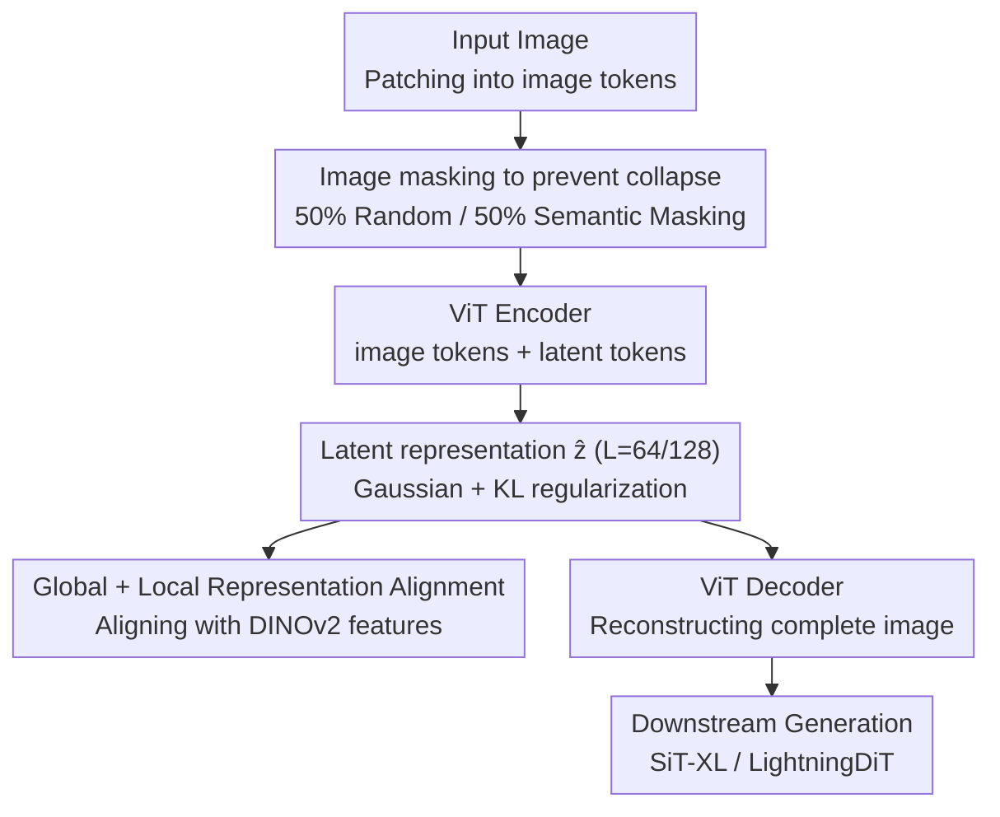

# MacTok: Robust Continuous Tokenization for Image Generation

**Conference**: CVPR 2026  
**Paper**: [CVF Open Access](https://openaccess.thecvf.com/content/CVPR2026/html/Zeng_MacTok_Robust_Continuous_Tokenization_for_Image_Generation_CVPR_2026_paper.html)  
**Code**: None  
**Area**: Image Generation / Visual Tokenizer  
**Keywords**: Continuous tokenizer, posterior collapse, image masking, representation alignment, KL-VAE

## TL;DR
MacTok addresses the posterior collapse issue of KL-VAE continuous tokenizers under high compression ratios using three strategies: masking on image tokens, DINOv2-guided semantic masking, and global/local representation alignment. With only 64/128 1D tokens, it achieves (near) state-of-the-art generation quality on ImageNet: 256→256 gFID of 1.44 and 512→512 gFID of 1.52.

## Background & Motivation

**Background**: Modern visual generation methods (diffusion, flow matching, autoregressive) compress images into a compact latent space before modeling, a step accomplished by image tokenizers. Tokenizers are divided into discrete methods (VQ-VAE / VQ-GAN / TiTok) which use a finite codebook and suffer from quantization errors, and continuous methods (KL-VAE / SD-VAE / MAR-VAE) that regularize a smooth continuous latent space using a Gaussian prior and KL divergence to achieve smoother representations.

**Limitations of Prior Work**: When the number of tokens is aggressively reduced, continuous methods are highly prone to **posterior collapse**. A strong KL regularization pushes the posterior distribution toward isotropic Gaussian priors, causing the encoder to stop embedding useful information. Consequently, the decoder relies entirely on prior-based guessing, degrading both reconstruction and generation quality. The authors frequently observed this collapse in their own implementation of KL-VAE under high compression.

**Key Challenge**: There is an inherent trade-off between compression efficiency (fewer tokens) and generation quality (information preservation). Existing solutions primarily rely on **KL weight scheduling** (KL annealing or manual parameter tuning). This requires meticulous parameter search and only delays the collapse instead of resolving latent degradation fundamentally.

**Goal**: To prevent continuous tokenizers from collapsing while preserving semantic information under extremely low token counts (such as 64 or 128), without relying on fragile parameter tuning.

**Key Insight**: The essence of posterior collapse is the depletion of mutual information between the input and the latent space by the KL penalty. To preserve mutual information, the model must be forced to rely on the latent variables to reconstruct the input. Drawing inspiration from masked representation learning (like MAE), the authors force the tokenizer to reconstruct complete images from **corrupted images**. Consequently, the latent variables must carry the information necessary for reconstruction. Crucially, the authors discover that masking must be applied to **image tokens** rather than latent tokens (masking the latter only delays collapse before eventually failing).

**Core Idea**: Instead of fragile KL weight tuning, this work fundamentally prevents collapse by applying "image masking (random + DINO-guided semantic masking) to force information flow through the latent" combined with "global/local representation alignment with DINOv2 features to structure the latent space."

## Method

### Overall Architecture
MacTok is a 1D continuous tokenizer. The encoder patches the input image into image tokens, prepends a set of learnable latent tokens, and processes them through a ViT encoder. The outputs corresponding to the latent tokens are extracted as the latent representation $\hat z\in\mathbb{R}^{L\times Z}$ (where $L$=64 or 128) and modeled as continuous variables regularized by a Gaussian prior and KL divergence. The decoder concatenates the sampled $\hat z$ with reconstruction tokens and decodes them via a ViT decoder to reconstruct the original image. Along this backbone, MacTok introduces two key designs to prevent collapse: **applying a mask to the image tokens prior to encoding** (with a 50% probability of either random masking or DINO-guided semantic masking) to force the latent space to reconstruct the image from partial inputs, and **aligning the latent representations with DINOv2 features globally and locally** as an auxiliary regularization. The training objective is a compound loss involving reconstruction, perceptual, adversarial, KL, and representation alignment.

### Key Designs

**1. Masking image tokens instead of latent tokens**

This is the most critical observation of the paper. Since posterior collapse stems from the decoder relying on the prior instead of the latent variables, the model must be forced to use the latent space. A naive approach is to randomly drop latent tokens during training (similar to Dropout, which has been attempted by prior work), but empirical results show this only **delays** the collapse—the model eventually collapses as training progresses. A fundamentally effective approach is to apply **masking to the image patch tokens prior to encoding**: substituting a fraction of the patches with a mask token before the encoder, thereby forcing both the encoder and decoder to **infer the missing regions** from the partial input. This information is forced to pass through the latent variables, preventing the loss of mutual information. The mask ratio $m$ is uniformly sampled from $[-0.1, M]$ and clipped to $[0, M]$ (default $M{=}0.7$). The negative lower bound allows the model to occasionally process complete images ($m{=}0$), preventing high-mask training from degrading reconstruction quality. Ablation studies show that random masking alone recovers the gFID from a collapsed state to 6.01 (Tab.5), acting as the primary defense against collapse.

**2. DINOv2-guided semantic masking: Hiding the "most important" regions**

Purely random masking is blind to semantic structures; it might mask out uninformative background patches, making the reconstruction task trivial and failing to learn discriminative semantics. MacTok introduces a **semantic masking** branch: using a pre-trained DINOv2 to compute the cosine similarity between the class token $c$ and each patch token $p_i$:

$$s_i = \frac{c^\top p_i}{\lVert c\rVert\,\lVert p_i\rVert},\qquad \mathcal{M}_p = \mathrm{TopK}\big(\{s_i\},\ \lceil m\cdot N\rceil\big)$$

The $\lceil m N\rceil$ patches with the highest similarity (i.e., the most semantically relevant) are masked. This artificially increases the reconstruction difficulty—forcing the model to recover **object-level structures and global context** from partial observations, effectively distilling the semantic prior of DINOv2 **implicitly** into the latent space. During training, random and semantic masking are alternated with a 50% probability (in abalations, "dino 50%" outperforms "dino 100%" with gFID 13.95 vs 14.84, Tab.4). They complement each other: random masking ensures robustness while semantic masking ensures discriminativeness.

**3. Global + Local representation alignment: Structuring the latent space**

Merely preventing collapse is insufficient; the authors also aim to structure the latent space so that similar semantic concepts cluster together. Existing representation alignment methods either use fixed token lengths, perform only coarse-grained global alignment, or introduce heavy auxiliary objectives. MacTok introduces a lightweight global + local dual alignment: first, the $L$ latent tokens are duplicated $r{=}N/L$ times to form $\tilde z_{loc}\in\mathbb{R}^{N\times Z}$ to match the patch resolution of DINOv2, while the latent tokens are average-pooled to obtain a global representation $\tilde z_{glob}$. Both are then projected into the DINOv2 feature space through a lightweight MLP and aligned via cosine similarity:

$$\mathcal{L}_{RA} = -\frac{1}{N+1}\Big[\sum_{i=1}^{N}\mathrm{sim}(o_{loc,i}, p_i) + \mathrm{sim}(o_{glob}, c)\Big]$$

Local alignment ($o_{loc}$ vs. patch token $p_i$) preserves spatial consistency and detailed structures, while global alignment ($o_{glob}$ vs. class token $c$) ensures high-level semantic consistency. This dual alignment provides stable semantic guidance across varying token lengths. In ablation studies, local alignment improves gFID from 6.01 to 3.53, while adding global alignment further reduces it to 3.15 (Tab.5).

### Loss & Training
The total loss is a compound objective:

$$\mathcal{L} = \mathcal{L}_{recon} + \lambda_1\mathcal{L}_{percep} + \lambda_2\mathcal{L}_{adv} + \lambda_3\mathcal{L}_{KL} + \lambda_4\mathcal{L}_{RA}$$

where the weights are set to $\lambda_1{=}1.0,\ \lambda_2{=}0.2,\ \lambda_3{=}10^{-6},\ \lambda_4{=}0.1$. The backbone uses a ViT-Base encoder and decoder (totaling 176M parameters). The encoder is initialized with DINOv2 weights to inject semantic priors. The discriminator is a frozen DINO-S combined with DiffAug, consistency regularization, and LeCAM. The model is trained on ImageNet for 250K steps for 256→256 resolution and 500K steps for 512→512. An engineering detail is **decoder fine-tuning**: after training the main model, the encoder is frozen, and the decoder is fine-tuned without masking for 10 epochs, recovering the reconstruction fidelity slightly degraded by masking while retaining the learned semantic structure (which improves rFID from 0.57 to 0.43, as shown in Tab.4).

## Key Experimental Results

### Main Results
ImageNet conditional generation, 1D tokens (all metrics: lower is better for rFID/gFID, higher is better for IS):

| Setting| Tokenizer | #Tokens | rFID↓ | gFID↓ (w/ CFG) | IS↑ |
|------|-----------|---------|-------|----------------|-----|
| 256→256 | SoftVQ-VAE | 64 | 0.88 | 1.78 | 279.0 |
| 256→256 | MAETok | 128 | 0.48 | 1.67 | 311.2 |
| 256→256 | LightningDiT | 256 | 0.28 | 1.35 | 295.3 |
| 256→256 | **MacTok+SiT-XL** | **64** | 0.75 | 1.58 | 310.4 |
| 256→256 | **MacTok+SiT-XL** | **128** | 0.43 | **1.44** | 302.5 |
| 512→512 | SoftVQ-VAE | 64 | 0.71 | 2.21 | 290.5 |
| 512→512 | MAETok | 128 | 0.62 | 1.69 | 304.2 |
| 512→512 | **MacTok+SiT-XL** | **64**† | 0.89 | **1.52** | 306.0 |
| 512→512 | **MacTok+SiT-XL** | **128** | 0.79 | **1.52** | 316.0 |

(†: A larger decoder is used for a fair comparison with SoftVQ-VAE.) Key takeaway: With 128 tokens, it achieves a gFID of 1.44 on 256×256 images (approaching LightningDiT's 1.35 with 256 tokens), and on 512×512 images, both 64 and 128 tokens set a new SOTA at 1.52 gFID. This surpasses SoftVQ-VAE by 0.69 gFID at the same token budget, using up to 64x fewer tokens than other competitive methods that require 256+ tokens.

### Ablation Study
Stepping through the components (MacTok-128 + SiT-B, with decoder fine-tuning, optimal CFG, Tab.5):

| Configuration | rFID↓ | gFID↓ | IS↑ | Note |
|------|-------|-------|-----|------|
| + Random Masking | 0.58 | 6.01 | 234.8 | Primary driver for avoiding collapse; yields stable gFID |
| + Local Alignment | 0.44 | 3.53 | 241.9 | Structures the latent space; improves both reconstruction and generation |
| + Semantic Masking | 0.43 | 3.32 | 249.2 | Injects semantic robustness |
| + Global Alignment | 0.43 | **3.15** | 258.3 | High-level semantic consistency (optimal setup) |

Ablation of mask ratio $M$ (no decoder fine-tuning, no CFG, Tab.4): As $M$ increases from 0.4 to 0.7, the gFID gradually drops to 14.59, and then rises to 14.92 at $M{=}0.8$. Thus, **$M{=}0.7$ is optimal**. Alternating 50% random and 50% semantic masking (dino 50%) performs better than 100% semantic masking (dino 100%) (13.95 vs. 14.84).

### Key Findings
- **Random masking makes the largest contribution**: Applying random masking alone rescues the collapsing KL-VAE to a usable gFID of 6.01, serving as the core mechanism to prevent collapse.
- **Masking intensity has a sweet spot**: $M{=}0.7$ works best. A weak mask ($M{=}0.4$) fails to motivate information preservation, while an overly aggressive mask ($M{=}0.8$) hurts reconstruction. A 1:1 mixture of random and semantic masking outperforms pure semantic masking.
- **Latent space visualization** (Fig.5) supports the core mechanism: The latent space of the collapsed KL-VAE is isotropic and unstructured; adding masking makes it more compact; further adding representation alignment clearly clusters semantic concepts. This correlates with linear probing accuracy, which is positively related to generation quality and accelerates convergence by about 6.25×.

## Highlights & Insights
- **The masking target is key**: Although both are masking techniques, masking latent tokens only delays collapse, while masking image tokens solves it fundamentally. This is because only the latter forces information to **flow through the latent variables** to complete reconstruction. This distinction is non-intuitive but highly valuable.
- **Leveraging pre-trained DINOv2 as an evaluator**: Semantic masking employs the cls-patch similarity of DINOv2 to identify crucial regions for masking, effortlessly distilling pre-trained semantic priors into the generative tokenizer's latent space with zero extra trainable parameters.
- **Extreme token efficiency**: Achieving comparable or superior generation quality with only 64/128 1D tokens compared to methods utilizing 256–1024 tokens leads to concrete computational savings in training and inference of downstream diffusion or autoregressive models.
- **Transferable recipe**: The approach of "forcing information flow via masking and structuring latent spaces via foundation model alignment" is not restricted to images but is likely applicable to any highly compressed autoencoding pipelines (e.g., video/audio tokenizers, VAE latent spaces).

## Limitations & Future Work
- **Heavy reliance on DINOv2**: Semantic masking, representation alignment, encoder initialization, and the discriminator all rely on DINOv2. If replaced with a weaker visual foundation model or applied to modalities lacking high-quality pre-trained features, performance gains might diminish significantly. This robustness was not analyzed.
- **Multiple losses and hyperparameters**: The framework involves five loss terms, mask ratios, random-to-semantic mixing ratios, and decoder fine-tuning, making the pipeline relatively complex. Some hyperparameters like $M$ might still require tuning for new datasets (albeit being more stable than tuning KL weights directly).
- **Evaluated only on ImageNet class-conditional generation**: The method has not been validated on more complex scenarios like text-to-image, high-resolution (>512), or video. Additionally, semantic masking relies on clean cls-patch similarities, and its efficacy on cluttered scenes with multiple objects requires further investigation.
- **No open-source code**: Replicating the work requires custom implementation of the masking, alignment, and other training details.

## Related Work & Insights
- **vs. SoftVQ-VAE**: Both work on highly compressed 1D continuous tokenization. SoftVQ-VAE aggregates soft codewords to bridge discrete and continuous representations, whereas MacTok directly builds on the KL-VAE framework and solves collapse via image masking. At 64 tokens, MacTok delivers better gFID (1.58 vs. 1.78 at 256).
- **vs. MAETok**: Both leverage masked autoencoding and utilize semantic targets like DINOv2. However, MAETok is a pure AE with multiple auxiliary semantic objectives, while MacTok is a KL-VAE leveraging image masking and global/local alignment, achieving better generation with 128 tokens (1.44 vs. 1.67 at 256).
- **vs. l-DeTok / MAR-VAE**: Both belong to the continuous KL VAE family. The former relies on denoising objectives during training. In contrast, MacTok emphasizes "image token masking + representation alignment to structure the latent," achieving superior generation with fewer tokens.
- **vs. VA-VAE / REPA**: Both align representations as well, but they often perform coarse-grained global alignment or require fixed token counts. MacTok's dual-granularity global and local alignment naturally scales to variable token lengths.

## Rating
- Novelty: ⭐⭐⭐⭐ The distinction between "image token masking vs. latent token masking" provides genuine insight. The combination of DINO semantic masking and dual-granularity alignment is solid, though individual techniques are clever combinations of existing ideas.
- Experimental Thoroughness: ⭐⭐⭐⭐ Systematic comparisons at 256/512 resolutions, comprehensive component/mask-ratio evaluations, latent space visualization, and linear probing are well-covered, though limited to ImageNet class-conditional generation.
- Writing Quality: ⭐⭐⭐⭐ The logic flow from motivation to observation to method is clear; Figures 1, 4, and 5 are intuitive, and equations are thorough.
- Value: ⭐⭐⭐⭐ Extreme token efficiency combined with robust training offers practical value for generative modeling, alongside a recipe that is highly transferable to other modality tokenizers.

<!-- RELATED:START -->

## Related Papers

- [\[CVPR 2026\] Spherical Leech Quantization for Visual Tokenization and Generation](spherical_leech_quantization_for_visual_tokenization_and_generation.md)
- [\[CVPR 2026\] CaTok: Taming Mean Flows for One-Dimensional Causal Image Tokenization](catok_taming_mean_flows_for_one-dimensional_causal_image_tokenization.md)
- [\[CVPR 2026\] Towards Robust Sequential Decomposition for Complex Image Editing](towards_robust_sequential_decomposition_for_complex_image_editing.md)
- [\[CVPR 2026\] Kontinuous Kontext: Continuous Strength Control for Instruction-based Image Editing](kontinuous_kontext_continuous_strength_control_for_instruction-based_image_editi.md)
- [\[CVPR 2026\] SliderEdit: Continuous Image Editing with Fine-Grained Instruction Control](slideredit_continuous_image_editing_with_fine-grained_instruction_control.md)

<!-- RELATED:END -->
