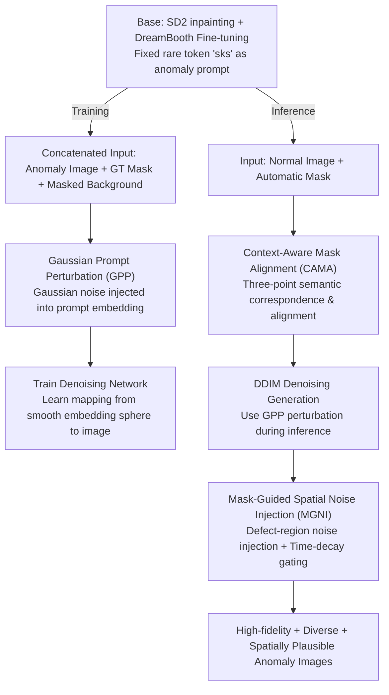

# MAGIC: Few-Shot Mask-Guided Anomaly Inpainting with Prompt Perturbation, Spatially Adaptive Guidance, and Context Awareness

**Conference**: CVPR 2026 Findings  
**arXiv**: [2507.02314](https://arxiv.org/abs/2507.02314)  
**Code**: [GitHub](https://github.com/Jaeihk/MAGIC-Anomaly-generation)  
**Area**: Image Generation / Anomaly Detection  
**Keywords**: Few-shot Anomaly Generation, Diffusion Models, Inpainting, Industrial Quality Control, Prompt Perturbation, Spatially Adaptive Guidance, Mask Alignment  
**Authors**: JaeHyuck Choi, MinJun Kim, Je Hyeong Hong (Hanyang University)

## TL;DR

The MAGIC framework is proposed to generate high-fidelity, diverse, and spatially plausible industrial anomaly images under few-shot conditions. By fine-tuning an inpainting diffusion model and integrating three complementary modules—Gaussian Prompt Perturbation (GPP), Mask-Guided Spatial Noise Injection (MGNI), and Context-Aware Mask Alignment (CAMA)—it achieves SOTA performance on MVTec-AD downstream tasks.

## Background & Motivation

In industrial quality control scenarios, normal images are abundant while anomaly images are extremely scarce. Although anomaly detection can be trained solely on normal samples (e.g., one-class classification, reconstruction methods), anomaly classification (critical for root cause analysis) still requires labeled anomaly samples. Therefore, synthesizing realistic anomaly images using generative models has become a key requirement.

Existing diffusion model solutions face two types of problems:
- **Global Anomaly Generation (GAG)** methods (e.g., DualAnoDiff) generate anomaly images and masks simultaneously but often destroy original background textures because they do not accept guidance from normal images.
- **Mask-Guided Anomaly Generation (MAG)** methods (e.g., AnomalyDiffusion, AnoGen) preserve the background but suffer from misalignment between anomaly regions and input masks, or mask shifts outside object boundaries. Furthermore, freezing the backbone limits generation quality.

The **Key Challenge** is: while direct few-shot fine-tuning of an inpainting model can ensure background fidelity and mask alignment, it leads to severe overfitting—lack of diversity in results and poor generation quality when masks are placed in semantically unreasonable positions.

## Method

### Overall Architecture

MAGIC aims to resolve the dilemma in industrial scenarios where anomaly samples are scarce and direct fine-tuning of inpainting models leads to severe overfitting (diversity collapse and failed generation for misplaced masks). It uses Stable Diffusion 2 Inpainting as the base, fine-tunes with DreamBooth, and fixes a rare token (e.g., "sks") as the anomaly prompt, eliminating the need for per-category text descriptions. During training, the anomaly image $I_A$, ground-truth mask $M_{GT}$, and masked normal background $I_A^M$ are concatenated as input, paired with Gaussian-perturbed prompt embeddings $c_p$. During inference, given a normal image $I_N$ and an automatic mask $M$, CAMA first aligns the mask to a semantically reasonable position to obtain $M_a$. Then, denoising is performed using randomly perturbed $c_p$ and MGNI local noise injection. These modules restore the capabilities lost during fine-tuning across global texture, local texture, and spatial dimensions.

### Key Designs

**1. Gaussian Prompt Perturbation (GPP): Mapping Anomaly Concepts to an Embedding Sphere**

The cost of direct fine-tuning is diversity collapse—the same fixed prompt always generates nearly identical anomalies. GPP injects Gaussian noise into the prompt embedding space $c_p = \tau(\mathcal{P}) + \delta,\ \delta \sim \mathcal{N}(0, \sigma^2 I)$ ($\sigma=1.0$) to expand global texture diversity. The **Core Idea** is to apply noise during **both** training and inference: if noise is only added during inference, the model encounters an unseen distribution, leading to unrealistic textures. By training with same-distribution perturbations, the model learns a smooth mapping from the embedding sphere to the image space.

**2. Mask-Guided Spatial Noise Injection (MGNI): Supplementing Local Texture Diversity**

While GPP handles global diversity, fine-grained textures inside defects remain monotonous. MGNI injects additional random noise only within the mask region during DDIM denoising. The intensity is controlled by a scale factor $a$ (sampled uniformly from $[0, 0.6]$) and a time-decay gate $\lambda(t) = a \cdot \mathbb{1}_{t > t_{\min}}$. Noise is injected early in denoising ($t \approx 1$) to enrich texture, and follows standard DDIM updates late ($t \to 0$) to preserve fidelity. This is implemented by adding a localized noise term $\sqrt{1-\alpha_{t-1}} \cdot \lambda(t) \cdot M \cdot \eta_t$ to the standard update; the multiplication by mask $M$ ensures it only affects defect pixels without touching the background.

**3. Context-Aware Mask Alignment (CAMA): Placing Defects in Semantically Valid Positions**

For object-type categories (e.g., screws, cables), anomalies should only appear in specific semantic regions. Random mask placement leads to poor generation. CAMA utilizes the pre-trained GeoAware-SC semantic correspondence model to select three keypoints from anomaly samples—mask centroid $p_c$, upper boundary $p_u$, and lower boundary $p_\ell$. It establishes semantic correspondence with the normal image by calculating similarity maps $S_u, S_c, S_\ell$. By matching boundary points to find candidate line $\mathcal{L}$ and optimizing the centroid $q_c^*$ under joint constraints of the foreground mask $M_f$ and similarity map $S_c$, it robustly migrates the mask.

## Key Experimental Results

### Generation Quality Evaluation (MVTec-AD, Table 1)

| Method | KID (×10³) ↓ | IC-LPIPS ↑ |
|------|------------|-----------|
| AnomalyDiffusion | 104.01 | 0.30 |
| AnoGen | 105.39 | 0.31 |
| DualAnoDiff | 96.82 | **0.36** |
| **MAGIC (Ours)** | **46.06** | 0.30 |

MAGIC significantly leads in KID score (over 52% lower), indicating the generated distribution is closest to real anomalies. DualAnoDiff's higher IC-LPIPS is partly attributed to false diversity caused by background destruction.

### Downstream Anomaly Classification Accuracy (ResNet-34, Table 2)

| Method | Mean Accuracy (%) |
|------|----------------|
| Crop-Paste | 56.17 |
| AnomalyDiffusion | 64.90 |
| AnoGen | 56.92 |
| DualAnoDiff | 68.50 |
| **MAGIC (Ours)** | **76.39** |

MAGIC's classification accuracy is 7.89 percentage points higher than the runner-up DualAnoDiff. Gains are particularly significant in categories like hazelnut (95.83%) and screw (83.95%).

### Downstream Anomaly Detection and Localization (U-Net, Table 3)

| Method | AUROC-P | AP-P | F1-P | AP-I |
|------|---------|------|------|------|
| Crop-Paste | 94.4 | 69.1 | 70.7 | 98.9 |
| AnomalyDiffusion | 98.2 | 75.0 | 73.2 | 99.1 |
| DualAnoDiff | 97.4 | 76.8 | 72.9 | 98.6 |
| **MAGIC (Ours)** | **99.0** | **81.7** | **77.4** | **99.5** |

MAGIC achieves optimal results across all pixel-level and image-level metrics, with AP-P leading the runner-up by nearly 5 percentage points.

### Ablation Study (Table 4)

| GPP | MGNI | CAMA | KID↓ | Accuracy (%) |
|-----|------|------|------|-------------|
| ✗ | ✗ | ✗ | 40.36 | 70.09 |
| ✓ | ✗ | ✗ | 33.87 | 74.07 |
| ✓ | ✓ | ✗ | 40.13 | 74.50 |
| ✓ | ✓ | ✓ | 38.76 | **76.39** |

Using GPP alone significantly reduces KID and boosts accuracy by ~3%. MGNI increases diversity—slightly increasing KID but improving downstream performance. CAMA provides an additional ~2.85% boost on object categories.

## Key Findings

- Injecting Gaussian perturbations in the prompt embedding space increases global texture diversity more effectively than changing random seeds.
- **Using GPP during training** is critical; using it only during inference causes distribution shift, resulting in unrealistic textures.
- Spatial local noise injection (MGNI) and prompt-level perturbation (GPP) enhance local and global diversity respectively, proving complementary.
- Semantic correspondence using only three keypoints enables efficient mask alignment with much lower computational cost than dense methods.

## Highlights & Insights

1. **Precise Problem Definition**: Explicitly states that anomaly generators must satisfy three requirements simultaneously (background fidelity, mask alignment, and semantic validity), whereas existing methods satisfy at most two.
2. **Transfer Insight from Personalized Generation**: Borrows DreamBooth fine-tuning for fidelity while restoring diversity through embedding space perturbation—finding a balance between over-fitting and under-fitting.
3. **No Need for Category-Specific Descriptions**: Using rare tokens like "sks" enhances universality for industrial parts without semantic labels.
4. **Evaluation Fairness**: All baseline methods are reproduced with a unified evaluation protocol and no manual selection, ensuring high credibility.
5. **Symmetry in Design**: The training-inference symmetry of GPP reflects a deep understanding of distribution consistency.

## Limitations

- CAMA relies on a rough match between input mask and real defect shapes; large deviations affect semantic correspondence.
- Dependence on pre-trained components (U2-Net for foreground, GeoAware-SC for correspondence) may fail in repetitive structures or unseen domains.
- Verified only on MVTec-AD; other datasets like VisA were not tested.
- Training cost is relatively high: independent training (~1.5 hours / 5000 steps) required for each anomaly type.
- CAMA increases inference time (approximately 5x), limiting real-time performance.

## Related Work & Insights

- **AnomalyDiffusion**: Generates anomalies via frozen backbone + textual inversion. MAGIC adopts inpainting fine-tuning for better fidelity.
- **DualAnoDiff**: A global method with dual-stream attention sharing. High diversity but severe background destruction.
- **DreamBooth/Textual Inversion**: Two routes for personalized generation. MAGIC combines DreamBooth's fidelity with perturbation-based diversity.
- **DreamDistribution**: Also performs distribution sampling in embedding space for diversity, but targets general personalized generation rather than anomalies.
- **DefectFill**: Concurrent work that also fine-tunes inpainting, but requires object-specific prompts and does not handle mask misalignment.

**Insight**: The technique of Gaussian perturbation in embedding space coupled with symmetric training/inference is generalizable and could be transferred to other few-shot conditional generation tasks (e.g., medical image augmentation, few-shot style transfer).

## Rating

- Novelty: ⭐⭐⭐⭐ — Clever symmetric design of GPP and integrated modules.
- Experimental Thoroughness: ⭐⭐⭐⭐ — Complete ablation and downstream tasks, though single-dataset validation is a slight drawback.
- Writing Quality: ⭐⭐⭐⭐ — Clear motivation, comprehensive methodology, and high-quality figures.
- Value: ⭐⭐⭐⭐ — Practical value for industrial anomaly detection; transferable technical insights.

<!-- RELATED:START -->

## Related Papers

- [\[ICML 2026\] CLEAR: Context-Aware Learning with End-to-End Mask-Free Inference for Adaptive Video Subtitle Removal](../../ICML2026/image_generation/clear_context-aware_learning_with_end-to-end_mask-free_inference_for_adaptive_vi.md)
- [\[CVPR 2025\] MTADiffusion: Mask Text Alignment Diffusion Model for Object Inpainting](../../CVPR2025/image_generation/mtadiffusion_mask_text_alignment_diffusion_model_for_object_inpainting.md)
- [\[CVPR 2025\] DualAnoDiff: Dual-Interrelated Diffusion Model for Few-Shot Anomaly Image Generation](../../CVPR2025/image_generation/dual-interrelated_diffusion_model_for_few-shot_anomaly_image_generation.md)
- [\[CVPR 2026\] From Inpainting to Layer Decomposition: Repurposing Generative Inpainting Models for Image Layer Decomposition](from_inpainting_to_layer_decomposition_repurposing_generative_inpainting_models_.md)
- [\[AAAI 2026\] FreeInpaint: Tuning-free Prompt Alignment and Visual Rationality Enhancement in Image Inpainting](../../AAAI2026/image_generation/freeinpaint_tuning-free_prompt_alignment_and_visual_rationality_enhancement_in_i.md)

<!-- RELATED:END -->
