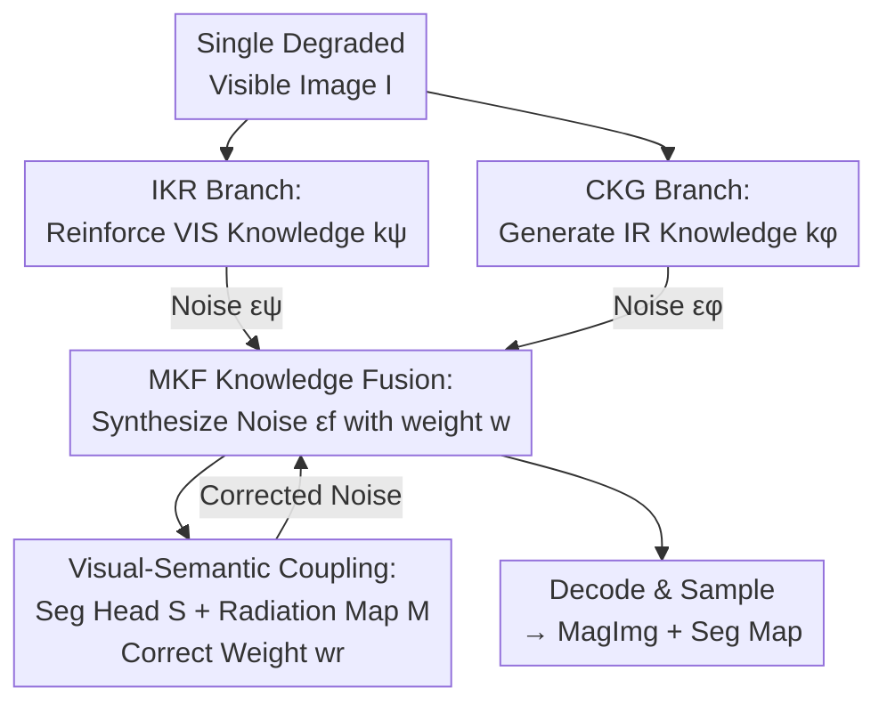

# MagicFuse: Single Image Fusion for Visual and Semantic Reinforcement

**Conference**: CVPR 2026  
**arXiv**: [2602.01760](https://arxiv.org/abs/2602.01760)  
**Code**: https://github.com/zhayanping/MagicFuse (Available)  
**Area**: Diffusion Models / Image Fusion / Multi-modal  
**Keywords**: Single Image Fusion, Infrared-Visible Fusion, Latent Diffusion Models, Cross-spectral Knowledge Generation, Semantic Segmentation

## TL;DR
Addressing the pain point that real-world scenarios often possess visible cameras but lack infrared cameras, this paper proposes the "Single Image Fusion (SIF)" paradigm. Two diffusion streams are utilized to **reinforce intra-spectral knowledge** and **generate infrared knowledge** from a single low-quality visible image. These are fused at the noise level to obtain "MagImg," which balances human perception and downstream semantic decision-making. Using only a single degraded visible image, visual/semantic metrics achieve performance comparable to or exceeding SOTA fusion methods that require paired infrared-visible inputs.

## Background & Motivation
**Background**: Infrared-Visible Image Fusion (IVIF) leverages the infrared modality to complement scene information lost by visible light under adverse conditions such as low light, haze, or noise. It has been widely used in reconnaissance, intelligent transportation, and assisted driving. Recent deep methods like TarDAL, OmniFuse, and Text-DiFuse continue to push the robustness of fusion in complex environments to new heights.

**Limitations of Prior Work**: All IVIF methods rely on a hard prerequisite—**the simultaneous availability of registered infrared and visible images**. However, in reality, infrared thermal imagers are often absent due to high costs, and the vast majority of scenarios only have visible light sensors. This "data-level absence" directly invalidates all traditional IVIF methods. Reverting to image restoration to recover information from a single spectrum is often suboptimal because priors within a single visible spectrum are limited, especially when degradation types are diverse and coupled.

**Key Challenge**: The essence of fusion is "cross-modal complementary information," which requires a **second modality**. Once infrared data is absent at the data level, traditional "data-level fusion" (concatenating pixels/features of two images) becomes impossible.

**Goal**: To enjoy the benefits of IVIF under the condition of having only a single low-quality visible image, resulting in a cross-spectral scene representation that balances visual quality and semantic decision-making. This requires answering two fundamental questions: (1) Where does the new knowledge beyond the visible spectrum come from? (2) Since data-level fusion is infeasible, how to transition from data-level to knowledge-level fusion?

**Key Insight**: Generative diffusion models can "learn/create" new knowledge from large-scale data—details obscured by degradation in the visible spectrum can be recovered via a restoration diffusion stream, and infrared thermal radiation distributions can be empirically generated via a "visible-to-infrared" translation diffusion stream. The noise $\bm{\epsilon}_t$ estimated at each step of diffusion sampling encodes knowledge and can serve as a medium for fusion.

**Core Idea**: Elevate fusion from "data-level" to "knowledge-level"—instead of concatenating pixels, two diffusion streams produce "reinforced visible knowledge" and "generated infrared knowledge," which are fused via weighted combination in the **noise space**. A MagImg is then continuously sampled from a shared Gaussian noise starting point.

## Method

### Overall Architecture
MagicFuse takes a degraded visible image $\bm{\mathcal{I}}\in\mathbb{R}^{H\times W\times 3}$ as input and outputs a Magic Image (MagImg) with cross-spectral representation capabilities along with its corresponding semantic segmentation map. It formalizes SIF as a knowledge fusion problem: first, two Latent Diffusion Models (LDM) produce two types of knowledge $\bm{k}^\psi$ (intra-spectral reinforced knowledge) and $\bm{k}^\phi$ (cross-spectrally generated infrared knowledge). Then, the fusion network $\mathcal{F}$ synthesizes both in the noise space according to weight $\bm{w}$, which is finally decoded into MagImg. Simultaneously, a segmentation head $\mathcal{S}$ aligns fused features with semantic labels, which in turn corrects the fusion weights. The entire pipeline starts from a shared standard Gaussian noise $\bm{z}_T$, with three diffusion streams (IKR/CKG/MKF) performing synchronized step-by-step sampling.

### Key Designs

**1. Single Image Fusion (SIF): Elevating Fusion from Data-Level to Knowledge-Level**

The direct motivation is the core contradiction mentioned above—the absence of infrared data makes traditional fusion completely fail. Instead of "stitching a second image," this paper redefines fusion as a knowledge fusion problem (Eq. 1): $\min_{\bm{\omega}^{\mathtt f}}\mathbb{E}_{\bm{z}_T\sim\mathcal{N}(0,\bm{I})}[\mathcal{L}^{\mathtt f}(\mathcal{F}(\bm{k}^\psi,\bm{k}^\phi;\bm{\omega}^{\mathtt f}))]$, where $\bm{k}^\psi$ comes from the visible restoration diffusion stream $\Psi$, and $\bm{k}^\phi$ comes from the "visible-to-infrared" translation diffusion stream $\Phi$, both sharing the same noise starting point $\bm{z}_T$. The key insight is that information for the second modality **does not have to come from a sensor; it can come from the distribution patterns learned by a generative model from large-scale paired data**. Thus, the objects of fusion change from "pixels of two images" to "knowledge produced by two diffusion streams," bypassing the infrared absence constraint—this is the first SIF proposal claimed by the paper.

**2. IKR + CKG Dual Diffusion Streams: Replenishing Internal Knowledge and Creating External Knowledge**

The learning objectives for the two types of knowledge are fundamentally different: visible restoration recovers color/texture details within the spectrum, while "visible-to-infrared" translation models cross-spectral semantic correspondences. Thus, two specialized diffusion branches are instantiated—IKR (intra-spectral knowledge reinforcement) trains $\Psi$ for degraded visible restoration, and CKG (cross-spectral knowledge generation) trains $\Phi$ to learn infrared radiation distributions and infer infrared representations from visible light. Both share the same LDM design (a lightweight autoencoder with InstanceNorm mapping images to a content-centric latent space $\bm{z}=\bm{\mathcal{E}}(\bm{\mathcal{I}})$, a U-Net denoiser predicting noise $\bm{\epsilon}_\theta(\bm{z}_t,\bm{c},t)$ conditioned on the degraded image $\bm{c}$, and DDIM accelerated sampling), but with different parameter capacities—the translation task is harder, so $\Phi$ (517.67M) is significantly larger than $\Psi$ (39.65M). Crucially, the learned knowledge is not explicitly output as an image but **implicitly encoded in the noise predicted at each step** $\bm{\epsilon}^\psi_t,\bm{\epsilon}^\phi_t$, providing an interface for fusion in the noise space.

**3. MKF Noise-Level Fusion: Dynamic Weighting of Dual Knowledge in Probability Space**

With two noise streams, how to combine them? The MKF (multi-domain knowledge fusion) branch is constructed to let the fusion network $\mathcal{F}$ estimate a weighting coefficient $\bm{w}$ at each time step, linearly combining the two noises: $\bm{\epsilon}_t^{\mathtt f}=\bm{w}\bm{\epsilon}^\psi_t+(1-\bm{w})\bm{\epsilon}^\phi_t$ (Eq. 3). Weights are not fixed constants but calculated based on three types of information (Eq. 4): the current single-step initial state estimates $\widetilde{\bm{z}}^\psi_{t\to0}$, $\widetilde{\bm{z}}^\phi_{t\to0}$ (measuring knowledge quality, derived via $\widetilde{\bm{z}}_{t\to0}=(\bm{z}_t-\sqrt{1-\bar\alpha_t}\,\bm{\epsilon}_t)/\sqrt{\bar\alpha_t}$), the two noises $\bm{\epsilon}^\psi_t, \bm{\epsilon}^\phi_t$ themselves, and the MKF sampling representation $\bm{z}_t^{\mathtt f}$. This allows weights to adaptively change with time steps and content, ensuring balance between "internal knowledge replenishment" and "external knowledge creation" in the probability space.

**4. Visual-Semantic Coupling: Seg Head Injects Semantics and Rescues Training**

Optimizing only for visuals makes MagImg look good but useless for machine perception. More subtly, since $\bm{\epsilon}^\psi$ and $\bm{\epsilon}^\phi$ are both generated from the same input $\{\bm{\mathcal{I}},\bm{z}_T\}$, there is an inherent correlation $\bm{\epsilon}^\phi=A\bm{\epsilon}^\psi$. Eq. 3 can be rewritten as $\bm{\epsilon}_t^{\mathtt f}=(\bm{w}+(1-\bm{w})A)\bm{\epsilon}^\psi_t$—because both streams are conditioned on the visible image, optimization tends to favor $\bm{\epsilon}^\psi_t$ (i.e., $\bm{w}\to1$), leading to infrared knowledge being erased and training collapse. This paper embeds a segmentation head $\mathcal{S}$ in the MKF, using the attention features $\bm{\zeta}$ of the fusion network to predict a segmentation map $\Gamma$ (Eq. 5), then deriving a radiation category map $\mathcal{M}$ (marking typical thermal targets like pedestrians and vehicles) from $\Gamma$ to correct the weights: $\bm{w}^{\mathtt r}=\mathcal{M}\,\text{min}(\bm{w},\bm{\tau})+(1-\mathcal{M})\bm{w}$ (Eq. 6). By forcing weights to not exceed hyperparameter $\bm{\tau}$ in thermal target regions, **it ensures thermal radiation features are preserved (semantic injection) and breaks the $\bm{\w}\to1$ collapse (optimization rescue)**—a single module solves both semantic alignment and training stability.

### Loss & Training
A two-stage optimization is adopted. Stage 1: Train $\Psi$ and $\Phi$ **independently** on paired data (IKR uses 14,190 degraded-clean visible pairs; CKG uses 25,186 degraded visible-clean infrared pairs). Stage 2: Freeze $\Psi$ and $\Phi$, and train only the fusion network $\mathcal{F}$ (2.74M) and segmentation head $\mathcal{S}$, using signals from each diffusion step (see Algorithm 1). The visual end uses contrast/texture/color regularizations (Eq. 10): $\mathcal{L}_{\text{cont}}$ sets MagImg luminance to the pixel-wise max of both decoded images, $\mathcal{L}_{\text{text}}$ takes the max of Sobel gradients, and $\mathcal{L}_{\text{color}}$ constrains chrominance towards visible light, synthesized as $\mathcal{L}_{\text{visual}}=\lambda_1\mathcal{L}_{\text{cont}}+\lambda_2\mathcal{L}_{\text{text}}+\lambda_3\mathcal{L}_{\text{color}}$. The semantic end uses cross-entropy $\mathcal{L}_{\text{seg}}$ (Eq. 11). Joint optimization drives improvements in both visual fidelity and semantic consistency. Diffusion steps for training/inference are 1000/25.

## Key Experimental Results

Dataset: IKR/CKG trained on the merged set of MFNet + FMB + LLVIP; MKF trained on 1,177 degraded visible images from MFNet with segmentation labels, and tested on 392 degraded visible images. All comparative methods use infrared-visible paired inputs, while MagicFuse uses only a single degraded visible image.

### Main Results
Visual quality comparison (MFNet test set, ↑ higher is better):

| Metric | TarDAL | EMMA | Text-DiFuse | DAFusion | **Ours** |
|------|--------|------|-------------|----------|----------|
| EN | 5.11 | 6.74 | 7.08 | 7.26 | **7.29 (Best)** |
| MI | 1.45 | 3.46 | 2.99 | 3.08 | **4.13 (Best)** |
| PSNR | 57.48 | 61.96 | 62.99 | 61.71 | **63.49 (Best)** |
| SSIM | 0.12 | 0.43 | 0.41 | 0.42 | 0.45 |
| Qabf | 0.21 | 0.45 | 0.40 | 0.33 | 0.50 (Runner-up) |

Using only a single degraded visible image, MagicFuse achieves the best performance in EN/MI/PSNR, overall matching or surpassing SOTA methods that use infrared-visible pairs.

Semantic segmentation comparison (MFNet, SegFormer retrained, mIoU↑):

| Method | Input | mIoU |
|------|------|------|
| SegMiF | IR+VIS | 62.28 (Best) |
| **Ours-$\mathcal{F}$** | Single VIS | **62.19 (Runner-up)** |
| EMMA | IR+VIS | 61.98 |
| Text-IF | IR+VIS | 60.65 |
| Degra. VIS (Original) | Single VIS | 54.09 |

With only a single visible image, the method achieves runner-up mIoU, trailing the dual-modal SegMiF by only 0.09, and far exceeding the degraded original image's 54.09.

### Ablation Study
Ablation of key components (Visual Table 6 / Semantic Table 7):

| Config | EN↑ | MI↑ | PSNR↑ | mIoU↑ | Description |
|------|-----|-----|-------|-------|------|
| Model I: Weight w/o $\widetilde{\bm{z}}_{t\to0}$ | 7.28 | 4.09 | 62.14 | 61.05 | Weight only considers noise |
| Model II: w/o Seg Head | 7.33 | 4.10 | 62.16 | 60.83 | Visual guidance only |
| Model III: Aggregate after diffusion | 7.17 | 3.24 | 61.49 | 59.74 | Weakest cross-spectral ability |
| Model IV: IKR-enhanced VIS only | 7.39 | 4.08 | 62.11 | 57.18 | No IR knowledge, semantic collapse |
| **Full Model** | 7.29 | **4.13** | **63.49** | 61–62 | Complete model |

### Key Findings
- **Step-by-step noise fusion is critical**: Model III, which replaces step-by-step noise fusion with "aggregate after individual diffusion," sees MI drop from 4.13 to 3.24 and mIoU drop to 59.74, proving knowledge must be fused at the noise level during the diffusion process.
- **IR knowledge is vital for semantics**: Model IV, keeping only IKR for visible enhancement, maintains good visual metrics (highest EN of 7.39) but mIoU collapses to 57.18—confirming "generated infrared knowledge" primarily assists machine perception (highlighting thermal targets).
- **Sweet spot for $\bm{\tau}$ is at 0.4**: Adjusting the influence of the radiation category map on fusion, visual quality and segmentation accuracy both peak at $\bm{\tau}=0.4$, indicating that while cross-spectral knowledge enhances representation, excessive injection damages original spectral information.
- **Generalization to non-fusion scenarios**: Enhancing visible images for retraining SegFormer on Cityscapes improves mIoU from 65.80 to 66.91, proving the method is not limited to infrared-visible datasets and can be applied to almost any natural image.

## Highlights & Insights
- **"Fusion does not need a second sensor, just a second piece of knowledge"**: By elevating fusion from data-level to knowledge-level, using generative models to create missing modal knowledge, this paradigm shift opens a new direction for "enjoying multi-modal fusion dividends with single images," which is of high practical value (as infrared cameras are expensive and often missing).
- **Noise as knowledge carrier**: Instead of decoding diffusion outputs to images for fusion, weighting fusion is performed directly on predicted noise $\bm{\epsilon}_t$ at each step. This choice is clever—noise encodes both semantic and structural knowledge and naturally exists in the shared sampling trajectory of the two streams, allowing for very low-cost fusion (fusion network is only 2.74M).
- **One segmentation head, two roles**: The segmentation head injects semantics (optimizing MagImg for downstream tasks) and simultaneously solves the optimization problem where "homologous noises lead to $\bm{w}\to1$ training collapse." Forcing weight suppression in thermal target areas is an elegant "two birds with one stone" design.

## Limitations & Future Work
- **CKG as "Empirical IR Fantasy"**: Infrared knowledge is inferred entirely from the training distribution by the generative model. It might "hallucinate" unrealistic thermal distributions for unseen patterns (rare objects, anomalous temperature scenes); the paper does not discuss reliability assessment for generated IR.
- **Dependency on large-scale paired data for upstream training**: although inference only requires a single visible image, training IKR/CKG still requires nearly 40,000 pairs. Changing scenarios or sensors requires retraining upstream diffusion streams.
- **Semantics still slightly trail pure dual-modal methods**: mIoU is runner-up, and generalization on FMB is inferior to multi-modal fusion, indicating generated IR knowledge is not yet equivalent to real IR measurements in extreme environments.
- **Future directions**: Introduce uncertainty estimation for IR generation to reduce fusion weights in low-confidence thermal regions; or use small amounts of real IR for semi-supervised calibration of CKG to narrow the gap between "generated IR vs real IR."

## Related Work & Insights
- **vs Traditional IVIF (TarDAL / SegMiF / Text-DiFuse)**: They perform data-level fusion and must have registered IR+VIS pairs; this paper performs knowledge-level fusion and only requires a single VIS. The difference lies in the source of the second modal information—sensor-based vs generative-model-based.
- **vs Image Restoration**: Restoration can only recover limited information within the visible spectrum; this method additionally introduces cross-spectral knowledge through CKG, exceeding single-spectrum priors.
- **vs Diffusion Fusion (DDFM / OmniFuse)**: Those also use diffusion but still perform denoising/fusion on dual-modal inputs; this paper's innovation lies in "noise as fusion medium + dynamic step-wise weighting + seg head for collapse prevention," utilizing diffusion as a unified framework for "knowledge generation + fusion."

## Rating
- Novelty: ⭐⭐⭐⭐⭐ First to propose Single Image Fusion (SIF), elevating fusion to the knowledge level.
- Experimental Thoroughness: ⭐⭐⭐⭐ Comprehensive experiments covering visual/semantic/generalization/ablation, though lacking reliability analysis for generated IR.
- Writing Quality: ⭐⭐⭐⭐ Narrative driven by two fundamental questions is clear; formulas and Algorithm are complete; notation is somewhat dense.
- Value: ⭐⭐⭐⭐⭐ High practical value for deployment as it eliminates infrared hardware dependency.

<!-- RELATED:START -->

## Related Papers

- [\[CVPR 2026\] Fusion in Your Way: Aligning Image Fusion with Heterogeneous Demands via Direct Preference Optimization](fusion_in_your_way_aligning_image_fusion_with_heterogeneous_demands_via_direct_p.md)
- [\[CVPR 2026\] Leveraging Verifier-Based Reinforcement Learning in Image Editing](leveraging_verifier-based_reinforcement_learning_in_image_editing.md)
- [\[CVPR 2026\] SplitFlux: Learning to Decouple Content and Style from a Single Image](splitflux_learning_to_decouple_content_and_style_from_a_single_image.md)
- [\[CVPR 2026\] Learning Latent Proxies for Controllable Single-Image Relighting](learning_latent_proxies_for_controllable_single-image_relighting.md)
- [\[CVPR 2026\] Efficient and Training-Free Single-Image Diffusion Models](efficient_and_training-free_single-image_diffusion_models.md)

<!-- RELATED:END -->
