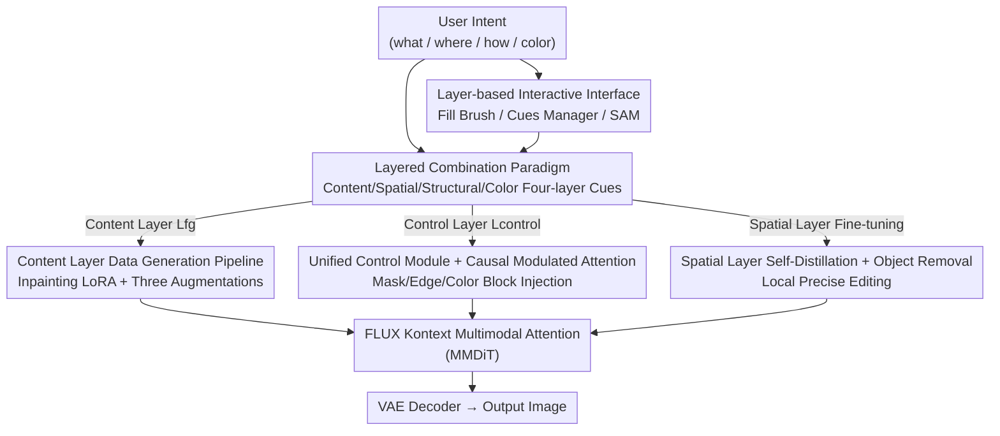

# MagicQuill V2: Precise and Interactive Image Editing with Layered Visual Cues

**Conference**: CVPR 2026  
**Paper**: [CVF Open Access](https://openaccess.thecvf.com/content/CVPR2026/html/Liu_MagicQuill_V2_Precise_and_Interactive_Image_Editing_with_Layered_Visual_CVPR_2026_paper.html)  
**Code**: TBD (project page demo only)  
**Area**: Image Generation / Interactive Image Editing  
**Keywords**: Layered Editing, Diffusion Transformer, Controllable Generation, FLUX Kontext, Interactive Systems

## TL;DR
MagicQuill V2 decomposes the paradigm of "editing the entire image with a single-sentence prompt" into four independently stackable visual cues: **content layer / spatial layer / structural layer / color layer**. Based on FLUX Kontext, it precisely injects these cues into the diffusion process using a unified control module + causal modulated attention, coupled with a Photoshop-like layered interactive interface. This allows users to achieve precise, itemized control over "what to draw, where to place it, what it looks like, and what color it should be."

## Background & Motivation
**Background**: The current generation of diffusion Transformer editing systems, such as FLUX, Qwen-Image, GPT-4o, and Nano Banana (Gemini 2.5 Flash Image), excel at performing "holistic" editing based on natural language or reference images, capable of generating highly complex results with just a single prompt. ControlNet / T2I-Adapter, and later OminiControl and EasyControl, have also attempted to incorporate spatial conditions such as Canny edges, depth, and poses.

**Limitations of Prior Work**: The core issue is that these systems rely on a **single, holistic prompt**. In reality, a user's creative intent is rarely "monolithic". As shown in Fig. 1 of the paper, a user first composes a scene of "classic car + person + dog", and then wants to turn the dog's head to face the camera, change the shirt to green, and insert a top hat and an apple. When these requirements are entangled in a single prompt, it is highly challenging for the model to decouple them. Even if a reference image is provided, its role still depends on text prompt scheduling, thereby inheriting the inherent imprecision of language—failing to clearly specify "where to modify, what to change it to, and what shape it should take." Consequently, a massive chasm remains between the semantic convenience of generative models and the spatial precision of traditional image editing software (like Photoshop or GIMP).

**Key Challenge**: There is a fundamental tension between **holistic prompting** and **fine-grained control**. A single-sentence prompt is naturally unable to decouple the four orthogonal intent dimensions of "content (what) / position (where) / structure (how) / color (color)", and forcing them into one prompt leads to mutual interference.

**Goal**: To explicitly decompose the "creative intent" into four independent, controllable layers, allowing users to express their intent by stacking layers just like in professional painting software, where these layers are not static inputs but dynamic elements that can be independently combined, moved, and refined.

**Key Insight**: Borrowing from the mature and intuitive "layer-based" workflow of professional graphics software, the authors map each fundamental dimension of visual creation to a dedicated layer: the content layer uses foreground reference images to specify "what to draw", the spatial layer uses masks to indicate "where to draw", the structural layer uses edge maps to define "what shape", and the color layer uses color blocks/strokes to define "what color".

**Core Idea**: To replace "a single vague text prompt" with "a stack of precise visual cues"—deconstructing the editing intent into four layers (content, spatial, structural, and color) and injecting them into a diffusion Transformer via a unified control module, thereby overlaying graphics-software-level granularity of control onto the semantic capabilities of generative models.

## Method

### Overall Architecture
MagicQuill V2 is built upon the image editing model **FLUX Kontext**. The objective is to generate a target image $x$ given a context image $y$, a natural language instruction $c$, and a stack of layered visual cues $L$, which approximates the conditional distribution

$$p(x \mid y, c, \{L_{fg}, L_{control}\}).$$

Here, the cues are explicitly split into two groups: the **content layer** $L_{fg}$ ("what to draw") specified by one or more foreground fragments $F_i$, and the **control layer** $L_{control}$ ("where to draw / what shape / what color") consisting of a spatial layer mask $M$, a structural layer edge map $E$, and a color layer color-block map $C$.

The entire system is composed of three components: (1) a **data generation pipeline** specifically for training the content layer, enabling the model to learn "context-aware foreground fusion" rather than simple copy-pasting; (2) a **unified control module** that processes spatial, structural, and color control cues simultaneously, utilizing causal modulated attention to precisely constrain geometry and color scheme; (3) a **layered interactive interface** that integrates these layers into an intuitive, real-time editing tool resembling painting software. During inference, the layered visual cues are individually encoded into latents, which are then fed into the unified control module alongside text latents and noise latents to perform multimodal attention, and finally decoded into the final output via a VAE decoder.

### Key Designs

**1. Layered Combination Paradigm: Decomposing a prompt into four orthogonal visual cues**

This is the core principle of the paper. Addressing the pain point that "a single holistic prompt cannot decouple content, position, structure, and color," the authors map the editing intent into four dedicated layers: the **content layer** (foreground reference image $F_i$, controlling "what to draw"), the **spatial layer** (mask $M$, controlling "where to edit"), the **structural layer** (edge map $E$, controlling "what shape"), and the **color layer** (color-block map $C$, controlling "what palette"). In the interactive system, these four layers are not one-time static inputs, but dynamic elements that can be independently stacked, repositioned, and refined. The fundamental difference between this and previous controllable editing methods is that while methods like ControlNet can provide spatial conditions, and composition methods like Paint-by-Example, AnyDoor, and Insert-Anything can provide masks and reference images, the final appearance is still inferred from "the overall reference image + text". In contrast, each layer here is a **direct and explicit** channel, bypassing the language inference gap and allowing the user's specific target modification to be expressed separately and precisely.

**2. Content Layer Data Generation Pipeline: Teaching the model "contextual fusion" instead of "pasting" using Inpainting LoRA + three augmentations**

The biggest pitfall of the content layer is that foregrounds extracted from real images are often occluded and incomplete (e.g., a hand blocking part of an apple). If trained directly on such incomplete foregrounds, the model only learns to copy and paste the incomplete fragment without understanding the context to generate reasonable interactions and surrounding content. The authors bypass this with a dedicated data generation pipeline. First, they synthesize 5,000 base images depicting "object-scene interactions": Qwen3-8B is used to generate object descriptions and captions $c$ with interaction action lists, Flux.1 Krea renders high-definition photorealistic source images, and Grounding SAM segments the main object masks to obtain initial foreground fragments. To handle the incompleteness issue, the authors specifically train an **object inpainting LoRA** (on FLUX Kontext, learning to restore complete objects from random brush masks using 3,000 complete objects) to recover complete objects from the cropped incomplete foregrounds. Subsequently, three types of **augmentations** are applied to make the foreground realistic: a **relighting augmentation** using random lighting maps from ICLight (to learn lighting coordination), a **resolution augmentation** using random downsampling and scaling (to adapt to different user input resolutions), and a **perspective augmentation** using random perspective transforms (to learn geometric distortion correction). Finally, the training triplets are assembled: the target $x$ is the unmodified source image, $c$ is its description, and the input $y$ is formed by synthesizing the augmented foreground back to its original position and applying random background mask augmentations, forcing the model to learn contextual coordination. During training, a LoRA is added to the attention layers of FLUX Kontext, optimizing the rectified-flow objective:

$$\mathcal{L}_\theta = \mathbb{E}_{t\sim p(t),x,y,c}\big[\,\lVert v_\theta(z_t,t,y,c) - (\epsilon - x)\rVert_2^2\,\big],$$

where $\epsilon\sim\mathcal{N}(0,1)$ and $z_t=(1-t)x+t\epsilon$. Ablation studies show that removing any augmentation leads to degradation (see experimental results), proving that this pipeline is the source of the "non-pasting" capability.

**3. Unified Control Module and Causal Modulated Attention: A unified mechanism to inject masks, edges, and color blocks with adjustable strengths**

Since spatial, structural, and color control cues vary in form, the authors handle them with a **highly simplified and unified** control module. To save compute, all visual control cues are downscaled from their original size $(H,W)$ to a fixed low resolution $(h,w)$, while the positional encodings are still mapped back to the high-resolution coordinates as $P_i = i\cdot\frac{H}{h},\ P_j = j\cdot\frac{W}{w}$ to maintain spatial alignment. The control cue latent $Z_c$ is injected via a LoRA-adapted **conditioning branch**: low-rank updates are added to the MMDiT shared projections $W_Q,W_K,W_V$, yielding $Q_c = W_Q Z_c + B_Q A_Q Z_c$ ($K,V$ are updated similarly, with rank $r\ll d$), and then concatenated with the QKV parameters of the text $Z_t$, noise map $Z_x$, and context image $Z_y$ into a complete sequence for multimodal attention.

The true ingenuity lies in the **Causal Modulated Attention**: a bias matrix $B$ is directly added to the attention logits,

$$\text{Attention}(\mathbf{Q},\mathbf{K},\mathbf{V}) = \text{Softmax}\!\Big(\tfrac{\mathbf{Q}\mathbf{K}^T}{\sqrt{d_k}} + \mathbf{B}\Big)\mathbf{V},$$

where, letting $I_x,I_{c_k}$ denote the token index sets for the noise map and the $k$-th cue, respectively:

$$B_{ij} = \begin{cases} \log(\sigma_k) & i\in I_x,\ j\in I_{c_k} \\ -\infty & i\in I_{c_k},\ j\notin I_{c_k} \\ 0 & \text{otherwise} \end{cases}$$

The first term $\log(\sigma_k)$ represents a **user-adjustable guidance strength**: when $\sigma_k=1$, the bias is 0, degenerating to standard attention; as $\sigma_k$ increases, the positive bias gets stronger, enforcing stricter compliance with the cue; when $\sigma_k=0$, the bias is $-\infty$, which effectively turns off the cue. The second term forcibly sets the attention between different control signals to $-\infty$, **isolating** different cues to prevent mutual crosstalk. This single $\sigma$ parameter allows users to continuously slide between "trusting my painted cues" and "trusting the model's generation prior" (in experiments, as $\sigma$ increases from 0 to 2.0, the generation matches the user's strokes more closely). For training, structural and color layers $(E,C)$ are trained in a **context-free** ($y=\varnothing$) conditional generation manner, approximating $p(x|c)$. The authors find that the control capability learned under conditional generation robustly generalizes to conditional editing during inference.

**4. Spatial Layer Self-Distillation and Object Removal: Training "local precise editing" independently**

The positioning of the spatial layer (mask $M$) differs from the other layers—its goal is to **restrict modifications to a specified region** for local editing, rather than redrawing from noise based on cues. This requires a (source image, target image, prompt, mask) quadruplet. The authors use **self-distillation** to construct this data: they first employ a VLM (Qwen2.5-VL-72B) to generate reasonable local editing prompts for source images, and then use the base FLUX Kontext to perform these edits; the mask $M$ is obtained by thresholding the pixel-wise difference between the source and edited images and taking the convex hull of the modified region, filtering out samples where the mask is too large (global editing) or too small (no significant change). To strengthen the common task of **object removal**, the authors additionally construct data following the SmartEraser approach—randomly cropping a foreground object and pasting it back to an arbitrary position in the same image, then training the model to seamlessly erase the redundant content. Because the spatial layer is explicitly fine-tuned for "masked local editing/removal," it significantly outperforms general inpainting models in local modification and object erasure.

### A Complete Example
Taking the continuous workflow in Fig. 1 as an example, a user can stack intents layer by layer in a single workflow: (A) First, drag three foreground fragments ("classic car," "woman," and "dog") into the content layer to compose a base image; (B) To change the dog's pose, draw a mask in the spatial layer and add the instruction "turn the dog's head to face the camera" for local reconstruction; (C) In the structural layer, use a brush to outline a bell collar (edge map $E$), and in the color layer, paint the shirt green (color-block map $C$); (D) Finally, seamlessly insert a top hat and an apple. Each step only affects its corresponding layer without interfering with others, and each cue's intensity $\sigma$ can be adjusted at any time, or refined using SAM segmentation.

## Key Experimental Results

### Main Results

**Content Layer Composition** (self-constructed 200-sample test set, 100 interaction + 100 placement, Table 1):

| Model | L1 ↓ | L2 ↓ | CLIP-I ↑ | DINO ↑ | CLIP-T ↑ | LPIPS ↓ |
|------|------|------|----------|--------|----------|---------|
| Insert Anything | 0.105 | 0.039 | 0.910 | 0.825 | 0.327 | 0.354 |
| Nano Banana | 0.105 | 0.038 | 0.934 | 0.891 | 0.335 | 0.321 |
| Qwen-Image | 0.114 | 0.042 | 0.929 | 0.881 | 0.334 | 0.357 |
| FLUX Kontext | 0.117 | 0.045 | 0.930 | 0.872 | **0.337** | 0.359 |
| Put it Here | 0.136 | 0.054 | 0.925 | 0.854 | 0.335 | 0.438 |
| **Ours** | **0.061** | **0.019** | **0.962** | **0.930** | 0.335 | **0.202** |

Ours significantly leads across almost all metrics: L1 drops from the second-best 0.105 to 0.061, LPIPS drops from 0.321 to 0.202, and DINO rises from 0.891 to 0.930. Only CLIP-T is roughly on par (0.335) with FLUX Kontext's 0.337.

**Structural Layer + Color Layer Control** (1,000 samples drawn from Pico-Banana-400K, extracting edges/color blocks directly from the target image as cues, Table 2):

| Model | L1 ↓ | L2 ↓ | CLIP-I ↑ | DINO ↑ | LPIPS ↓ |
|------|------|------|----------|--------|---------|
| Qwen-Image | 0.132 | 0.043 | 0.923 | 0.871 | 0.395 |
| Qwen-Image (Edge) | 0.131 | 0.042 | 0.924 | 0.875 | 0.387 |
| FLUX Kontext | 0.152 | 0.054 | 0.908 | 0.853 | 0.434 |
| Ours (Edge) | 0.107 | 0.030 | 0.938 | 0.909 | 0.317 |
| Ours (Color) | 0.080 | 0.020 | 0.943 | 0.915 | 0.327 |
| **Ours (Edge+Color)** | **0.080** | **0.018** | **0.949** | **0.930** | **0.283** |

Using the edge layer alone corrects geometry but suffers from color shift, while using the color layer alone aligns colors but loses structural details. Combining both yields the best results across all metrics (L1 0.080, LPIPS 0.283), confirming that the two types of cues are complementary and both indispensable.

**Object Removal** (RORD benchmark with 5,000 samples, Table 3):

| Model | L1 ↓ | L2 ↓ | LPIPS ↓ | SSIM ↑ | PSNR ↑ | FID ↓ |
|------|------|------|---------|--------|--------|-------|
| SmartEraser | 0.069 | 0.098 | 0.196 | 0.630 | 21.14 | 17.03 |
| OmniEraser (Base) | 0.058 | 0.084 | 0.243 | 0.660 | 22.16 | 19.76 |
| OmniEraser (CN) | 0.048 | 0.084 | 0.182 | 0.817 | 22.96 | 25.92 |
| **Ours** | **0.042** | **0.071** | **0.154** | **0.840** | **24.45** | **16.42** |

Ours achieves comprehensive dominance across L1/L2/LPIPS/SSIM/PSNR/FID (PSNR of 24.45 vs. the second-best 22.96, and the lowest FID of 16.42).

### Ablation Study

Data construction pipeline ablation (Fig. 7, primarily qualitative, retraining by removing one augmentation at a time):

| Configuration | Phenomenon | Conclusion |
|------|------|------|
| Full (Complete Pipeline) | Geometry, lighting, resolution, and interaction are all correct | All augmentations work synergistically |
| w/o Perspective Aug. | Cabinets retain original tilt, physically implausible | Responsible for geometric correction |
| w/o Relighting Aug. | Subject contains flat lighting, appearing "pasted on" | Responsible for lighting coordination |
| w/o Resolution Aug. | Blurry or noisy outputs under low-res/low-quality cues | Responsible for input robustness |
| w/o Inpainting LoRA | Training on incomplete foregrounds degrades to copy-pasting, failing to interact with the scene | Responsible for "contextual fusion instead of pasting" |

### Key Findings
- **Inpainting LoRA is key to "non-pasting"**: Without reconstructing the incomplete foreground, the model simply copies and pastes the fragment without interacting with the scene, which is the core difference between Ours and general composition methods.
- **Complementarity of Edges vs. Colors**: The edge layer governs geometry while the color layer manages the color scheme. Using either alone reveals distinct limitations, whereas combining them achieves optimal results across all metrics. This proves that decomposing the intent into layers yields empirical benefits rather than being a mere conceptual gimmick.
- **$\sigma$ provides continuously adjustable intensity**: $\sigma=0$ degenerates to the base FLUX Kontext, $\sigma=1.0$ achieves a balanced and faithful result, and higher values enforce stricter adherence but amplify defects inherent to the cues, thereby introducing artifacts. This provides users with a control knob to balance "trusting cues vs. trusting the prior."
- **Independent fine-tuning of the spatial layer yields clear benefits**: General inpainting (e.g., FLUX Fill, MagicQuill V1) ignores the original contents within the mask and fails to execute "content-aware local editing". In contrast, the specially trained spatial layer maintains identity while performing local color adjustment/style transfer, and sets a new SOTA in object removal.

## Highlights & Insights
- **Formally introducing the "layer" construct—a professional graphic paradigm proven for decades—into generative editing**: Instead of inventing new command languages, this approach maps content/space/structure/color into stackable layers, making it highly intuitive. This is the most impressive, product-level "aha" insight.
- **Causal modulated attention kills two birds with one stone**: A single bias matrix uses $\log(\sigma_k)$ to provide a continuous intensity knob for each cue, while utilizing $-\infty$ to isolate different cues and prevent mutual interference. This elegant mechanism simultaneously solves both "adjustable strength" and "multi-cue decoupling." This trick is highly transferable to any diffusion control scenarios requiring multi-conditional adjustable injection.
- **Bypassing the "dirty data" issue of incomplete foregrounds by training an object inpainting LoRA**: The root cause why many composition methods degrade to simple pasting lies in the incompleteness of the training foregrounds. The authors directly address this root cause instead of piling up data, showing a clean, refined approach.
- **Structural/color layers trained with context-free conditional generation generalize robustly to conditional editing**: This empirical lesson (transferring control capabilities learned during generation to editing) is highly valuable for low-cost synthesis of controllable editing data.

## Limitations & Future Work
- **Strong dependency on the FLUX Kontext backbone**: The entire system is built upon FLUX Kontext, meaning its control capabilities and performance upper bound are constrained by the backbone. Whether this framework successfully transfers to other backbones remains unverified.
- **High $\sigma$ amplifies flaws in cues**: The authors acknowledge that when $\sigma$ is increased to enforce stricter compliance, it also amplifies the inherent imperfections in user-drawn cues, leading to artifacts. Thus, a trade-off still exists between precision and robustness.
- **Content layer data pipeline heavily relies on synthetic data**: The base images are synthesized by Flux.1 Krea, prompts are generated by Qwen3-8B, and completion relies on a self-trained LoRA. This entire pipeline is a "model-generating-data-for-model-training" loop. Whether it fully covers complex real-world occlusion/lighting distributions remains questionable (⚠️ Subject to the original text; the paper did not report additional evaluation on real-world datasets).
- **No quantitative interaction efficiency or user study**: The "intuitiveness and precision" of the layered interface are mainly supported by qualitative user interface figures and case studies. There is a lack of user experiments to quantitatively compare the efficiency gains over traditional prompt-based workflows.

## Related Work & Insights
- **vs. ControlNet / T2I-Adapter**: These models inject spatial conditions like Canny, depth, and pose into the UNet, serving as early milestones of fine-grained control. Ours extends control to the DiT architecture and unifies them into stackable, strength-adjustable, non-interfering layers, offering higher granularity and composability.
- **vs. OminiControl / EasyControl**: OminiControl concatenates text, noise, and conditioning tokens into a single sequence for joint processing, while EasyControl uses isolated branches to enhance plug-and-play capability. Ours similarly adopts a unified sequence + LoRA conditioning branch, but additionally introduces causal modulated attention for strength adjustment and cue isolation, semanticizing the control into four layers: "content, space, structure, and color".
- **vs. Composition methods like Paint-by-Example / AnyDoor / Insert-Anything**: These methods allow specifying layouts/masks to control "where the object is placed", but the final appearance is still inferred from the overall reference image, limiting fine-grained control. Ours allows users to provide "foreground fragments" as direct cues, offering a more precise guidance channel.
- **vs. MagicQuill V1**: V1 proposed the prototype "Idea Collector" interactive concept and brush tools. V2 extends this with Fill Brush (spatial layer), Visual Cue Manager (foreground dragging), and SAM segmentation panel, formally framing the interaction as a layer-based editing framework.

## Rating
- Novelty: ⭐⭐⭐⭐⭐ Systematically introduces the professional layered paint paradigm into generative editing, coupled with causal modulated attention, representing a paradigm-level innovation.
- Experimental Thoroughness: ⭐⭐⭐⭐ Quantitative tables and data pipeline ablation studies are provided across three tasks (content, control, and removal), but it lacks user studies and evaluations on real-world datasets.
- Writing Quality: ⭐⭐⭐⭐⭐ The logic connecting motivation, framework, four-layer design, and experiments is clear, with complete equations and diagrams.
- Value: ⭐⭐⭐⭐⭐ Delivers precise, controllable editing tailored directly to creators, offering high productization value with highly transferable tricks.

<!-- RELATED:START -->

## Related Papers

- [\[CVPR 2026\] Cinematic Audio Source Separation Using Visual Cues](cinematic_audio_source_separation_using_visual_cues.md)
- [\[CVPR 2025\] MagicQuill: An Intelligent Interactive Image Editing System](../../CVPR2025/image_generation/magicquill_an_intelligent_interactive_image_editing_system.md)
- [\[CVPR 2026\] OneHOI: Unifying Human-Object Interaction Generation and Editing](onehoi_unifying_human-object_interaction_generation_and_editing.md)
- [\[CVPR 2026\] MRT: Masked Region Transformer for Layered Image Generation and Editing at Scale](mrt_masked_region_transformer_for_layered_image_generation_and_editing_at_scale.md)
- [\[CVPR 2026\] Inter-Edit: First Benchmark for Interactive Instruction-Based Image Editing](inter-edit_first_benchmark_for_interactive_instruction-based_image_editing.md)

<!-- RELATED:END -->
