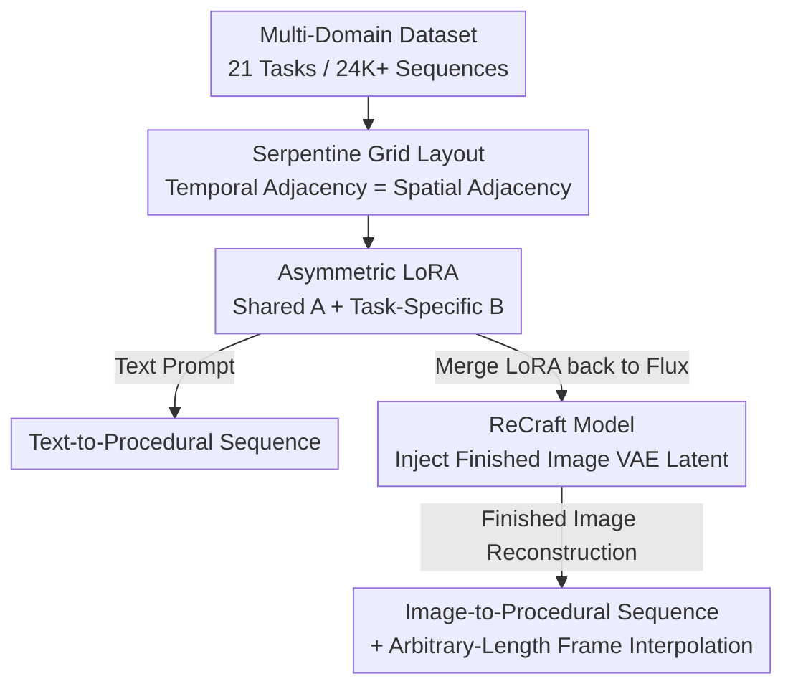

# MakeAnything: Harnessing Diffusion Transformers for Multi-Domain Procedural Sequence Generation

**Conference**: CVPR 2026  
**Paper**: [CVF Open Access](https://openaccess.thecvf.com/content/CVPR2026/html/Song_MakeAnything_Harnessing_Diffusion_Transformers_for_Multi-Domain_Procedural_Sequence_Generation_CVPR_2026_paper.html)  
**Code**: https://github.com/showlab/MakeAnything  
**Area**: Diffusion Models / Image Generation  
**Keywords**: Procedural Sequence Generation, Diffusion Transformer, Asymmetric LoRA, Image-Conditioned Generation, Multi-Task

## TL;DR
MakeAnything leverages the in-context capability of Flux (DiT) by arranging multi-frame creative processes (such as drawing, crafting, and cooking) into a grid and fine-tuning with Asymmetric LoRA. This achieves, for the first time, cross-domain "step-by-step tutorial" generation across 21 domains, supporting both text-to-process generation and reconstructing creation steps from a finished image (ReCraft).

## Background & Motivation
**Background**: Letting machines generate step-by-step procedural sequences of "how to draw this painting / make this craft" has long been a highly desired but difficult-to-realize direction. Early works relied on stroke-based rendering (SBR) combined with reinforcement learning to approximate the target image stroke-by-stroke. Recently, methods such as ProcessPainter, PaintsUndo, and Inverse Painting have leveraged temporal diffusion models to learn the drawing distribution of artists on synthetic datasets.

**Limitations of Prior Work**: These methods are almost completely restricted to the single task of "drawing," demonstrating poor cross-domain generalization. ProcessPainter, based on AnimateDiff, can only model very minor physical movements and fails to represent procedural sequences with **structural mutations** (e.g., Lego blocks turning into finished assemblies, or raw ingredients turning into a cooked dish). While general DiT-based video models can generate long sequences, their training data distribution diverges significantly from complex procedural workflows, leading to performance degradation caused by distribution shifts.

**Key Challenge**: Replicating human creativity requires two elements to be addressed simultaneously: **high-quality multi-task procedural data** and **a method capable of learning effectively under extreme data scarcity**. However, procedural data is inherently scarce and imbalanced (some categories have only 50 samples). A single standard LoRA trained on all data fails to learn diverse knowledge, while training on individual tasks leads to severe overfitting on small datasets.

**Goal**: (1) Construct a large-scale, multi-domain procedural sequence dataset; (2) Design a unified framework that can generalize across domains, operate under low-data regimes, and perform inverse process reconstruction.

**Key Insight**: The authors observe that DiT attention naturally favors **spatially adjacent** tokens (due to the strong correlation between neighboring pixels learned during pre-training). If a sequence of temporal frames is arranged into a grid where temporal adjacency equals spatial adjacency, the model can directly leverage the in-context attention of DiT to learn "inter-frame consistency and logical coherence" without requiring additional temporal modules.

**Core Idea**: Translate "process generation" into "in-context image generation within a grid." This is achieved by feeding a serpentine grid layout into Flux, utilizing Asymmetric LoRA to balance general knowledge with single-task adaptation, and introducing a lightweight image-conditioned plugin, ReCraft, for inverse reconstruction and arbitrary-length frame interpolation.

## Method

### Overall Architecture
MakeAnything is built on pre-trained Flux 1.0, with training conducted serially in two stages. **The first stage**: Each creative sequence (9 or 4 frames) is arranged in a serpentine layout to form a 3x3 or 2x2 grid, treated as a single large image. This is fine-tuned with Asymmetric LoRA on a 24K+ multi-task dataset to activate DiT's in-context capabilities, producing a "text-to-procedural sequence" generator. **The second stage**: The LoRA weights learned in the first stage are merged back into the Flux base, forming the foundation for ReCraft. By concatenating the "clean VAE latent of the finished image" into the multimodal attention and applying lightweight LoRA fine-tuning, the "image-to-procedural sequence" inverse reconstructor is obtained, which inherently gains the ability to interpolate frames between any two steps.

### Key Designs

**1. Serpentine Grid Layout: Translating temporal consistency into DiT's spatial adjacency preference**

Arranging 9 frames sequentially into a standard 3x3 grid poses a potential risk: the 3rd frame (end of the first row) and the 4th frame (start of the second row) are temporally adjacent but are neither vertically nor horizontally adjacent in the grid. DiT's attention would fail to capture their strong correlation, leading to disconnected frame transitions. The authors' serpentine layout guides the sequence like a snake—the first row goes left-to-right, the second row goes right-to-left, and the third row goes left-to-right—ensuring that **any two temporally adjacent frames are either horizontally or vertically adjacent in the grid**. Essentially, since DiT learns that "neighboring pixels are highly correlated" during pre-training, "disguising" temporal continuity as spatial continuity allows the model to maintain inter-frame visual consistency and logical progression using existing attention priors, without introducing extra temporal modules. 9 frames are arranged into 3x3, and 4 frames into 2x2.

**2. Asymmetric LoRA: Sharing a single matrix A to learn generic procedural knowledge, with task-specific B matrices to prevent overfitting**

Procedural data is extremely scarce and imbalanced (ranging from 50 to 10,000 sequences per task). Standard LoRA trained on mixed data fails to acquire such diverse knowledge, whereas single-task LoRA suffers from severe overfitting on small datasets. Inspired by HydraLoRA, the authors introduce Asymmetric LoRA to image generation for the first time: **all tasks share a single down-projection matrix $A$** (capturing general procedural knowledge shared across tasks), while **each task has its own up-projection matrix $B_i$** (adapting to task-specific characteristics). The weight updates are formulated as:

$$W = W_0 + \Delta W = W_0 + \sum_{i=1}^{N} \omega_i \cdot B_i A,$$

where $B_i \in \mathbb{R}^{d\times r}$, the shared $A \in \mathbb{R}^{r\times k}$, and $\omega_i$ is the weight of the $i$-th module. The shared $A$ learns the generalized patterns of "step-by-step creation" from large-scale procedural data, mitigating overfitting on low-sample categories. Meanwhile, the specialized $B_i$ retains task-specific detail performance, striking a balance between "generalization vs. specialization." During inference, the domain-specific $B$ and the domain-agnostic $A$ are combined. Furthermore, this can be superimposed with stylistic LoRAs from Civitai that **do not contain procedural data**, transferring the method to unseen domains (e.g., watercolor, relief, ice sculpting, papercraft).

**3. ReCraft Model: Injecting the finished image VAE latent into multimodal attention to reconstruct the creation process under low-data regimes**

In practical scenarios, users often want to "upload a finished product and see how it was made step-by-step." Training a large control module like ControlNet or IP-Adapter from scratch is impractical when there are only dozens of samples per task. ReCraft addresses this by reusing the merged Flux base and adding a minimal conditioning module: the finished image (the last frame of the sequence) is encoded via VAE into a **clean (noise-free) image condition token** $c_I$, which is concatenated with the noisy process tokens $z$ and text tokens $c_T$ into the multimodal attention:

$$\text{MMA}([z; c_I; c_T]) = \text{softmax}\!\left(\frac{QK^\top}{\sqrt{d}}\right)V,$$

During training, noise is added and removed only for the preceding steps, while $c_I$ for the last frame remains clean throughout, acting as an "anchor" for the entire denoising trajectory. During inference, given a finished image, the model autoregressively reconstructs the first 8 steps to produce a logically coherent reverse creation process. The entire process is still optimized using the conditional flow matching loss (see below), yielding strong controllability with minimal modifications to Flux.

**4. Arbitrary-Length Frame Interpolation: Training with 2x2 diagonal frames to recursively generate arbitrary fine-grained steps**

A fixed 8-step sequence is sometimes not detailed enough. The authors equip ReCraft with an interpolation capability: during training, a 2x2 grid $\{x_1,x_2,x_3,x_4\}$ is constructed from 4 consecutive frames. The **diagonal frames $x_1$ and $x_4$ are used as inputs** to predict the missing intermediate frames $x_2,x_3 = F(x_1,x_4)$, thereby learning to "fill in reasonable intermediate transitions given two boundary keyframes." During inference, this interpolation module can be repeatedly applied to any adjacent frame pair $(x_n, x_{n+1})$. Through recursive subdivision, the sequence can be made arbitrarily dense—enhancing the details of reconstructed sequences or extending text-generated processes while maintaining style and temporal consistency.

### Loss & Training
Both stages utilize the conditional flow matching loss of SD3. The first stage (Asymmetric LoRA) applies only to text conditioning:

$$\mathcal{L}_{CFM} = \mathbb{E}_{t,\,p_t(z|\epsilon),\,p(\epsilon)}\big[\,\|v_\Theta(z, t, c_T) - u_t(z|\epsilon)\|^2\,\big],$$

where $v_\Theta$ is the velocity field parameterized by the network, and $u_t(z|\epsilon)$ is the conditional vector field connecting the noise to the real distribution probability path. During the ReCraft stage, the image condition $c_I$ is incorporated, and the objective becomes $\|v_\Theta(z,t,c_I,c_T)-u_t(z|\epsilon)\|^2$. Training details: Flux 1.0 dev base; CAME optimizer instead of Adam (significantly improving generation quality); resolution 1024, LoRA rank 64, learning rate 1e-4, batch size 2; Asymmetric LoRA is trained for 40K steps, while ReCraft's reconstruction and interpolation modules are each trained for 15K steps. Data annotation/descriptions for each frame are automatically generated using GPT-4o.

## Key Experimental Results

### Main Results
There are no readily available metrics to evaluate procedural sequences (as coherence, logic, and usability are hard to quantify). The authors employ a hybrid evaluation approach combining GPT-4o and human ratings across three dimensions: **Alignment** (text-image alignment), **Coherence** (inter-frame logical coherence), and **Usability** (tutorial utility), along with CLIP Score to quantify text-image alignment. The table below highlights representatives from the 21 tasks (G=GPT score, H=Human, C=CLIP):

| Task | Alignment (G\|H\|C) | Coherence (G\|H) | Usability (G\|H) |
|------|------|------|------|
| Oil Painting | 4.90\|4.30\|37.30 | 4.95\|4.17 | 4.85\|4.20 |
| Chinese Painting | 4.80\|4.37\|33.46 | 4.90\|4.22 | 4.70\|4.33 |
| LEGO | 4.60\|4.32\|34.40 | 4.90\|4.15 | 4.75\|4.00 |
| Transformer | 4.75\|4.30\|33.03 | 4.90\|4.23 | 4.75\|4.15 |
| Cook | 3.20\|4.21\|34.41 | 4.25\|4.03 | 3.65\|3.90 |
| Illustration | 3.12\|4.17\|31.68 | 3.40\|4.07 | 2.45\|4.07 |

For text-to-sequence generation, the method is compared with ProcessPainter, Flux, and the commercial API Ideogram. For image-to-sequence generation, comparisons are made against Inverse Painting and PaintsUndo. A human blind test on 50 sequence groups (41 valid questionnaires, with randomized method names) shows that MakeAnything ranks first across all four preference dimensions: Alignment, Coherence, Usability, and Consistency (Fig. 7).

### Ablation Study
Ablation study of Asymmetric LoRA across all 21 tasks (G=GPT, C=CLIP):

| Configuration | Alignment (G\|C) | Coherence | Usability | Description |
|------|------|------|------|------|
| Full Asymmetric LoRA | 4.35\|32.70 | 3.97 | 4.09 | Full design: Shared A + Task-specific B |
| w/o Asymmetric LoRA | 3.68\|29.42 | 3.83 | 3.76 | Degrades to single-task standard LoRA, no shared parameters |
| Mixed-data Training | 3.72\|30.94 | 3.50 | 3.50 | Standard LoRA trained on mixed multi-task data |

### Key Findings
- **Asymmetric LoRA is the core source of performance gain**: The full design achieves an Alignment score of 4.35. Removing the asymmetric structure (single-task standard LoRA) drops it to 3.68, and training on mixed data drops it to 3.72; the CLIP score similarly drops from 32.70 to 29.42 and 30.94 respectively.
- **Qualitative trade-off between overfitting and underfitting**: On small datasets (e.g., only 50 portrait samples or 300 sketch samples), the base Flux model responds correctly to the text prompt but fails to generate meaningful step-by-step visual transitions. Standard LoRA generates reasonable step transitions but suffers from a severe breakdown in text-image alignment (overfitting). Asymmetric LoRA simultaneously achieves "logical process transitions + strong alignment," which the authors attribute to the generalized procedural knowledge absorbed by the shared $A$ from large-scale data, effectively alleviating overfitting in low-data regimes.
- **Generalization to unseen domains**: By superimposing the procedural LoRA with watercolor, relief, ice sculpting, or papercraft style LoRAs from Civitai, the model can generate decent procedural sequences even without being trained on those specific workflows.

## Highlights & Insights
- **Disguising temporal processes as spatial grids**: The serpentine grid layout directly leverages DiT's pre-existing spatial adjacency attention priors to maintain frame-to-frame consistency, bypassing the need for dedicated temporal modules—a lightweight yet effective formulation.
- **Asymmetric LoRA's "Shared A + Specific B" is an elegant solution for low-data multi-task settings**: The shared matrix acting as a "general procedural knowledge... base" while the task-specific matrices preserve individual details is a decomposition strategy transferable to any generative scenario characterized by many tasks, minimal data per task, and shared underlying patterns.
- **ReCraft controls generation via "clean condition token anchoring"**: Injecting the finished image as a noise-free anchor into the MMA is far more data-efficient than training a ControlNet from scratch, presenting a practical paradigm for low-resource controllable generation.
- **Self-supervised frame interpolation via diagonal frames**: Training on 2x2 grids using diagonal inputs to predict intermediate frames enables recursive subdivision without requiring extra annotations, shifting "fixed step" generation to "arbitrary fine-grained" step generation.

## Limitations & Future Work
- **Evaluation heavily relies on subjective scores (GPT-4o + Human)**: Procedural sequences lack objective evaluation metrics. CLIP only measures text-image alignment, while scores for coherence and usability naturally contain subjective noise, demanding caution when comparing absolute values across different tasks (e.g., GPT scores for Cook and Illustration are noticeably lower).
- **Extreme data imbalance remains a challenge**: Task sample sizes range from 50 to 10,000, spanning two orders of magnitude. Even with the shared $A$ providing support, the quality ceiling for low-resource categories remains constrained.
- **Fixed frame-number layout**: Training relies primarily on 9-frame or 4-frame grids. Generating longer or irregular sequences requires recursive interpolation via ReCraft, which can lead to cumulative errors.
- **Unverified realism of reconstructed processes**: ReCraft provides "physically and visually plausible" reverse steps, which might not reflect the actual physical fabrication process, demanding caution when applied to educational or reverse-engineering scenarios.

## Related Work & Insights
- **vs. ProcessPainter / PaintsUndo**: These methods utilize AnimateDiff or temporal diffusion to model artist painting distributions within a single drawing domain, accommodating only minor physical variations and exhibiting poor cross-domain capabilities. In contrast, this work employs DiT in-context learning, grid layouts, and Asymmetric LoRA to cover 21 domains with structural mutations (e.g., Lego, cooking, carving), supporting both text and image conditioning.
- **vs. Inverse Painting**: This method models the drawing process by predicting painting orders and image segmentation, restricted only to drawing. ReCraft uses image condition token injection to reconstruct processes, exhibiting cross-domain capacity with low data requirements.
- **vs. OminiControl / IP-Adapter / ControlNet**: These are general controllable generation schemes but either rely on spatial alignment or require training control modules from scratch. ReCraft adds a minimal conditioning module on top of the Flux base, reusing the merged procedural LoRA, specifically tailored for low-data procedural reconstruction.
- **vs. HydraLoRA**: This paper introduces the asymmetric LoRA concept (shared A + multiple B) to image generation for the first time, addressing data scarcity and imbalance in multi-task procedural learning.

## Rating
- Novelty: ⭐⭐⭐⭐⭐ The three components (serpentine grid, Asymmetric LoRA, and ReCraft) are custom-designed to address the under-explored task of procedural sequence generation.
- Experimental Thoroughness: ⭐⭐⭐⭐ Covers 21 tasks, includes multiple baselines, blind testing, and ablation studies, though it suffers from a lack of objective metrics and relies heavily on subjective evaluations.
- Writing Quality: ⭐⭐⭐⭐ Clear motivation and sequential development of methods; some tables and figure captions are information-dense.
- Value: ⭐⭐⭐⭐⭐ Open-sources a 24K+ multi-domain procedural dataset and provides a unified framework, establishing a solid benchmark for step-by-step creation generation.

<!-- RELATED:START -->

## Related Papers

- [\[CVPR 2026\] ProcessMaker: A Generalized Process Visualization Framework with Adaptive Sequence Steps on Diffusion Transformers](processmaker_a_generalized_process_visualization_framework_with_adaptive_sequenc.md)
- [\[CVPR 2026\] MERIT: Multi-domain Efficient RAW Image Translation](merit_multi-domain_efficient_raw_image_translation.md)
- [\[CVPR 2026\] Circuit Mechanisms for Spatial Relation Generation in Diffusion Transformers](circuit_mechanisms_for_spatial_relation_generation_in_diffusion_models.md)
- [\[CVPR 2026\] Region-Adaptive Sampling for Diffusion Transformers](region-adaptive_sampling_for_diffusion_transformers.md)
- [\[CVPR 2026\] PixelDiT: Pixel Diffusion Transformers for Image Generation](pixeldit_pixel_diffusion_transformers_for_image_generation.md)

<!-- RELATED:END -->
