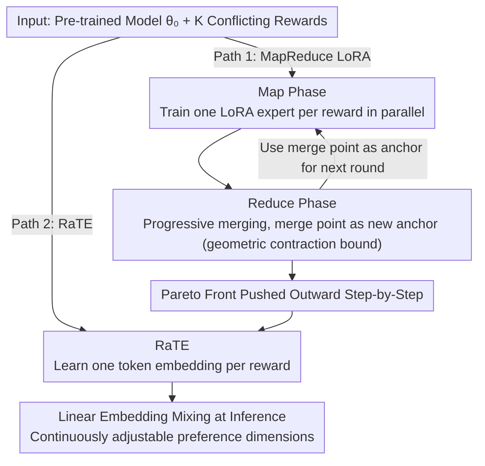

# MapReduce LoRA: Advancing the Pareto Front in Multi-Preference Optimization for Generative Models

**Conference**: CVPR2026  
**arXiv**: [2511.20629](https://arxiv.org/abs/2511.20629)  
**Code**: [https://github.com/SHI-Labs/MapReduce-LoRA](https://github.com/SHI-Labs/MapReduce-LoRA)  
**Area**: Image Generation  
**Keywords**: multi-preference optimization, LoRA merging, Pareto front, alignment tax, RLHF, text-to-image, text-to-video

## TL;DR
This work proposes MapReduce LoRA and RaTE, two complementary methods to advance the Pareto front in multi-preference optimization: the former pushes the Pareto front progressively via a "Map (parallel training of preference experts) + Reduce (iterative merging)" strategy; the latter enables composable preference control during inference by learning reward-aware token embeddings.

## Background & Motivation
RLHF/RLAIF has become the mainstream paradigm for aligning generative models with human preferences, but human preferences are inherently multi-dimensional. Taking text-to-image as an example, users simultaneously focus on multiple dimensions like text alignment, aesthetic quality, and OCR accuracy, which often involve conflicting objectives.

The conventional practice scales multiple rewards linearly into a single scalar for optimization, but this suffers from a fundamental problem—the **alignment tax**:

1.  **Inter-dimensional Conflicts**: Optimizing one dimension (e.g., OCR accuracy) often degrades others (e.g., aesthetics) because the gradient directions of different reward models contradict each other.
2.  **Limitations of Linear Weighting**: Simple linear weighting only explores the convex hull of the Pareto front; Pareto optimal solutions in non-convex regions remain unreachable.
3.  **Hyperparameter Sensitivity**: Weight coefficients require extensive ablation tuning, and optimal weights vary across base models and datasets.
4.  **No Inference-time Control**: Once weights are fixed during training, the relative importance of preference dimensions cannot be flexibly adjusted at inference time.

From a multi-objective optimization perspective, an ideal solution should **advance the entire Pareto front**—improving all or at least some dimensions without sacrificing others. This constitutes the core motivation of this paper.

## Core Problem
How can the alignment tax bottleneck be overcome in multi-preference alignment to advance the Pareto front, enabling generative models to improve across multiple evaluation dimensions simultaneously while supporting flexible preference control at inference time?

## Method

### Overall Architecture
The work addresses the alignment tax in multi-preference alignment: when $K$ rewards $\{R_k\}_{k=1}^K$ are linearly weighted into a scalar, improving one dimension often sacrifices another, leaving the Pareto front stagnant. The authors propose two complementary paths. First, **MapReduce LoRA** adapts the MapReduce concept from distributed computing: Map (train independent LoRA experts for each preference dimension in parallel) then Reduce (iteratively merge these experts and treat the merge point as a new starting point for the next round). Second, **RaTE** keeps the main model frozen and learns a trainable token embedding for each reward, allowing linear mixing at inference time for controllable preference weighting. Formally, let $F_k(\theta) = \mathbb{E}[R_k(x, G_\theta(x))]$; the goal is to drive the vector $\mathbf{F}(\theta) = [F_1(\theta), \ldots, F_K(\theta)]$ toward Pareto optimality by lifting the entire front.

### Key Designs

**1. Map Phase—Decoupling conflicting rewards by training independent experts**

Linear weighting causes conflicts because gradient directions of different reward models are naturally contradictory. The Map phase decouples them: an independent LoRA adapter $\Delta\theta_k$ is trained for each dimension $k$, targeting only the corresponding $R_k$,

$$\Delta\theta_k^* = \arg\max_{\Delta\theta_k} \mathbb{E}_{x}\big[R_k(x, G_{\theta_0 + \Delta\theta_k}(x))\big]$$

where $\theta_0$ is the pre-trained base model. Since each expert only optimizes its own reward, training is entirely independent and parallelizable.

**2. Reduce Phase—Iterative progressive merging with anchors**

Naive souping (averaging experts once) often only finds solutions within the convex combinations of experts. This work introduces **progressive merging**: after initializing $\bar{\theta}^{(0)} = \theta_0 + \frac{1}{K}\sum_k \Delta\theta_k$, at each round $t$, new experts $\Delta\theta_k^{(t)}$ are fine-tuned using the current merged model $\bar{\theta}^{(t-1)}$ as the reference. Then, $\bar{\theta}^{(t)} = \bar{\theta}^{(t-1)} + \frac{\eta}{K}\sum_k \Delta\theta_k^{(t)}$. By using the "previous merge point" as the starting point, the Pareto front is pushed outward round by round rather than staying on the initial convex hull.

**3. Convergence Theory—Geometric contraction proof**

The authors prove that progressive merging is equivalent to **averaged proximal consensus optimization** and provides a geometric contraction bound: let $d^{(t)} = \max_k \|\Delta\theta_k^{(t)}\|$ be the maximum offset of experts relative to the merge point at round $t$, then

$$d^{(t+1)} \leq \rho \cdot d^{(t)}, \quad \rho < 1$$

The contraction rate $\rho$ depends on the smoothness and curvature of the reward landscapes. This explains why the experts' divergence $d^{(t)}$ monotonically decreases, and the merge point converges to a consensus region that is superior across all dimensions.

**4. RaTE—Shifting preference weights from training to inference**

RaTE learns a trainable token embedding $e_k \in \mathbb{R}^d$ for each reward dimension $k$. At inference time, these are linearly combined as $e = \sum_k w_k e_k$ and injected into the model, where $w_k$ is user-specified. During training, the main model is frozen, and embeddings are updated by sampling weights $\mathbf{w} \sim \text{Dir}(\alpha)$ to optimize the mixed reward $R(\mathbf{w}) = \sum_k w_k R_k$. This enables continuous transitions between preference dimensions on the lifted Pareto front.

## Key Experimental Results

### Text-to-Image (T2I)

| Method | Base Model | GenEval ↑ | PickScore ↑ | OCR Acc ↑ | Pareto Advancement |
|------|---------|-----------|-------------|-----------|------------|
| Baseline (SD3.5M) | SD3.5M | 0.56 | 21.8 | 21.1% | - |
| Multi-reward RL | SD3.5M | 0.68 | 22.1 | 28.3% | Partial |
| Naive Souping | SD3.5M | 0.70 | 22.3 | 30.5% | Partial |
| **MapReduce LoRA** | SD3.5M | **0.76** (+36.1%) | **22.8** (+4.6%) | **32.9** (+55.7%) | **Full Advancement** |
| Baseline (FLUX) | FLUX | 0.62 | 22.0 | 18.9% | - |
| **MapReduce LoRA** | FLUX | **0.82** (+32.7%) | **22.9** (+4.3%) | **31.6** (+67.1%) | **Full Advancement** |

### Text-to-Video and Language Models

| Task | Model | Dimension 1 | Dimension 2 | Remarks |
|------|------|-------|-------|------|
| T2V | HunyuanVideo | VQ +48.1% | MQ +90.0% | Simultaneous visual/motion quality gain |
| Language | Llama-2 7B | Helpful +43.4% | Harmless +136.7% | Large gains in both alignment axes |
| Language (Ablation) | Llama-2 7B | Naive soup degrades | Progressive soup improves | Confirms necessity of iterative merging |

### Ablation Study
- **Iteration Rounds**: Significant gains appear in round 1; convergence occurs after 2–3 rounds, matching theoretical geometric contraction.
- **Naive vs. Progressive Souping**: Naive merging in T2I only captures ~60% of the Pareto area compared to progressive merging and can cause degradation in LLMs.
- **RaTE Controllability**: Sampling the weight space reveals smooth transitions in generation results across dimensions.

## Highlights & Insights
- **Novelty**: Adopts the MapReduce paradigm to decouple multi-preference optimization into parallel training and iterative merging with theoretical guarantees.
- **Experimental Thoroughness**: Proven effective across T2I (SD3.5M, FLUX), T2V (HunyuanVideo), and LLMs (Llama-2 7B).
- **Mechanism**: Systematically advances the Pareto front rather than making single-point trade-offs, effectively solving the alignment tax.
- **Function**: RaTE provides lightweight inference-time preference adjustment.
- **Value**: The convergence of progressive souping is supported by rigorous mathematical proof.

## Limitations & Future Work
1. **Scalability of Experts**: Training costs grow linearly with the number of preference dimensions $K$.
2. **Reward Model Dependency**: Performance is upper-bounded by the quality and potential biases of the reward models used.
3. **Iterative Overhead**: While parallelizable, multiple rounds of fine-tuning increase total computation.
4. **RaTE Expressivity**: Token embedding injection might limit the granularity of control for highly non-linear preference interactions.
5. **Evaluation Scale**: Performance on 10+ preference dimensions remains to be verified.

## Rating
- Novelty: ⭐⭐⭐⭐
- Experimental Thoroughness: ⭐⭐⭐⭐⭐
- Writing Quality: ⭐⭐⭐⭐
- Value: ⭐⭐⭐⭐⭐

<!-- RELATED:START -->

## Related Papers

- [\[ICLR 2026\] Pareto-Conditioned Diffusion Models for Offline Multi-Objective Optimization](../../ICLR2026/image_generation/pareto-conditioned_diffusion_models_for_offline_multi-objective_optimization.md)
- [\[CVPR 2026\] Quantization with Unified Adaptive Distillation to enable multi-LoRA based one-for-all Generative Vision Models on edge](quantization_with_unified_adaptive_distillation_to_enable_multi-lora_based_one-f.md)
- [\[CVPR 2026\] MICo-150K: A Comprehensive Dataset Advancing Multi-Image Composition](mico-150k_a_comprehensive_dataset_advancing_multi-image_composition.md)
- [\[CVPR 2026\] ChimeraLoRA: Multi-Head LoRA-Guided Synthetic Datasets](chimeralora_multi-head_lora-guided_synthetic_datasets.md)
- [\[CVPR 2025\] Calibrated Multi-Preference Optimization for Aligning Diffusion Models](../../CVPR2025/image_generation/calibrated_multi-preference_optimization_for_aligning_diffusion_models.md)

<!-- RELATED:END -->
