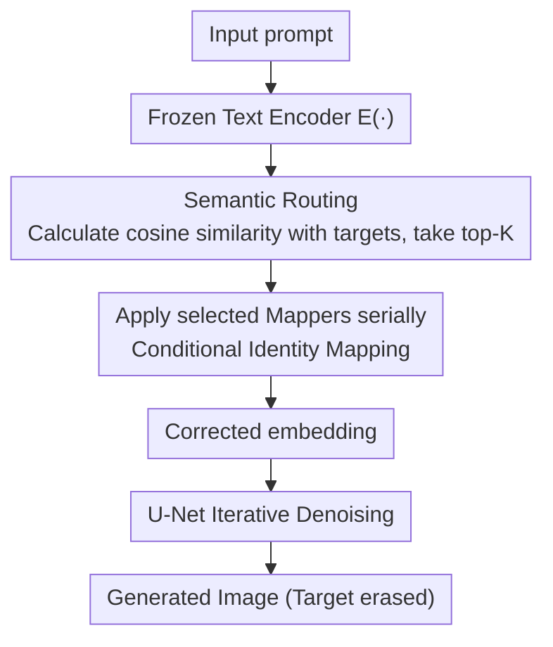

# MapRoute: Semantic Routing for Precise Concept Erasure with Mapper

**Conference**: CVPR 2026  
**Paper**: [CVF Open Access](https://openaccess.thecvf.com/content/CVPR2026/html/Li_MapRoutePrecise-Concept_Erasing_Mappers_via_Semantic_Routing_CVPR_2026_paper.html)  
**Code**: https://github.com/GG-li/MapRoute  
**Area**: Image Generation / Concept Erasure / Diffusion Model Safety  
**Keywords**: Concept Erasure, Text-to-Image Diffusion, Conditional Identity Mapping, Semantic Routing, Plug-and-Play Adapter

## TL;DR
MapRoute inserts a set of lightweight "Mapper" modules after a frozen text encoder. Each Mapper learns a "conditional identity mapping" through two-stage training (mapping the target concept embedding to a surrogate concept while maintaining identity for others). During inference, a top-K semantic router dynamically selects and serially applies relevant Mappers based on the input prompt. This achieves thorough erasure of specified concepts with minimal damage to unrelated concepts, outperforming SOTA methods like MACE and UCE across objects, celebrities, artistic styles, and mixed concepts.

## Background & Motivation

**Background**: Large-scale text-to-image (T2I) diffusion models possess powerful generation capabilities but also bring risks such as copyright infringement, privacy leaks, and illicit content. Concept Erasure aims to make models "forget" specific concepts (e.g., celebrity faces, artistic styles, specific object categories). Existing methods are categorized into three types: loss-based optimization (e.g., ESD, CRCE, AGE), closed-form analytical projection (e.g., UCE, MACE, RealEra), and plug-and-play adapters (e.g., SPM, Receler). The adapter paradigm balances customizability and transferability—adding sensitive concepts only requires fine-tuning or replacing adapters without retraining the base model.

**Limitations of Prior Work**: Erasure methods generally suffer from two major flaws. (1) **Incomplete Erasure**: Models occasionally still generate images containing target concepts. (2) **Poor Semantic Selectivity**: Erasing targets often affects unrelated concepts, degrading overall generation quality. Specifically for adapters: first, they **depend heavily on high-quality paired data** ("target vs. surrogate" pairs). Lacking a good surrogate leads to incomplete erasure or damage to legitimate concepts, and manually specifying "semantic neighbors" for every target is tedious. Second, **parameter conflicts during multi-concept erasure**: stacking multiple adapters can cause erasure failure or image degradation, requiring complex parameter isolation. Closed-form projection methods, which use SVD to zero out target components, often cause collateral damage due to the non-linear entanglement between target and legitimate concepts (e.g., erasing "English Springer Spaniel" might damage all canine categories).

**Key Challenge**: A trade-off exists between erasure (thoroughly removing the target) and preservation (not affecting unrelated concepts). The root cause is that most methods **globally modify model parameters**, failing to localize intervention precisely to the target concept.

**Goal**: (1) Design a lightweight erasure module that does not modify base weights and does not rely on high-quality paired data. (2) Ensure that multi-concept erasure modules do not conflict and avoid catastrophic forgetting.

**Key Insight**: The authors leverage the **semantic linear structure** of the CLIP/text encoder embedding space—where any semantic can be approximately represented as a sparse linear combination of human-interpretable concepts—to transform erasure into "mapping specific concepts within the embedding space."

**Core Idea**: Insert Mappers after the frozen text encoder to learn a conditional mapping that replaces target concepts while remaining identical for others. Use an input-driven top-K router to activate and serially apply only relevant Mappers, achieving precise, scalable erasure without paired data dependence.

## Method

### Overall Architecture
MapRoute consists of three parts: (1) Mapper module design, (2) two-stage learning strategy, and (3) semantic routing. **Training**: A Mapper $M_{c_{tar}}$ is trained individually for each target concept $c_{tar}$, first learning identity mapping via self-supervision, then learning the "target $\to$ surrogate" mapping, producing a reusable Mapper library. **Inference**: After the prompt passes through the frozen text encoder to generate an embedding, the semantic router calculates the cosine similarity between this embedding and all target concepts. The top-K most relevant Mappers are selected and applied **serially** after the text encoder to produce a corrected embedding, which is then fed into the U-Net for iterative denoising. Since intervention only occurs at the embedding layer and only for activated concepts, unrelated concepts suffer nearly zero damage.

### Key Designs

**1. Mapper: Learning Conditional Identity Mapping in Embedding Space**

Instead of fine-tuning existing linear or attention layers (which would modify parameters **globally** and degrade unrelated concepts), Mapper is an **inserted module** following the text encoder. This localizes intervention to embedding transformations. It is a lightweight feed-forward module with three Map layers (Linear + GELU) and a LayerNorm. It learns a **conditional identity mapping** $M_{c_{tar}}$:

$$M_{c_{tar}}(E(c))=\begin{cases}E(c_{sur}), & c=c_{tar}\\ E(c), & \text{otherwise}\end{cases}$$

where $E(\cdot)$ is the frozen pre-trained text encoder and $c_{sur}$ is the surrogate concept embedding. The intuition is: for the target concept, rewrite its embedding to a benign surrogate; for all other concepts, preserve them exactly (identity). Since each target concept has a dedicated Mapper, multi-concept scenarios are flexible, avoiding catastrophic forgetting caused by simple concatenation.

**2. Two-stage Training: From "Total Preservation" to "Targeted Replacement"**

The "conditional" nature is achieved through two-stage optimization. **Stage 1 (Self-supervised Identity, first 10 epochs)**: The frozen text encoder's Mapper learns identity mapping for **all** concepts in a concept dictionary:

$$\mathcal{L}_{stage1}=\mathbb{E}_{c\in C}\big[\|M_{c_{tar}}(E(c))-E(c)\|_2^2\big]$$

The authors validated this using 1000 random 768-dimensional vectors to simulate real text embeddings. After 10 epochs, the average MSE was only $1\times10^{-6}$, indicating the Mapper learned precise identity. **Stage 2 (Targeted Replacement)**: Building on the identity mapping, the target concept is mapped to the surrogate while two preservation losses prevent collateral damage:

$$\mathcal{L}_{learn}=\mathbb{E}_{c_{tar}}\big[\|M_{c_{tar}}(E(c_{tar}))-E(c_{sur})\|_2^2\big]$$

$$\mathcal{L}_{stage2}=\mathcal{L}_{learn}+\alpha\,\mathcal{L}_{keep1}+\beta\,\mathcal{L}_{keep2}$$

where $\mathcal{L}_{keep1}$ maintains identity across the concept dictionary and $\mathcal{L}_{keep2}$ maintains identity across a set of 8,578 English names (specifically for celebrity erasure), with $\alpha=\beta=1$. The dictionary is taken from the top 10,000 frequent words and 5,000 bi-grams from LAION-400M. This two-stage approach ensures the Mapper erases targets precisely with near-zero distortion for other concepts.

**3. Proxy Concept Independence: Removing Dependence on High-Quality Paired Data**

A major bottleneck for adapter methods is manually choosing a semantic neighbor surrogate for each target. MapRoute posits that since the Mapper learns a **conditional identity mapping**, the surrogate concept is irrelevant—one could map "Car" to "Van Gogh" or "Truck" to "Cat" regardless of semantic connection. Experiments show that different surrogate concepts yield **highly consistent** erasure results (Figure 2 shows consistent results for a Mapper trained with four different surrogates). This eliminates the need for high-quality "target vs. surrogate" pairs and the complex engineering of defining semantic neighbors.

**4. Semantic Routing: Top-K Dynamic Selection + Serial Application**

To handle multiple concepts in a single prompt without catastrophic forgetting from "applying all Mappers," MapRoute uses input-driven semantic routing. It calculates the cosine similarity between the input prompt embedding and all target concepts, selecting the top-K:

$$\mathcal{M}^{(k)}=\big\{M_i\in\mathcal{M}\mid sim_i\in\mathrm{TopK}(\{sim_1,sim_2,\dots\},k)\big\}$$

Selected Mappers are applied **serially** after the text encoder. This allows the prompt embedding to pass through each active module, removing undesired concepts one by one. This avoids the need to run an entire erasure pipeline for each target and naturally prevents parameter conflicts, making it particularly effective for mixed concept erasure.

## Key Experimental Results

> Experiments based on Stable Diffusion v1.4. Training a single Mapper takes ~13.3 mins (A100), inference ~6s. Sampling: PNDM, 50 steps, CFG=7.5. Comparisons: MACE, FMN, UCE, SPM, ESD, RECE, GLoCE, etc.
>
> **Metrics**: Object erasure uses triple harmonic mean $H_o=\dfrac{3}{(1-\text{ACC}_e)^{-1}+(\text{ACC}_s)^{-1}+(1-\text{ACC}_g)^{-1}}$, where $\text{ACC}_e$ is target category residual accuracy (lower is better), $\text{ACC}_s$ is unrelated category preservation accuracy (higher is better), and $\text{ACC}_g$ is synonym generalization erasure accuracy (lower is better). Celebrity erasure uses $H_c=\dfrac{2}{(1-GCD_e)^{-1}+(GCD_s)^{-1}}$. Art style uses $H_a=\text{CLIP}_s-\text{CLIP}_e$.

### Main Results: Object Erasure (CIFAR-10, 10-class average, Table 1)

| Method | ACCe ↓ | ACCs ↑ | ACCg ↓ | Ho ↑ |
|------|------|------|------|------|
| FMN | 96.96 | 96.73 | 82.56 | 6.13 |
| SPM | 95.00 | 99.53 | 83.36 | 14.95 |
| UCE | 13.54 | 98.45 | 23.18 | 85.48 |
| RECE | 21.55 | 98.32 | 22.92 | 81.59 |
| MACE | 10.53 | 92.61* | — | 92.61 |
| **MapRoute（Ours）** | **0.92** | **99.37** | — | **99.37** |

MapRoute suppresses target residual ACCe to near 0 while unrelated category preservation ACCs is nearly 99.4, with a 10-class average Ho≈99, significantly outperforming previous SOTA MACE/UCE.

### Celebrity Erasure (Table 2, 50-Celebrity Multi-concept)

| Method | GCDe ↓ | GCDs ↑ | Hc ↑ |
|------|------|------|------|
| GLoCE | 3.20 | 79.28 | 87.17 |
| MACE | 9.50 | 81.83 | 85.95 |
| **MapRoute（Ours）** | **0.00** | **90.16** | **94.83** |

MapRoute achieves GCDe near 0 for both single and multi-celebrity erasure, while GCDs remains comparable to the original model (SD v1.4), successfully balancing "clean erasure" and "preservation."

### Key Findings
- **Erasure-Preservation Trade-off Broken**: Existing methods either fail to erase (high ACCe for FMN, SPM) or over-regularize and damage unrelated classes (ESD-x/-u). MapRoute leads in accuracy, controllability, and generalization simultaneously.
- **Two Stages are Essential**: Stage 1's identity mapping (MSE $1\times10^{-6}$) is the prerequisite for subsequent precise erasure. Stage 2's $\mathcal{L}_{keep1/2}$ ensures dictionary concepts and names remain untouched while erasing targets.
- **Proxy Independence Verified**: Qualitative results in Figure 2 show consistent erasure across semantically unrelated surrogates (e.g., Truck mapped to Bruce Lee), confirming that surrogate choice has negligible impact.
- **Mixed Concept Superiority**: For mixed prompts involving CIFAR-10 objects and artistic styles (Van Gogh/Monet), MACE damages styles while erasing objects, and SPM fails to erase. MapRoute, via top-K routing, activates only relevant modules to erase both objects and styles while preserving others.

## Highlights & Insights
- **Erasure as Conditional Mapping in Embedding Space**: By leaving base weights untouched and performing "target replacement + identity for others" on text embeddings, intervention is localized at the mechanism level, explaining why it erases cleanly without collateral damage.
- **Proxy Independence is a Major Liberation**: Proving that Mappers learn conditional mappings and surrogates can be arbitrary (e.g., Car $\to$ Van Gogh) removes the dependency on high-quality paired data or semantic neighbors—a counter-intuitive yet practical observation.
- **Routing Solves Multi-concept Conflict**: Input-driven top-K serial routing replaces the "stack all adapters" approach, naturally avoiding parameter conflicts and catastrophic forgetting. It scales to multi-concepts without retraining the entire pipeline.
- **Lightweight and Reusable**: Each Mapper trains in 13.3 minutes and is plug-and-play. Adding sensitive concepts only requires training a new Mapper for the library, facilitating dynamic safety policy updates.

## Limitations & Future Work
- **Storage/Management of Mappers**: The library grows linearly with the number of concepts; storage and retrieval overhead for massive concept sets should be addressed.
- **Dependence on Embedding Semantic Linearity**: The method assumes CLIP/text encoder embeddings are approximately linearly decomposable. Whether identity-replacement mappings remain precise for highly entangled semantics is uncertain.
- **Robustness of Routing K and Thresholds**: Routing depends on cosine similarity. The stability of selecting the correct Mapper under prompt paraphrasing, synonym attacks, or adversarial prompts remains to be fully explored.
- **Verification limited to SD v1.4**: Transferability to SDXL or next-gen T2I models with different encoders has not been verified.

## Related Work & Insights
- **vs. MACE / UCE (Closed-form Projection)**: Closed-form methods zero out target subspaces in cross-attention K/V. They risk collateral damage when targets and legitimate concepts are non-linearly entangled. MapRoute performs conditional mapping on embeddings, ensuring precise targeting and better preservation.
- **vs. SPM / Receler (Plug-and-play Adapters)**: SPM requires a unique prompt-specified surrogate; Receler requires adversarial training and safe/unsafe image pairs. MapRoute is proxy-independent, requires no image pairs, and uses routing to resolve multi-adapter conflicts.
- **vs. ESD / CRCE / AGE (Loss Optimization)**: These methods fine-tune the base model, which is costly and may unpredictably impact overall generation capability. MapRoute freezes the base model, is reversible, and has minimal side effects.

## Rating
- Novelty: ⭐⭐⭐⭐ The combination of "conditional identity mapping + proxy independence + semantic routing" is novel in the erasure task.
- Experimental Thoroughness: ⭐⭐⭐⭐ Covers objects/celebrities/styles/mixed erasure with 7 SOTA comparisons and complete metric design.
- Writing Quality: ⭐⭐⭐⭐ Clearly defined components and motivation; well-explained custom metrics.
- Value: ⭐⭐⭐⭐ Plug-and-play, proxy-independent, and scalable, offering practical value for T2I safety and copyright compliance.

<!-- RELATED:START -->

## Related Papers

- [\[CVPR 2026\] Beyond Text Prompts: Precise Concept Erasure through Text–Image Collaboration](beyond_text_prompts_precise_concept_erasure_through_text-image_collaboration.md)
- [\[CVPR 2026\] EMMA: Concept Erasure Benchmark with Comprehensive Semantic Metrics and Diverse Categories](emma_concept_erasure_benchmark_with_comprehensive_semantic_metrics_and_diverse_c.md)
- [\[CVPR 2026\] Erasing Thousands of Concepts: Towards Scalable and Practical Concept Erasure for Text-to-Image Diffusion Models](erasing_thousands_of_concepts_towards_scalable_and_practical_concept_erasure_for.md)
- [\[CVPR 2026\] Closed-Form Concept Erasure via Double Projections](closed-form_concept_erasure_via_double_projections.md)
- [\[CVPR 2026\] Prototype-Guided Concept Erasure in Diffusion Models](prototype-guided_concept_erasure_in_diffusion_models.md)

<!-- RELATED:END -->
