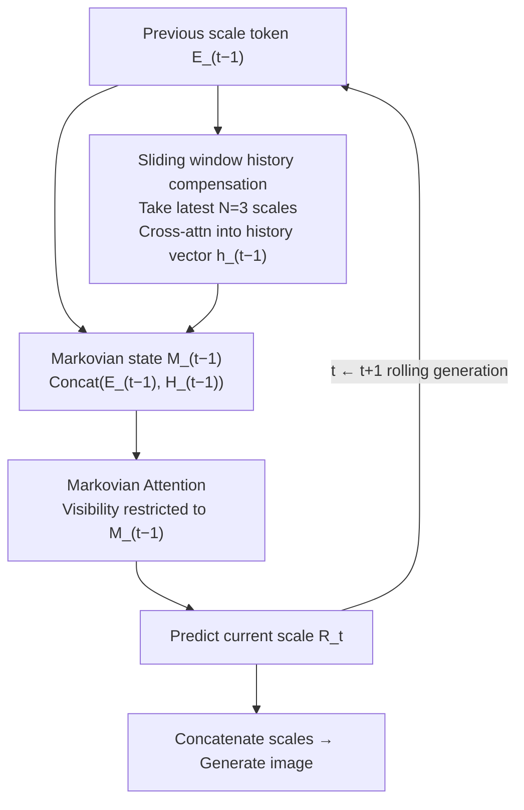

# Markovian Scale Prediction: A New Era of Visual Autoregressive Generation

**Conference**: CVPR 2026  
**arXiv**: [2511.23334](https://arxiv.org/abs/2511.23334)  
**Code**: [Available](https://luokairo.github.io/markov-var-page/)  
**Area**: Image Generation  
**Keywords**: Visual autoregressive generation, Markov process, multi-scale prediction, memory efficiency, image generation  

## TL;DR

Refactors the Visual Autoregressive (VAR) model from full-context dependency next-scale prediction to Markovian scale prediction based on a Markov process. Through a sliding window history compensation mechanism, it achieves non-full-context modeling, reducing FID by 10.5% and peak memory by 83.8% on ImageNet.

## Background & Motivation

Visual autoregressive modeling (VAR) achieves breakthroughs in visual generation by replacing next-token prediction with next-scale prediction, generating images in a coarse-to-fine manner. However, the **full-context dependency** of VAR (where predicting the current scale requires attending to all previous scales) leads to three major issues:

**Enormous Computational Overhead**: The number of tokens grows quadratically with scale, and cumulative cross-scale modeling causes computational costs to increase super-linearly. At 1024×1024 resolution, the peak memory of a depth-24 VAR reaches 117.9GB.

**Continuous Error Accumulation**: The unidirectional causal chain of autoregression cannot correct early prediction errors. Experiments show that perturbations injected early have a much greater impact on FID than those injected later (perturbations in the first scale lead to the largest FID drop), and full-context dependency exacerbates accumulation by repeatedly utilizing erroneous information.

**Cross-scale Interference**: Full-context attention causes gradients from different scales to compete and conflict in the shared feature space. The authors calculate the RFA (Residual-Feature Alignment) score—the cosine similarity between the current scale's output residual features and input features from each previous scale—finding that **early scales usually have a negative impact on current representation learning**.

The core motivation stems from the concept of **sufficient statistics** in information theory: in a continuous chain of propagation, each node maintains representative historical information, and effective prediction can be achieved through proper distillation without requiring the entire history.

## Method

### Overall Architecture

Markov-VAR refines VAR into a non-full-context Markov process:

- **Original VAR Modeling**: $p(R_1, \ldots, R_T) = \prod_{t=1}^{T} p(R_t | \langle\text{sos}\rangle, R_{<t})$, where each scale depends on all previous scales.
- **Markov-VAR Modeling**: $p(R_1, \ldots, R_T) = \prod_{t=1}^{T} p(R_t | M_{t-1})$, where each scale depends only on the current Markovian state.

Here $M_t = f_\phi(R_t, M_{t-1})$ is the representative dynamic state, and $M_0 = \langle\text{sos}\rangle$.

### Key Designs

**1. Markovian State Definition: Letting the current scale act as a "condensed history"**

The bottleneck of VAR lies in looking back at all $R_{<t}$ when predicting the $t$-th scale, which is both expensive and amplifies early errors. The authors address this using the concept of sufficient statistics from information theory: the mutual information between the complete history $c_{<t}$ and the current time $c_t$ is highly redundant. There exists a sufficient statistic $c_{t-1}$ such that $I(c_{t-1}; c_t) = I(c_{<t}; c_t)$. This means that if $c_{t-1}$ already encodes the "history useful for predicting $c_t$," looking further back is redundant. Chain-like unidirectional autoregression satisfies this condition: each scale absorbs representative historical information during generation and can be used directly as a Markovian state. This reduces modeling from $p(R_t | R_{<t})$ to $p(R_t | M_{t-1})$, fundamentally eliminating full-context dependency and removing the need for a KV cache.

**2. Sliding Window History Compensation: Recovering "recent" info lost by looking only at the last scale**

Using only $E_{t-1}$ as the state is aggressive, as a single scale may not be a perfect sufficient statistic. The authors use a sliding window of size $N$, $\mathcal{W}_t = \{E_{t-1}, E_{t-2}, \ldots, E_{t-N}\}$, to concatenate recent tokens into $\hat{X}_t$. A learnable global state query $q$ compresses this via cross-attention into a fixed-dimensional history vector:

$$h_{t-1} = \text{Attn}(q, \hat{X}_t, \hat{X}_t)$$

This history vector is broadcast and concatenated with current scale features to obtain the representative dynamic state for the next step:

$$M_{t-1} = \text{Concat}(E_{t-1}, H_{t-1})$$

The key is that the window "slides" rather than "accumulates": when generating the 4th scale, it only sees scales 1–3; at the 5th scale, the window moves forward, dropping scale 1 to see 2–4. The history remains a fixed-size segment of neighbors rather than a growing sequence. A window size of $N=3$ was found optimal through ablation, aligning with RFA analysis—recent 3 scales contribute positively to the current representation, while earlier scales introduce interference.

**3. Markovian Attention: Locking attention within the dynamic state to cut cross-scale interference**

Changing the modeling formula is insufficient; the attention mask must also be modified. VAR uses full causal attention, allowing each scale to see all preceding scales, which causes cross-scale gradient competition. Markovian attention strictly limits the visibility of each scale to its own dynamic state $M_{t-1}$. Scales do not peer into each other, allowing each to focus on learning its specific layer representation. Combined with the previous points, the chain eliminates the need to store historical KVs and removes interference, benefiting both quality and efficiency.

### Loss & Training

- **Loss**: Cross-entropy $\mathcal{L} = \sum_{t=1}^{T} CE(\hat{R}_t, R_t)$
- **Training Strategy**: Teacher-forcing + Markovian attention mask
- **Optimizer**: AdamW, lr=$8 \times 10^{-5}$, $\beta_1=0.9$, $\beta_2=0.95$
- **Scale**: batch 768-1536, epochs 200-400, 8×H200 GPU
- **Encoder**: Uses multi-scale VQ-VAE tokenizer pre-trained by VAR
- **Positional Encoding**: Rotary Positional Embedding (RoPE)
- **Architecture**: LLaMA-style attention and MLP blocks, width $w=64d$, attention heads $h=d$

## Key Experimental Results

### Main Results (ImageNet 256×256 class-conditional)

| Model | Params | FID↓ | IS↑ | Precision↑ | Recall↑ |
|-------|--------|------|-----|------------|---------|
| VAR-d16 | 310M | 3.61 | 225.6 | 0.81 | 0.52 |
| **Markov-VAR-d16** | 329M | **3.23** | **256.2** | **0.84** | 0.52 |
| VAR-d20 | 600M | 2.67 | 254.4 | 0.81 | 0.57 |
| **Markov-VAR-d20** | 623M | **2.44** | **286.1** | 0.83 | 0.56 |
| VAR-d24 | 1.0B | 2.17 | 271.9 | 0.81 | 0.59 |
| **Markov-VAR-d24** | 1.02B | **2.15** | **310.9** | 0.83 | 0.59 |
| DiT-XL/2 (Diffusion) | 675M | 2.27 | 278.2 | 0.83 | 0.57 |

Efficiency Comparison (batch=25, single H200):

| Model | Res. | Inference Time (s)↓ | Peak Memory (GB)↓ | Memory Reduction |
|-------|------|-------------------|-------------------|------------------|
| VAR-d24 | 256 | 0.711 | 12.4 | — |
| Markov-VAR-d24 | 256 | 0.608 | 4.7 | **-62.1%** |
| VAR-d24 | 512 | 1.335 | 31.4 | — |
| Markov-VAR-d24 | 512 | 1.261 | 8.1 | **-74.2%** |
| VAR-d24 | 1024 | 5.891 | 117.9 | — |
| Markov-VAR-d24 | 1024 | 5.322 | 19.1 | **-83.8%** |

### Ablation Study

History compensation mechanism (depth-16):

| Method | Params | FID↓ | IS↑ |
|--------|--------|------|-----|
| No history compensation | 300M | 3.64 | 247.7 |
| Global history (Full-context) | 324M | 3.41 | 245.2 |
| Mixed history | 359M | 3.45 | 257.4 |
| **Sliding window (Ours)** | 329M | **3.23** | **256.2** |

Sliding window size:

| Window Size | FID (d16)↓ | IS (d16)↑ | FID (d20)↓ | IS (d20)↑ |
|-------------|-----------|----------|-----------|----------|
| 1 | 3.53 | 237.8 | 2.50 | 267.9 |
| 2 | 3.39 | 248.6 | 2.47 | 281.4 |
| **3** | **3.23** | **256.2** | **2.44** | **286.1** |
| 4 | 3.33 | 252.3 | 2.56 | 278.2 |

### Key Findings

1. d16 model FID improved from 3.61→3.23 (10.5% gain), IS from 225.6→256.2 (13.6% gain).
2. 1024 resolution peak memory reduced from 117.9GB→19.1GB (83.8% reduction), with no KV cache required.
3. Window size $N=3$ is optimal across all depths, with theoretical analysis highly consistent with experiments.
4. Scaling laws are robust: loss and error rate decrease as power laws with model size ($R^2 > 0.99$).
5. Markov-VAR-d20 achieves competitive performance using only about 70% of the parameters of M-VAR-d20.

## Highlights & Insights

1. **Elegant Unity of Theory and Experiment**: The Markov assumption is argued from information-theoretic sufficient statistics, with RFA analysis and perturbation experiments providing direct empirical evidence.
2. **Deep Validation of "Less is More"**: Reducing context dependency actually improves quality because full context introduces cross-scale interference.
3. **Architectural Efficiency Gain**: The lack of a required KV cache is a fundamental advantage that scales further with increased resolution.
4. **Minimalist Design**: History compensation via only one cross-attention and one learnable query adds minimal parameters but yields significant effects.

## Limitations & Future Work

1. Validated only on ImageNet class-conditional generation; effectiveness on complex tasks like text-to-image remains to be verified.
2. Dependent on the pre-trained VQ-VAE tokenizer from VAR; stronger tokenizers may yield further improvements.
3. A single learnable query may limit history expression; multiple or adaptive queries could be explored.
4. Combination with acceleration techniques like quantization and distillation is not yet explored.

## Rating

- **Novelty**: ⭐⭐⭐⭐⭐ — The Markovian assumption challenges full-context dependency with counter-intuitive but powerful theoretical motivation.
- **Experimental Thoroughness**: ⭐⭐⭐⭐⭐ — Covers performance, efficiency, ablation, and scaling laws; validated across resolutions with full model weights released.
- **Writing Quality**: ⭐⭐⭐⭐⭐ — Deep motivation analysis (RFA/perturbation), excellent visualizations, and smooth logic.
- **Value**: ⭐⭐⭐⭐⭐ — Simultaneously improves performance and efficiency; 83.8% memory saving is significant for high-resolution generation.

<!-- RELATED:START -->

## Related Papers

- [\[ICLR 2026\] MVAR: Visual Autoregressive Modeling with Scale and Spatial Markovian Conditioning](../../ICLR2026/image_generation/mvar_visual_autoregressive_modeling_with_scale_and_spatial_markovian_conditionin.md)
- [\[CVPR 2026\] FVAR: Next-Focus Prediction for Visual Autoregressive Modeling](fvar_next-focus_prediction_for_visual_autoregressive_modeling.md)
- [\[CVPR 2026\] Mirai: Autoregressive Visual Generation Needs Foresight](mirai_autoregressive_visual_generation_needs_foresight.md)
- [\[CVPR 2026\] DPAR: Dynamic Patchification for Efficient Autoregressive Visual Generation](dpar_dynamic_patchification_for_efficient_autoregressive_visual_generation.md)
- [\[CVPR 2026\] VAR RL Done Right: Tackling Asynchronous Policy Conflicts in Visual Autoregressive Generation](var_rl_done_right_tackling_asynchronous_policy_conflicts_in_visual_autoregressiv.md)

<!-- RELATED:END -->
