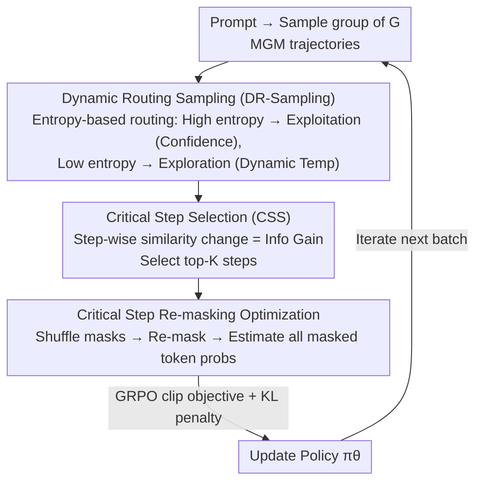

# MaskFocus: Focusing Policy Optimization on Critical Steps for Masked Image Generation

**Conference**: CVPR 2026  
**Paper**: [CVF Open Access](https://openaccess.thecvf.com/content/CVPR2026/html/Zhang_MaskFocus_Focusing_Policy_Optimization_on_Critical_Steps_for_Masked_Image_CVPR_2026_paper.html)  
**Code**: Available (The paper states "Code is available at here", specific repository address TBD ⚠️)  
**Area**: Image Generation / Masked Generative Models / Reinforcement Learning  
**Keywords**: Masked Generative Models, GRPO, Critical Step Selection, Dynamic Routing Sampling, Text-to-Image

## TL;DR
MaskFocus introduces a reinforcement learning post-training framework for Masked Generative Models (MGM). It identifies a few critical sampling steps for image formation using "cosine similarity changes between intermediate and final image embeddings," performing policy optimization only on these steps to avoid the high cost of full-trajectory estimation. Additionally, it employs "entropy-based dynamic routing sampling" to divert high/low entropy samples, balancing exploration and exploitation. This pushes the GenEval score of the open-source MGM Meissonic from 0.54 to 0.76, approaching FLUX across multiple metrics.

## Background & Motivation

**Background**: Masked Generative Models (MGM, such as MaskGIT, Muse, Meissonic) represent a third visual generation paradigm alongside diffusion and autoregressive models. MGM quantizes images into discrete tokens. During inference, it starts from a full [MASK] canvas and iteratively predicts all masked tokens in parallel, retaining only a small portion based on confidence. This offers significant speed advantages while maintaining quality comparable to SDXL. Meanwhile, RLVR/GRPO has demonstrated significant improvements in instruction following and image quality in LLM post-training and autoregressive/diffusion visual models.

**Limitations of Prior Work**: Applying RL to MGM is challenging. Policy optimization methods like GRPO require log-likelihoods for each action, while the "coarse-to-fine" process of MGM is a multi-step iteration. Obtaining probabilities for each step requires step-wise estimation along the entire sampling trajectory. Mask-GRPO treats the entire unmasking trajectory as a multi-step decision and optimizes the full trajectory, incurring massive computational costs. Another approach, MaskGRPO (different work, same abbreviation), selects steps with "high mask ratios" to accelerate training, but this non-dynamic, fixed-rule selection fails to account for the varying contributions of different steps to the final image, leading to suboptimal results.

**Key Challenge**: The fundamental contradiction of RL on MGM is the **trade-off between "probability estimation cost" and "optimization effectiveness"**. Estimating full-trajectory probabilities is too expensive, while arbitrary step selection lacks precision, wasting the time-step budget.

**Goal**: To identify truly "image-deciding" critical steps in the sampling trajectory without performing full-trajectory estimation, concentrating the limited policy optimization budget on these steps; simultaneously, to mitigate the under-exploration issue in MGM caused by confidence-based sampling, which often results in early steps focusing on background while compressing the main subject.

**Key Insight**: The authors made two observations. First, the probability distributions of all masked tokens at each step (even those not selected for retention) are strongly correlated with the final image, as the pre-training objective is supervised by the ground truth for all masked tokens. Thus, policy optimization can be performed directly on the "probabilities of all masked tokens." Second, measuring "intermediate vs. final image embedding" cosine similarity along the sampling trajectory reveals **highly non-uniform** growth: early steps (e.g., 1–25) show rapid similarity increases, establishing global structure, while later steps (25–64) focus on local details. This non-uniformity serves as a natural measure of "step-wise value."

**Core Idea**: Use "step-wise similarity variation" as information gain to identify top-K critical steps and **perform GRPO only on these steps**. Add a dynamic routing sampling mechanism based on entropy to inject more exploration into low-entropy (over-determined) samples.

## Method

### Overall Architecture
MaskFocus is a post-training pipeline for MGM centered around GRPO, using Meissonic as the base. For each prompt, a group (group size $G$) of complete generation trajectories is sampled, recording image embeddings and masks. Two parallel tracks follow: **Critical Step Selection (CSS)** selects $K$ critical steps with the highest information gain, and **Dynamic Routing Sampling (DR-Sampling)** routes samples within the group to exploration or exploitation branches based on entropy. Finally, only samples from these $K$ critical steps are fed into the optimization phase: masks are randomly shuffled, generated tokens are re-masked, and log-likelihoods under $\pi_\theta$, $\pi_{old}$, and $\pi_{ref}$ are estimated to calculate the GRPO clipping objective and KL penalty for policy updates. This process compresses "full-trajectory probability estimation" into "estimating only $K$ critical steps."

### Key Designs

**1. Critical Step Selection (CSS): Locking in "Image-Deciding" Steps via Similarity Changes**

This design targets the bottleneck where full-trajectory estimation is expensive and random selection is suboptimal. The authors first use an image tokenizer (VQ-VAE) to encode intermediate images at each step $t$ into embeddings $E_t$, calculating cosine similarity with the final embedding $E_T$: $S_t = \mathrm{CosSim}(E_t, E_T)$. The absolute difference between adjacent steps is treated as the information gain: $V_t = |\Delta S_t| = |S_{t+1} - S_t|$. Larger gain indicates a greater "push" toward the final image. The top-$K$ steps (e.g., $K=6$ out of 64) are selected. Intuitively, this concentrates optimization on pivotal steps while avoiding low-value detail-refinement steps, preventing reward hacking. The authors use "probabilities of all masked tokens" for optimization, which is both reasonable and efficient given the MGM pre-training objective.

**2. Dynamic Routing Sampling (DR-Sampling): Injecting Exploration into "Over-Determined" Samples**

This addresses the inherent flaw of confidence-based sampling in MGM, where conservative strategies tend to fill simple regions (background) early, compressing subject diversity. The authors calculate the entropy for each sample: $H_i = -\sum_{v \in \mathcal{V}} p(v)\log p(v)$. Samples are divided into two branches based on entropy. The **Exploitation branch** takes the high-entropy half, using standard confidence sampling to maintain stability. The **Exploration branch** takes the low-entropy half, applying dynamic temperature $T_i = T\,e^{-H_{i,j}/\alpha} + T_{min}$ to encourage new unmasking positions. Routing avoids uniform temperature increases, as high-entropy samples are more sensitive to noise.

**3. Re-masking Probability Estimation and GRPO Updates: Robust Off-policy Estimation**

After selecting critical steps, the optimization phase does not directly reuse the sampling masks. Instead, it **randomly shuffles the mask $M_k$ to obtain a new mask $M_k'$ and re-masks generated tokens**. Log-likelihoods are estimated under the current policy, old policy, and reference model to calculate importance ratios $r_t^i$ and KL penalties for the GRPO objective. Advantages are normalized within the group: $A^i = (R^i - \mathrm{mean}(\{R^i\}))/\mathrm{std}(\{R^i\})$. Ablation shows that reusing sampling trajectory masks leads to large estimation errors and excessive KL penalties in off-policy training; re-generating masks proves more stable.

### Loss & Training
The objective combines the GRPO clipped objective with a KL penalty:

$$\mathcal{J} = \mathbb{E}_{\{o^i\}\sim\pi_{old}}\Big[\tfrac{1}{\sum_i |o^i|}\sum_i\sum_t \big(\min(r_t^i\hat{A}^i,\ \mathrm{clip}(r_t^i,1-\varepsilon,1+\varepsilon)\hat{A}^i) - \beta D_{KL}(\pi_\theta\|\pi_{ref})\big)\Big]$$

Where $r_t^i = \pi_\theta(o_t^i)/\pi_{\theta_{old}}(o_t^i)$. The base model is Meissonic (1024x1024), using 64 sampling steps, $K=6$ critical steps, and group size $G=8$. CFG is set to 5 for both training and inference. The composition task uses 50k GenEval-style prompts, while the preference alignment task uses 10k HPSv2 training samples.

## Key Experimental Results

### Main Results
On GenEval, MaskFocus significantly improves the base Meissonic from 0.54 to 0.76, outperforming other mask-based RL methods (e.g., MaskGRPO at 0.73).

| Method | Overall↑ | Two Obj.↑ | Counting↑ | Color↑ | Position↑ | Color Attr.↑ |
|------|----------|-----------|-----------|--------|-----------|--------------|
| SDXL | 0.55 | 0.74 | 0.39 | 0.85 | 0.15 | 0.23 |
| FLUX.1-dev | 0.66 | 0.81 | 0.74 | 0.79 | 0.22 | 0.45 |
| Janus-Pro-1B | 0.73 | 0.82 | 0.51 | 0.89 | 0.65 | 0.56 |
| Mask-GRPO | 0.73 | 0.90 | 0.69 | 0.85 | 0.35 | 0.59 |
| Meissonic (Base) | 0.54 | 0.66 | 0.42 | 0.86 | 0.10 | 0.22 |
| Meissonic + MaskGRPO | 0.73 | 0.87 | 0.83 | 0.87 | 0.39 | 0.48 |
| **Meissonic + MaskFocus (Ours)** | **0.76** | **0.91** | **0.85** | 0.87 | **0.42** | 0.54 |

On DrawBench preference metrics, MaskFocus elevates Meissonic to levels comparable to or exceeding FLUX.1-dev:

| Method | DEQA↑ | PickScore↑ | HPS↑ | ImageReward↑ |
|------|-------|-----------|------|--------------|
| SD3.5-M | 4.24 | 22.50 | 30.17 | 0.98 |
| FLUX.1-dev | 4.37 | 22.97 | 31.13 | 1.06 |
| Meissonic (Base) | 4.00 | 21.63 | 28.89 | 0.39 |
| Meissonic + MaskGRPO | 4.35 | 22.34 | 35.48 | 1.06 |
| **Meissonic + MaskFocus (Ours)** | **4.39** | **22.39** | **35.52** | **1.09** |

### Ablation Study

| Configuration | GenEval↑ | DEQA↑ | PickScore↑ |
|------|---------|-------|-----------|
| MaskFocus (Full) | 0.76 | 4.39 | 22.39 |
| w/o CSS (Random early steps) | 0.72 | 4.34 | 22.34 |
| w/o DR-Sampling | 0.74 | 4.35 | 22.31 |

### Key Findings
- **CSS contributes more to "Instruction Following," while DR-Sampling contributes to "Image Quality"**.
- **Step selection strategy matters**: Random selection in early steps leads to degradation or reward hacking; information-gain-based selection is superior.
- **Off-policy challenges**: Reusing trajectory masks leads to poor probability estimation; re-masking is essential for stability.

## Highlights & Insights
- **Step-wise embedding similarity variation is a lightweight yet universal metric**: It requires no extra networks or labels and can be migrated to any iterative generative model for step-level credit assignment.
- **Using probabilities of all masked tokens bypasses the primary cost of MGM RL**: Leveraging the pre-training objective to relax the "full-trajectory estimation" constraint is the key insight for feasibility.
- **Routing by entropy is a fine-grained approach to the exploration-exploitation trade-off**, ensuring exploration occurs only where necessary to maintain training stability.

## Limitations & Future Work
- **Hyperparameters ($K$, $G$) are fixed**: Whether $K=6$ and $G=8$ are optimal across different models or step counts remains under-explored.
- **Off-policy probability estimation errors**: While re-masking mitigates the issue, error remains a challenge and is designated as a future research priority.
- **Single base model**: Evaluated only on Meissonic; generalizability across other MGM architectures (e.g., Show-o, Muse) needs further verification.

## Related Work & Insights
- **vs. Mask-GRPO**: Mask-GRPO optimizes full trajectories at high cost; MaskFocus optimizes only top-K critical steps, achieving better GenEval scores (0.76 vs 0.73) more efficiently.
- **vs. MaskGRPO**: That work used fixed rules (high mask ratio) for selection; MaskFocus uses dynamic information gain, distinguishing step-wise contributions to improve quality and avoid reward hacking.
- **vs. Diffusion RL**: Those methods target continuous denoising; MaskFocus addresses parallel discrete token unmasking, solving MGM-specific challenges.

## Rating
- Novelty: ⭐⭐⭐⭐ Combines information-gain step selection and entropy routing for MGM RL.
- Experimental Thoroughness: ⭐⭐⭐⭐ Solid results across GenEval/DrawBench; however, limited to one base model.
- Writing Quality: ⭐⭐⭐⭐ Clear logic chain (Observation → Method); some ambiguity regarding code availability and specific hyperparameters.
- Value: ⭐⭐⭐⭐ Provides a practical paradigm for applying RL to MGM.

<!-- RELATED:START -->

## Related Papers

- [\[CVPR 2026\] Curriculum Group Policy Optimization: Adaptive Sampling for Unleashing the Potential of Text-to-Image Generation](curriculum_group_policy_optimization_adaptive_sampling_for_unleashing_the_potent.md)
- [\[CVPR 2026\] Seeing What Matters: Visual Preference Policy Optimization for Visual Generation](seeing_what_matters_visual_preference_policy_optimization_for_visual_generation.md)
- [\[CVPR 2026\] Neighbor GRPO: Contrastive ODE Policy Optimization Aligns Flow Models](neighbor_grpo_contrastive_ode_policy_optimization_aligns_flow_models.md)
- [\[CVPR 2026\] VA-π: Variational Policy Alignment for Pixel-Aware Autoregressive Generation](va-p_variational_policy_alignment_for_pixel-aware_autoregressive_generation.md)
- [\[CVPR 2026\] OSPO: Object-Centric Self-Improving Preference Optimization for Text-to-Image Generation](ospo_object-centric_self-improving_preference_optimization_for_text-to-image_gen.md)

<!-- RELATED:END -->
