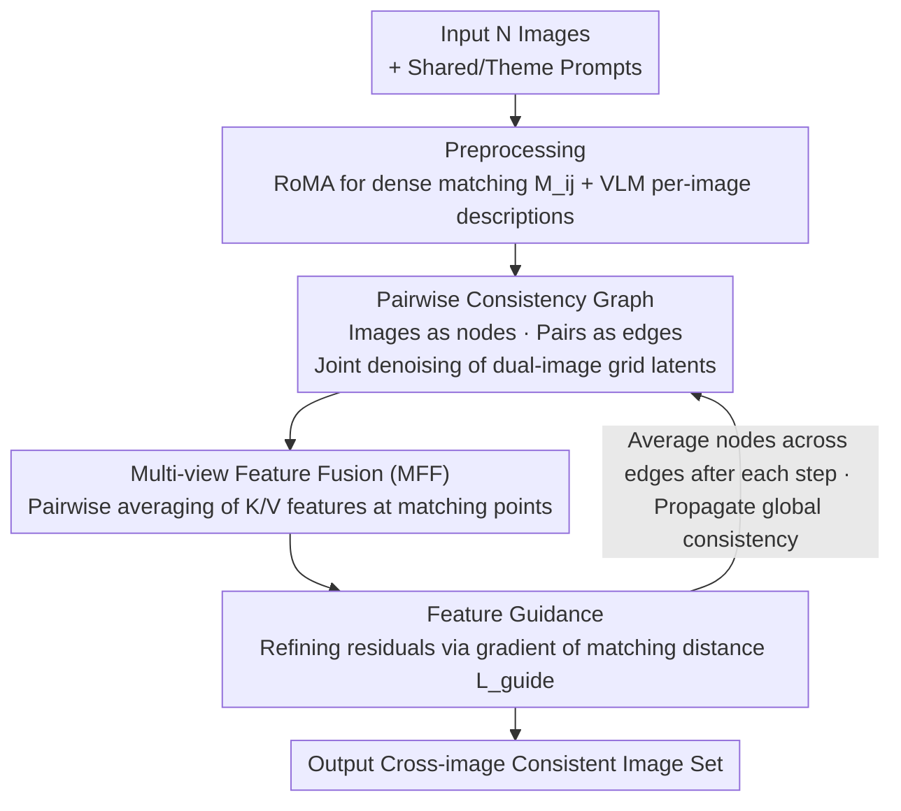

# Match-and-Fuse: Consistent Generation from Unstructured Image Sets

**Conference**: CVPR 2026  
**arXiv**: [2511.22287](https://arxiv.org/abs/2511.22287)  
**Area**: Image Generation / Consistent Generation  
**Keywords**: Set-to-set generation, cross-image consistency, diffusion models, feature fusion, correspondence, training-free, zero-shot

## TL;DR
Match-and-Fuse is proposed as the first training-free consistent generation method for unstructured image sets. By constructing a pairwise consistency graph with images as nodes and image pairs as edges, it manipulates internal features during diffusion inference through Multi-view Feature Fusion (MFF) and feature guidance to achieve set-level cross-image consistency. It achieves a DINO-MatchSim of 0.80, significantly outperforming all baselines.

## Background & Motivation

**Background**: Daily visual experiences are organized into image sets (photo albums, product catalogs, real estate listings). However, generative AI primarily focuses on single images or videos, leaving set-level consistent generation largely unexplored.

**Key Challenge**: (a) Image sets lack the temporal continuity of videos and missing motion cues; (b) shared content may undergo significant deformations; (c) consistency must be maintained for shared elements while allowing non-shared regions to vary freely.

**Limitations of Prior Work**: Edicho is limited to pairwise editing propagated from a single reference; IC-LoRA requires fine-tuning LoRAs; FLUX Kontext lacks explicit consistency mechanisms; 3D/video editing methods rely on overly strong assumptions.

**Key Insight**: T2I diffusion models possess a **Grid Prior**—when multiple images are tiled on a single canvas for joint generation, consistency emerges spontaneously, but it remains incomplete and degrades rapidly as the number of images increases.

**Core Idea**: Model image sets as complete graphs and utilize the pairwise grid prior combined with dense 2D correspondences to perform multi-view fusion and guidance at the feature level.

## Method

### Overall Architecture

Match-and-Fuse addresses the problem of maintaining consistency of shared content when jointly generating a set of unstructured images (e.g., albums, product catalogs) without any training. It models the image set as a complete graph where each image is a node and each image pair is an edge. Taking $N$ images along with a shared content description $\mathcal{P}^{shared}$ and a theme description $\mathcal{P}^{theme}$ as input, a preprocessing stage uses RoMA to compute dense 2D matches $M_{ij}$ (automatically identifying shared regions via confidence filtering without manual masks), and a VLM generates per-image descriptions. During inference, joint denoising is performed on this pairwise consistency graph, using feature-level fusion and guidance to align content at matched positions.

### Key Designs

**1. Pairwise Consistency Graph: Local Pairwise Operations + Global Information Propagation via Grid Prior**

The difficulty of set consistency lies in achieving both pairwise self-consistency and global coordination; processing all images together is computationally prohibitive. It is observed that T2I diffusion models have a "grid prior"—generating two images side-by-side on one canvas spontaneously creates consistency. Thus, each edge in graph $G=(V,E)$ corresponds to a dual-image grid latent $z_{ij}^t = \text{concat}(z_i^t, z_j^t)$, combined with concatenated depth maps and grid prompts for joint denoising. After each denoising step, each node extracts and averages "its own half" of the latents from all adjacent edges, gradually propagating pairwise consistency into global consistency. To control cost, node degree is limited to 4 (randomly neighbors), with full connectivity for $N \le 5$ and linear complexity degradation thereafter.

**2. Multi-view Feature Fusion (MFF): Direct Feature Alignment at Matching Points**

Consistency from the grid prior alone is incomplete and degrades with increasing image counts. MFF is based on the observation that cosine similarity of features at matched positions is strongly correlated with visual consistency. It performs fusion directly on K and V feature maps of selected DiT layers—averaging feature pairs for each matching coordinate: $\mathbf{f}_i[\mathbf{c}] \leftarrow \frac{1}{2}(\mathbf{f}_i[\mathbf{c}] + \mathbf{f}_j[M_{ij}(\mathbf{c})])$. For $N$ images, features are first averaged across adjacent edges $\bar{\mathbf{f}}_i = \frac{1}{|\delta(i)|}\sum_{e \in \delta(i)} \mathbf{f}_i^e$, then fused across all images. This effectively pulls features of "regions that should be consistent" together, while only modifying matching points and leaving non-shared areas untouched.

**3. Feature Guidance: Remedying Residual Inconsistency via Gradients**

MFF is a single-step averaging that may be insufficient for sparse matching regions. Guidance defines an additional matching feature distance objective:
$$L_{guide} = \frac{1}{|E|}\sum_{\{i,j\}\in E}\frac{1}{|M_{ij}|}\sum_{\mathbf{c}\in M_{ij}}\|\mathbf{f}_i[\mathbf{c}] - \mathbf{f}_j[M_{ij}(\mathbf{c})]\|_2$$
Gradients are calculated with respect to $z_i^{t-1}$ to perform lightweight refinement in latent space. MFF can be viewed as an analytical solution for this objective, while Guidance handles the residuals. Furthermore, gradients backpropagate through the entire model, providing a wider receptive field robust to sparse matching.

## Key Experimental Results

### Main Results: Consistency and Prompt Following

| Method | CLIP Score↑ | DreamSim↑ | DINO-MatchSim↑ |
|------|------------|-----------|----------------|
| FLUX Kontext | 0.65 | 0.78 | 0.57 |
| IC-LoRA | 0.65 | 0.71 | 0.65 |
| FLUX | 0.67 | 0.76 | 0.66 |
| Edicho | 0.65 | 0.81 | 0.72 |
| **Match-and-Fuse** | **0.66** | **0.85** | **0.80** |
| w/o Guidance | 0.66 | 0.82 | 0.76 |
| w/o MFF | 0.66 | 0.83 | 0.78 |
| w/o Pairwise Graph | 0.66 | 0.82 | 0.75 |

### User Study & VLM Evaluation (2AFC, Ours Win Rate)

| Baseline | User Preference↑ | VLM Preference↑ |
|---------|----------|---------|
| vs Kontext | 88% | 82% |
| vs IC-LoRA | 90% | 92% |
| vs FLUX | 92% | 94% |
| vs Edicho | 83% | 78% |

### Metric Alignment with Human Judgment

| Metric | Human Alignment Rate↑ |
|------|-------------|
| DreamSim | 84.3% |
| VLM | 84.9% |
| **DINO-MatchSim** | **91.4%** |

### Key Findings
- DINO-MatchSim of 0.80 significantly exceeds the best baseline, Edicho, at 0.72 (+11.1%).
- All three components (Graph, MFF, Guidance) are indispensable.
- Consistency of Match-and-Fuse with 9 images remains superior to baselines with only 2 images.
- High robustness: DINO-MatchSim remains 0.76+ even when matching is as sparse as 10%.
- DINO-MatchSim achieves 91.4% alignment with human judgment, far exceeding DreamSim (84.3%).

## Highlights & Insights
- **First Set-to-Set Generation Method**: Extends generative AI to image sets as a fundamental visual unit.
- **Elegant Graph Modeling**: The pairwise consistency graph allows local pairwise operations while enabling global information propagation; $O(N^2)$ complexity can be sparsified to $O(N)$.
- **Discovery and Utilization of Grid Prior**: The spontaneous consistency of T2I models under grid layouts is a key insight.
- **DINO-MatchSim Metric**: Uses source matching points to locate corresponding positions in output images for patch-level similarity, providing higher accuracy than global metrics.
- Fully training-free, zero-shot, and mask-free.

## Limitations & Future Work
- Performance depends on the quality of dense correspondences; areas with no matches may exhibit inconsistency.
- Rely on the base model's adherence to depth condition maps.
- Integrating FlowEdit requires per-edit hyperparameter tuning.
- $O(N^2)$ edge counts still incur overhead for large sets (despite sparsification).

## Rating
- Novelty: ⭐⭐⭐⭐⭐ First to define and solve set-to-set consistent generation.
- Experimental Thoroughness: ⭐⭐⭐⭐⭐ Quantitative + User Study + VLM Evaluation + New Metric + Ablation + Extended Applications.
- Writing Quality: ⭐⭐⭐⭐⭐ Clear problem definition with exquisite figures and elegant formulas.
- Value: ⭐⭐⭐⭐ Significant for creative workflows like product ads, character design, and storyboarding.

<!-- RELATED:START -->

## Related Papers

- [\[CVPR 2026\] Cycle-Consistent Tuning for Layered Image Decomposition](cycle-consistent_tuning_for_layered_image_decomposition.md)
- [\[ICCV 2025\] MatchDiffusion: Training-free Generation of Match-Cuts](../../ICCV2025/image_generation/matchdiffusion_training-free_generation_of_match-cuts.md)
- [\[CVPR 2026\] PaCo-RL: Advancing Reinforcement Learning for Consistent Image Generation with Pairwise Reward Modeling](paco-rl_advancing_reinforcement_learning_for_consistent_image_generation_with_pa.md)
- [\[ICLR 2026\] Consistent Text-to-Image Generation via Scene De-Contextualization](../../ICLR2026/image_generation/consistent_text-to-image_generation_via_scene_de-contextualization.md)
- [\[AAAI 2026\] Infinite-Story: A Training-Free Consistent Text-to-Image Generation](../../AAAI2026/image_generation/infinite-story_a_training-free_consistent_text-to-image_gene.md)

<!-- RELATED:END -->
