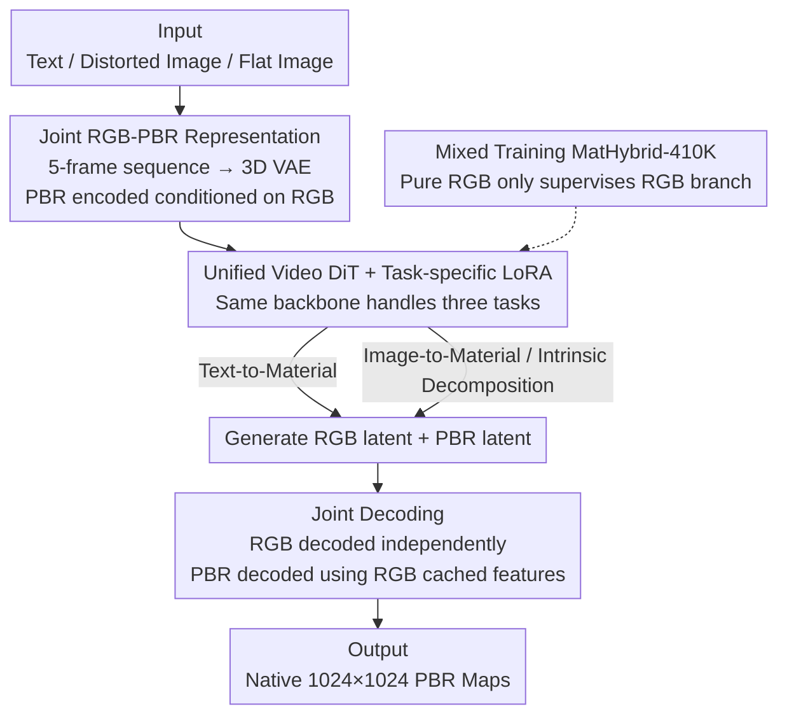

# MatPedia: A Universal Generative Foundation for High-Fidelity Material Synthesis

**Conference**: CVPR 2026  
**Paper**: [CVF Open Access](https://openaccess.thecvf.com/content/CVPR2026/html/Luo_MatPedia_A_Universal_Generative_Foundation_for_High-Fidelity_Material_Synthesis_CVPR_2026_paper.html)  
**Code**: To be confirmed  
**Area**: Image Generation / Diffusion Models / PBR Material Synthesis  
**Keywords**: PBR Materials, Joint Representation, Video Diffusion, Intrinsic Decomposition, Foundation Model

## TL;DR
MatPedia encodes "RGB texture + four PBR maps" into a 5-frame sequence and applies a video diffusion architecture for joint modeling. This unified model handles text-to-material, image-to-material, and intrinsic decomposition tasks. By leveraging massive pure RGB images during training, it outperforms previous specialized methods at a native 1024×1024 resolution.

## Background & Motivation

**Background**: Physically Based Rendering (PBR) materials are fundamental to realistic graphics. Each material is described by four maps—basecolor (diffuse albedo), normal, roughness, and metallic—following the Cook-Torrance microfacet model. Manually creating these maps is labor-intensive and requires specialized skills, making automatic material generation via GANs or diffusion models a recent research hotspot.

**Limitations of Prior Work**: The authors identify two fundamental shortcomings in existing methods. First is **task fragmentation**—intrinsic decomposition, text-to-material, and image-to-material tasks each use dedicated pipelines (e.g., ControlMat, MatFuse, Material Palette, RGB↔X), lacking a unified architecture. Second is **data constraints**—these models are typically trained on small-scale PBR datasets (often thousands to tens of thousands of materials), failing to utilize higher-quality, larger-scale natural RGB image data. This results in synthetic material quality and diversity significantly lagging behind modern RGB image generators.

**Key Challenge**: The absence of a unified latent space representation that **simultaneously bridges natural image appearance (RGB) and physical material properties (PBR)**. Without it, it is impossible to build a unified architecture or introduce large-scale RGB data into material training.

**Key Insight**: The authors observe an **asymmetric complementary relationship** between RGB and PBR. RGB images already contain rich appearance cues (texture, color, structure), while the four PBR maps primarily provide the physical interpretation behind the RGB (surface geometry, material type, reflectance). Therefore, PBR should not be treated as a parallel modality to RGB; instead, PBR should be **encoded conditioned on RGB**, allowing for high compression by only representing the "incremental physical attributes."

**Core Idea**: Drawing inspiration from video compression—where 3D VAEs model dependencies across temporally coherent frames—the authors treat the RGB frame and four PBR maps as a 5-frame "video" sequence. They use a video VAE/DiT to learn their joint distribution, naturally capturing the RGB↔PBR coupling and transferring visual priors from video generation models.

## Method

### Overall Architecture
The goal of MatPedia is to complete text-to-material, image-to-material, and intrinsic decomposition tasks using a **single architecture**. The core is a **joint RGB-PBR representation**: an RGB frame and four PBR maps are treated as a 5-frame sequence, encoded by a fine-tuned 3D (video) VAE into two interdependent latent variables—one representing the shaded RGB appearance and one jointly encoding the four PBR maps (conditioned on RGB). A video DiT backbone follows, using task-specific LoRAs for flexible conditional control. The three tasks are unified by "feeding different conditional signals." The training data utilizes the MatHybrid-410K mixed corpus (RGB-PBR pairs + pure RGB images).

### Key Designs

**1. Joint RGB-PBR Representation: Compressing PBR conditioned on RGB, treating material as a 5-frame video**

To address the lack of a unified latent space bridging RGB and PBR, the authors concatenate an RGB image $\mathbf{I}_{rgb}\in\mathbb{R}^{H\times W\times 3}$ and four PBR maps $(a,n,r,m)$ into a 5-frame sequence. This is fed into a pre-trained video VAE (Wan2.2-VAE, featuring 3D causal convolutions and high compression—16× spatial / 4× temporal). The encoder is asymmetric: RGB is encoded independently as $\mathbf{z}_{rgb}=\mathcal{E}_{rgb}(\mathbf{I}_{rgb})$, while PBR is encoded conditioned on cached features $\mathcal{F}_{enc}$ from the RGB branch: $\mathbf{z}_{pbr}=\mathcal{E}_{pbr}([\mathcal{F}_{enc}(\mathbf{z}_{rgb}),a,n,r,m])$. The decoder is mirror-symmetric: RGB decodes independently, while PBR uses RGB decoding cached features $\mathcal{F}_{dec}$ for "incremental refinement." This design works because RGB already carries significant visual structure; the PBR latent only needs to encode physical properties absent in the RGB, achieving high compression while maintaining material details for native 1024×1024 generation. To preserve the pre-trained latent distribution while improving material fidelity, the authors **only fine-tune the decoder** (encoder is frozen) using pixel and perceptual losses: $\mathcal{L}_{\mathrm{VAE}}=\lambda_1\|\hat{\mathbf{x}}-\mathbf{x}\|_1+\lambda_2\|\phi(\hat{\mathbf{x}})-\phi(\mathbf{x})\|_2^2$, where $\phi$ is from a pre-trained VGG.

**2. Unified Video DiT + Task-specific LoRA: One backbone, three tasks via conditional switching**

To solve task fragmentation, a video DiT is applied to the joint latents. The three tasks share the same backbone and are distinguished only by different LoRAs and conditional signals. **Text-to-material**: The DiT starts from noise and generates both RGB and PBR latents conditioned on text. **Image-to-material**: Photographs (potentially with geometric distortion) are encoded into conditional latents via the VAE; the DiT generates two new latents for "rectified flat RGB + PBR." During decoding, RGB is reconstructed independently (correcting distortion), and PBR is decoded using cached RGB features. This task is fine-tuned via LoRA from the text-to-material checkpoint. **Intrinsic decomposition**: Given a flat RGB input, the DiT only generates the corresponding PBR latent, also fine-tuned via LoRA from text weights. All tasks optimize the rectified flow objective: $\mathcal{L}_{\mathrm{RF}}=\mathbb{E}_{\mathbf{x}_0,\mathbf{x}_1,t}\big[\|v_\theta(\mathbf{x}_t,t,\mathbf{c})-(\mathbf{x}_0-\mathbf{x}_1)\|_2^2\big]$, where $\mathbf{x}_t=(1-t)\mathbf{x}_0+t\mathbf{x}_1$. The DiT is initialized from a large-scale video generation model, using LoRA (rank 128) to transfer visual priors for cross-map correlation and spatial alignment.

**3. Mixed Training MatHybrid-410K: Compensating for PBR scarcity with large-scale pure RGB data**

To address PBR data scarcity, the authors constructed MatHybrid-410K: ① **RGB Appearance Subset**: ~50,000 flat material images (generated via Gemini 2.5 Flash Image + public real flat material photos), each paired with text descriptions from Qwen2.5-VL-72B, providing diverse pure RGB appearances. ② **Full PBR Subset**: ~6,000 material sets (from Matsynth, etc.), rendered in Blender using Disney Principled BSDF to produce flat views (192,000 pairs via 32 HDR environmental maps for intrinsic decomposition) and distorted views (rendered onto spheres/cubes/cylinders, ~168,000 pairs for image-to-material). During training, **only the RGB latent generation is supervised** for pure RGB samples, while the PBR latent distribution is learned solely from paired data. This allows the RGB branch to absorb vast visual knowledge without contaminating the PBR latent distribution. Ablations show that removing the RGB subset drops CLIP from 0.283 to 0.275 and increases DINO-FID from 1.31 to 1.62, proving this appearance data improves both semantic alignment and perceptual realism.

### Loss & Training
The 3D VAE decoder was fine-tuned for 10K steps on 1024×1024 RGB-PBR paired data (AdamW, lr=5×10⁻⁵, λ₁=10, λ₂=1). The video DiT with LoRA (rank 128) was trained for 200K steps per task on mixed data (batch 16, lr=1×10⁻⁴). Inference generates at 1024×1024, followed by RealESRGAN upscaling to 4K. Full PBR generation takes ~20 seconds for 50 sampling steps.

## Key Experimental Results

Evaluation followed the MaterialPicker test set. Metrics: **CLIP score** (semantic alignment), **DINO score** (perceptual similarity via DINOv2 embeddings), **DINO-FID** (FID using DINOv2 features, lower is better), **MSE / LPIPS** (pixel error and perceptual distance).

### Main Results

Text-to-Material (compared with unified framework MatFuse):

| Method | CLIP↑ | DINO-FID↓ |
|------|-------|-----------|
| MatFuse | 0.261 | 1.90 |
| **Ours (MatPedia)** | **0.283** | **1.31** |
| MatPedia (w/o Mixed Training) | 0.275 | 1.62 |

Image-to-Material (per-channel CLIP / DINO; compared with MatFuse, Material Palette):

| Metric | Method | Basecolor | Normal | Roughness | Render |
|------|------|-----------|--------|-----------|--------|
| CLIP↑ | MatFuse | 0.833 | 0.906 | 0.873 | 0.859 |
| CLIP↑ | Material Palette | 0.813 | 0.875 | 0.780 | 0.824 |
| CLIP↑ | **Ours** | **0.943** | **0.927** | **0.903** | **0.923** |
| DINO↑ | MatFuse | 0.649 | 0.755 | 0.717 | 0.677 |
| DINO↑ | **Ours** | **0.907** | **0.762** | **0.752** | **0.843** |

In intrinsic decomposition, the proposed method achieved the lowest MSE and LPIPS across all channels (e.g., basecolor MSE 0.009 vs. Material Palette 0.058 / RGB↔X 0.122).

### Ablation Study

| Configuration | Key Metrics | Remark |
|------|---------|------|
| Full Model (Mixed Training) | CLIP 0.283 / DINO-FID 1.31 | Best Text-to-Material results |
| w/o RGB Appearance Subset | CLIP 0.275 / DINO-FID 1.62 | Using only PBR data; semantic and realism both decrease |
| VAE Decoder (Before Fine-tuning) | Normal 27.29 / Roughness 31.36 dB | Reconstruction PSNR |
| VAE Decoder (After Fine-tuning) | Normal 30.84 / Roughness 36.56 dB | Normal +3.55 dB, Roughness +5.20 dB |

### Key Findings
- **Mixed training is a source of quality**: Introducing pure RGB appearance data simultaneously improves semantic alignment (CLIP↑) and distributional realism (DINO-FID↓) for text-to-material generation, validating the strategy of using RGB "big data" to compensate for PBR scarcity.
- **Decoder fine-tuning yields the most gain for Normal/Roughness**: These maps are critical for material appearance. Fine-tuning improves their PSNR by +3.55 and +5.20 dB respectively, showing that freezing the encoder while refining the decoder is sufficient to recover material details.
- **Image-to-material improvements are concentrated in basecolor**: Compared to MatFuse, the +0.11 CLIP / +0.26 DINO gain in basecolor suggests the method is better at recovering the intrinsic albedo (removing illumination) from distorted inputs.

## Highlights & Insights
- **Material-as-Video Analogy**: By analogizing "RGB↔PBR physical coupling" to "temporal coherence between adjacent video frames," the model directly reuses mature video VAE/DiT architectures and pre-trained priors. This cross-domain transfer perspective is clever.
- **Asymmetric Encoding**: Compressing PBR conditioned on RGB allows the PBR latent to focus on incremental physical information, which is key to balancing high compression with high resolution, supporting native 1024×1024 generation.
- **Pure RGB Semi-supervision**: Supervising only the RGB branch for unlabelled samples to protect the PBR latent distribution provides a practical, low-cost paradigm for data augmentation.

## Limitations & Future Work
- The joint compression **couples spatial features**, making it difficult to support tileable material generation directly through noise rolling; however, native 1024×1024 (upsampled to 4096²) is sufficient for most production scenarios.
- Quality is highly correlated with the chosen pre-trained video VAE/DiT backbone; ⚠️ the paper lacks robustness analysis regarding backbone swapping.
- Future directions: Exploring tileable generation and including more PBR channels (e.g., anisotropy, transmission) into the joint representation.

## Related Work & Insights
- **vs. MaterialPicker**: Also uses a video backbone for distorted inputs, but MaterialPicker compresses frames independently, limiting resolution to 256×256. MatPedia uses joint 5-frame representation with a 3D VAE for native 1024×1024.
- **vs. IntrinsicX**: IntrinsicX uses separate LoRAs + cross-attention for each PBR map to maintain consistency. MatPedia shifts this to **task-specific** LoRAs on a shared joint latent, resulting in a more unified structure.
- **vs. MatFuse / ControlMat / Material Palette**: These are mostly task-specific and limited by small PBR datasets. MatPedia unifies three tasks in a single architecture and leverages pure RGB data to enhance quality and diversity.

## Rating
- Novelty: ⭐⭐⭐⭐⭐ The "material=video" joint representation + RGB-conditioned asymmetric encoding is a truly novel unified perspective.
- Experimental Thoroughness: ⭐⭐⭐⭐ Covers three tasks with ablations, though many comparisons lack public weights and some are qualitative only.
- Writing Quality: ⭐⭐⭐⭐ The link between motivation, observation, and method is clear; Figure 2 pipeline is highly informative.
- Value: ⭐⭐⭐⭐⭐ The unified architecture and the released MatHybrid-410K hold high value for the material generation community.

<!-- RELATED:START -->

## Related Papers

- [\[CVPR 2026\] DiT360: High-Fidelity Panoramic Image Generation via Hybrid Training](dit360_high-fidelity_panoramic_image_generation_via_hybrid_training.md)
- [\[CVPR 2026\] PROMO: Promptable Outfitting for Efficient High-Fidelity Virtual Try-On](promo_promptable_virtual_tryon_efficient.md)
- [\[CVPR 2026\] High-Fidelity Diffusion Face Swapping with ID-Constrained Facial Conditioning](high-fidelity_diffusion_face_swapping_with_id-constrained_facial_conditioning.md)
- [\[CVPR 2026\] The Universal Normal Embedding](the_universal_normal_embedding.md)
- [\[CVPR 2026\] Preserving Source Video Realism: High-Fidelity Face Swapping for Cinematic Quality](preserving_source_video_realism_high-fidelity_face_swapping_for_cinematic_qualit.md)

<!-- RELATED:END -->
