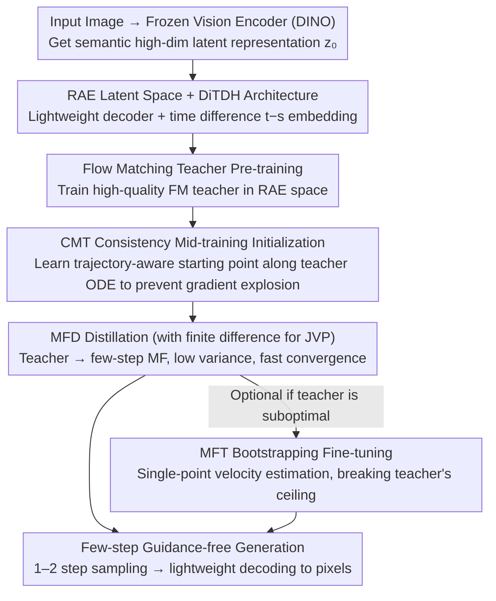

# MeanFlow Transformers with Representation Autoencoders

**Conference**: CVPR 2026  
**Paper**: [CVF Open Access](https://openaccess.thecvf.com/content/CVPR2026/html/Hu_MeanFlow_Transformers_with_Representation_Autoencoders_CVPR_2026_paper.html)  
**Code**: https://github.com/sony/mf-rae  
**Area**: Diffusion Models / Few-step Generation  
**Keywords**: MeanFlow, Representation Autoencoder, Flow Matching Distillation, Consistency Mid-training, Few-step Sampling

## TL;DR
MeanFlow-RAE migrates the few-step generation model MeanFlow from the traditional SD-VAE latent space to the semantic latent space of a "Representation Autoencoder (RAE)". It utilizes Consistency Mid-training (CMT) for trajectory-aware initialization to stabilize gradient explosions, replaces training-from-scratch with Flow Matching Distillation (MFD), and substitutes JVP with finite differences. Ultimately, it achieves an ImageNet 256 single-step FID of 2.03 (vs. 3.43 for vanilla MF) while reducing sampling GFLOPS by 38% and total training costs by approximately 83%.

## Background & Motivation
**Background**: Diffusion and flow matching models achieve exceptional generation quality but are notoriously slow because sampling requires solving Probability Flow Ordinary Differential Equations (PF-ODE), necessitating dozens or hundreds of network forward passes. Recent flow map models (represented by MeanFlow, i.e., MF) directly learn the solution mapping of PF-ODEs to compress "noise-to-data" into one or two steps, serving as a powerful route for few-step generation. In practice, MF is typically executed in latent space, leveraging pre-trained SD-VAEs to handle high-dimensional images.

**Limitations of Prior Work**: Even in latent space, MF training remains expensive and unstable—vanilla MF requires 600+ H100 GPU-days for ImageNet 256. It is also burdened by numerous hyperparameters: class-conditional generation depends on complex classifier-free guidance (CFG), involving two CFG scales and two trigger interval hyperparameters, all requiring grid searches. The Jacobian-Vector Product (JVP) in the MF loss increases computational overhead and brings instability; even supporting JVP in modern components like Flash Attention requires extra engineering. On the inference side, the SD-VAE decoder that converts latent vectors back to pixels is the main bottleneck—on ImageNet 256, SD-VAE decoding accounts for approximately 73% of total computation (310 GFLOPS vs. 114 GFLOPS for DiT).

**Key Challenge**: The bottleneck of few-step models has shifted from "iteration count" to "decoder overhead + training instability + hyperparameter complexity," while the aging SD-VAE latent space is both expensive and difficult to train. Recent RAEs use frozen pre-trained vision encoders (e.g., DINO) as tokenizers and train only a lightweight ViT decoder. Their decoders require only ~106 GFLOPS (nearly a 3x speedup over SD-VAE), and their semantic-rich high-dimensional latent space is naturally suited for few-step models—but directly moving MF into RAE latent space leads to immediate gradient explosion.

**Goal**: To train a stable, fast, and high-quality few-step MF in the RAE latent space, systematically decomposing each stage of MF training and providing improvements for each.

**Key Insight**: The authors decompose MF training into four orthogonal axes—better latent space, trajectory-aware initialization, choice of proxy velocity, and efficient computation of transport derivatives—and address each one.

**Core Idea**: Replace SD-VAE with the RAE semantic latent space + DiTDH architecture, use CMT initialization to block gradient explosion, substitute training-from-scratch MFT with MFD distillation, and replace JVP with finite differences, thereby eliminating guidance hyperparameters while simultaneously reducing costs and improving quality.

## Method

### Overall Architecture
MF-RAE decomposes the difficult task of "training a few-step generator in the RAE latent space" into a divide-and-conquer three-stage pipeline: first, pre-train a high-quality flow matching teacher in the RAE latent space; then, use CMT for trajectory-aware MF initialization (the teacher generates reference trajectories and serves as CMT's initial weights); finally, starting from CMT weights, train the MF using MFD with finite differences, followed by an optional piece of MFT to further reduce bias if necessary. Architecturally, the authors use the DiTDH backbone (DiT + wide-but-light DDT head) from RAE and add an embedding module for the time difference $t-s$. By summing embeddings for class, current time $t$, and time difference $t-s$, the model explicitly encodes absolute time and time differences, which is key to learning accurate flow maps. Every stage in the chain prepares for the next: pre-training provides a good teacher, CMT provides a stable starting point, and MFD achieves fast convergence from this starting point.

### Key Designs

**1. RAE Semantic Latent Space + DiTDH Architecture: Removing Bottlenecks from Decoder and Iterations Simultaneously**

Vanilla MF uses SD-VAE, where the decoder consumes about 73% of generation computation. RAE shifts to a frozen pre-trained semantic encoder $E$ (e.g., DINOv2/SigLIP2) as a tokenizer and trains only a ViT decoder $D$ with reconstruction loss $L_{rec}=\omega_L\,\mathrm{LPIPS}(\hat x,x)+L_1(\hat x,x)+\omega_G\,\mathrm{GAN}(\hat x,x)$. For standard latent diffusion, RAE's speedup is limited (as the bottleneck is multiple ODE steps); however, for few-step models like MF that only evaluate 1–2 steps, RAE's lightweight decoder (~106 GFLOPS) advantage is magnified. Additionally, the semantic-rich latent space accelerates convergence and allows class-conditional generation without any guidance. To handle high-dimensional space, RAE expands DiT into DiTDH with a DDT head; the authors add $t-s$ embedding to this for flow map learning. Any architectural changes made to adapt DiT/SiT for MF can be similarly plugged into DiTDH, ensuring generality.

**2. CMT Consistency Mid-training Initialization: Blocking Gradient Explosion in RAE Latent Space**

Training MF directly in RAE latent space is extremely unstable: whether using random initialization or pre-trained FM teacher initialization, gradients explode—the loss and gradient norm of the XL model soar to approximately $10^5$ by the 2nd epoch. The best single-step FID before divergence remains >20, far from convergence. The root cause is a training signal mismatch: flow matching learns infinitesimal local jumps on PF-ODE trajectories, whereas MF learns "long jumps" between distant time steps; random initialization exacerbates this. CMT uses the teacher's numerical ODE trajectories to learn a trajectory-aware initialization, with the objective $L_{\text{CMT-MF}}(\theta)=\mathbb{E}\big\|h_\theta(\hat z_{t_i},t_i,t_j)-\frac{\hat z_{t_i}-\hat z_{t_j}}{t_i-t_j}\big\|_2^2$, making $h_\theta$ reproduce corresponding long jumps on the teacher's trajectory. In the RAE setting, a first-order Euler solver with 16 NFE is sufficient (RAE diffusion reaches FID 2.32 in 16 steps), making second-order Heun as in the original CMT unnecessary.

**3. Bias-Variance Trade-off in MFD and MFT: Distillation First, (Optional) Bootstrapping Later**

MF's regression proxy velocity $w$ can be taken from a single-point velocity estimation $\hat v$ (MFT) or a pre-trained teacher $v_\theta$ (MFD). The authors provide the first theoretical characterization of this (Proposition 3.1): substituting $w_\eta=(1-\eta)\hat v+\eta v_\theta$ into the generalized loss decomposes it into three types of residuals—single-point velocity residual, teacher-oracle velocity residual, and oracle bias. $\eta=0$ degenerates to pure MFT, whose loss contains all variance terms from single-point estimation; $\eta=1$ is pure MFD, where variance terms vanish, leaving only teacher residuals and oracle bias. The conclusion is: when the teacher is good enough ($\delta v_\theta\approx 0$), MFD possesses both smaller bias and lower variance, converging faster; if the teacher is suboptimal, MFT can follow MFD (starting from a converged point to effectively suppress variance) to further reduce residual bias and break the quality ceiling imposed by the teacher.

**4. Finite Difference instead of JVP: Eliminating MF's Largest Computational and Stability Bottleneck**

The transport derivative $\frac{d}{dt}h_{\theta^-}=(\partial_z h_{\theta^-})w+\partial_t h_{\theta^-}$ in the MF regression target requires JVP, which is expensive, unstable, and hard to implement on modern components. The authors use finite difference to approximate the time derivative: $\frac{d}{dt}h_\theta\approx\frac{h_\theta(z_{t+\Delta t},t+\Delta t,s)-h_\theta(z_{t-\Delta t},t-\Delta t,s)}{2\Delta t}$, where $z_{t\pm\Delta t}\approx z_t\pm\Delta t\,w(z_t,t)$ is obtained via a first-order Euler step along the teacher's velocity field. Experimental results show that for $\Delta t\in[0.001,0.01]$, training is stable and performance is almost identical to exact JVP; a fixed median $\Delta t=0.005$ is used throughout.

### Loss & Training
The three-stage pipeline comprises: (1) Pre-training—training a high-quality FM teacher in the RAE latent space; (2) Mid-training—using CMT to learn a trajectory-aware MF initialization; (3) Post-training—starting from CMT weights and training MF via MFD with finite differences, with an optional MFT supplement. Hyperparameters are minimal: the configuration mostly reuses the DiTDH flow matching stage, with batch size reduced from 1024 to 256/128 (ImageNet 256/512), learning rate lowered from $2\times10^{-4}$ to $1\times10^{-4}$, and EMA adjusted to 0.9999/0.9995. Uniform time sampling from the teacher is retained, and class-conditional generation uses no guidance. In contrast, vanilla MF requires switching to a tuned log-normal time distribution and depends on numerous CFG hyperparameters.

## Key Experimental Results

### Main Results
For ImageNet 256 class-conditional generation, MF-RAE achieves SOTA 1-step/2-step quality among all flow map models, with lower generation and training costs:

| Method | NFE | FID↓ | #Params |
|------|-----|------|---------|
| SiT-XL/2 | 250×2 | 2.06 | 675M |
| RAE | 50×2 | 1.13 | 839M |
| MeanFlow (vanilla) | 1 / 2 | 3.43 / 2.20 | 676M |
| CMT w/ MF | 1 | 3.34 | 676M |
| AlphaFlow | 1 / 2 | 2.58 / 1.95 | 675M |
| **MF-RAE (Ours)** | 1 / 2 | **2.03 / 1.89** | 841M |

Costs: 1-step generation for vanilla DiT-MF requires $310+114=424$ GFLOPS, while ours requires only $106+157=263$ GFLOPS (38% reduction). Regarding training, vanilla MF from scratch (MFT) requires 1400 epochs (~600+ H100 GPU-days); MF-RAE's three stages total ~100 H100 GPU-days (FM Pre-training 78 + CMT 2.1 + MFD 21), a ~6x reduction. If a teacher is already available, CMT+MFD takes only 23 H100 GPU-days. On ImageNet 512, 1-step FID is 3.23, with the lowest GFLOPS among all baselines.

### Ablation Study
Combinations of Latent Space × Training Scheme (ImageNet 256):

| Algorithm | W/ Guidance? | Architecture | NFE | FID↓ |
|------|------|------|-----|------|
| MFT | Yes | SD-VAE + DiT/SiT | 1 / 2 | 3.38 / 2.20 |
| MFD | Yes | SD-VAE + DiT/SiT | 1 / 2 | 3.15 / 1.95 |
| MFD | No | SD-VAE + DiT/SiT | 1 / 2 | 5.94 / 4.01 |
| MFT | No | RAE + DiTDH | 1 / 2 | 2.81 / 2.56 |
| **MFD** | No | **RAE + DiTDH** | 1 / 2 | **2.03 / 1.89** |

JVP vs. Finite Difference $\Delta t$ (default $5\times10^{-3}$):

| $\Delta t$ | JVP | $10^{-4}$ | $10^{-3}$ | $5\times10^{-3}$ | $10^{-2}$ |
|------|------|------|------|------|------|
| 1-step FID | 1.96 | 5.63 | 2.06 | 2.03 | 2.17 |
| 2-step FID | 1.87 | 4.22 | 1.87 | 1.89 | 1.94 |

### Key Findings
- **RAE Latent Space is key to removing guidance**: Removing guidance from MFD on SD-VAE leads to severe degradation (FID 5.94/4.01), whereas RAE+DiTDH achieves 2.03/1.89 without guidance—the semantic latent space makes class-condition generation independent of CFG hyperparameters.
- **CMT is the ON/OFF switch for RAE training**: While vanilla MF can be trained from scratch on SD-VAE (albeit requiring 1400 epochs), it fails to train on RAE latent space from either random or diffusion teacher initialization; only CMT initialization makes training possible.
- **MFD significantly outperforms MFT in the same latent space**: On RAE, MFD achieves 1.89/2.03 compared to MFT's 2.56/2.81. Since the teacher-student FID gap is already small (teacher is FID 1.51 at 50 NFE), additional bootstrapping MFT is unnecessary.
- **Finite difference matches JVP almost for free**: At $\Delta t=5\times10^{-3}$, FID is nearly equal to exact JVP, eliminating JVP's computational and implementation burdens.

## Highlights & Insights
- **Repositioning and solving bottlenecks of few-step generation**: The authors identify that bottlenecks have shifted from iteration counts to decoder overhead, training instability, and hyperparameter complexity, addressing them with RAE decoders, CMT initialization, and MFD distillation for stackable gains.
- **Valuable theoretical characterization of MFD/MFT**: Proposition 3.1 frames the choice between distillation and single-point estimation as an analyzable bias-variance control problem, providing a practical recipe—"MFD first, optional MFT later"—that is transferable to other flow map distillations.
- **Hyperparameter robustness as a hidden selling point**: MF-RAE can mostly reuse hyperparameters from flow matching pre-training, avoiding the CFG grid searches required by vanilla MF—highly valuable for practical deployment.

## Limitations & Future Work
- **Dependency on good teachers and multi-stage pipelines**: The method is essentially a "Teacher → CMT → MFD" chain, requiring a high-quality FM teacher first. Training from scratch in RAE space proved impossible, limiting its flexibility.
- **Boundaries for bootstrapping**: The paper claims MFT bootstrapping is "unnecessary" when the teacher is strong, but more systematic quantification is needed to determine how much the ceiling can be raised when the teacher is clearly suboptimal.
- **Evaluation focus on ImageNet class-conditioning**: Stability and gains in more complex conditions like text-to-image or higher resolutions remain to be verified.
- **Step size for finite difference requires empirical tuning**: $\Delta t=0.005$ is an empirical median; at $10^{-4}$, FID worsened to 5.63, suggesting there is still a sensitive interval for the step size.

## Related Work & Insights
- **vs. vanilla MeanFlow**: Both learn average velocity for few-step generation, but vanilla MF trains from scratch on SD-VAE and relies on CFG hyperparameters and JVP. MF-RAE switches to RAE latent space, utilizing CMT+MFD+finite difference to lower FID from 3.43 to 2.03, reduce training costs by ~6x, and eliminate all guidance hyperparameters.
- **vs. RAE (original)**: RAE was originally designed for latent flow matching and offered limited speedup for standard diffusion (where NFE is the bottleneck). This paper "activates" the value of RAE's decoder efficiency specifically for the few-step MF scenario.
- **vs. flow map models like CM / CTM**: CM learns mappings from any noise point to clean data, CTM learns mappings between any two points on a trajectory, and MF learns the average ODE integral between two points (mathematically equivalent to CTM parametrization). This work does not change the flow map paradigm but systematically optimizes the "latent space + initialization + objective + derivative calculation" stages of MF.

## Rating
- Novelty: ⭐⭐⭐⭐ Not a brand-new paradigm, but a solid combinational innovation involving RAE+CMT+MFD+finite difference supported by MFD/MFT theoretical analysis.
- Experimental Thoroughness: ⭐⭐⭐⭐⭐ ImageNet 256/512 main results + extensive ablations on latent space/training schemes/JVP; both cost and quality are well-quantified.
- Writing Quality: ⭐⭐⭐⭐⭐ Clear logic with the four-axis decomposition; motivation and bottleneck identification are well-articulated.
- Value: ⭐⭐⭐⭐⭐ High engineering value for few-step generation due to ~83% reduced training cost, 38% reduced sampling cost, and elimination of guidance hyperparameters.

<!-- RELATED:START -->

## Related Papers

- [\[ICLR 2026\] Diffusion Transformers with Representation Autoencoders](../../ICLR2026/image_generation/diffusion_transformers_with_representation_autoencoders.md)
- [\[CVPR 2026\] Understanding, Accelerating, and Improving MeanFlow Training](understanding_accelerating_and_improving_meanflow_training.md)
- [\[CVPR 2026\] Temporal Equilibrium MeanFlow: Bridging the Scale Gap for One-Step Generation](temporal_equilibrium_meanflow_bridging_the_scale_gap_for_one-step_generation.md)
- [\[CVPR 2026\] Extending One-Step Image Generation from Class Labels to Text via Discriminative Text Representation](emf_meanflow_text_to_image.md)
- [\[CVPR 2026\] Interpretable and Steerable Concept Bottleneck Sparse Autoencoders](interpretable_and_steerable_concept_bottleneck_sparse_autoencoders.md)

<!-- RELATED:END -->
