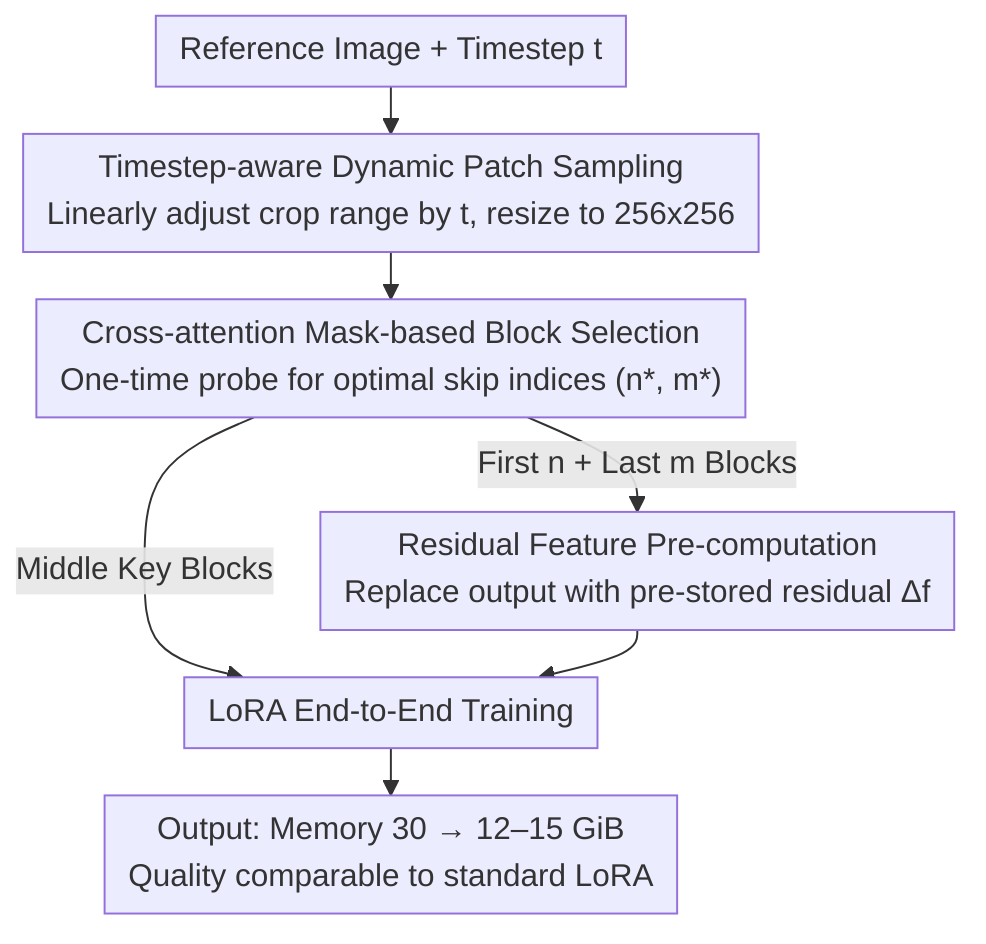

# Memory-Efficient Fine-Tuning Diffusion Transformers via Dynamic Patch Sampling and Block Skipping

**Conference**: CVPR 2026  
**arXiv**: [2603.20755](https://arxiv.org/abs/2603.20755)  
**Code**: None  
**Area**: Diffusion Models / Efficient Fine-Tuning  
**Keywords**: Diffusion Transformer, Efficient Fine-Tuning, Dynamic Patch Sampling, Block Skipping, Personalized Generation

## TL;DR

The DiT-BlockSkip framework is proposed, reducing LoRA fine-tuning VRAM on FLUX by approximately 50% through timestep-aware dynamic patch sampling (low-resolution training with dynamically adjusted cropping ranges) and a block skipping strategy based on cross-attention analysis for key block selection and residual feature pre-computation, while maintaining personalized generation quality comparable to standard LoRA.

## Background & Motivation

1. **Background**: Diffusion Transformer (DiT)-based text-to-image models (e.g., FLUX, SANA) have significantly improved image generation quality. Personalized fine-tuning typically uses PEFT methods like LoRA to adapt on a small number of reference images.

2. **Limitations of Prior Work**: (a) DiT models have massive parameter counts (FLUX has 19 double-stream + 38 single-stream blocks); even with LoRA, full forward and backward propagation is required, leading to immense VRAM overhead (~30 GiB for FLUX LoRA at 512×512); (b) Quantization methods suffer from precision loss; (c) Gradient-free methods (e.g., ZOODiP) exhibit unstable optimization and require up to 30,000 steps to converge.

3. **Key Challenge**: The depth and capacity of the DiT architecture result in training activation memory that far exceeds that of U-Net. Existing VRAM-efficient methods designed for U-Net (e.g., HollowedNet) cannot be directly transferred.

4. **Goal**: Achieve substantial VRAM reduction in DiT while maintaining personalization quality, aiming for deployment on edge devices.

5. **Key Insight**: (a) Different timesteps in the diffusion process learn different features—high noise levels learn global structures, while low noise levels learn fine-grained details; (b) Not all blocks in DiT are equally important for personalization—blocks in the middle layers are more critical.

6. **Core Idea**: Dynamic cropping combined with low-resolution training to reduce forward/backward activation memory, and selective skipping of non-critical blocks with pre-computed residual features to reduce parameter and optimizer state VRAM.

## Method

### Overall Architecture

This paper addresses the issue where activation memory during LoRA personalization of massive DiT models like FLUX is excessively high (30 GiB at 512×512), making them incompatible with consumer GPUs. The authors observe that VRAM pressure stems from two independent sources: full-resolution forward/backward passes and all 57 blocks participating in training. Two orthogonal methods are employed: first, training resolution is reduced by dynamically cropping a region based on the current diffusion timestep and resizing it to 256×256; second, the number of trained blocks is reduced by using a one-time attention probe to identify critical blocks. Non-critical blocks at the beginning and end are skipped, with their outputs replaced by pre-stored residual features, and LoRA is applied only to the middle key blocks for end-to-end training. By stacking both components, FLUX LoRA fine-tuning memory is reduced from 30 GiB to 12–15 GiB.

### Key Designs

**1. Timestep-aware Dynamic Patch Sampling: Low-res training without losing global structure**

Reducing resolution is the most direct way to save activation memory, but naive resizing to 256×256 loses detail, while fixed cropping loses global composition. The authors observe that the diffusion process learns different scales at different timesteps: global structures at high noise and fine details at low noise. Thus, the crop size is not fixed but changes linearly with timestep $t$: $f(s_{min}, s_{max}, t) = s_{min} + \frac{t}{T} \cdot (s_{max} - s_{min})$. Large areas are cropped at high noise for global structure, and small patches are cropped at low noise for details, all resized to $s_{min}\times s_{min}$ (e.g., 256×256). Boundaries are aligned with the VAE's 16x downsampling factor. This allows the model to "see" scales matching its learning objective, replicating high-res representation capability within a low-res budget. Ablations show a DINO score of 0.7253, significantly higher than 0.7164 for simple resizing.

**2. Cross-attention Mask-based Block Selection: Identifying skippable blocks**

Unlike U-Net, DiT lacks an explicit encoder-decoder hierarchy to guide block reduction. The authors sequentially mask the cross-attention (image query to text key) of 14 consecutive blocks in a fine-tuned model and measure the semantic distance of the output from the full model. Results show that masking middle layers causes the subject to disappear (largest semantic distance), while masking initial or final blocks has minimal impact. By calculating the DINO embedding distance for 30 CustomConcept101 categories, the optimal skip pair $(n^*, m^*)$ is found such that the sum of mask impacts from the first $n$ and last $m$ blocks is minimized. This probe is performed once and can be used for any budget.

**3. Residual Feature Pre-computation: Compensating for skipped information**

Simply removing blocks causes severe feature distribution shifts; a naive skip on DiT (similar to HollowedNet on U-Net) results in a DINO score drop from 0.73 to 0.43. Although skipped blocks are not "critical," they still perform non-trivial transformations. The authors calculate the residuals of the $l$ consecutive skipped blocks before training:

$$\Delta f_{i,i+l} = f_{i+l} - f_i$$

During training, these blocks are bypassed, and the fixed residual is added to the updated input: $f'_{i+l} = f'_i + \Delta f_{i,i+l}$. This uses a pre-stored bias to approximate the skipped transformation, recovering performance from 0.43 to 0.72 with minimal storage cost.

### Loss & Training

The training objective is the standard conditional flow matching loss, consistent with original FLUX/SANA training. LoRA is injected only into the non-skipped middle blocks. Parameters of skipped blocks are offloaded from GPU to CPU, and residuals are loaded as needed to further reduce peak VRAM. Evaluation uses 4–6 reference images per subject and 25 category-specific prompts, generating 4 images per prompt.

## Key Experimental Results

### Main Results

**Comparison of personalization quality on DreamBooth (FLUX):**

| Method | Skip Ratio | Training Res | DINO↑ | CLIP-I↑ | CLIP-T↑ |
|------|---------|-----------|-------|---------|---------|
| LoRA (baseline) | – | 512×512 | 0.7324 | 0.8146 | 0.3173 |
| LISA | – | 512×512 | 0.7387 | 0.8194 | 0.3177 |
| HollowedNet | 50% | 512×512 | 0.4435 | 0.6930 | 0.3094 |
| **Ours** | **30%** | **256×256** | **0.7194** | **0.8036** | **0.3199** |
| **Ours** | **40%** | **256×256** | **0.7171** | **0.8034** | **0.3194** |
| **Ours** | **50%** | **256×256** | **0.6963** | **0.7877** | **0.3184** |

**VRAM Comparison (FLUX BFloat16):**

| Method | Training VRAM (GiB) | TFLOPs |
|------|---------------|--------|
| LoRA 512×512 | ~30 | ~28 |
| Ours 30% 256×256 | ~15 | ~7 |
| Ours 50% 256×256 | ~12 | ~5 |

### Ablation Study

| Configuration | DINO | CLIP-I | CLIP-T | Notes |
|------|------|--------|--------|------|
| LoRA 512×512 | 0.7324 | 0.8146 | 0.3173 | Baseline |
| + Resize to 256 | 0.7164 | 0.8044 | 0.3176 | Simple downsampling |
| + Dynamic Patch | 0.7253 | 0.8099 | 0.3196 | Better than simple resize |
| Block Skip (No Resid) 50% | 0.4301 | 0.6794 | 0.3047 | Naive skip collapse |
| Block Skip + Resid 50% | 0.7150 | 0.8035 | 0.3182 | Residue restores perf |
| Skip First 50% blocks | 0.6651 | 0.7646 | 0.3193 | Inferior to ours |
| Skip Last 50% blocks | 0.4808 | 0.7111 | 0.3090 | Last layers more critical |
| Ours (First+Last) 50% | 0.7150 | 0.8035 | 0.3182 | Optimal skip strategy |

### Key Findings

- **Dynamic patch sampling outperforms simple resizing**: DINO 0.7253 vs 0.7164, proving that timestep-aware scale variation is effective.
- **Residual feature pre-computation is core to block skipping**: Without residuals, DINO plummeted from 0.73 to 0.43; residuals restored it to 0.72.
- **Skipping end layers is more damaging than initial layers**: Skipping only the last 50% blocks resulted in DINO 0.48, confirming the importance of middle-to-late layers.
- **30% block skipping is the optimal trade-off**: DINO 0.7194 is close to the 0.7324 LoRA baseline (1.8% gap) while halving VRAM.
- **HollowedNet fails entirely on DiT**: Scoring only 0.44 DINO, whereas the proposed method maintains 0.70+ at the same skip ratio.

## Highlights & Insights

- **Timestep-scale Alignment**: Leveraging the inherent properties of the diffusion process (high noise = coarse structure, low noise = fine detail) to guide training design. This generalizes well to video diffusion models.
- **Residual Feature Pre-computation**: A minimalist approach to compensate for information loss in block skipping. It essentially approximates the function of skipped blocks with a fixed bias, yielding high impact with low cost.
- **Cross-attention Mask Probing**: Replacing gradient analysis with attention mask experiments to identify critical layers is more intuitive and computationally efficient, offering a new perspective on DiT interpretability.

## Limitations & Future Work

- **No VRAM reduction during inference**: The method only optimizes the training stage; inference still requires a full forward pass. Pruning/distillation is needed for edge inference.
- **Storage overhead for residuals**: Pre-computing and storing residuals for each training iteration may become a bottleneck in large-scale training.
- **Architecture specificity**: Optimal skip ratios differ between SANA and FLUX, requiring a new block selection analysis for each architecture.
- **Future directions**: (a) Exploring dynamic rather than static residuals that adapt during training; (b) scaling block selection to inference acceleration; (c) integrating gradient checkpointing for further activation memory reduction.

## Related Work & Insights

- **vs HollowedNet**: A layer-skipping method for U-Net that collapses on DiT (DINO 0.44). This work fixes block skipping for DiT via cross-attention analysis and residual pre-computation.
- **vs ZOODiP**: Zeroth-order optimization avoids backprop but is unstable and requires 30,000 steps; the proposed method converges in standard step counts.
- **vs LISA/LoRA-FA**: These efficient LLM training methods show inconsistent results on DiT (degrading on SANA); the proposed method is more robust.

## Rating

- Novelty: ⭐⭐⭐⭐ Combination of dynamic sampling and block skipping is not entirely new, but the specific integration with cross-attention probes is innovative.
- Experimental Thoroughness: ⭐⭐⭐⭐ Covers FLUX and SANA, though more model architectures could be verified.
- Writing Quality: ⭐⭐⭐⭐ Clear structure, well-defined motivation, and logical charts.
- Value: ⭐⭐⭐⭐ Significant for DiT fine-tuning; halving VRAM with minimal quality loss enables edge deployment.

<!-- RELATED:START -->

## Related Papers

- [\[CVPR 2026\] DDiT: Dynamic Patch Scheduling for Efficient Diffusion Transformers](ddit_dynamic_patch_scheduling_for_efficient_diffusion_transformers.md)
- [\[CVPR 2026\] Region-Adaptive Sampling for Diffusion Transformers](region-adaptive_sampling_for_diffusion_transformers.md)
- [\[ECCV 2024\] Memory-Efficient Fine-Tuning for Quantized Diffusion Model](../../ECCV2024/image_generation/memory-efficient_fine-tuning_for_quantized_diffusion_model.md)
- [\[CVPR 2026\] MPDiT: Multi-Patch Global-to-Local Transformer Architecture for Efficient Flow Matching](mpdit_multi-patch_global-to-local_transformer_architecture_for_efficient_flow_ma.md)
- [\[CVPR 2026\] Reward Sharpness-Aware Fine-Tuning for Diffusion Models](reward_sharpness-aware_fine-tuning_for_diffusion_models.md)

<!-- RELATED:END -->
